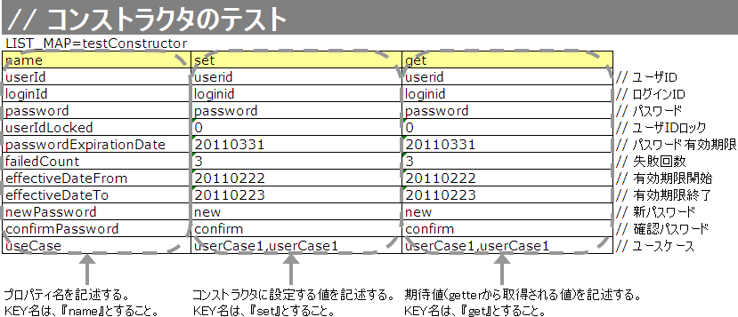

# Form/Entityのクラス単体テスト

## Form/Entityのクラス単体テスト

FormおよびEntityのクラス単体テストはほぼ同じように行えるため、共通する内容についてはEntity単体テストをベースに説明し、特有の処理については個別に説明する。

> **注意**: Entityとは、テーブルのカラムと1対1に対応するプロパティを持つFormのことである。

バリデーションテストのExcel定義。

**テストケース表**（ID: `testShots`固定）

| カラム名 | 記載内容 |
|---|---|
| title | テストケースのタイトル |
| description | テストケースの簡単な説明 |
| expectedMessageId*n* | 期待するメッセージ（*n*は1からの連番） |
| propertyName*n* | 期待するプロパティ（*n*は1からの連番） |

複数メッセージを期待する場合、`expectedMessageId2`, `propertyName2`のように列を右に追加する。

**入力パラメータ表**（ID: `params`固定）

テストケース表に対応する入力パラメータを1行ずつ記載する。:ref:`special_notation_in_cell`\ の記法を使用することで効率的に入力値を作成できる。


**クラス**: `nablarch.test.core.entity.EntityTestConfiguration`

コンポーネント設定ファイルで設定する。全項目必須。

| プロパティ名 | 必須 | 説明 |
|---|---|---|
| maxMessageId | ○ | 最大文字列長超過時のメッセージID |
| maxAndMinMessageId | ○ | 最長最小文字列長範囲外のメッセージID（可変長） |
| fixLengthMessageId | ○ | 最長最小文字列長範囲外のメッセージID（固定長） |
| underLimitMessageId | ○ | 文字列長不足時のメッセージID |
| emptyInputMessageId | ○ | 未入力時のメッセージID |
| characterGenerator | ○ | 文字列生成クラス（`nablarch.test.core.util.generator.CharacterGenerator`の実装クラス） |

`characterGenerator`には通常`nablarch.test.core.util.generator.BasicJapaneseCharacterGenerator`を使用する。

設定するメッセージIDは、バリデータの設定値と合致させること。

<details>
<summary>keywords</summary>

Entity, Form, Entity定義, Form単体テスト, Entity単体テスト, testShots, params, バリデーションテストケース表, 入力パラメータ表, expectedMessageId, propertyName, special_notation_in_cell, EntityTestConfiguration, nablarch.test.core.entity.EntityTestConfiguration, CharacterGenerator, nablarch.test.core.util.generator.CharacterGenerator, BasicJapaneseCharacterGenerator, nablarch.test.core.util.generator.BasicJapaneseCharacterGenerator, maxMessageId, maxAndMinMessageId, fixLengthMessageId, underLimitMessageId, emptyInputMessageId, characterGenerator, エンティティテスト設定, メッセージID設定, バリデーション

</details>

## Form/Entity単体テストの書き方

## テストデータの作成

テストデータを記載したExcelファイルはテストソースコードと同じディレクトリに同じ名前で格納する（拡張子のみ異なる）。:ref:`entityUnitTest_ValidationCase`（精査）、:ref:`entityUnitTest_ConstructorCase`（コンストラクタ）、:ref:`entityUnitTest_SetterGetterCase`（setter/getter）のそれぞれが1シートを使用する。メッセージデータやコードマスタなどの静的マスタデータはプロジェクトで管理されたデータがあらかじめ投入されている前提であり、個別のテストデータとして作成しない。

テストデータの記述方法: [../../06_TestFWGuide/01_Abstract](testing-framework-01_Abstract.md)、[../../06_TestFWGuide/02_DbAccessTest](testing-framework-02_DbAccessTest.md)

サンプルファイル:
- [テストクラス(SystemAccountEntityTest.java)](../../../knowledge/development-tools/testing-framework/assets/testing-framework-01_entityUnitTest/SystemAccountEntityTest.java)
- [テストデータ(SystemAccountEntityTest.xls)](../../../knowledge/development-tools/testing-framework/assets/testing-framework-01_entityUnitTest/SystemAccountEntityTest.xls)
- :download:`テスト対象クラス(SystemAccountEntity.java)<../../04_Explanation/_source/download/SystemAccountEntity.java>`

## テストクラスの作成

テストクラス作成ルール:
1. パッケージはテスト対象のForm/Entityと同じ
2. クラス名は `<Form/Entityクラス名>Test`
3. `nablarch.test.core.db.EntityTestSupport` を継承

```java
package nablarch.sample.management.user;
public class SystemAccountEntityTest extends EntityTestSupport {
```

## 文字種と文字列長の単項目精査テストケース

単項目精査テストでは、入力される文字種と文字列長に関するケースがほとんどを占める。例えば「フリガナ（最大50文字・必須・全角カタカナのみ）」プロパティに対して以下のようなテストケースを作成する必要がある。

| ケース | 観点 |
|---|---|
| 全角カタカナ50文字を入力し精査が成功する | 最大文字列長、文字種の確認 |
| 全角カタカナ51文字を入力し精査が失敗する | 最大文字列長の確認 |
| 全角カタカナ1文字を入力し精査が成功する | 最小文字列長、文字種の確認 |
| 空文字を入力し、精査が失敗する | 必須精査の確認 |
| 半角カタカナを入力し精査が失敗する | 文字種の確認 |

> 同様に、半角英字、全角ひらがな、漢字等が入力され精査が失敗するケースも必要である。

このようにケース数が多くなるため、単項目精査テスト専用のテスト方法が提供されており、テストケース作成の簡易化と保守性向上が見込まれる。

> **注意**: プロパティとして別のFormを保持するForm（`<親Form>.<子Form>.<子フォームのプロパティ名>` 形式でアクセス）には使用できない。その場合は独自に精査処理のテストを実装すること。

## その他の単項目精査のテストケース

文字種・文字列長テストでカバーできない精査（例：数値入力項目の範囲精査）について、各プロパティに入力値と期待メッセージIDのペアを記述することで任意の値で単項目精査をテストできる。

> **注意**: プロパティとして別のFormを保持するForm（`<親Form>.<子Form>.<子フォームのプロパティ名>` 形式でアクセス）には使用できない。その場合は独自に精査処理のテストを実装すること。

## バリデーションメソッドのテストケース

単項目精査テスト（`testValidateCharsetAndLength`、`testSingleValidation`）では、エンティティのセッターメソッドに付与されたアノテーションがテストされるが、`@ValidateFor`アノテーションを付与したstaticバリデーションメソッドは実行されない。独自バリデーションメソッドを実装した場合は別途テストを作成すること。

**精査対象確認**

精査対象プロパティの指定（:ref:`validation_specifyProperty`参照）が正しいか確認するケース。全プロパティに対して単項目精査エラーとなるデータを用意し、精査対象プロパティのみがエラーになることを確認する。テストケース表には全精査対象プロパティ名とそのエラーメッセージIDを記載する。入力パラメータ表には全プロパティの単項目精査エラー値を記載する。

> **注意**: 精査対象プロパティが漏れている場合、期待メッセージが出力されずアサートが失敗する。精査対象外プロパティが誤って精査対象となっている場合、予期しないメッセージが出力される。


**別FormのプロパティをExcelに指定する方法**:

Formが別のFormのプロパティを保持している場合（例: `SampleForm`が`SystemUserEntity`や`UserTelEntity[]`を保持）、以下のように指定できる。

```java
public class SampleForm {
    private SystemUserEntity systemUser;
    private UserTelEntity[] userTelArray;
}
```

- ネストしたFormのプロパティ（`SystemUserEntity.userId`を指定する場合）: `sampleForm.systemUser.userId`
- 配列要素のプロパティ（`UserTelEntity`配列の先頭要素のプロパティを指定する場合）: `sampleForm.userTelArray[0].telNoArea`

**項目間精査など**

:ref:`entityUnitTest_ValidationMethodSpecifyNormal`\ の精査対象指定以外の動作確認ケース（例：項目間精査）。


**精査クラスのコンポーネント設定ファイル例:**

```xml
<property name="validators">
  <list>
    <component class="nablarch.core.validation.validator.RequiredValidator">
      <property name="messageId" value="MSG00010"/>
    </component>
    <component class="nablarch.core.validation.validator.LengthValidator">
      <property name="maxMessageId" value="MSG00011"/>
      <property name="maxAndMinMessageId" value="MSG00011"/>
      <property name="fixLengthMessageId" value="MSG00023"/>
    </component>
    <!-- 中略 -->
</property>
```

**テストのコンポーネント設定ファイル例:**

```xml
<component name="entityTestConfiguration" class="nablarch.test.core.entity.EntityTestConfiguration">
  <property name="maxMessageId"        value="MSG00011"/>
  <property name="maxAndMinMessageId"  value="MSG00011"/>
  <property name="fixLengthMessageId"  value="MSG00023"/>
  <property name="underLimitMessageId" value="MSG00011"/>
  <property name="emptyInputMessageId" value="MSG00010"/>
  <property name="characterGenerator">
    <component name="characterGenerator"
               class="nablarch.test.core.util.generator.BasicJapaneseCharacterGenerator"/>
  </property>
</component>
```

<details>
<summary>keywords</summary>

EntityTestSupport, nablarch.test.core.db.EntityTestSupport, テストクラス作成, テストデータ作成, @ValidateFor, バリデーションメソッドテスト, 単項目精査, 精査対象確認, 項目間精査, バリデーション, 精査対象プロパティ, validation_specifyProperty, SampleForm, SystemUserEntity, UserTelEntity, EntityTestConfiguration, nablarch.test.core.entity.EntityTestConfiguration, RequiredValidator, nablarch.core.validation.validator.RequiredValidator, LengthValidator, nablarch.core.validation.validator.LengthValidator, BasicJapaneseCharacterGenerator, nablarch.test.core.util.generator.BasicJapaneseCharacterGenerator, entityTestConfiguration, コンポーネント設定ファイル, エンティティテスト設定例, XML設定例

</details>

## テストケース表の作成方法

文字種と文字列長の単項目精査テストケース表カラム:

| カラム名 | 記載内容 |
|---|---|
| propertyName | テスト対象のプロパティ名 |
| allowEmpty | そのプロパティが未入力を許容するか |
| min | 最小文字列長（省略可） |
| max | 最大文字列長 |
| messageIdWhenNotApplicable | 文字種不適合時に期待するメッセージID |
| 半角英字 | 半角英字を許容するか |
| 半角数字 | 半角数字を許容するか |
| 半角記号 | 半角記号を許容するか |
| 半角カナ | 半角カナを許容するか |
| 全角英字 | 全角英字を許容するか |
| 全角数字 | 全角数字を許容するか |
| 全角ひらがな | 全角ひらがなを許容するか |
| 全角カタカナ | 全角カタカナを許容するか |
| 全角漢字 | 全角漢字を許容するか |
| 全角記号その他 | 全角記号その他を許容するか |
| 外字 | 外字を許容するか |

許容カラムの値: `o`（許容する・半角英小文字のオー）/ `x`（許容しない・半角英小文字のエックス）


`ENTITY_CLASS`変数にテスト対象Entityクラスを指定し、シート名（`sheetName`）とバリデーションメソッド名（`validateFor`）を指定して`testValidateAndConvert`を呼び出す。変数内容の変更だけで異なるEntityのテストに対応可能。

```java
private static final Class<SystemAccountEntity> ENTITY_CLASS = SystemAccountEntity.class;

@Test
public void testValidateForRegisterUser() {
    String sheetName = "testValidateForRegisterUser";
    String validateFor = "registerUser";
    testValidateAndConvert(ENTITY_CLASS, sheetName, validateFor);
}
```

<details>
<summary>keywords</summary>

propertyName, allowEmpty, min, max, messageIdWhenNotApplicable, 文字種テストケース表, 文字列長テストケース表, 半角英字, 全角カタカナ, testValidateAndConvert, testValidateForRegisterUser, EntityTestSupport, バリデーションテストメソッド, validateFor

</details>

## テストメソッドの作成方法

**クラス**: `nablarch.test.core.db.EntityTestSupport`

```java
void testValidateCharsetAndLength(Class entityClass, String sheetName, String id)
```

使用例:
```java
@Test
public void testCharsetAndLength() {
    String sheetName = "testCharsetAndLength";
    String id = "charsetAndLength";
    testValidateCharsetAndLength(ENTITY_CLASS, sheetName, id);
}
```

テストデータ各行ごとに以下の観点でテストが実行される:

| 観点 | 入力値 | 備考 |
|---|---|---|
| 文字種 | 半角英字 | max欄の長さの文字列 |
| 文字種 | 半角数字 | max欄の長さの文字列 |
| 文字種 | 半角記号 | max欄の長さの文字列 |
| 文字種 | 半角カナ | max欄の長さの文字列 |
| 文字種 | 全角英字 | max欄の長さの文字列 |
| 文字種 | 全角数字 | max欄の長さの文字列 |
| 文字種 | 全角ひらがな | max欄の長さの文字列 |
| 文字種 | 全角カタカナ | max欄の長さの文字列 |
| 文字種 | 全角漢字 | max欄の長さの文字列 |
| 文字種 | 全角記号その他 | max欄の長さの文字列 |
| 文字種 | 外字 | max欄の長さの文字列 |
| 未入力 | 空文字 | 長さ0の文字列 |
| 最小文字列 | 最小文字列長の文字列 | o印の文字種で構成 |
| 最長文字列 | 最大文字列長の文字列 | o印の文字種で構成 |
| 文字列長不足 | 最小文字列長－1の文字列 | o印の文字種で構成 |
| 文字列長超過 | 最大文字列長＋1の文字列 | o印の文字種で構成 |

コンストラクタに対するテストでは、引数に指定した値が全Entityプロパティに正しく設定されているかを確認する。テストデータには、プロパティ名・設定する値・期待値（getterで取得する値）を用意する。

> **注意**: Entityは自動生成されるため、アプリケーションで使用されないコンストラクタが生成される可能性がある。その場合リクエスト単体テストではテストできないため、**Entity単体テストでコンストラクタのテストを必ず行うこと**。一般的なFormはリクエスト単体テストでカバー可能なため、クラス単体テストでのコンストラクタテストは不要。



| プロパティ | コンストラクタ設定値 | 期待値（getter取得値） |
|---|---|---|
| userId | userid | userid |
| loginId | loginid | loginid |
| password | password | password |

テストメソッド（`EntityTestSupport`を継承）:

```java
@Test
public void testConstructor() {
    Class<?> entityClass = SystemAccountEntity.class;
    String sheetName = "testAccessor";
    String id = "testConstructor";
    testConstructorAndGetter(entityClass, sheetName, id);
}
```

> **注意**: `testConstructorAndGetter`でテスト可能なプロパティの型には制限がある。対応型: `String`/`String[]`、`BigDecimal`/`BigDecimal[]`、`valueOf(String)`メソッドを持つクラスとその配列（`Integer`、`Long`、`java.sql.Date`、`java.sql.Timestamp`など）。これ以外の型は、各テストクラスでコンストラクタとgetterを明示的に呼び出してテストすること。

対応外の型のテストコード例（`getParamMap`でExcelデータ取得 → `Map<String, Object>`に変換 → コンストラクタ呼び出し → getter検証）。テスト対象のプロパティが複数ある場合は、`getParamMap`の代わりに`getListParamMap`を使用すること:

```java
// getParamMapを呼び出し、個別にテストを行うプロパティのテストデータを取得する。
// (テスト対象のプロパティが複数ある場合は、getListParamMapを使用する。)
Map<String, String[]> data = getParamMap(sheetName, "testConstructorOther");
Map<String, Object> params = new HashMap<String, Object>();
params.put("users", Arrays.asList(data.get("set")));
SystemAccountEntity entity = new SystemAccountEntity(params);
assertEquals(entity.getUsers(), Arrays.asList(data.get("get")));
```

<details>
<summary>keywords</summary>

testValidateCharsetAndLength, EntityTestSupport, 文字種テスト, 文字列長テスト, 単項目精査実行, testConstructorAndGetter, SystemAccountEntity, コンストラクタテスト, getParamMap, getListParamMap, testConstructor

</details>

## テストケース表の作成方法

その他の単項目精査テストケース表カラム:

| カラム名 | 記載内容 |
|---|---|
| propertyName | テスト対象のプロパティ名 |
| case | テストケースの簡単な説明 |
| input1 | 入力値（複数パラメータの場合はinput2, input3と列を増やす） |
| messageId | 発生を期待するメッセージID（精査エラーにならない場合は空欄） |

:ref:`special_notation_in_cell` の記法を使用することで効率的に入力値を作成できる。


setter/getterテストでは、setterで設定した値とgetterで取得した値が期待通りになっているか全Entityプロパティを対象に確認する。各プロパティにsetterへのデータと期待値を用意する。

> **注意**: Entityは自動生成されるため、アプリケーションで使用されないsetter/getterが生成される可能性がある。その場合リクエスト単体テストではテストできないため、**Entity単体テストでsetter/getterのテストを必ず行うこと**。一般的なFormはリクエスト単体テストでカバー可能なため、クラス単体テストでのsetter/getterテストは不要。


テストメソッド（`EntityTestSupport`を継承）:

```java
@Test
public void testSetterAndGetter() {
    Class<?> entityClass = SystemAccountEntity.class;
    String sheetName = "testAccessor";
    String id = "testGetterAndSetter";
    testSetterAndGetter(entityClass, sheetName, id);
}
```

> **注意**: `testGetterAndSetter`でテスト可能なプロパティの型には制限がある。制限内容は :ref:`entityUnitTest_ConstructorCase` 参照。

> **注意**: setter/getterにロジックを記述した場合（例: 郵便番号上3桁と下4桁をsetterで設定し、getterで7桁でまとめて返す場合）、そのロジックを確認するテストケースを作成すること。


**プロパティ名のExcel記述**: EclipseのアウトラインでプロパティをCopy Qualified Nameでコピーし、Excelの置き換え機能でクラス名部分（例: `nablarch.sample.management.user.SystemAccountEntity.`）を空文字に置き換える。

<details>
<summary>keywords</summary>

propertyName, case, input1, messageId, 単項目精査テストケース表, 数値範囲精査, testSetterAndGetter, testGetterAndSetter, EntityTestSupport, setter/getterテスト, Copy Qualified Name, プロパティ名取得

</details>

## テストメソッドの作成方法

**クラス**: `nablarch.test.core.db.EntityTestSupport`

```java
void testSingleValidation(Class entityClass, String sheetName, String id)
```

使用例:
```java
@Test
public void testSingleValidation() {
    String sheetName = "testSingleValidation";
    String id = "singleValidation";
    testSingleValidation(ENTITY_CLASS, sheetName, id);
}
```

<details>
<summary>keywords</summary>

testSingleValidation, EntityTestSupport, 単項目精査, その他精査

</details>
