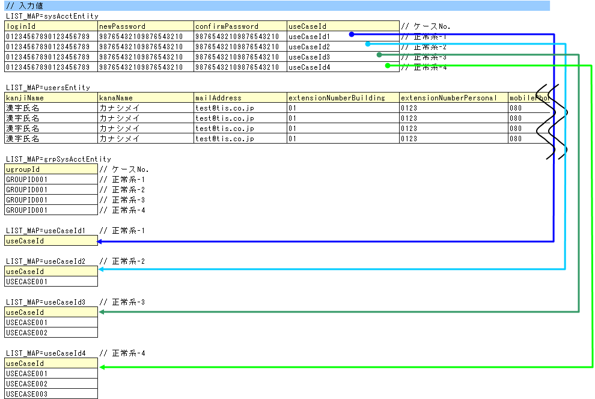

# Action/Componentのクラス単体テスト

本項では、Action/Componentのクラス単体テストのうちComponentのクラス単体テスト(以下Component単体テスト)にて説明する。
なお、Actionのクラス単体テスト(以下Action単体テスト)の場合の違いとしてはテストクラス名の部分である。

## Action/Component単体テストの書き方

本項で例として使用したテストクラスとテストデータは以下のとおり(右クリック->保存でダウンロード)。

* [テストケース一覧(ユーザ登録_ UserComponent_クラス単体テストケース.xls)](../../../knowledge/assets/testing-framework-02-componentUnitTest/ユーザ登録_UserComponent_クラス単体テストケース.xls)
* [テストクラス(UserComponentTest.java)](../../../knowledge/assets/testing-framework-02-componentUnitTest/UserComponentTest.java)
* [テストデータ(UserComponentTest.xls)](../../../knowledge/assets/testing-framework-02-componentUnitTest/UserComponentTest.xls)
* [テスト対象クラス(UserComponent.java)](../../../knowledge/assets/testing-framework-02-componentUnitTest/UserComponent.java)

本項では、ユーザ登録用メソッド(UserComponent#registerUser)を例に説明する。
このメソッドは、本来クラス単体テストの対象ではない [1] 想定だが、
Componentのクラス単体テストの実施手順を説明するのに好適である為、
例として取り上げる。

設計書にて定義されたメソッドでない為。クラス単体テストの対象については、 [クラス単体テスト概要](../../development-tools/testing-framework/testing-framework-01-UnitTestOutline.md#クラス単体テスト概要) を参照。

### テストケース実行のパターン分け

テストケース一覧とテスト対象メソッドから、テストケースは以下の4つに分類される。これは、どのパターンに属するかによって、テストクラスやデータの作成方法に
違いがあるためである。

| パターン | 当てはまる処理の例 |
|---|---|
| 戻り値(データベースの検索結果)を確認しなければならないもの | 検索処理 |
| 戻り値(データベースの検索結果以外)を確認しなければならないもの | 計算、判定処理 |
| 処理終了後のデータベースの状況を確認しなければならないもの | 更新(挿入、削除含む)処理 |
| メッセージIDを確認しなければならないもの | エラー処理 |

今回の例は、DB挿入処理、2重登録時のエラー処理ありなので、テストケースは"処理終了後のデータベースの状況を確認しなければならないもの"と
"メッセージIDを確認しなければならないもの"に分類される。

> **Note:**
> 戻り値を確認するパターン2つについては、次回発行時に説明を追記予定。

### テストデータとテストクラスの作成

[事前準備データの作成処理](../../development-tools/testing-framework/testing-framework-02-componentUnitTest.md#事前準備データの作成処理) 、 [処理終了後のデータベースの状況を確認しなければならないもの](../../development-tools/testing-framework/testing-framework-02-componentUnitTest.md#処理終了後のデータベースの状況を確認しなければならないもの) 、 [メッセージIDを確認しなければならないもの](../../development-tools/testing-framework/testing-framework-02-componentUnitTest.md#メッセージidを確認しなければならないもの) のそれぞれについて、テストデータとテストクラスの作成方法を説明する。
まず最初に、テストデータ(Excelファイル)そのもののと、テストクラスの作成方法(継承すべきクラスなど)を説明する。次に、各パターンごとのデータとテストメソッド作成方法を説明する。

#### テストデータの作成

テストデータを記載したExcelファイルは、 [Form/Entityのクラス単体テスト](../../development-tools/testing-framework/testing-framework-01-entityUnitTest.md#formentityのクラス単体テスト) と同様にテストソースコードと同じディレクトリに同じ名前で格納する(拡張子のみ異なる)。
なお、全てのテストデータは同じExcelのシートに記載する前提である。

テストデータの記述方法詳細については、 [自動テストフレームワーク](../../development-tools/testing-framework/testing-framework-01-Abstract.md) 、 [データベースを使用するクラスのテスト](../../development-tools/testing-framework/testing-framework-02-DbAccessTest.md) を参照。

なお、メッセージデータやコードマスタなどの、データベースに格納する静的マスタデータは、プロジェクトで管理されたデータがあらかじめ投入されている
(これらのデータを個別のテストデータとして作成しない)前提である。

#### テストクラスの作成

Component単体テストのテストクラスは以下の条件を満たすように作成する。詳細は、 [データベースを使用するクラスのテスト](../../development-tools/testing-framework/testing-framework-02-DbAccessTest.md) を参照。

* テストクラスのパッケージは、テスト対象のAction/Componentと同じとする。
* <Action/Componentクラス名>Testというクラス名でテストクラスを作成する。
* nablarch.test.core.db.DbAccessTestSupportを継承する。

```java
package nablarch.sample.management.user; // 【説明】パッケージはUserComponentと同じ

import static org.junit.Assert.assertEquals;
import static org.junit.Assert.assertTrue;
import static org.junit.Assert.fail;

import java.util.HashMap;
import java.util.List;
import java.util.Map;
import java.util.Map.Entry;

import nablarch.core.db.statement.SqlResultSet;
import nablarch.core.message.ApplicationException;
import nablarch.test.core.db.DbAccessTestSupport;

import org.junit.Test;

/**
 * {@link UserComponentTest}のテストクラス。
 *
 * @author Tsuyoshi Kawasaki
 * @since 1.0
 */
public class UserComponentTest extends DbAccessTestSupport {
// 【説明】クラス名はUserComponentTestで、DbAccessTestSupportを継承する

// ～後略～
```

( [記載しているサンプルプログラムソースコードの注意事項](../../about/about-nablarch/about-nablarch-aboutThis.md#注意事項) 参照)

#### 事前準備データの作成処理

事前データと事前データ投入処理を作成する。今回の例では、次のようなデータを作成している。

* スレッドコンテキスト [2] の設定

  * USER_ID:ユーザID。USERID0001。
  * REQUEST_ID:リクエストID。USERS00301。
* 挿入対象テーブルの初期化

  * SYSTEM_ACCOUNT:システムアカウントテーブル。初期データ3件。
  * USERS:ユーザテーブル。初期データ0件。
  * UGROUP_SYSTEM_ACCOUNT:グループシステムアカウントテーブル。初期データ0件。
  * SYSTEM_ACCOUNT_AUTHORITY:システムアカウント権限テーブル。初期データ0件。
* マスタ系データの投入

  * ID_GENERATE:採番テーブル。登録時に採番処理を行うため。採番テーブルを初期化しておかないと、テスト実行時の採番結果がわからなくなり、挿入結果の検証ができなくなる。


スレッドコンテキストとは、ユーザID、リクエストID、使用言語のような、一連の処理を実行するときに、コールスタックの複数のメソッドにおいて共通的に必要なデータを格納するオブジェクト。
 [変数スコープ](../../../../fw/reference/architectural_pattern/concept.html#scope) 参照。

これらのデータを読み込む処理を以下に示す。

```java
// ～前略～

/**
 * {@link UserComponent#registerUser()}のテスト1。<br>
 * 正常系。
 */
@Test
public void testRegisterUser1() {
    String sheetName = "registerUser";

    setThreadContextValues(sheetName, "threadContext"); // 【説明】スレッドコンテキストの設定

// ～中略～

     for (int i = 0; i < sysAcctDatas.size(); i++) {

// ～中略～

        // データベース準備
        setUpDb(sheetName); // 【説明】事前データの投入。
                            // 【説明】各ケースごとに初期化するためループ中で実行する。

// ～後略～
```

( [記載しているサンプルプログラムソースコードの注意事項](../../about/about-nablarch/about-nablarch-aboutThis.md#注意事項) 参照)

#### 処理終了後のデータベースの状況を確認しなければならないもの

##### テストデータ(入力値)の作成

テスト対象メソッドの引数を用意する。今回の例では、以下の3つが必要となる。なお、各データの同じ行で1組のテストデータとなる(例えば、sysAcctEntityの1行目と、
usersEntityの1行目と、grpSysAcctEntityの1行目で1ケース分のテストデータとなる)。

* sysAcctEntity:システムアカウントエンティティのデータ
* usersEntity:ユーザエンティティのデータ
* grpSysAcctEntity:グループシステムアカウントエンティティのデータ

sysAcctEntityのuseCaseIdはuseCaseIdプロパティに設定される値そのものではなく(SystemAccountEntityのuseCaseIdプロパティは配列)、図中矢印で示している別の
表のデータを指している。テストコードでは、取得した値をキーとして更にデータを取得、配列を作成し、useCaseIdプロパティに設定している。



```java
// ～前略～

public void testRegisterUser1() {
    String sheetName = "registerUser";

    setThreadContextValues(sheetName, "threadContext");

    List<Map<String, String>> sysAcctDatas = getListMap(sheetName, "sysAcctEntity");
    List<Map<String, String>> usersDatas = getListMap(sheetName, "usersEntity");
    List<Map<String, String>> grpSysAcctDatas = getListMap(sheetName, "grpSysAcctEntity");
    // エクセルのデータを一時的に受けるMap、List
    Map<String, Object> work = new HashMap<String, Object>();
    List<Map<String, String>> useCaseData = null;

    SystemAccountEntity sysAcct = null;
    UsersEntity users = null;
    UgroupSystemAccountEntity grpSysAcct = null;
    for (int i = 0; i < sysAcctDatas.size(); i++) {

// ～中略～

        // システムアカウント  // 【説明】SystemAccountEntityの準備
        work.clear();
        for (Entry<String, String> e : sysAcctDatas.get(i).entrySet()) {
            work.put(e.getKey(), e.getValue());
        }
        // ユースケースIDの引数作成
        String id = sysAcctDatas.get(i).get("useCaseId"); // 【説明】図中矢印の根元にある表のIDを取得
        useCaseData = getListMap(sheetName, id); // 【説明】取得したIDを使用して図中矢印の先にある配列のデータを取得
        String[] useCaseId = new String[useCaseData.size()]; // 【説明】配列の作成
        for (int j = 0; j < useCaseData.size(); j++) {
            useCaseId[j] = useCaseData.get(j).get("useCaseId");
        }
        work.put("useCase", useCaseId); // 【説明】作成した配列をSystemAccountEntityのコンストラクタに渡すMapに設定
        sysAcct = new SystemAccountEntity(work);

        // ユーザ  // 【説明】UsersEntityの準備
        work.clear();
        for (Entry<String, String> e : usersDatas.get(i).entrySet()) {
            work.put(e.getKey(), e.getValue());
        }
        users = new UsersEntity(work);

        // グループシステムアカウント  // 【説明】UgroupSystemAccountEntityの準備
        work.clear();
        for (Entry<String, String> e : grpSysAcctDatas.get(i).entrySet()) {
            work.put(e.getKey(), e.getValue());
        }
        grpSysAcct = new UgroupSystemAccountEntity(work);

        // 実行
        target.registerUser(sysAcct, users, grpSysAcct);
        commitTransactions();   // 【説明】全てのトランザクションをコミット

        // 検証
        String expectedGroupId = getListMap(sheetName, "expected").get(i).get("caseNo");
        assertTableEquals(expectedGroupId, sheetName, expectedGroupId);

// ～後略～
```

( [記載しているサンプルプログラムソースコードの注意事項](../../about/about-nablarch/about-nablarch-aboutThis.md#注意事項) 参照)

> **Note:**
> 上記のソースコードでは、getListMapメソッドを用いてExcelシートからデータを読み込んでいる。
> getListMapメソッドの詳細については、 [目的別API使用方法](../../development-tools/testing-framework/testing-framework-03-Tips.md) の
> 『 [Excelファイルから、入力パラメータや戻り値に対する期待値などを取得したい](../../development-tools/testing-framework/testing-framework-03-Tips.md#excelファイルから入力パラメータや戻り値に対する期待値などを取得したい) 』 を参照。

クラス単体テストでは、テストクラスからデータベースアクセスを行うクラスを直接起動する為、
フレームワークによるトランザクション制御は行われない。
処理終了後のデータベースの状況を確認しなければならない場合は、テストクラスにてトランザクションをコミットする必要がある。

スーパクラスの `commitTransactions()` メソッドを起動しコミットする。
トランザクションをコミットしない場合、テスト結果の確認が正常に行われない。
(参照系のテストの場合はコミットを行う必要はない)

##### テストデータ(想定結果)の作成

想定結果をテストケースごとに用意する。アプリケーションで設定する項目だけでなく、自動設定項目( [自動設定項目の指定(Entityの編集)](../../guide/web-application/web-application-07-insert.md#自動設定項目の指定entityの編集) 参照)も想定結果を用意する。検証には"assertTableEquals"メソッドを用いる。

サンプルアプリケーションでは、グループID( [一つのシートに複数テストケースのデータを記載したい](../../development-tools/testing-framework/testing-framework-03-Tips.md#一つのシートに複数テストケースのデータを記載したい) 参照)を定義したデータ(expected)を用意し、これをassertTableEqualsの
引数に渡すことで、複数の想定結果に対応している。


```java
// ～前略～

/**
 * {@link UserComponent#registerUser()}のテスト1。<br>
 * 正常系。
 */
@Test
public void testRegisterUser1() {
    String sheetName = "registerUser";

// ～中略～

     for (int i = 0; i < sysAcctDatas.size(); i++) {

// ～中略～

         // 検証
         // 【説明】グループIDの取得
         String expectedGroupId = getListMap(sheetName, "expected").get(i).get("caseNo");
         // 【説明】取得したグループIDを引数にassertTableEqualsの実行
         assertTableEquals(expectedGroupId, sheetName, expectedGroupId);

// ～後略～
```

( [記載しているサンプルプログラムソースコードの注意事項](../../about/about-nablarch/about-nablarch-aboutThis.md#注意事項) 参照)

case1を例にとると、想定結果は次のようになる。

| テーブル名 | 想定 |
|---|---|
| SYSTEM_ACCOUNT | [事前準備データの作成処理](../../development-tools/testing-framework/testing-framework-02-componentUnitTest.md#事前準備データの作成処理) で示したレコード+1レコード追加。計4レコード。 |
| USERS | 1レコード追加。( [事前準備データの作成処理](../../development-tools/testing-framework/testing-framework-02-componentUnitTest.md#事前準備データの作成処理) で0件に初期化し、テスト対象処理で1レコード追加) |
| UGROUP_SYSTEM_ACCOUNT | 1レコード追加。( [事前準備データの作成処理](../../development-tools/testing-framework/testing-framework-02-componentUnitTest.md#事前準備データの作成処理) で0件に初期化し、テスト対象処理で1レコード追加) |
| SYSTEM_ACCOUNT_AUTHORITY | 変化なし(新規追加なし)。 |

#### メッセージIDを確認しなければならないもの

##### テストデータ(入力値と想定値)の作成

[前項のテストデータ(入力値)の作成](../../development-tools/testing-framework/testing-framework-02-componentUnitTest.md#テストデータ入力値の作成) と同様にテストデータ(入力値)を作成する。こちらでは、
 [前項](../../development-tools/testing-framework/testing-framework-02-componentUnitTest.md#テストデータ入力値の作成) で指定したIDの末尾に"Err"を付加することで、同じExcelシート内に正常系と異常系のデータを混載している。また、
想定値はメッセージIDである。

ここで確認すべき内容は、ユニークキー制約違反による例外の発生である。テストコードでは、目的の例外をキャッチし、メッセージIDを比較することで検証を行う。

> **Warning:**
> キャッチする例外は発生を想定する例外とし、RuntimeExceptionなどの上位例外クラスは用いないこと。メッセージIDはあっているが、例外そのものを間違えているバグを
> 検出できなくなってしまう。


```java
// ～前略～

/**
 * {@link UserComponent#registerUser()}のテスト2。<br>
 * 異常系。
 */
@Test
public void testRegisterUser2() {
    String sheetName = "registerUser";

// ～中略～

        // 実行
        try {
            target.registerUser(sysAcct, users, grpSysAcct); // 【説明】テスト対象メソッド実行
            fail(); // 【説明】例外が発生しなかったらテスト失敗
        } catch (ApplicationException ae) { // 【説明】発生するはずの例外をキャッチ
            // 【説明】メッセージIDを検証
            assertEquals(expected.get(i).get("messageId"), ae.getMessages().get(0).getMessageId());
        }
    }
}

// ～後略～
```

( [記載しているサンプルプログラムソースコードの注意事項](../../about/about-nablarch/about-nablarch-aboutThis.md#注意事項) 参照)
