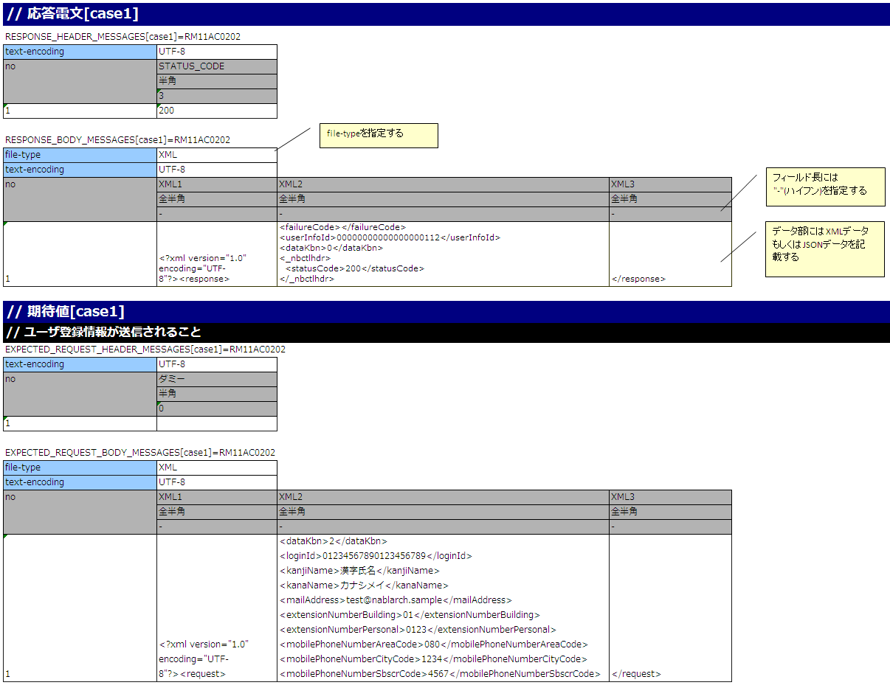

# リクエスト単体テストの実施方法(HTTP同期応答メッセージ送信処理)

リクエスト単体テスト実施方法は、 [リクエスト単体テストの実施方法(同期応答メッセージ送信処理)](../../development-tools/testing-framework/testing-framework-02-requestunittest-send-sync.md#リクエスト単体テストの実施方法同期応答メッセージ送信処理) を参照すること。

ただし、「送信キュー」「受信キュー」を「通信先」と読み替えること。

本項では、 [リクエスト単体テストの実施方法(同期応答メッセージ送信処理)](../../development-tools/testing-framework/testing-framework-02-requestunittest-send-sync.md#リクエスト単体テストの実施方法同期応答メッセージ送信処理) と異なる箇所の解説を行う。

## テストデータの書き方

以下に、実際にExcelで書かれたテストデータを示す。



-----

モックアップを使用する場合、testShotsに"expectedMessageByClient"および"responseMessageByClient"にグループIDを設定する。
グループIDの関連については [リクエスト単体テストの実施方法(同期応答メッセージ送信処理)](../../development-tools/testing-framework/testing-framework-02-requestunittest-send-sync.md#リクエスト単体テストの実施方法同期応答メッセージ送信処理) における"expectedMessage"および"responseMessage"の場合と同様であるため割愛する。


-----

同一アクション内でMOMによる同期応答メッセージ送信処理とHTTP同期応答メッセージ送信処理が同時に行われる場合、
"expectedMessage"、"responseMessage"にMOMによる同期応答メッセージ送信処理で使用するグループIDを、
"expectedMessageByClient"、"responseMessageByClient"にHTTP同期応答メッセージ送信処理で使用するグループIDを
それぞれ個別に指定する。


> **Note:**
> グループIDはMOMによる同期応答メッセージ送信処理とHTTP同期応答メッセージ送信処理でそれぞれ別の値を設定する必要がある。
> 同一のグループIDを指定した場合、正しく結果検証が行われないため、注意すること。

-----

テストデータのディレクティブ行に設定されたfile-typeの値により、要求電文のアサート方法が変化する。

設定方法やアサート内容についての詳細は [リクエスト単体テストの実施方法(同期応答メッセージ受信処理)](../../development-tools/testing-framework/testing-framework-02-requestunittest-real.md#リクエスト単体テストの実施方法同期応答メッセージ受信処理) のレスポンスメッセージの項を参照すること。

## フレームワークで使用するクラスの設定

通常、これらの設定はアーキテクトが行うものでありアプリケーションプログラマが設定する必要はない。

### モックアップクラスの設定

コンポーネント設定ファイルに、リクエスト単体テストで使用するモックアップクラスを設定する。

```xml
<!-- HTTP通信用クライアント -->
<component name="defaultMessageSenderClient"
           class="nablarch.test.core.messaging.RequestTestingMessagingClient">
</component>
```
