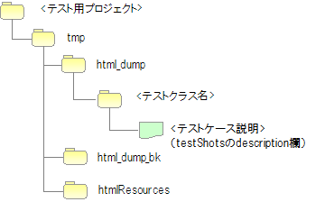

# リクエスト単体テスト（画面オンライン処理）

## 主なクラス・リソース一覧

リクエスト単体テスト（画面オンライン処理）の主なクラスとリソース。

| 名称 | 役割 | 作成単位 |
|------|------|----------|
| テストクラス | テストロジックを実装する。 | テスト対象クラス(Action)につき１つ作成 |
| テストデータ（Excelファイル） | テーブルに格納する準備データや期待する結果、HTTPパラメータなど、テストデータを記載する。 | テストクラスにつき１つ作成 |
| テスト対象クラス(Action) | テスト対象のクラス（Action以降の業務ロジックを実装する各クラスを含む） | 取引につき1クラス作成 |
| DbAccessTestSupport | 準備データ投入などデータベースを使用するテストに必要な機能を提供する。 | － |
| HttpServer | 内蔵サーバ。サーブレットコンテナとして動作し、HTTPレスポンスをファイル出力する機能を持つ。 | － |
| HttpRequestTestSupport | 内蔵サーバの起動やリクエスト単体テストで必要となる各種アサートを提供する。 | － |
| AbstractHttpReqestTestSupport / BasicHttpReqestTestSupport | リクエスト単体テストをテンプレート化するクラス。リクエスト単体テストのテストソース、テストデータを定型化する。 | － |
| TestCaseInfo | データシートに定義されたテストケース情報を格納するクラス。 | － |

> **重要**: 上記のクラス群は、内蔵サーバも含め全て同一のJVM上で動作する。このため、リクエストやセッション等のサーバ側のオブジェクトを加工できる。

<details>
<summary>keywords</summary>

HttpServer, HttpRequestTestSupport, AbstractHttpReqestTestSupport, BasicHttpReqestTestSupport, TestCaseInfo, DbAccessTestSupport, テストクラス, 同一JVM, サーバ側オブジェクト, 主なクラス, 作成単位, 内蔵サーバ, テストデータ, Excelファイル

</details>

## 前提事項

内蔵サーバを利用してHTMLダンプを出力するリクエスト単体テストは、**１リクエスト１画面遷移のシンクライアント型Webアプリケーション**を対象としている。

Ajaxやリッチクライアントを利用したアプリケーションの場合、HTMLダンプによるレイアウト確認は使用できない。

> **注意**: ViewテクノロジにJSPを用いているが、サーブレットコンテナ上で画面全体をレンダリングする方式であれば、JSP以外のViewテクノロジでもHTMLダンプの出力が可能である。

<details>
<summary>keywords</summary>

前提事項, シンクライアント, 1リクエスト1画面遷移, Ajax, リッチクライアント, HTMLダンプ, JSP以外, 対象アプリケーション, 制約

</details>

## 構造（クラス設計）

**BasicHttpRequestTestTemplate**

各テストクラスのスーパクラス。本クラスを使用することで、リクエスト単体テストのテストソース、テストデータを定型化でき、テストソース記述量を大きく削減できる。

具体的な使用方法は [../05_UnitTestGuide/02_RequestUnitTest/index](testing-framework-02_RequestUnitTest.md) を参照。

**AbstractHttpRequestTestTemplate**

アプリケーションプログラマが直接使用することはない。テストデータの書き方を変えたい場合など、自動テストフレームワークを拡張する際に用いる。

**TestCaseInfo**

データシートに定義されたテストケース情報を格納するクラス。テストデータの書き方を変えたい場合は、本クラス及びAbstractHttpRequestTestTemplateを継承する。

<details>
<summary>keywords</summary>

BasicHttpRequestTestTemplate, AbstractHttpRequestTestTemplate, TestCaseInfo, 構造, テンプレート化, 自動テストフレームワーク拡張, テストソース削減, スーパクラス

</details>

## データベース関連機能

`HttpRequestTestSupport`のデータベース関連機能は`DbAccessTestSupport`クラスへの委譲で実現。ただし、リクエスト単体テストでは不要なため、以下のメソッドは意図的に委譲されていない。

- `public void beginTransactions()`
- `public void commitTransactions()`
- `public void endTransactions()`
- `public void setThreadContextValues(String sheetName, String id)`

詳細は [02_DbAccessTest](testing-framework-02_DbAccessTest.md) を参照。

<details>
<summary>keywords</summary>

HttpRequestTestSupport, DbAccessTestSupport, データベース関連機能, beginTransactions, commitTransactions, endTransactions, setThreadContextValues, 委譲

</details>

## 事前準備補助機能

`HttpRequestTestSupport`が提供する事前準備補助メソッド。

**HttpRequest生成**:

```java
HttpRequest createHttpRequest(String requestUri, Map<String, String[]> params)
```
HTTPメソッドはPOSTに設定される。URIとパラメータ以外のデータが必要な場合は、返却されたインスタンスに追加設定する。

**ExecutionContext生成**:

```java
ExecutionContext createExecutionContext(String userId)
```
指定したユーザIDはセッションに格納され、そのユーザIDでログインしている状態になる。

**トークン発行（2重サブミット防止テスト用）**:

> **注意**: 2重サブミット防止を施しているURIのテストには、テスト実行前にトークンを発行しセッションに設定する必要がある。

```java
void setValidToken(HttpRequest request, ExecutionContext context)
```
トークンを発行しセッションに格納する。

```java
void setToken(HttpRequest request, ExecutionContext context, boolean valid)
```
第3引数が`true`の場合は`setValidToken`と同じ動作。`false`の場合はセッションからトークン情報を除去する。テストデータからboolean値を渡すことで、テストクラスにトークン設定の分岐処理を書かずに済む。

```java
// 【説明】テストデータから取得したものとする。
String isTokenValid;

// 【説明】"true"の場合はトークンが設定される。
setToken(req, ctx, Boolean.parseBoolean(isTokenValid));
```

<details>
<summary>keywords</summary>

HttpRequestTestSupport, createHttpRequest, createExecutionContext, setValidToken, setToken, トークン発行, 2重サブミット防止, HTTPリクエスト作成, ExecutionContext生成

</details>

## 実行

`execute`メソッドで内蔵サーバを起動しリクエストを送信する。

```java
HttpResponse execute(String caseName, HttpRequest req, ExecutionContext ctx)
```
- `caseName`: テストケース説明（HTMLダンプ出力ファイル名に使用）
- `req`: HttpRequest
- `ctx`: ExecutionContext

**リポジトリの初期化**:

`execute`メソッド内部でリポジトリの再初期化を行う。これによりクラス単体テストとリクエスト単体テストで設定を分けずに連続実行できる。

プロセス:
1. 現在のリポジトリの状態をバックアップ
2. テスト対象のWebアプリケーションのコンポーネント設定ファイルを用いてリポジトリを再初期化
3. `execute`メソッド終了時に、バックアップしたリポジトリを復元

テスト対象Webアプリケーションの設定については :ref:`howToConfigureRequestUnitTestEnv` を参照。

<details>
<summary>keywords</summary>

HttpRequestTestSupport, execute, リポジトリ初期化, 再初期化, クラス単体テスト, リクエスト単体テスト, 連続実行, HttpResponse

</details>

## メッセージ

アプリケーション例外に格納されたメッセージが想定通りであることを確認するメソッド:

```java
void assertApplicationMessageId(String expectedCommaSeparated, ExecutionContext actual)
```
- 第1引数: 期待するメッセージID（複数の場合はカンマ区切り）
- 第2引数: ExecutionContext

> **注意**: 例外が発生しなかった場合や、アプリケーション例外以外の例外が発生した場合はアサート失敗となる。メッセージIDの比較はIDをソートした状態で行うため、テストデータの順序を気にする必要はない。

<details>
<summary>keywords</summary>

HttpRequestTestSupport, assertApplicationMessageId, アプリケーション例外, メッセージIDアサート, 結果確認

</details>

## HTMLダンプ出力ディレクトリ

テスト実行後、プロジェクトルートに`tmp/html_dump`ディレクトリが作成される。テストクラス毎に同名のサブディレクトリが作成され、テストケース説明と同名のHTMLダンプファイルが出力される。

HTMLが参照するリソース（スタイルシート、画像等）も同ディレクトリに出力されるため、このディレクトリを保存することでどの環境でもHTMLを同じように参照できる。

> **注意**: `html_dump`ディレクトリが既に存在する場合は、`html_dump_bk`という名前でバックアップされる。



<details>
<summary>keywords</summary>

HTMLダンプ, html_dump, html_dump_bk, HTMLダンプ出力ディレクトリ, テスト結果出力

</details>
