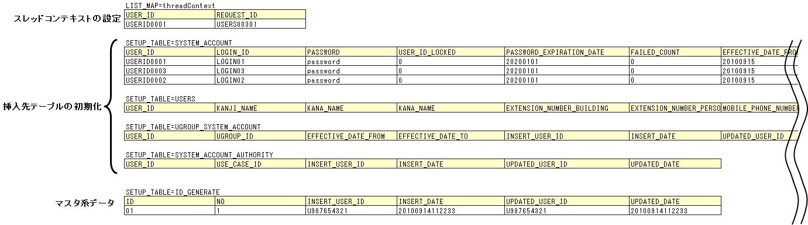

# Action/Componentのクラス単体テスト

## 

Component単体テストとAction単体テストの違いはテストクラス名のみ。

サンプルファイル:
- [テストケース一覧(ユーザ登録_ UserComponent_クラス単体テストケース.xls)](../../../knowledge/development-tools/testing-framework/assets/testing-framework-02_componentUnitTest/ユーザ登録_UserComponent_クラス単体テストケース.xls)
- [テストクラス(UserComponentTest.java)](../../../knowledge/development-tools/testing-framework/assets/testing-framework-02_componentUnitTest/UserComponentTest.java)
- [テストデータ(UserComponentTest.xls)](../../../knowledge/development-tools/testing-framework/assets/testing-framework-02_componentUnitTest/UserComponentTest.xls)
- :download:`テスト対象クラス(UserComponent.java)<../../04_Explanation/_source/download/UserComponent.java>`

<details>
<summary>keywords</summary>

Component単体テスト, Action単体テスト, DbAccessTestSupport, クラス単体テスト

</details>

## Action/Component単体テストの書き方

テストケースは処理内容によって以下の4パターンに分類し、パターンごとにテストクラス・データ作成方法が異なる。

| パターン | 当てはまる処理の例 |
|---|---|
| 戻り値(DBの検索結果)を確認 | 検索処理 |
| 戻り値(DB検索結果以外)を確認 | 計算、判定処理 |
| 処理終了後のDBの状況を確認 | 更新(挿入、削除含む)処理 |
| メッセージIDを確認 | エラー処理 |

<details>
<summary>keywords</summary>

テストケースパターン分類, 戻り値確認, DB更新確認, メッセージID確認, クラス単体テスト

</details>

## テストデータの作成

- テストデータExcelファイルはテストソースコードと同じディレクトリに同じ名前で格納する（拡張子のみ異なる）。
- 全テストデータは同じExcelシートに記載する前提。
- メッセージデータやコードマスタなどの静的マスタデータはプロジェクト管理データが事前投入済みの前提（個別にテストデータとして作成しない）。

参照: [../../06_TestFWGuide/01_Abstract](testing-framework-01_Abstract.md)、[../../06_TestFWGuide/02_DbAccessTest](testing-framework-02_DbAccessTest.md)

<details>
<summary>keywords</summary>

テストデータExcel, テストデータ配置, 静的マスタデータ, DbAccessTest, 同一ディレクトリ

</details>

## テストクラスの作成

Component単体テストのテストクラス作成条件（詳細: [../../06_TestFWGuide/02_DbAccessTest](testing-framework-02_DbAccessTest.md)）:

1. テストクラスのパッケージはテスト対象のAction/Componentと同じにする。
2. クラス名は`<Action/Componentクラス名>Test`とする。
3. `nablarch.test.core.db.DbAccessTestSupport`を継承する。

```java
package nablarch.sample.management.user; // パッケージはUserComponentと同じ
public class UserComponentTest extends DbAccessTestSupport {
    // クラス名はUserComponentTest、DbAccessTestSupportを継承
}
```

<details>
<summary>keywords</summary>

DbAccessTestSupport, テストクラス作成条件, Component単体テスト, DbAccessTestSupportを継承

</details>

## 事前準備データの作成処理

テスト実行前に以下のデータを準備する:

- スレッドコンテキスト設定（USER_ID、REQUEST_IDなど）
- 挿入対象テーブルの初期化（既知の初期状態にセット）
- 採番テーブル（ID_GENERATE）の初期化 — 採番テーブルを初期化しないとテスト実行時の採番結果が不確定になり挿入結果の検証ができなくなる。



```java
setThreadContextValues(sheetName, "threadContext"); // スレッドコンテキストの設定
// ...
setUpDb(sheetName); // 事前データの投入（各ケースごとに初期化するためループ中で実行）
```

<details>
<summary>keywords</summary>

事前準備データ, setUpDb, setThreadContextValues, スレッドコンテキスト, 採番テーブル初期化, ID_GENERATE

</details>

## 処理終了後のデータベースの状況を確認しなければならないもの

クラス単体テストではフレームワークのトランザクション制御が行われないため、テストクラスにてトランザクションをコミットする必要がある。スーパクラスの`commitTransactions()`を呼び出すこと。コミットしない場合はテスト結果の確認が正常に行われない（参照系はコミット不要）。

**テストデータ(入力値)**

`getListMap(sheetName, "listName")`でExcelシートからデータを読み込む（[how_to_get_data_from_excel](testing-framework-03_Tips.md) 参照）。同じ行のデータで1ケース分のテストデータを構成する。配列型プロパティ（SystemAccountEntityのuseCaseIdなど）は別表のデータを参照して配列を構築してから設定する。


**テストデータ(想定結果)**

自動設定項目（[insert_auto_setting_item](../../guide/web-application/web-application-07_insert.md) 参照）も想定結果を用意する。`assertTableEquals`で検証する。グループIDを定義したデータ（expected）を用意し`assertTableEquals`の引数に渡すことで複数の想定結果に対応できる。


```java
SystemAccountEntity sysAcct = new SystemAccountEntity(work);
UsersEntity users = new UsersEntity(work);
UgroupSystemAccountEntity grpSysAcct = new UgroupSystemAccountEntity(work);

target.registerUser(sysAcct, users, grpSysAcct);
commitTransactions(); // 全トランザクションをコミット

// 検証: グループIDで想定結果を指定
String expectedGroupId = getListMap(sheetName, "expected").get(i).get("caseNo");
assertTableEquals(expectedGroupId, sheetName, expectedGroupId);
```

<details>
<summary>keywords</summary>

commitTransactions, assertTableEquals, getListMap, トランザクションコミット, DB検証, how_to_get_data_from_excel, insert_auto_setting_item, SystemAccountEntity, UsersEntity, UgroupSystemAccountEntity

</details>

## メッセージIDを確認しなければならないもの

> **警告**: キャッチする例外は発生を想定する具体的な例外クラスを指定すること。`RuntimeException`などの上位例外クラスを使うと、メッセージIDは合っているが例外クラスが間違っているバグを検出できなくなる。

- テストデータのIDの末尾に"Err"を付加することで、同一Excelシートに正常系と異常系のデータを混載できる。
- 想定値はメッセージIDとする。


```java
try {
    target.registerUser(sysAcct, users, grpSysAcct);
    fail(); // 例外が発生しなかったらテスト失敗
} catch (ApplicationException ae) { // 発生するはずの例外をキャッチ
    assertEquals(expected.get(i).get("messageId"), ae.getMessages().get(0).getMessageId());
}
```

<details>
<summary>keywords</summary>

ApplicationException, メッセージID検証, fail(), 異常系テスト, 例外クラス指定

</details>
