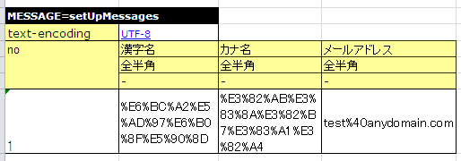

# 目的別API使用方法

**公式ドキュメント**: [目的別API使用方法]()

## Excelファイルから、入力パラメータや戻り値に対する期待値などを取得したい

## Excelファイルからデータ取得（LIST_MAP形式）

データタイプ `LIST_MAP` を使用してExcelファイルからList\<Map\<String, String\>>形式でデータを取得する。

**書式**: `LIST_MAP=<シート内で一意になるID（任意の文字列）>`

- データの2行目: MapのKey
- データの3行目以降: MapのValue

**クラス**: `TestSupport`, `DbAccessTestSupport`

データ取得メソッド（第1引数: シート名、第2引数: ID）:
- `TestSupport#getListMap(String sheetName, String id)`
- `DbAccessTestSupport#getListMap(String sheetName, String id)`

```java
List<Map<String, String>> parameters = getListMap("testGetName", "parameters");
Map<String, String> param = parameters.get(0);
String empNo = param.get("empNo");
String expected = param.get("expected");
```

**Excelデータ例**:
```
LIST_MAP=parameters
empNo    expected
00001    山田太郎
00002    鈴木一郎
```

上記の表で取得可能なオブジェクトは、以下のコードで取得できるListと等価である。

```java
List<Map<String, String>> list = new ArrayList<Map<String, String>>();
Map<String, String> first = new HashMap<String, String>();
first.put("empNo", "00001");
first.put("expected", "山田太郎");
list.add(first);
Map<String, String> second = new HashMap<String, String>();
second.put("empNo", "00002");
map.put("expected", "鈴木一郎");
list.add(second);
```

シーケンスオブジェクトの採番をテストするには、テスト用設定ファイルで `OracleSequenceIdGenerator` を `FastTableIdGenerator`（テーブル採番）に置き換える。

本番用設定:
```xml
<component name="idGenerator" class="nablarch.common.idgenerator.OracleSequenceIdGenerator">
    <property name="idTable">
        <map>
            <entry key="1101" value="SEQ_1"/>
            <entry key="1102" value="SEQ_2"/>
            <entry key="1103" value="SEQ_3"/>
            <entry key="1104" value="SEQ_4"/>
        </map>
    </property>
</component>
```

テスト用設定（本番設定を上書き）:
```xml
<component name="idGenerator" class="nablarch.common.idgenerator.FastTableIdGenerator">
    <property name="tableName" value="TEST_SBN_TBL"/>
    <property name="idColumnName" value="ID_COL"/>
    <property name="noColumnName" value="NO_COL"/>
    <property name="dbTransactionManager" ref="dbTransactionManager"/>
</component>
```

> **注意**: テーブル採番設定の詳細は [Nablarch採番機能](../../component/libraries/libraries-06_IdGenerator.md) 参照。

Excelファイル設定例（採番対象ID:1101の場合）:

準備データ（採番用テーブル）:

| ID_COL | NO_COL |
|--------|--------|
| 1101   | 100    |

> **注意**: 準備データにはテスト範囲内で使用する採番対象のレコードのみ設定する。

期待値（採番用テーブル）:

| ID_COL | NO_COL |
|--------|--------|
| 1101   | 101    |

期待値（採番した値が登録されるテーブル USER_INFO）:

| USER_ID    | KANJI_NAME | KANA_NAME |
|------------|------------|-----------|
| 0000000101 | 漢字名     | ｶﾅﾒｲ     |

> **注意**: 採番処理が1回の場合、期待値は「準備データの値 + 1」となる。

デフォルトでは `test/java` 配下からテストデータを読み込む。変更する場合はコンポーネント定義ファイルに `nablarch.test.resource-root` を設定する。

| キー | 値 |
|---|---|
| `nablarch.test.resource-root` | テスト実行時のカレントディレクトリからの相対パス。セミコロン(`;`)区切りで複数指定可 |

設定例:
```
nablarch.test.resource-root=path/to/test-data-dir
```

複数ディレクトリ指定例:
```
nablarch.test.resource-root=test/online;test/batch
```

> **補足**: 一時的な設定変更はVMの引数 `-Dnablarch.test.resource-root=path/to/test-data-dir` で代替可能（設定ファイルの変更不要）。

> **注意**: 複数ディレクトリ指定時、同名のテストデータが存在した場合は最初に発見されたものが読み込まれる。

<details>
<summary>keywords</summary>

TestSupport, DbAccessTestSupport, getListMap, LIST_MAP, Excelデータ取得, List-Map形式, EmployeeComponent, OracleSequenceIdGenerator, FastTableIdGenerator, シーケンスオブジェクト採番テスト, テーブル採番への置き換え, TEST_SBN_TBL, SETUP_TABLE, EXPECTED_TABLE, 採番テスト設定, nablarch.test.resource-root, テストデータディレクトリ変更, resource-root設定, セミコロン区切り複数ディレクトリ指定, VMオプション一時設定変更

</details>

## 同じテストメソッドをテストデータを変えて実行したい

## 同じテストメソッドをテストデータを変えて実行したい

LIST_MAP形式でデータを取得しループさせることで、Excelデータ追加だけでデータバリエーションを増やせる。

```java
setUpDb("testSelectByPk");
List<Map<String, String>> parameters = getListMap("testGetName", "parameters");
for (Map<String, String> param : parameters) {
    String empNo = param.get("empNo");
    String expectedDataId = param.get("expectedDataId");
    SqlResultSet actual = target.selectByPk(empNo);
    assertSqlResultSetEquals("testSelectByPk", expectedDataId, actual);
}
```

> **警告**: 更新系のテストを行う場合は、ループ内で `setUpDb` メソッドを呼び出すこと。呼び出さないと、テストの成否がデータの順番に依存してしまう。

**Excelデータ例**:
```
// ループさせるデータ
LIST_MAP=parameters
empNo    expectedDataId
00001    expected01
00002    expected02

// 準備データ
SETUP_TABLE=EMPLOYEE
NO       NAME
00001    山田太郎
00002    鈴木一郎

// 期待するデータその１
LIST_MAP=expected01
NO       NAME
00001    山田太郎

// 期待するデータその２
LIST_MAP=expected02
NO       NAME
00001    山田太郎
```

フレームワークを経由せずテストクラスからデータベースアクセスクラスを直接起動する場合、ThreadContextに値が設定されていない。Excelファイルに値を記述し以下のメソッドを呼び出すことでThreadContextに値を設定できる。

- `TestSupport#setThreadContextValues(String sheetName, String id)`
- `DbAccessTestSupport#setThreadContextValues(String sheetName, String id)`

> **注意**: 自動設定項目を利用してデータベースに登録・更新する際は、ThreadContextにリクエストIDとユーザIDが設定されている必要がある。テスト対象クラス起動前に設定すること。

テストコード例:
```java
public class DbAccessTestSample extends DbAccessTestSupport {
    @Test
    public void testInsert() {
        setThreadContextValues("testSelect", "threadContext");
        // ...
    }
}
```

テストデータ（シート[testInsert]、`LIST_MAP=threadContext`）:

| USER_ID | REQUEST_ID | LANG  |
|---------|------------|-------|
| U00001  | RS000001   | ja_JP |

テストデータのExcelに記述されたデータはデフォルトでは指定エンコーディングでバイト列に変換されるのみ。URLエンコーディングのような定型的な変換処理を追加するには、`nablarch.test.core.file.TestDataConverter` インタフェースを実装してリポジトリに登録する。

**インタフェース**: `nablarch.test.core.file.TestDataConverter`

リポジトリ登録:

| キー | 値 |
|---|---|
| `TestDataConverter_<データ種別>` | 上記インタフェースを実装したクラスのクラス名。データ種別はテストデータのfile-typeに指定した値 |

```xml
<component name="TestDataConverter_FormUrlEncoded"
           class="please.change.me.test.core.file.FormUrlEncodedTestDataConverter"/>
```




<details>
<summary>keywords</summary>

getListMap, setUpDb, assertSqlResultSetEquals, LIST_MAP, ループテスト, データバリエーション, SqlResultSet, TestSupport, DbAccessTestSupport, setThreadContextValues, ThreadContext, ユーザID設定, リクエストID設定, TestDataConverter, nablarch.test.core.file.TestDataConverter, TestDataConverter_データ種別, テストデータ変換処理, URLエンコーディング変換, file-type, FormUrlEncodedTestDataConverter

</details>

## 一つのシートに複数テストケースのデータを記載したい

## グループIDによる複数テストケースのデータ集約

グループIDを付与することで、複数テストケースのデータを1シートに混在させられる。

サポートされるデータタイプ: `EXPECTED_TABLE`, `SETUP_TABLE`

**書式**: `データタイプ[グループID]=テーブル名`

APIにグループIDを渡すと、そのグループIDのデータのみが処理対象になる。

```java
// グループIDが"case_001"のものだけDBに登録
setUpDb("testUpdate", "case_001");

// グループIDが"case_001"のものだけassert対象
assertTableEquals("データベース更新結果確認", "testUpdate", "case_001");
```

**Excelデータ例**:
```
SETUP_TABLE[case_001]=EMPLOYEE_TABLE
ID       EMP_NAME     DEPT_CODE
00001    山田太郎      0001
00002    田中一郎      0002

EXPECTED_TABLE[case_001]=EMPLOYEE_TABLE
ID       EMP_NAME     DEPT_CODE
00001    山田太郎      0001
00002    田中一郎      0010   //更新

SETUP_TABLE[case_002]=EMPLOYEE_TABLE
...
EXPECTED_TABLE[case_002]=EMPLOYEE_TABLE
...
```

テストソースコードと異なるディレクトリのExcelファイルを読み込む場合は、`TestDataParser` 実装クラスを直接使用する。

```java
TestDataParser parser = (TestDataParser) SystemRepository.getObject("testDataParser");
List<Map<String, String>> list = parser.getListMap("/foo/bar/Baz.xls", "sheet001", "params");
```

<details>
<summary>keywords</summary>

グループID, EXPECTED_TABLE, SETUP_TABLE, setUpDb, assertTableEquals, 複数テストケース, シートデータ集約, TestDataParser, SystemRepository, getListMap, 任意ディレクトリExcel読み込み

</details>

## システム日時を任意の値に固定したい

## システム日時の固定（FixedSystemTimeProvider）

`SystemTimeProvider`インタフェースの実装クラスを`nablarch.test.FixedSystemTimeProvider`に差し替えることで、任意のシステム日時を返却させられる。

**クラス**: `nablarch.test.FixedSystemTimeProvider`

```xml
<component name="systemTimeProvider"
    class="nablarch.test.FixedSystemTimeProvider">
  <property name="fixedDate" value="20100913123456" />
</component>
```

| プロパティ名 | 設定内容 |
|---|---|
| fixedDate | 固定する日時。フォーマット: `yyyyMMddHHmmss`（12桁）または `yyyyMMddHHmmssSSS`（15桁） |

```java
SystemTimeProvider provider = (SystemTimeProvider) SystemRepository.getObject("systemTimeProvider");
Date now = provider.getDate();
```

JUnit4のアノテーション（`@Before`, `@After`, `@BeforeClass`, `@AfterClass`）を使用することでテスト実行前後に共通処理を実行できる。

<details>
<summary>keywords</summary>

FixedSystemTimeProvider, SystemTimeProvider, fixedDate, システム日時固定, テスト日付固定, SystemRepository, @Before, @After, @BeforeClass, @AfterClass, JUnit4アノテーション, テスト前後共通処理

</details>

## @BeforeClass, @AfterClass使用時の注意点

`@BeforeClass`, `@AfterClass` 使用時の注意: サブクラスでスーパークラスと同名・同アノテーションのメソッドを作成すると、スーパークラスのメソッドが起動されなくなる。

```java
public class TestSuper {
    @BeforeClass
    public static void setUpBeforeClass() {
        System.out.println("super");   // 表示されない
    }
}

public class TestSub extends TestSuper {
    @BeforeClass
    public static void setUpBeforeClass() {
        // スーパークラスのメソッドを上書き
    }
    @Test
    public void test() {
        System.out.println("test");
    }
}
```

<details>
<summary>keywords</summary>

@BeforeClass, @AfterClass, サブクラス同名メソッド上書き, スーパークラスメソッド無効化

</details>

## デフォルト以外のトランザクションを使用したい

データベースアクセスクラスのテストでは、テストクラス側でトランザクション制御が必要。`DbAccessTestSupport` を継承することで、テストメソッド実行前にトランザクション開始、終了後にトランザクション終了が自動で行われる（スーパークラスの `@Before`、`@After` メソッドが自動呼び出し）。これにより個別テストで明示的にトランザクション開始・終了する必要がなくなり、終了漏れも防止できる。

<details>
<summary>keywords</summary>

DbAccessTestSupport, トランザクション制御, テスト自動トランザクション管理, beginTransactions, endTransactions

</details>

## 本フレームワークのクラスを継承せずに使用したい

別のクラスを継承する必要があるなどフレームワークのスーパークラスを継承できない場合、`DbAccessTestSupport` をインスタンス化して委譲できる。

- コンストラクタにテストクラス自身の `Class` インスタンスを渡す
- `@Before` メソッドで `dbSupport.beginTransactions()` を明示的に呼び出す
- `@After` メソッドで `dbSupport.endTransactions()` を明示的に呼び出す

```java
public class SampleTest extends AnotherSuperClass {
    private DbAccessTestSupport dbSupport = new DbAccessTestSupport(getClass());

    @Before
    public void setUp() {
        dbSupport.beginTransactions();
    }

    @After
    public void tearDown() {
        dbSupport.endTransactions();
    }

    @Test
    public void test() {
        dbSupport.setUpDb("test");
        // ...
        dbSupport.assertSqlResultSetEquals("test", "id", actual);
    }
}
```

<details>
<summary>keywords</summary>

DbAccessTestSupport, beginTransactions, endTransactions, 委譲パターン, setUpDb, assertSqlResultSetEquals, フレームワーク非継承

</details>

## クラスのプロパティを検証したい

テスト対象クラスのプロパティ検証には以下のメソッドを使用する。テストデータの記述方法は [how_to_get_data_from_excel](#) と同様で、2行目がプロパティ名、3行目以降が検証値。

- `HttpRequestTestSupport#assertObjectPropertyEquals(String message, String sheetName, String id, Object actual)`
- `HttpRequestTestSupport#assertObjectArrayPropertyEquals(String message, String sheetName, String id, Object[] actual)`
- `HttpRequestTestSupport#assertObjectListPropertyEquals(String message, String sheetName, String id, List<?> actual)`

テストコード例:
```java
public class UserUpdateActionRequestTest extends HttpRequestTestSupport {
    @Test
    public void testRW11AC0301Normal() {
        execute("testRW11AC0301Normal", new BasicAdvice() {
            @Override
            public void afterExecute(TestCaseInfo testCaseInfo, ExecutionContext context) {
                UserForm form = (UserForm) context.getRequestScopedVar("user_form");
                UsersEntity users = form.getUsers();
                assertObjectPropertyEquals(testCaseInfo.getTestCaseName(), testCaseInfo.getSheetName(), "expectedUsers", users);
            }
        });
    }
}
```

Excelファイル例（`LIST_MAP=expectedUsers`）:

| kanjiName | kanaName  | mailAddress        |
|-----------|-----------|---------|
| 漢字氏名  | カナシメイ | test@anydomain.com |

<details>
<summary>keywords</summary>

HttpRequestTestSupport, assertObjectPropertyEquals, assertObjectArrayPropertyEquals, assertObjectListPropertyEquals, プロパティ検証

</details>

## テストデータに空白、空文字、改行やnullを記述したい

テストデータへの空白・空文字・改行・nullの記述方法については、:ref:`special_notation_in_cell` を参照。

<details>
<summary>keywords</summary>

special_notation_in_cell, テストデータ特殊記法, 空白, null, 空文字

</details>

## テストデータに空行を記述したい

テストデータに空行を含めたい場合、空行は無視されるため `""` を使って空行を表現する。行のうち1セルだけに `""` を記載すれば良く（全セルに記載不要）、推奨は左端セルへの記載。

例（2レコード目が空行）:

`SETUP_VARIABLE=/path/to/file.csv`

| name | address |
|------|---------|
| 山田 | 東京都  |
| ""   |         |
| 田中 | 大阪府  |

<details>
<summary>keywords</summary>

SETUP_VARIABLE, 空行記述, ダブルクォーテーション空行表現

</details>

## マスタデータを変更してテストを行いたい

マスタデータを変更してテストを行う方法については、[04_MasterDataRestore](testing-framework-04_MasterDataRestore.md) を参照。

<details>
<summary>keywords</summary>

04_MasterDataRestore, マスタデータ変更テスト

</details>
