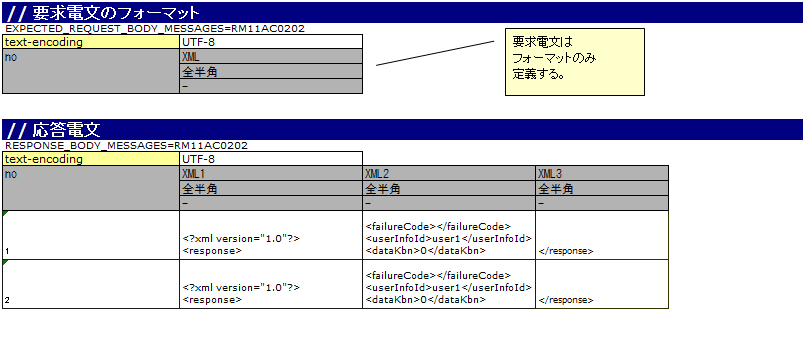

# HTTP同期応答メッセージ送信処理を伴う取引単体テストの実施方法

## 概要

HTTP同期応答メッセージ送信処理を伴う取引単体テストには、Nablarchが提供するモックアップクラスを使用する。

基本的な実施方法は :ref:`dealUnitTest_send_sync` を参照。ただし「送信キュー」「受信キュー」は「通信先」と読み替えること。

<details>
<summary>keywords</summary>

HTTP同期応答メッセージ送信処理, 取引単体テスト, モックアップクラス, 送信キュー, 受信キュー, 通信先

</details>

## モックアップクラスを使用した取引単体テストの実施方法

## Excelファイルの書き方

テストデータはExcelファイルに定められた記述ルールに従い記載する。

- 応答電文のフォーマット・データ: モックアップクラスが返却する応答電文の生成に使用
- 要求電文のフォーマット: モックアップクラスが要求電文ログの出力に使用



電文のフォーマット・データの記載方法は [send_sync_test_data_format](testing-framework-send_sync-03_DealUnitTest.md) と同じ。ただしHTTP通信は要求・応答電文ともにヘッダが存在しないため、本文のみ定義する。

## モックアップクラスの設定

> **注意**: 通常、これらの設定はアーキテクトが行う。アプリケーションプログラマが設定する必要はない。

コンポーネント設定ファイルにモックアップクラスを設定する:

```xml
<component name="defaultMessageSenderClient"
           class="nablarch.test.core.messaging.MockMessagingClient">
</component>
```

<details>
<summary>keywords</summary>

MockMessagingClient, nablarch.test.core.messaging.MockMessagingClient, defaultMessageSenderClient, Excelファイル, 取引単体テスト, モックアップクラス設定, HTTP同期応答メッセージ送信処理, send_sync_test_data_format

</details>
