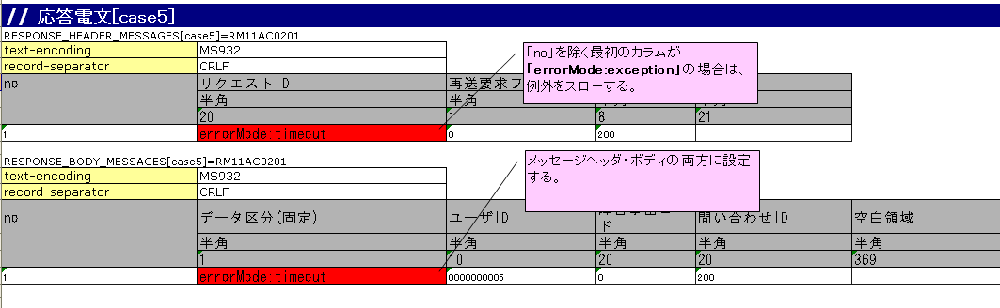

# リクエスト単体テストの実施方法(同期応答メッセージ送信処理)

## 出力ライブラリ(同期応答メッセージ送信処理)の構造とテスト範囲

同期応答メッセージ送信処理のリクエスト単体テストはリクエストID単位で実施する。

> **注意**: ここでのリクエストIDとは、メッセージを送信する相手先システムの機能を一意に識別するために定義するIDであり、画面オンライン処理やバッチ処理で使用するリクエストIDとは意味が異なる。このリクエストIDにもとづき、要求電文および応答電文のフォーマット、送信キュー名、受信キュー名が決まる。

テストフロー:
1. 自動テストFWがNablarch Application Frameworkを起動
2. NablarchがActionの入力パラメータ（画面: リクエスト、バッチ: ファイル/DB）を読み込みActionを起動
3. ActionがNablarchのメッセージ同期送信処理を実行し、パラメータを要求電文に変換
4. 自動テストFWがテストデータをもとに要求電文をアサート（キューにPUTしない）
5. 自動テストFWがテストデータをもとに応答電文を生成しActionへ返却（キューからGETしない）

> **注意**: 自動テストFWは「送信キュー」「受信キュー」を使用せず、キューの手前で要求電文のアサートおよび応答電文の生成を行う。特別なミドルウェアのインストールや環境設定は不要。

本テストフレームワークの特色:
1. ExcelファイルでI/F設計書のフォーマット定義に沿ったテストデータ記述が可能（固定長電文も扱いやすい）
2. スーパークラスが典型的な定型処理（テスト準備・実行・結果確認）を実装済み。テストデータのみでほぼコーディングなしでテスト実行可能

keywords

同期応答メッセージ送信処理, リクエスト単体テスト, リクエストID, 要求電文, 応答電文, キュー不使用, ミドルウェア不要, テストフレームワーク特色

## テストの実施方法

同期応答メッセージ送信処理のテストは、画面オンライン処理やバッチ処理などのテスト方式を踏襲して行われる。テストクラスの書き方や各種準備データの準備方法については、これらのテストの実施方法を参照すること。本項では同期応答メッセージ送信処理固有の実施方法についてのみ解説する。

keywords

テストの実施方法, 同期応答メッセージ送信, テスト方式踏襲

## テストデータの配置ルール

テストデータを記載したExcelファイルは、クラス単体テストと同様にテストソースコードと同じディレクトリに同じ名前で格納する（拡張子のみ異なる）。

テストデータの記述方法詳細については :ref:`how_to_write_excel` を参照。

keywords

テストデータ, Excelファイル配置, テストソースコード同一ディレクトリ, how_to_write_excel

## テストデータの書き方

リクエストIDごとに要求電文・応答電文のヘッダ部とボディ部のフォーマットおよびデータを定義する。テストケースのexpectedMessageおよびresponseMessageフィールドに記載されたグループIDが、対応する識別子を持つ電文表と対応付けられる。

- テストケース一覧にexpectedMessageおよびresponseMessageの欄がない場合は検証が行われない
- 欄が空欄かつメッセージ同期送信処理が行われた場合はテストが失敗する。メッセージ同期送信処理を行う場合はexpectedMessageおよびresponseMessageを必ず記載すること
- 1テストケースで同一グループIDかつ同一リクエストIDの電文が複数件送信される場合は件数分のデータ行を記載。noの連番は送信順に一致

識別子の書式:
- 要求電文ヘッダ期待値: `EXPECTED_REQUEST_HEADER_MESSAGES[グループID]=リクエストID`
- 要求電文本文期待値: `EXPECTED_REQUEST_BODY_MESSAGES[グループID]=リクエストID`
- 応答電文ヘッダ: `RESPONSE_HEADER_MESSAGES[グループID]=リクエストID`
- 応答電文本文: `RESPONSE_BODY_MESSAGES[グループID]=リクエストID`

> **注意**: Nablarch標準の同期応答メッセージ送信機能では、要求電文と応答電文のヘッダ部は共通フォーマットを使用する。テストデータもヘッダ部フォーマット定義をリクエスト単位で統一すること。ボディ部については要求電文と応答電文で異なるフォーマット定義が可能。

keywords

expectedMessage, responseMessage, グループID, EXPECTED_REQUEST_HEADER_MESSAGES, EXPECTED_REQUEST_BODY_MESSAGES, RESPONSE_HEADER_MESSAGES, RESPONSE_BODY_MESSAGES, 要求電文期待値, 応答電文定義

## 電文表の書式定義

要求電文の期待値および応答電文の表の書式:

| 項目 | 説明 |
|---|---|
| 識別子 | 電文種類を示すIDを指定。テストケースのexpectedMessage/responseMessageのグループIDに対応 |
| ディレクティブ行 | ディレクティブ名と設定値を記載（複数行指定可） |
| no | ディレクティブ行の下に必ず記載 |
| フィールド名称 | フィールド数分記載 |
| データ型 | フィールドのデータ型をフィールド数分記載 |
| フィールド長 | フィールドのフィールド長をフィールド数分記載 |
| データ | フィールドに格納されるデータ。複数レコードは次行に記載。同一リクエストIDで複数回同期送信する場合も次行に続けて記載 |

> **警告**: フィールド名称に重複した名称は許容されない（例：「氏名」フィールドが2つ以上存在してはならない。通常は「本会員氏名」「家族会員氏名」のようにユニークな名称を付与する）

> **ヒント**: フィールド名称、データ型、フィールド長の記述は、外部インタフェース設計書からコピー＆ペーストすることで効率良く作成できる。ペーストする際、**「行列を入れ替える」** オプションにチェックすること。

keywords

識別子, ディレクティブ行, フィールド名称, フィールド長, データ型, 電文フォーマット定義, フィールド名重複禁止, 外部インタフェース設計書, コピーペースト, 行列を入れ替える

## 要求電文の記載例

要求電文の本文の期待値の記載例。要求電文ヘッダ期待値および応答電文の本文・ヘッダについても、識別子を除く部分は同様の書式となる。

以下の仕様を満たす要求電文が送信されることを期待する例:
- リクエストID: `RM21AA0104`
- 文字コード: `Windows-31J`
- レコード区切り文字: `CRLF`
- フィールド値: レコード区分=`1`、ユーザID=`0000000001`、ログインID=`nabura`

keywords

要求電文記載例, RM21AA0104, Windows-31J, CRLF, テストデータ具体例

## 障害系のテスト

応答電文の表のヘッダおよび本文両方の「no」を除く最初のフィールドに以下の値を設定することで障害系テストが可能:

| 設定値 | 障害内容 | 動作 |
|---|---|---|
| `errorMode:timeout` | メッセージ送信中のタイムアウトエラー | `MessageSendSyncTimeoutException`（`MessagingException`のサブクラス）をスロー |
| `errorMode:msgException` | メッセージ送受信エラー | `MessagingException`をスロー |

設定箇所: 応答電文の表の**ヘッダおよび本文両方**の、「no」を除く最初のフィールド。

> **注意**: 業務アクション内で明示的に`MessagingException`の制御を行っていない場合、個別のリクエスト単体テストで障害系テストは不要。

keywords

errorMode:timeout, errorMode:msgException, MessageSendSyncTimeoutException, MessagingException, 障害系テスト, タイムアウト

## テスト結果検証

要求電文の期待値を定義した場合、自動テストFWが以下を検証する:
- 要求電文の内容の検証
- 要求電文の送信件数の検証

keywords

テスト結果検証, 要求電文アサート, 送信件数検証

