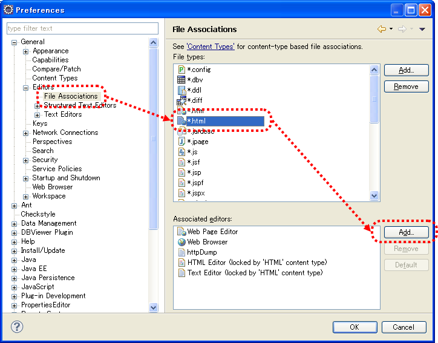
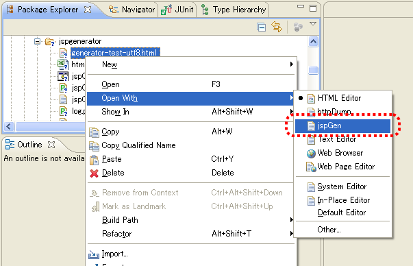

# JSP自動生成ツール インストールガイド

[JSP自動生成ツール](../../development-tools/toolbox/toolbox-01-JspGenerator.md#jsp自動生成ツール) のインストール方法について説明する。

## 前提事項

本ツールを使用する際、以下の前提事項を満たす必要がある。

* javaコマンドがパスに含まれていること

## 提供方法

本ツールは、Nablarchのチュートリアルプロジェクトに同梱して提供する。
本ツールのツール構成を下記に示す。

| ファイル名 | 説明 |
|---|---|
| jspGen.bat | 起動バッチファイル（Windows用） |
| jspGen.config | JSP自動生成ツールの設定ファイル |
| log.properties | ログ出力設定ファイル |
| nablarch-X.X.jar | Nablarch Application Framework のJARファイル（X.Xの部分はバージョン番号） |
| nablarch-tfw-X.X.jar | Nablarch Testing Framework のJARファイル（X.Xの部分はバージョン番号） |
| nablarch-toolbox-X.X.jar | Nablarch Toolbox のJARファイル（X.Xの部分はバージョン番号） |

各JARファイルへのクラスパスが設定されたjspGen.batがサンプルアプリケーションの下記パスに配置されている。

```bash
/Nablarch_sample/tool/jspgenerator/jspGen.bat
```

## Eclipseとの連携

以下の設定をすることでEclipseから本ツールを起動することができる。

### 設定画面起動

ツールバーから、ウィンドウ(Window)→設定(Prefernce)を選択する。
左側のペインから一般(General)→エディタ(Editors)→ファイルの関連付け(File Associations)
を選択、右側のペインから*.htmlを選択し、追加(Add)ボタンを押下する。



### 外部プログラム選択

ラジオボタンから外部プログラム(External program)を選択し、参照(Browse)ボタンを押下する。


### 起動用バッチファイル選択

バッチファイル(jspGen.bat)を選択する。

Nablarch_sample には、上記バッチファイルが /Nablarch_sample/tool/jspgenerator 配下にあらかじめ配置されている。


### HTMLファイルからの起動方法

Eclipseのパッケージエクスプローラ等からHTMLファイルを右クリックし、
jspGenで開くことでツールを起動できる。



### 作成したファイルの表示

[HTMLファイルからの起動方法](../../development-tools/toolbox/toolbox-02-SetUpJspGeneratorTool.md#htmlファイルからの起動方法) の実行により、HTMLファイルと同一ディレクトリにJSPファイルが生成される。
HTMLファイルと同一ディレクトリを右クリックしフレッシュ(Refresh)を選択することでJSPファイルが生成される。
