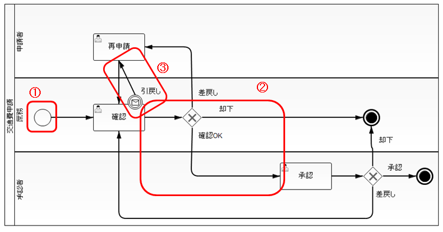
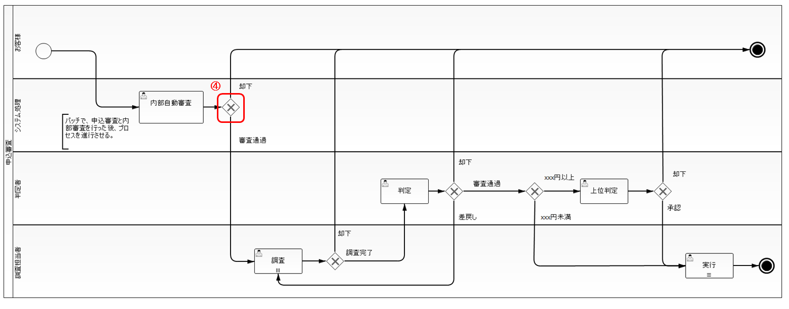
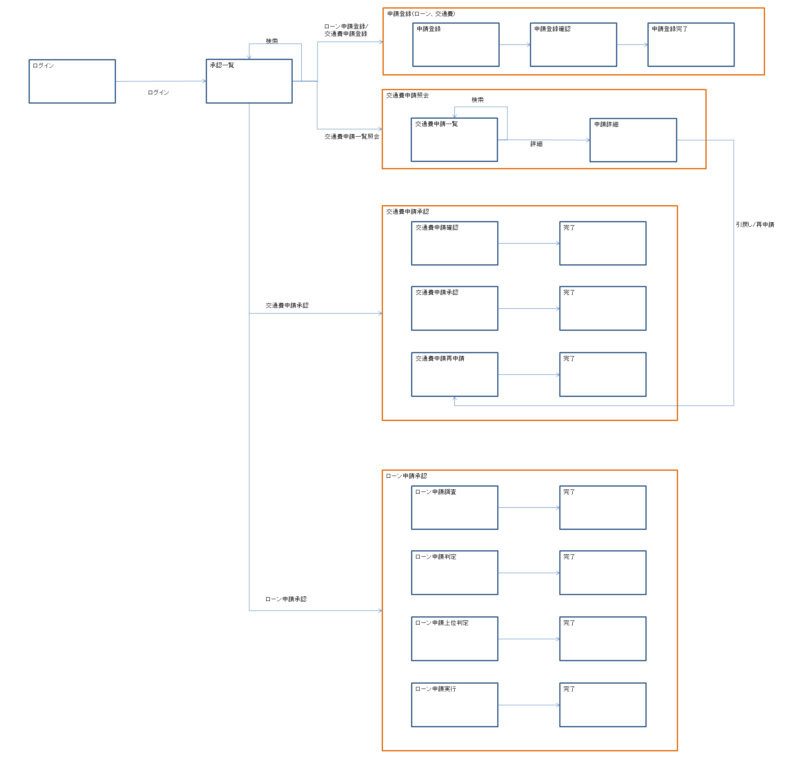
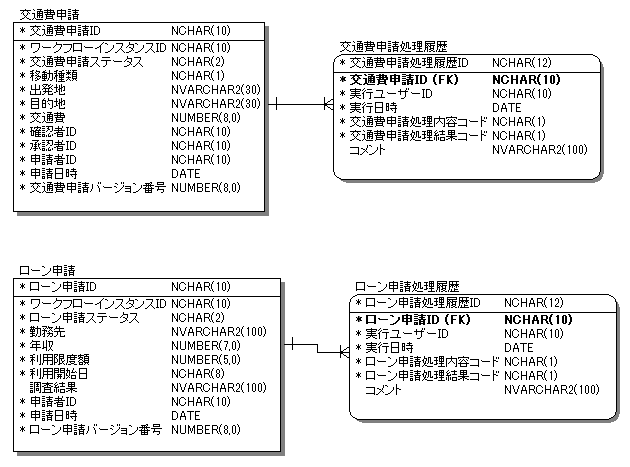
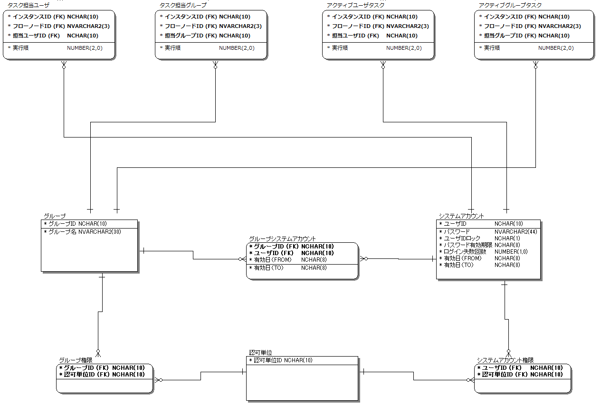

# サンプルアプリケーション概要

## 

サンプルアプリケーションは申請情報の登録とワークフロー進行機能を実装している。

申請の種類:
- 交通費申請
- ローン申請

keywords

サンプルアプリケーション, 交通費申請, ローン申請, 申請情報登録, ワークフロー進行

## ワークフロー定義

交通費申請のワークフロー定義:

ローン申請のワークフロー定義:

keywords

ワークフロー定義, 交通費申請, ローン申請, ワークフロー図, WF1101, WF1102

## 

| 番号 | 処理内容 | 実装方法 |
|---|---|---|
| ① | ワークフローを開始する | [start_workflow](workflow-SampleApplicationImplementation.md) |
| ② | 確認タスクを承認タスクへ進行させる | [complete_task](workflow-SampleApplicationImplementation.md) |
| ③ | 確認タスクを再申請タスクへ進行させる | [trigger_event](workflow-SampleApplicationImplementation.md) |
| ④ | 内部自動審査タスクの進行先ノードを判定する | [customize_flow_proceed_condition](workflow-SampleApplicationExtension.md) |

keywords

ワークフロー開始, start_workflow, complete_task, trigger_event, customize_flow_proceed_condition, タスク進行, 実装方法

## 画面遷移

これらの画面のいくつかの機能でワークフローAPIを呼び出すことで、前述のワークフローを実現している。

ローン申請承認機能のうち内部自動審査はバッチ処理で実現しているため、本画面遷移には含まれていない。

keywords

画面遷移, ワークフローAPI, 内部自動審査, バッチ処理, screenTransition

## 

ワークフローライブラリに関連する以下の機能はアプリケーション側で実装する必要がある:

- ワークフローに付随する情報の保持
- ワークフローにおける処理履歴の保持
- タスクにアサインするユーザ/グループや権限の管理

keywords

アプリケーション実装必須機能, ワークフロー付随情報, 処理履歴保持, タスクアサイン, ユーザー権限管理

## ワークフローライブラリに関連する機能

申請情報および履歴テーブルの定義:

タスクの担当ユーザに関連するテーブルの定義:

keywords

テーブル定義, 申請情報テーブル, 履歴テーブル, 担当ユーザテーブル, workItemsAndHistories, assigned

## ワークフローに付随する情報の保持

申請状況のステータスを申請情報テーブルで保持する。ステータス名は案件ごとに異なるため業務データとして管理する必要がある。

例: 交通費申請の「再申請」タスクが処理可能な場合のステータス名:
- 確認タスクから差戻された場合: 「確認差戻」
- 申請者が自ら引戻した場合: 「確認引戻」

keywords

ステータス管理, 申請状況, 確認差戻, 確認引戻, 業務データ, ワークフロー付随情報

## ワークフローにおける処理履歴の保持

申請に対する処理内容および結果を対応する履歴テーブルに登録して処理履歴を保持する。申請情報の種類ごとに履歴テーブルを定義している。

keywords

処理履歴, 履歴テーブル, 処理内容記録, 処理結果記録

## タスクにアサインするユーザ/グループや権限の管理

Nablarchの認可モデルを利用してタスクの担当ユーザおよび担当グループを管理する。ワークフローの各フローに対応するリクエストに認可を設定することでタスクの権限設定を行う。

例: ローン申請判定処理リクエストは判定者グループのみに認可されており、それ以外のグループのユーザは判定処理を実行できない。

keywords

認可モデル, 担当ユーザ, 担当グループ, タスク権限, 判定者グループ, ローン申請判定

