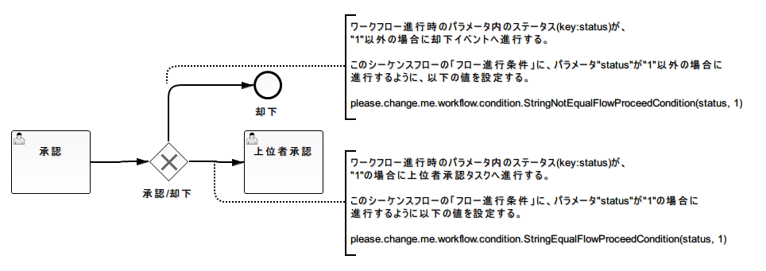

# ワークフローAPI

## ワークフローの開始

**クラス**: `please.change.me.workflow.WorkflowManager`

**メソッド**: `startInstance(workflowId)` / `startInstance(workflowId, parameter)`

- `workflowId` (String): 開始対象のワークフローID
- `parameter` (Map<String,?>): :ref:`flowProceedCondition` や :ref:`completionCondition` で使用するパラメータ（任意。[workflow_element_event_start](workflow-WorkflowProcessElement.md) から最初のタスクへの遷移に [workflow_element_gateway_xor](workflow-WorkflowProcessElement.md) が存在する場合などに指定）
- 戻り値: `please.change.me.workflow.WorkflowInstance`

同一ワークフローIDに複数バージョンがある場合、適用日がシステム日付以前で最もバージョンの大きい定義を使用する。

```java
WorkflowInstance workflow = WorkflowManager.startInstance("WF00001");
String instanceId = workflow.getInstanceId();
```

複数バージョンのワークフロー定義が共存する場合、バージョンに応じたUI分岐など実装での対応が必要。ワークフロー未開始時でも以下のAPIで現在有効なワークフローバージョンを取得できる。

**メソッド**: `please.change.me.workflow.WorkflowManager#getCurrentVersion(workflowId)`

| パラメータ | 型 | 説明 |
|---|---|---|
| workflowId | java.lang.Strng | ワークフローID |

**戻り値**: `int` — 指定ワークフローIDの現在有効なバージョン番号

```java
int version = WorkflowManager.getCurrentVersion("WF00001");

if (version == 1) {
    // バージョン1の場合の処理
} else if (version == 2) {
    // バージョン1の場合の処理
}
```

<details>
<summary>keywords</summary>

WorkflowManager, startInstance, WorkflowInstance, ワークフロー開始, バージョン選択, please.change.me.workflow.WorkflowManager, getCurrentVersion, ワークフローバージョン取得, バージョン分岐, 現在有効バージョン

</details>

## インスタンスIDの取得

**クラス**: `please.change.me.workflow.WorkflowInstance`

**メソッド**: `getInstanceId()` → `String`

業務テーブル（申請フォーム情報を保持するテーブル）とワークフロー進行状態管理テーブルを紐付けるため、取得したインスタンスIDを業務テーブルに保存すること。

```java
WorkflowInstance workflow = WorkflowManager.startInstance("WF00001");
String instanceId = workflow.getInstanceId();
LeaveApplicationEntity entity = new LeaveApplicationEntity();
entity.setInstanceId(instanceId);
register(entity);
```

[workflow_element_gateway_xor](workflow-WorkflowProcessElement.md) 使用時、次のフローノードのフロー定義が複数存在する場合に使用する。ワークフロー進行時のパラメータと [workflow_element_sequence_flows](workflow-WorkflowProcessElement.md) に設定されたフロー進行条件（`please.change.me.workflow.condition.FlowProceedCondition`の実装クラス）を使用して遷移先フローノードを判断する。

フロー進行条件は、:ref:`definitionLoader` がワークフロー定義を読み込む際にインスタンス化される。

<details>
<summary>keywords</summary>

WorkflowInstance, getInstanceId, インスタンスID取得, 業務テーブル紐付け, please.change.me.workflow.WorkflowInstance, FlowProceedCondition, ゲートウェイ進行先判定, XORゲートウェイ, シーケンスフロー遷移, フロー進行条件

</details>

## 開始済みワークフローの検索

**クラス**: `please.change.me.workflow.WorkflowManager`

**メソッド**: `findInstance(instanceId)` → `please.change.me.workflow.WorkflowInstance`

- `instanceId` (String): インスタンスID

指定インスタンスIDのワークフローが取得できない場合（既に完了している場合）、完了状態を表すインスタンスを返す。この完了状態インスタンスの挙動:
- `isCompleted()` は常に `true` を返す
- `isActive()` は常に `false` を返す
- タスクの進行・担当ユーザ/グループの割り当てを行うと実行時例外が送出される

```java
// ワークフロー開始時点のバージョンに対応するワークフロー定義が自動適用される
WorkflowInstance workflow = WorkflowManager.findInstance(instanceId);
```

**インタフェース**: `please.change.me.workflow.condition.FlowProceedCondition`

シーケンスフローへ進行可能かを判断する`isMatch`メソッドを定義する。XORゲートウェイ分岐時、各シーケンスフローの`isMatch`を評価し、`true`を返したシーケンスフローに従ってワークフローを進行させる。

> **重要**: 実装クラスのコンストラクタ引数に指定可能な型は`java.lang.String`のみ。String以外の型が必要な場合はコンストラクタ内で型変換すること。

**isMatchメソッド定義**:

```java
boolean isMatch(String instanceId, Map<String, ?> param, SequenceFlow sequenceFlow);
```

| パラメータ | 型 | 説明 |
|---|---|---|
| instanceId | String | ワークフローインスタンスID |
| param | Map<String, ?> | ワークフロー進行時のパラメータ |
| sequenceFlow | SequenceFlow | 評価対象のシーケンスフロー |

実装クラスではインスタンスID、パラメータMap、ワークフロー進行状態テーブル、業務テーブル等を利用して進行可否を判断し、進行させる場合は`true`を返す。

<details>
<summary>keywords</summary>

WorkflowManager, findInstance, WorkflowInstance, ワークフロー検索, isCompleted, isActive, FlowProceedCondition, isMatch, SequenceFlow, フロー進行条件インタフェース, コンストラクタ引数型制約

</details>

## ワークフローの進行

**クラス**: `please.change.me.workflow.WorkflowInstance`

担当ユーザとして割り当てられているタスクには `completeUserTask`、担当グループとして割り当てられているタスクには `completeGroupTask` を使用すること。

**メソッド一覧**:
- `completeUserTask()`
- `completeUserTask(parameter)`
- `completeUserTask(assigned)`
- `completeUserTask(parameter, assigned)`
- `completeGroupTask(assigned)`
- `completeGroupTask(parameter, assigned)`

**パラメータ**:
- `parameter` (Map<String,?>): :ref:`flowProceedCondition` や :ref:`completionCondition` で使用するパラメータ（任意）
- `assigned` (String): 処理対象ユーザまたはグループID。グループの場合は必須。ユーザの場合は未指定時に `ThreadContext` 内のユーザを使用。

```java
WorkflowInstance workflow = WorkflowManager.findInstance(instanceId);
workflow.completeUserTask();
workflow.completeGroupTask(groupId);
Map<String, Integer> parameter = new HashMap<String, Integer>();
parameter.put("amount", amount);
workflow.completeGroupTask(parameter, groupId);
```

**文字列比較クラス**（比較対象パラメータのキー値と期待値はコンストラクタで指定）:

| クラス名 | 概要 |
|---|---|
| StringEqualFlowProceedCondition | パラメータ値と期待値が一致する場合に進行可能 |
| StringNotEqualFlowProceedCondition | パラメータ値と期待値が不一致の場合に進行可能 |

**数値比較クラス**（比較対象パラメータのキー値と期待値はコンストラクタで指定）:

| クラス名 | 概要 |
|---|---|
| EqFlowProceedCondition | パラメータ値と期待値が一致する場合に進行可能 |
| NeFlowProceedCondition | パラメータ値と期待値が不一致の場合に進行可能 |
| GtFlowProceedCondition | パラメータ値が期待値より大きい場合に進行可能 |
| GeFlowProceedCondition | パラメータ値が期待値以上の場合に進行可能 |
| LtFlowProceedCondition | パラメータ値が期待値より小さい場合に進行可能 |
| LeFlowProceedCondition | パラメータ値が期待値以下の場合に進行可能 |

数値比較の型変換ルール:
- `java.lang.Number`サブタイプ: `Number#longValue()`で変換
- `java.lang.String`: `Long#valueOf`で変換。変換失敗時は進行不可として扱う（異常終了なし）
- 上記以外の型: 比較せず進行不可として扱う（異常終了なし）

<details>
<summary>keywords</summary>

WorkflowInstance, completeUserTask, completeGroupTask, ワークフロー進行, タスク完了, ThreadContext, StringEqualFlowProceedCondition, StringNotEqualFlowProceedCondition, EqFlowProceedCondition, NeFlowProceedCondition, GtFlowProceedCondition, GeFlowProceedCondition, LtFlowProceedCondition, LeFlowProceedCondition, 文字列比較進行条件, 数値比較進行条件

</details>

## 境界イベントによるワークフローの進行

**クラス**: `please.change.me.workflow.WorkflowInstance`

[workflow_element_boundary_event](workflow-WorkflowProcessElement.md) を発生させてタスクを中断しワークフローを進行させる場合に使用する。

**メソッド**: `triggerEvent(eventTriggerId)` / `triggerEvent(eventTriggerId, parameter)`

- `eventTriggerId` (String): 境界イベントトリガーID
- `parameter` (Map<String,?>): :ref:`flowProceedCondition` で使用するパラメータ（任意）

`triggerEvent` でタスクが中断された場合、:ref:`completionCondition` は実行されない（`completeUserTask`/`completeGroupTask` との相違点）。

```java
WorkflowInstance workflow = WorkflowManager.findInstance(instanceId);
workflow.triggerEvent(CANCEL_TRIGGER);
```

承認タスクがアクティブな状態での次タスクへの遷移例（[workflow_element_gateway_xor](workflow-WorkflowProcessElement.md) 使用）:



```java
// インスタンスIDを元に承認(却下)対象のワークフローを検索する。
WorkflowInstance workflow = WorkflowManager.findInstance(instanceId);

// 進行条件で使用するパラメータを作成する。
Map<Stirng, String> parameter = new HashMap<String, String>();
parameter.put("status", "1");

// ワークフローの進行（パラメータのステータスに"1"を設定→上位者承認タスクがアクティブとなる）
workflow.completeUserTask(parameter);
```

<details>
<summary>keywords</summary>

WorkflowInstance, triggerEvent, 境界イベント, タスク中断, eventTriggerId, completeUserTask, XORゲートウェイ使用例, ステータスパラメータ遷移, WorkflowManager

</details>

## ユーザ/グループの割り当て

**クラス**: `please.change.me.workflow.WorkflowInstance`

タスクへの割り当て実行時、以前割り当てられていたユーザ/グループ情報はすべて削除され、今回指定したユーザ/グループのみが割り当てられる。

**メソッド一覧**:

| メソッド | 対象 | 説明 |
|---|---|---|
| `assignUser(taskId, assignee)` | タスク | 単一ユーザを割り当て |
| `assignGroup(taskId, assignee)` | タスク | 単一グループを割り当て |
| `assignUsers(taskId, List<String> assignee)` | タスク | ユーザリストを割り当て |
| `assignGroups(taskId, List<String> assignee)` | タスク | グループリストを割り当て |
| `assignUserToLane(laneId, assignee)` | レーン全タスク | 単一ユーザを割り当て |
| `assignGroupToLane(laneId, assignee)` | レーン全タスク | 単一グループを割り当て |
| `assignUsersToLane(laneId, List<String> assignee)` | レーン全タスク | ユーザリストを割り当て |
| `assignGroupsToLane(laneId, List<String> assignee)` | レーン全タスク | グループリストを割り当て |

非マルチインスタンスのタスクに複数ユーザ/グループを指定した場合はエラー。順次 [workflow_element_multi_instance_task](workflow-WorkflowProcessElement.md) の場合、指定した順序でユーザ/グループがタスクを実行する必要がある。

```java
WorkflowInstance workflow = WorkflowManager.startInstance("WF00001");
workflow.assignUser("T01", userId);
workflow.assignUsers("T02", users);
workflow.assignUserToLane("T03", userId);
workflow.assignUsersToLane("T04", users);
```

[workflow_element_multi_instance_task](workflow-WorkflowProcessElement.md) （複数のユーザやグループが割り当て可能なタスク）では、タスク終了条件（`please.change.me.workflow.condition.CompletionCondition`の実装クラス）の設定が必要。ユーザ/グループがタスク実行するたびに終了条件を判定し、条件マッチ時にタスクが終了して次のフローノードがアクティブになる。

<details>
<summary>keywords</summary>

WorkflowInstance, assignUser, assignGroup, assignUsers, assignGroups, assignUserToLane, assignGroupToLane, assignUsersToLane, assignGroupsToLane, ユーザ割り当て, グループ割り当て, マルチインスタンス, CompletionCondition, マルチインスタンスタスク終了判定, AllCompletionCondition, OrCompletionCondition

</details>

## 割り当て済みユーザ/グループの変更

**クラス**: `please.change.me.workflow.WorkflowInstance`

特定ユーザ/グループを別のユーザ/グループに振り替える場合に使用する。タスク全体の再割り当てには「ユーザ/グループの割り当て」メソッドを使用すること。

**メソッド**: `changeAssignedUser(taskId, oldAssignee, newAssignee)` / `changeAssignedGroup(taskId, oldAssignee, newAssignee)`

- `taskId` (String): 振り替え対象のタスクID
- `oldAssignee` (String): 振り替え対象のユーザ/グループ
- `newAssignee` (String): 振り替え後のユーザ/グループ

> **注意**: 一つのタスクにはユーザまたはグループのいずれかしか割り当てられない。`changeAssignedUser`/`changeAssignedGroup` を使ってユーザからグループへの変更（またはその逆）を行うことはできない。

```java
WorkflowInstance workflow = WorkflowManager.findInstance(instanceId);
workflow.changeAssignedUser("T02", oldUserId, newUserId);
```

**インタフェース**: `please.change.me.workflow.condition.CompletionCondition`

ユーザタスク終了判断用の`isCompletedUserTask`メソッドとグループタスク終了判断用の`isCompletedGroupTask`メソッドを定義する。

> **重要**: 実装クラスのコンストラクタ引数に指定可能な型は`java.lang.String`のみ。String以外の型が必要な場合はコンストラクタ内で型変換すること。

**メソッド定義**:

```java
boolean isCompletedUserTask(Map<String, ?> param, String instanceId, Task task);
boolean isCompletedGroupTask(Map<String, ?> param, String instanceId, Task task);
```

| パラメータ | 型 | 説明 |
|---|---|---|
| param | Map<String, ?> | ワークフロー進行時のパラメータ |
| instanceId | String | ワークフローインスタンスID |
| task | Task | 完了判定の対象タスク |

実装クラスではインスタンスID、パラメータMap、ワークフロー進行状態テーブル、業務テーブル等を利用してタスク完了可否を判断し、完了させる場合は`true`を返す。

**提供される実装クラス**:

| クラス名 | 概要 |
|---|---|
| AllCompletionCondition | 割り当て全ユーザ(グループ)がタスク実行済みの場合にタスク終了と判断 |
| OrCompletionCondition | 指定数のユーザ(グループ)がタスク実行済みの場合にタスク終了と判断。指定数が実際の割り当て数より大きい場合は全員実行済みで終了と判断 |

<details>
<summary>keywords</summary>

WorkflowInstance, changeAssignedUser, changeAssignedGroup, ユーザ振り替え, グループ振り替え, CompletionCondition, isCompletedUserTask, isCompletedGroupTask, AllCompletionCondition, OrCompletionCondition, マルチインスタンス終了条件実装, Task

</details>

## フローノードがアクティブか否かの問い合わせ

**クラス**: `please.change.me.workflow.WorkflowInstance`

**メソッド**: `isActive(flowNodeId)` → `boolean`

- `flowNodeId` (String): フローノードID
- 戻り値: 指定フローノードIDがアクティブな場合 `true`

```java
if (workflow.isActive("t01")) {
  // フローノードID:t01がアクティブな場合の処理
}
```

<details>
<summary>keywords</summary>

WorkflowInstance, isActive, フローノード状態確認, flowNodeId

</details>

## ユーザ/グループのアクティブタスクが存在するか否かの問い合わせ

**クラス**: `please.change.me.workflow.WorkflowInstance`

**メソッド**:
- `hasActiveUserTask(user)` → `boolean`: ユーザ (String) のアクティブタスクが存在する場合 `true`
- `hasActiveGroupTask(group)` → `boolean`: グループ (String) のアクティブタスクが存在する場合 `true`

```java
if (workflow.hasActiveUserTask("0000000001")) {
  // ユーザ:0000000001 のアクティブタスクが存在する場合の処理
}
```

<details>
<summary>keywords</summary>

WorkflowInstance, hasActiveUserTask, hasActiveGroupTask, アクティブタスク確認

</details>

## ワークフローが完了したか否かの問い合わせ

**クラス**: `please.change.me.workflow.WorkflowInstance`

**メソッド**: `isCompleted()` → `boolean`

ワークフローが完了状態になると管理データ（:ref:`instanceTable`）は削除される。完了確認はワークフローの進行と同一トランザクション内でのみ有効。他トランザクションからは完了状態のワークフローインスタンスを取得できない。

> **注意**: ワークフローの完了状態とは、停止イベントがアクティブになった状態を指す。

```java
if (workflow.isCompleted()) {
  // ワークフローが完了した場合の処理
}
```

<details>
<summary>keywords</summary>

WorkflowInstance, isCompleted, ワークフロー完了確認, 停止イベント

</details>
