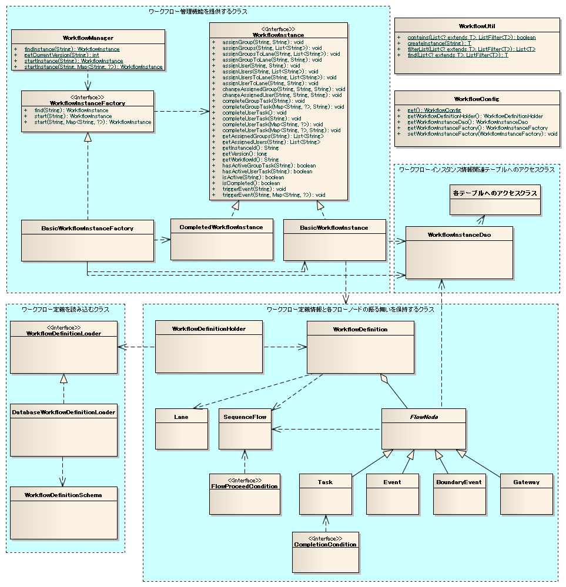

# ワークフローライブラリの全体構造

## 構造

### クラス図



### インタフェース定義

| インタフェース名 | 概要 |
|---|---|
| package:: `please.change.me.workflow`  interface:: `WorkflowInstance` | [ワークフローインスタンス](../../extension/workflow/workflow-WorkflowInstanceElement.md) をあらわすインタフェース。  業務アプリケーションは、本インタフェースを通じてワークフローの進行や担当者（グループ）の割り当て等を行う。 |
| package:: `please.change.me.workflow`  interface:: `WorkflowInstanceFactory` | WorkflowInstance を生成するインタフェース。 |
| package:: `please.change.me.workflow.definition.loader`  interface:: `WorkflowDefinitionLoader` | ワークフロー定義 を読み込むインタフェース。 |
| package:: `please.change.me.workflow.condition`  interface:: `CompletionCondition` | [タスク](../../extension/workflow/workflow-WorkflowProcessElement.md#workflow-element-task) の終了条件を定義するインタフェース。  本インタフェースの詳細及び本サンプルで提供する実装クラスの一覧は、 [マルチインスタンス・タスクの終了判定](../../extension/workflow/workflow-WorkflowApplicationApi.md#completioncondition) を参照。 |
| package:: `please.change.me.workflow.condition`  interface:: `FlowProceedCondition` | [シーケンスフロー](../../extension/workflow/workflow-WorkflowProcessElement.md#workflow-element-sequence-flows) のフロー進行条件を定義する インタフェース。  本インタフェースの詳細及び本サンプルで提供する実装クラスの一覧は、 [ゲートウェイの進行先ノードの判定制御](../../extension/workflow/workflow-WorkflowApplicationApi.md#flowproceedcondition) を参照。 |

### クラス定義

| クラス名 | 概要 |
|---|---|
| package:: `please.change.me.workflow`  class:: `WorkflowManager` | ワークフローインスタンスの開始や検索を行うクラス。  WorkflowInstanceFactory を使用して WorkflowInstance を生成する。 WorkflowInstanceFactory の実装クラスは、 [コンポーネント定義](../../extension/workflow/workflow-WorkflowArchitecture.md#workflowcomponentdefinition) に定義されているクラスを使用する。 |
| package:: `please.change.me.workflow`  class:: `BasicWorkflowInstance` | WorkflowInstance の基本実装クラス。 |
| package:: `please.change.me.workflow`  class:: `CompletedWorkflowInstance` | 完了状態のワークフローインスタンスをあらわす、 WorkflowInstance の実装クラス。  [開始済みワークフローの検索](../../extension/workflow/workflow-WorkflowApplicationApi.md#workflow-api-find) で、対象インスタンスが見つからず、完了状態のワークフローインスタンスが必要な場合に利用される。 |
| package:: `please.change.me.workflow`  class:: `BasicWorkflowInstanceFactory` | WorkflowInstanceFactory の実装クラスで、 BasicWorkflowInstance を生成する。 |
| package:: `please.change.me.workflow`  class:: `WorkflowConfig` | ワークフローのコンポーネント設定情報を保持するクラス。  コンポーネント定義の詳細は、 [コンポーネント定義](../../extension/workflow/workflow-WorkflowArchitecture.md#workflowcomponentdefinition) を参照。 |
| package:: `please.change.me.workflow.util`  class:: `WorkflowUtil` | ワークフロー機能で使用するユーティリティメソッドを提供するクラス。 |
| package:: `please.change.me.workflow.definition.loader`  class:: `DatabaseWorkflowDefinitionLoader` | WorkflowDefinitionLoader の実装クラスで、 [データベース](../../extension/workflow/workflow-WorkflowArchitecture.md#definitiontable) から ワークフロー定義 を読み込むクラス。  テーブル定義(テーブル名やカラム名)は、 WorkflowDefinitionSchema から取得する。 |
| package:: `please.change.me.workflow.definition.loader`  class:: `WorkflowDefinitionSchema` | [ワークフローの定義情報を保持するテーブル](../../extension/workflow/workflow-WorkflowArchitecture.md#definitiontable) の テーブル名やカラム名情報を保持するクラス。 |
| package:: `please.change.me.workflow.definition`  class:: `WorkflowDefinitionHolder` | ワークフロー定義ローダー から読み込んだ ワークフロー定義 を保持するクラス。  本クラスで保持しているワークフロー定義は、以下の方法で取得できる。  * ワークフローIDに対応する適用期間内の最新（バージョン番号が最も大きい）のワークフロー定義 * ワークフローIDとバージョン番号に対応するワークフロー定義 |
| package:: `please.change.me.workflow.definition`  class:: `WorkflowDefinition` | ワークフロー定義を保持するクラス。  以下の定義情報を保持する。  * レーン定義情報 * タスク定義情報 * イベント定義情報 * ゲートウェイ定義情報 * 境界イベント定義情報 * シーケンスフロー定義情報 |
| package:: `please.change.me.workflow.definition`  class:: `Lane` | レーン定義情報を保持する。 |
| package:: `please.change.me.workflow.definition`  class:: `FlowNode` | フローノード定義を保持する抽象クラス。 |
| package:: `please.change.me.workflow.definition`  class:: `Task` | フローノード定義 のサブクラスでタスク定義情報を保持する。 |
| package:: `please.change.me.workflow.definition`  class:: `Event` | フローノード定義 のサブクラスでイベント定義情報を保持する。 |
| package:: `please.change.me.workflow.definition`  class:: `Gateway` | フローノード定義 のサブクラスでゲートウェイ定義情報を保持する。 |
| package:: `please.change.me.workflow.definition`  class:: `BoundaryEvent` | フローノード定義 のサブクラスで境界イベント定義情報を保持する。 |
| package:: `please.change.me.workflow.definition`  class:: `SequenceFlow` | シーケンスフロー定義を保持するクラス。 |
| package:: `please.change.me.workflow.dao`  class::`WorkflowInstanceDao` | [ワークフローの進行状態を管理するテーブル](../../extension/workflow/workflow-WorkflowArchitecture.md#instancetable) にアクセスするデータベースアクセスクラス。  テーブル定義(テーブル名やカラム名)は、 workflowInstanceSchema から取得する。  本クラスは、各テーブルのデータベースアクセスクラス（以下のクラス）に対して処理を移譲する。  * InstanceDao(ワークフローインスタンステーブル) * InstanceFlowNodeDao(インスタンスフローノードテーブル) * TaskAssignedUserDao(タスク担当ユーザテーブル) * TaskAssignedGroupDao(タスク担当グループテーブル) * ActiveFlowNodeDao(アクティブフローノードテーブル) * ActiveUserTaskDao(アクティブユーザタスクテーブル) * ActiveGroupTaskDao(アクティブグループタスクテーブル)  データの取得処理を提供するデータベースアクセスクラスでは、取得結果をテーブルに対応するエンティティクラスで返却する。 エンティティクラスは以下のとおり。  * WorkflowInstanceEntity(ワークフローインスタンスエンティティ) * TaskAssignedUserEntity(タスク担当ユーザエンティティ) * TaskAssignedGroupEntity(タスク担当グループエンティティ) * ActiveFlowNodeEntity(アクティブフローノードエンティティ) * ActiveUserTaskEntity(アクティブユーザタスクエンティティ) * ActiveGroupTaskEntity(アクティブグループタスクエンティティ) |
| package:: `please.change.me.workflow.dao`  class:: `WorkflowInstanceSchema` | [ワークフローの進行状態を管理するテーブル](../../extension/workflow/workflow-WorkflowArchitecture.md#instancetable) のテーブル名やカラム名を保持するクラス。 |

## テーブル定義

ワークフロー機能で必要となるテーブルの情報を以下に示す。

テーブル名やカラム名は、プロジェクトの命名規則に従い設定することが想定される
このため、これらの情報はコンポーネント定義ファイルを用いて設定可能としている。

コンポーネント定義ファイルの設定例は、 コンポーネント定義 を参照。

### ワークフローの定義情報を格納するテーブル

ワークフローの定義情報を格納するテーブルの定義を下記に示す。

**ワークフロー定義テーブルの定義**

ワークフロー定義情報を管理するテーブル。

| 定義 | Javaの型 | 制約など |
|---|---|---|
| ワークフローID | java.lang.String | PK |
| バージョン | java.lang.Integer (int) | PK |
| ワークフロー名 | java.lang.String |  |
| 適用日 | java.lang.String | 8桁(yyyyMMdd)の文字列表記 |

**レーンテーブルの定義**

ワークフローの [レーン](../../extension/workflow/workflow-WorkflowProcessElement.md#workflow-element-lane) を管理するテーブル。

| 定義 | Javaの型 | 制約など |
|---|---|---|
| ワークフローID | java.lang.String | PK |
| バージョン | java.lang.Integer (int) | PK |
| レーンID | java.lang.String | PK |
| レーン名 | java.lang.String |  |

**フローノードテーブルの定義**

[フローノード](../../extension/workflow/workflow-WorkflowProcessElement.md#workflow-flow-node) の定義を管理するテーブル。

| 定義 | Javaの型 | 制約など |
|---|---|---|
| ワークフローID | java.lang.String | PK |
| バージョン | java.lang.Integer (int) | PK |
| フローノードID | java.lang.String | PK |
| フローノード名 | java.lang.String |  |

**タスクテーブルの定義**

[タスク](../../extension/workflow/workflow-WorkflowProcessElement.md#workflow-element-task) の定義を管理するテーブル。

| 定義 | Javaの型 | 制約など |
|---|---|---|
| ワークフローID | java.lang.String | PK |
| バージョン | java.lang.Integer (int) | PK |
| フローノードID | java.lang.String | PK |
| マルチインスタンス種別 | java.lang.String | 以下の値が格納される。  * NONE([タスク](../../extension/workflow/workflow-WorkflowProcessElement.md#workflow-element-task)) * SEQUENTIAL(順次 [マルチインスタンス・タスク](../../extension/workflow/workflow-WorkflowProcessElement.md#workflow-element-multi-instance-task)) * PARALLEL(並行 [マルチインスタンス・タスク](../../extension/workflow/workflow-WorkflowProcessElement.md#workflow-element-multi-instance-task)) |
| 完了条件 | java.lang.String | `please.change.me.workflow.condition.CompletionCondition` の実装クラスをFQCNで登録する。  `CompletionCondition` の詳細は [マルチインスタンス・タスクの終了判定](../../extension/workflow/workflow-WorkflowApplicationApi.md#completioncondition) を参照 |

**イベントテーブルの定義**

イベント([開始イベント](../../extension/workflow/workflow-WorkflowProcessElement.md#workflow-element-event-start) 、 [停止イベント](../../extension/workflow/workflow-WorkflowProcessElement.md#workflow-element-event-terminate))の定義を管理するテーブル。

| 定義 | Javaの型 | 制約など |
|---|---|---|
| ワークフローID | java.lang.String | PK |
| バージョン | java.lang.Integer (int) | PK |
| フローノードID | java.lang.String | PK |
| イベント種別 | java.lant.String | 以下の値が格納される。  * START([開始イベント](../../extension/workflow/workflow-WorkflowProcessElement.md#workflow-element-event-start)) * TERMINATE([停止イベント](../../extension/workflow/workflow-WorkflowProcessElement.md#workflow-element-event-terminate)) |

**ゲートウェイテーブル定義**

[XORゲートウェイ](../../extension/workflow/workflow-WorkflowProcessElement.md#workflow-element-gateway-xor) の定義を管理するテーブル。

| 定義 | Javaの型 | 制約など |
|---|---|---|
| ワークフローID | java.lang.String | PK |
| バージョン | java.lang.Integer (int) | PK |
| フローノードID | java.lang.String | PK |
| ゲートウェイ種別 | java.lant.String | 以下の値が格納される。  * EXCLUSIVE([XORゲートウェイ](../../extension/workflow/workflow-WorkflowProcessElement.md#workflow-element-gateway-xor)) |

**境界イベントテーブル定義**

[境界イベント](../../extension/workflow/workflow-WorkflowProcessElement.md#workflow-element-boundary-event) の定義を管理するテーブル。

| 定義 | Javaの型 | 制約など |
|---|---|---|
| ワークフローID | java.lang.String | PK |
| バージョン | java.lang.Integer (int) | PK |
| フローノードID | java.lang.String | PK |
| 境界イベントトリガーID | java.lang.String |  |
| 接続先タスクID | java.lang.String |  |

**境界イベントトリガーテーブル定義**

境界イベントトリガーの定義を管理するテーブル。境界イベントトリガーについては、 [境界イベント](../../extension/workflow/workflow-WorkflowProcessElement.md#workflow-element-boundary-event) を参照。

| 定義 | Javaの型 | 制約など |
|---|---|---|
| ワークフローID | java.lang.String | PK |
| バージョン | java.lang.Integer (int) | PK |
| 境界イベントトリガーID | java.lang.String | PK |
| 境界イベントトリガー名 | java.lang.String |  |

**シーケンスフローテーブル定義**

[シーケンスフロー](../../extension/workflow/workflow-WorkflowProcessElement.md#workflow-element-sequence-flows) の定義を管理するテーブル。

| 定義 | Javaの型 | 制約など |
|---|---|---|
| ワークフローID | java.lang.String | PK |
| バージョン | java.lang.Integer (int) | PK |
| シーケンスフローID | java.lang.String | PK |
| 接続元フローノードID | java.lang.String |  |
| 接続先フローノードID | java.lang.String |  |
| フロー進行条件 | java.lang.String | `please.change.me.workflow.condition.FlowProceedCondition` の実装クラス名をFQCNで登録する。  `FlowProceedCondition` の詳細は [ゲートウェイの進行先ノードの判定制御](../../extension/workflow/workflow-WorkflowApplicationApi.md#flowproceedcondition) を参照 |
| シーケンスフロー名 | java.lang.String |  |

#### テーブル定義の例


### ワークフローの進行状態を管理するテーブル

ワークフローの進行状態を管理するテーブルの定義を下記に示す。

> **Note:**
> ワークフローの進行状態は、ワークフローが終了するまでの状態を管理する。
> ワークフローが完了した場合には、本テーブル群のデータはクリーニング（削除）される。

**ワークフローインスタンステーブル定義**

進行中のワークフローを管理するテーブル。

| 定義 | Javaの型 | 制約など |
|---|---|---|
| インスタンスID | java.lang.String | PK  進行中のインスタンスIDを識別する情報。  インスタンスIDは、業務側のワークフローデータを保持する テーブルに格納する必要がある。  業務側テーブルに格納することで、ワークフローの進行状態と 業務データを紐付けて管理することができる。 |
| ワークフローID | java.lang.String |  |
| バージョン | java.lang.Integer (int) |  |

**インスタンスフローノードテーブル**

進行中のワークフローに含まれるタスクの情報を管理するテーブル。

| 定義 | Javaの型 | 制約など |
|---|---|---|
| インスタンスID | java.lang.String | PK |
| フローノードID | java.lang.String | PK |
| ワークフローID | java.lang.String |  |
| バージョン | java.lang.Integer (int) |  |

**タスク担当ユーザテーブル**

タスクに割り当てられた担当ユーザを管理するテーブル。 [1]

タスクへの担当ユーザの割り当てについては [タスク担当ユーザ/タスク担当グループ](../../extension/workflow/workflow-WorkflowInstanceElement.md#workflow-task-assignee) を参照。

| 定義 | Javaの型 | 制約など |
|---|---|---|
| インスタンスID | java.lang.String | PK |
| フローノードID | java.lang.String | PK |
| 担当ユーザID | java.lang.String | PK |
| 実行順 | java.lang.Integer (int) | **順次** [マルチインスタンス・タスク](../../extension/workflow/workflow-WorkflowProcessElement.md#workflow-element-multi-instance-task) の場合に ユーザの処理実行順を管理するために使用する。  非マルチインスタンスタスクや並行 [マルチインスタンス・タスク](../../extension/workflow/workflow-WorkflowProcessElement.md#workflow-element-multi-instance-task) の場合には、 本属性値は使用しない。 |

**タスク担当グループテーブル**

タスクに割り当てられた担当グループを管理するテーブル。 [1]

タスクへの担当グループの割り当てについては [タスク担当ユーザ/タスク担当グループ](../../extension/workflow/workflow-WorkflowInstanceElement.md#workflow-task-assignee) を参照。

| 定義 | Javaの型 | 制約など |
|---|---|---|
| インスタンスID | java.lang.String | PK |
| フローノードID | java.lang.String | PK |
| 担当グループID | java.lang.String | PK |
| 実行順 | java.lang.Integer (int) | **順次** [マルチインスタンス・タスク](../../extension/workflow/workflow-WorkflowProcessElement.md#workflow-element-multi-instance-task) の場合に ユーザの処理実行順を管理するために使用する。  非マルチインスタンスタスクや並行 [マルチインスタンス・タスク](../../extension/workflow/workflow-WorkflowProcessElement.md#workflow-element-multi-instance-task) の場合には、 本属性値は使用しない。 |

同一フローノードに対しては、ユーザかグループの一方のみの割り当てとなる。
このため、同一フローノードに対して、ユーザとグループの両方のデータが存在することはない。

**アクティブフローノードテーブル**

[アクティブフローノード](../../extension/workflow/workflow-WorkflowInstanceElement.md#workflow-active-flow-node) の情報を保持するテーブル

| 定義 | Javaの型 | 制約など |
|---|---|---|
| インスタンスID | java.lang.String | PK |
| フローノードID | java.lang.String | PK |

**アクティブユーザタスクテーブル**

ユーザが実行可能なタスクを管理するテーブル。

ユーザが実行可能なタスク（アクティブユーザタスク）については、 [アクティブユーザタスク/アクティブグループタスク](../../extension/workflow/workflow-WorkflowInstanceElement.md#workflow-active-task) を参照。

| 定義 | Javaの型 | 制約など |
|---|---|---|
| インスタンスID | java.lang.String | PK |
| フローノードID | java.lang.String | PK |
| 担当ユーザID | java.lang.String | PK |
| 実行順 | java.lang.Integer (int) | [タスク担当ユーザテーブル](../../extension/workflow/workflow-WorkflowArchitecture.md#assign-user) を参照 |

**アクティブグループタスクテーブル**

グループが実行可能なタスクを管理するテーブル。

グループが実行可能なタスク（アクティブグループタスク）については、 [アクティブユーザタスク/アクティブグループタスク](../../extension/workflow/workflow-WorkflowInstanceElement.md#workflow-active-task) を参照。

| 定義 | Javaの型 | 制約など |
|---|---|---|
| インスタンスID | java.lang.String | PK |
| フローノードID | java.lang.String | PK |
| 担当グループID | java.lang.String | PK |
| 実行順 | java.lang.Integer (int) | [タスク担当グループテーブル](../../extension/workflow/workflow-WorkflowArchitecture.md#assign-group) を参照 |

#### テーブル定義の例


## コンポーネント定義

ワークフロー機能では、リポジトリ機能するためコンポーネント定義ファイルへの設定が必要となる。
以下にワークフロー機能のコンポーネント定義方法を記述する。

**設定するコンポーネント**

| クラス | 説明 |
|---|---|
| package:: `please.change.me.workflow`  class:: `WorkflowConfig` | ワークフローの設定情報を保持するクラス。  > **Note:** > 本クラスは、コンポーネント名を **workflowConfig** として > コンポーネント定義ファイルに登録する必要がある。 |
| package:: `please.change.me.workflow.definition`  class:: `WorkflowDefinitionHolder` | ワークフローの定義情報を保持するクラス。  本クラスには、ワークロー定義をロードするクラスと、 ワークフローの適用日判定に使用するための システム日付(nablarch.core.date.SystemTimeProviderの実装クラス) を設定する。  システムリポジトリ構築時にワークフロー定義情報を、 ローダを使用しロードする。このため、初期化対象コンポーネントに 本クラスを設定する必要がある。 |
| package:: `please.change.me.workflow.definition.loader`  class:: `DatabaseWorkflowDefinitionLoader` | データベースからワークフロー定義をロードするクラス。  本クラスには、データベースへアクセスするための設定と、 ワークフロー定義関連テーブルの定義情報を設定する。 |
| package:: `please.change.me.workflow.definition.loader`  class:: `WorkflowDefinitionSchema` | ワークフローの定義情報を格納するテーブル のテーブル名と カラム名を設定する。 |
| package:: `please.change.me.workflow.dao`  class:: `WorkflowInstanceDao` | ワークフローの進行状態を管理するテーブル へアクセスする クラスを設定する。  本クラスには、インスタンスIDを採番するための採番クラスと ワークフローの進行状態を管理するテーブル の定義情報を 設定する。  システムリポジトリ構築時にデータベースアクセス用の SQL文の組み立てを行う。 このため、初期化対象コンポーネントに本クラスを設定する必要がある |
| package:: `please.change.me.workflow.dao`  class:: `WorkflowInstanceSchema` | ワークフローの進行状態を管理するテーブル のテーブル名と カラム名を設定する。 |
| package:: `please.change.me.workflow`  class:: `WorkflowInstanceFactory` | WorkflowInstance を生成するクラス。 |

**設定例**

```xml
<!--
ワークフロー設定クラス
このクラスは、「workflowConfig」という名前でコンポーネント定義する。
-->
<component name="workflowConfig" class="please.change.me.workflow.WorkflowConfig">
  <property name="workflowDefinitionHolder" ref="workflowDefinitionHolder" />
  <property name="workflowInstanceDao" ref="workflowInstanceDao" />
  <property name="workflowInstanceFactory" ref="workflowInstanceFactory" />
</component>

<!--
ワークフロー定義保持クラス

ワークフロー定義のローダーとシステム日付を取得するための
nablarch.core.date.SystemTimeProvider実装クラスを設定する。
-->
<component name="workflowDefinitionHolder"
    class="please.change.me.workflow.definition.WorkflowDefinitionHolder">
  <property name="workflowDefinitionLoader" ref="workflowLoader" />
  <property name="systemTimeProvider">
    <component class="nablarch.core.date.BasicSystemTimeProvider" />
  </property>
</component>

<!--
ワークフロー定義のロードクラス
-->
<component name="workflowLoader"
    class="please.change.me.workflow.definition.loader.DatabaseWorkflowDefinitionLoader">
  <!--
  データベースへアクセスするための設定(SimpleDbTransactionManager )

  データベース接続設定の詳細な設定例は省略する。
  -->
  <property name="transactionManager" ref="tran" />
  <property name="workflowDefinitionSchema" ref="workflowDefinitionSchema" />
</component>

<!-- ワークフロー定義関連テーブルのテーブル名とカラム名の設定 -->
<component name="workflowDefinitionSchema"
    class="please.change.me.workflow.definition.loader.WorkflowDefinitionSchema">
  <!-- テーブル名 -->
  <property name="workflowDefinitionTableName" value="WF_WORKFLOW_DEFINITION" />
  <property name="laneTableName" value="WF_LANE" />
  <property name="flowNodeTableName" value="WF_FLOW_NODE" />
  <property name="eventTableName" value="WF_EVENT" />
  <property name="taskTableName" value="WF_TASK" />
  <property name="gatewayTableName" value="WF_GATEWAY" />
  <property name="boundaryEventTableName" value="WF_BOUNDARY_EVENT" />
  <property name="eventTriggerTableName" value="WF_BOUNDARY_EVENT_TRIGGER" />
  <property name="sequenceFlowTableName" value="WF_SEQUENCE_FLOW" />

  <!-- ワークフロー定義テーブルのカラム名 -->
  <property name="workflowIdColumnName" value="WORKFLOW_ID" />
  <property name="workflowNameColumnName" value="WORKFLOW_NAME" />
  <property name="versionColumnName" value="DEF_VERSION" />
  <property name="effectiveDateColumnName" value="EFFECTIVE_DATE" />

  <!-- レーンテーブルのカラム名 -->
  <property name="laneIdColumnName" value="LANE_ID" />
  <property name="laneNameColumnName" value="LANE_NAME" />

  <!-- フローノードテーブルのカラム名 -->
  <property name="flowNodeIdColumnName" value="FLOW_NODE_ID" />
  <property name="flowNodeNameColumnName" value="FLOW_NODE_NAME" />

  <!-- イベント、タスク、ゲートウェイテーブルのカラム名 -->
  <property name="eventTypeColumnName" value="EVENT_TYPE" />
  <property name="multiInstanceTypeColumnName" value="MULTI_INSTANCE_TYPE" />
  <property name="completionConditionColumnName" value="COMPLETION_CONDITION" />
  <property name="gatewayTypeColumnName" value="GATEWAY_TYPE" />

  <!-- 境界イベント、境界イベントトリガーテーブルのカラム名 -->
  <property name="boundaryEventTriggerIdColumnName" value="BOUNDARY_EVENT_TRIGGER_ID" />
  <property name="boundaryEventTriggerNameColumnName" value="BOUNDARY_EVENT_TRIGGER_NAME" />
  <property name="attachedTaskIdColumnName" value="ATTACHED_TASK_ID" />

  <!-- シーケンスフローテーブルのカラム名 -->
  <property name="sequenceFlowIdColumnName" value="SEQUENCE_FLOW_ID" />
  <property name="sequenceFlowNameColumnName" value="SEQUENCE_FLOW_NAME" />
  <property name="sourceFlowNodeIdColumnName" value="SOURCE_FLOW_NODE_ID" />
  <property name="targetFlowNodeIdColumnName" value="TARGET_FLOW_NODE_ID" />
  <property name="flowProceedConditionColumnName" value="FLOW_PROCEED_CONDITION" />
</component>

<!-- ワークフローの進行状況を管理するテーブルへのアクセスクラス -->
<component name="workflowInstanceDao"
    class="please.change.me.workflow.dao.WorkflowInstanceDao">

  <!--
  インスタンスIDを生成する採番機能の設定

  採番クラス名とあわせて、採番対象IDを設定する。
  -->
  <property name="instanceIdGenerator" ref="instanceIdGenerator" />
  <property name="instanceIdGenerateId" value="01" />

  <!--
  インスタンスIDの桁数を設定する。
  設定を省略した場合は、デフォルト値(10桁)となる。

  インスタンスIDは指定された桁数で固定長化される。
  固定長化は、先頭に"0"を付加することで実現する。
  -->
  <property name="instanceIdLength" value="15" />

  <!-- テーブル定義情報の設定 -->
  <property name="workflowInstanceSchema" ref="workflowInstanceSchema" />
</component>

<!-- ワークフローの進行状況を管理するテーブルのカラム名とテーブル名の設定 -->
<component name="workflowInstanceSchema"
    class="please.change.me.workflow.dao.WorkflowInstanceSchema">

  <!-- テーブル名 -->
  <property name="instanceTableName" value="WF_INSTANCE" />
  <property name="instanceFlowNodeTableName" value="WF_INSTANCE_FLOW_NODE" />
  <property name="assignedUserTableName" value="WF_TASK_ASSIGNED_USER" />
  <property name="assignedGroupTableName" value="WF_TASK_ASSIGNED_GROUP" />
  <property name="activeFlowNodeTableName" value="WF_ACTIVE_FLOW_NODE" />
  <property name="activeUserTaskTableName" value="WF_ACTIVE_USER_TASK" />
  <property name="activeGroupTaskTableName" value="WF_ACTIVE_GROUP_TASK" />

  <!-- ワークフローインスタンステーブルのカラム名 -->
  <property name="instanceIdColumnName" value="INSTANCE_ID" />
  <property name="workflowIdColumnName" value="WORKFLOW_ID" />
  <property name="versionColumnName" value="DEF_VERSION" />

  <!-- ワークフローインスタンステーブルの関連テーブルのカラム名 -->
  <property name="flowNodeIdColumnName" value="FLOW_NODE_ID" />
  <property name="assignedUserColumnName" value="ASSIGNED_USER_ID" />
  <property name="executionOrderColumnName" value="EXECUTION_ORDER" />
  <property name="assignedGroupColumnName" value="ASSIGNED_GROUP_ID" />
</component>

<!-- インスタンスIDを採番するための採番クラスの設定 -->
<component name="instanceIdGenerator"
    class="please.change.me.common.idgenerator.OracleSequenceIdGenerator">
  <!-- 詳細な設定は省略 -->
</component>

<!-- ワークフローインスタンスファクトリ -->
<component name="workflowInstanceFactory" class="please.change.me.workflow.BasicWorkflowInstanceFactory" />

<!-- 初期化コンポーネントの設定 -->
<component name="initializer"
    class="nablarch.core.repository.initialization.BasicApplicationInitializer">
  <property name="initializeList">
    <list>
      <component-ref name="workflowDefinitionHolder" />
      <component-ref name="workflowInstanceDao" />
    </list>
  </property>
</component>
```
