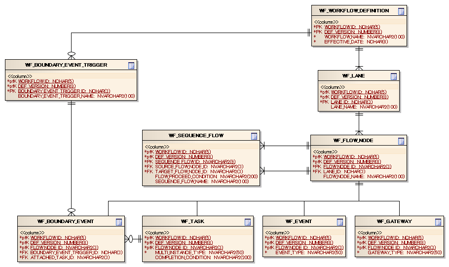
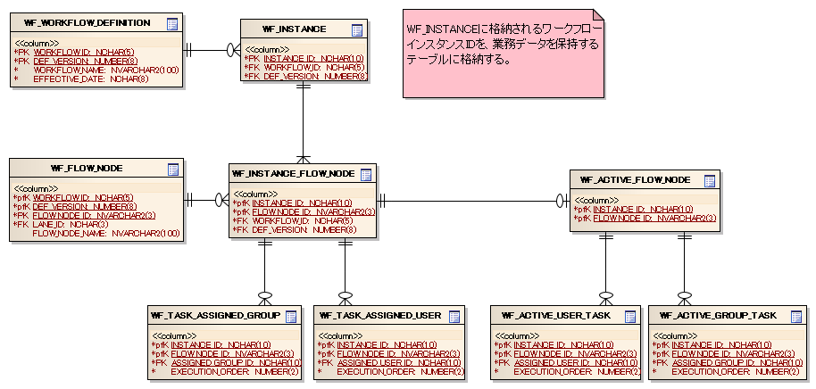

# ワークフローライブラリの全体構造

## クラス図


テーブル名やカラム名はプロジェクトの命名規則に従って設定し、コンポーネント定義ファイルで変更可能。

## ワークフローの定義情報を格納するテーブル

### ワークフロー定義テーブル

ワークフロー定義情報を管理するテーブル。

| 定義 | Javaの型 | 制約など |
|---|---|---|
| ワークフローID | java.lang.String | PK |
| バージョン | java.lang.Integer (int) | PK |
| ワークフロー名 | java.lang.String | |
| 適用日 | java.lang.String | 8桁(yyyyMMdd)の文字列表記 |

### レーンテーブル

[workflow_element_lane](workflow-WorkflowProcessElement.md) を管理するテーブル。

| 定義 | Javaの型 | 制約など |
|---|---|---|
| ワークフローID | java.lang.String | PK |
| バージョン | java.lang.Integer (int) | PK |
| レーンID | java.lang.String | PK |
| レーン名 | java.lang.String | |

### フローノードテーブル

[workflow_flow_node](workflow-WorkflowProcessElement.md) の定義を管理するテーブル。

| 定義 | Javaの型 | 制約など |
|---|---|---|
| ワークフローID | java.lang.String | PK |
| バージョン | java.lang.Integer (int) | PK |
| フローノードID | java.lang.String | PK |
| フローノード名 | java.lang.String | |

### タスクテーブル

[workflow_element_task](workflow-WorkflowProcessElement.md) の定義を管理するテーブル。

| 定義 | Javaの型 | 制約など |
|---|---|---|
| ワークフローID | java.lang.String | PK |
| バージョン | java.lang.Integer (int) | PK |
| フローノードID | java.lang.String | PK |
| マルチインスタンス種別 | java.lang.String | NONE([workflow_element_task](workflow-WorkflowProcessElement.md)) / SEQUENTIAL(順次 [workflow_element_multi_instance_task](workflow-WorkflowProcessElement.md)) / PARALLEL(並行 [workflow_element_multi_instance_task](workflow-WorkflowProcessElement.md)) |
| 完了条件 | java.lang.String | `please.change.me.workflow.condition.CompletionCondition` の実装クラスをFQCNで登録。詳細は :ref:`completionCondition` を参照 |

### イベントテーブル

[workflow_element_event_start](workflow-WorkflowProcessElement.md)、[workflow_element_event_terminate](workflow-WorkflowProcessElement.md) の定義を管理するテーブル。

| 定義 | Javaの型 | 制約など |
|---|---|---|
| ワークフローID | java.lang.String | PK |
| バージョン | java.lang.Integer (int) | PK |
| フローノードID | java.lang.String | PK |
| イベント種別 | java.lant.String | START([workflow_element_event_start](workflow-WorkflowProcessElement.md)) / TERMINATE([workflow_element_event_terminate](workflow-WorkflowProcessElement.md)) |

### ゲートウェイテーブル

[workflow_element_gateway_xor](workflow-WorkflowProcessElement.md) の定義を管理するテーブル。

| 定義 | Javaの型 | 制約など |
|---|---|---|
| ワークフローID | java.lang.String | PK |
| バージョン | java.lang.Integer (int) | PK |
| フローノードID | java.lang.String | PK |
| ゲートウェイ種別 | java.lant.String | EXCLUSIVE([workflow_element_gateway_xor](workflow-WorkflowProcessElement.md)) |

### 境界イベントテーブル

[workflow_element_boundary_event](workflow-WorkflowProcessElement.md) の定義を管理するテーブル。

| 定義 | Javaの型 | 制約など |
|---|---|---|
| ワークフローID | java.lang.String | PK |
| バージョン | java.lang.Integer (int) | PK |
| フローノードID | java.lang.String | PK |
| 境界イベントトリガーID | java.lang.String | |
| 接続先タスクID | java.lang.String | |

### 境界イベントトリガーテーブル

境界イベントトリガーの定義を管理するテーブル（[workflow_element_boundary_event](workflow-WorkflowProcessElement.md) 参照）。

| 定義 | Javaの型 | 制約など |
|---|---|---|
| ワークフローID | java.lang.String | PK |
| バージョン | java.lang.Integer (int) | PK |
| 境界イベントトリガーID | java.lang.String | PK |
| 境界イベントトリガー名 | java.lang.String | |

### シーケンスフローテーブル

[workflow_element_sequence_flows](workflow-WorkflowProcessElement.md) の定義を管理するテーブル。

| 定義 | Javaの型 | 制約など |
|---|---|---|
| ワークフローID | java.lang.String | PK |
| バージョン | java.lang.Integer (int) | PK |
| シーケンスフローID | java.lang.String | PK |
| 接続元フローノードID | java.lang.String | |
| 接続先フローノードID | java.lang.String | |
| フロー進行条件 | java.lang.String | `please.change.me.workflow.condition.FlowProceedCondition` の実装クラス名をFQCNで登録。詳細は :ref:`flowProceedCondition` を参照 |
| シーケンスフロー名 | java.lang.String | |

### テーブル定義の例



ワークフロー機能のコンポーネント定義に必要なクラス:

| クラス | 説明 |
|---|---|
| `please.change.me.workflow.WorkflowConfig` | ワークフローの設定情報を保持する。コンポーネント名は **workflowConfig** で登録必須。 |
| `please.change.me.workflow.definition.WorkflowDefinitionHolder` | ワークフロー定義情報を保持する。ワークフロー定義ローダーと `nablarch.core.date.SystemTimeProvider` 実装クラスを設定する。初期化対象コンポーネントに設定必須。 |
| `please.change.me.workflow.definition.loader.DatabaseWorkflowDefinitionLoader` | DBからワークフロー定義をロードする。`transactionManager` と `workflowDefinitionSchema` を設定する。 |
| `please.change.me.workflow.definition.loader.WorkflowDefinitionSchema` | ワークフロー定義関連テーブルのテーブル名・カラム名を設定する。 |
| `please.change.me.workflow.dao.WorkflowInstanceDao` | ワークフローの進行状態管理テーブルへアクセスする。インスタンスID採番クラスとスキーマ定義を設定する。初期化対象コンポーネントに設定必須。 |
| `please.change.me.workflow.dao.WorkflowInstanceSchema` | 進行状態管理テーブルのテーブル名・カラム名を設定する。 |
| `please.change.me.workflow.WorkflowInstanceFactory` | `WorkflowInstance` を生成する。 |

> **注意**: `WorkflowConfig` はコンポーネント名を `workflowConfig` として登録する必要がある。

> **注意**: `WorkflowDefinitionHolder` と `WorkflowInstanceDao` は `BasicApplicationInitializer.initializeList` に設定する必要がある。

**設定例**:

```xml
<component name="workflowConfig" class="please.change.me.workflow.WorkflowConfig">
  <property name="workflowDefinitionHolder" ref="workflowDefinitionHolder" />
  <property name="workflowInstanceDao" ref="workflowInstanceDao" />
  <property name="workflowInstanceFactory" ref="workflowInstanceFactory" />
</component>

<component name="workflowDefinitionHolder"
    class="please.change.me.workflow.definition.WorkflowDefinitionHolder">
  <property name="workflowDefinitionLoader" ref="workflowLoader" />
  <property name="systemTimeProvider">
    <component class="nablarch.core.date.BasicSystemTimeProvider" />
  </property>
</component>

<component name="workflowLoader"
    class="please.change.me.workflow.definition.loader.DatabaseWorkflowDefinitionLoader">
  <property name="transactionManager" ref="tran" />
  <property name="workflowDefinitionSchema" ref="workflowDefinitionSchema" />
</component>

<component name="workflowDefinitionSchema"
    class="please.change.me.workflow.definition.loader.WorkflowDefinitionSchema">
  <!-- テーブル名 -->
  <property name="workflowDefinitionTableName" value="WF_WORKFLOW_DEFINITION" />
  <property name="laneTableName" value="WF_LANE" />
  <property name="flowNodeTableName" value="WF_FLOW_NODE" />
  <property name="eventTableName" value="WF_EVENT" />
  <property name="taskTableName" value="WF_TASK" />
  <property name="gatewayTableName" value="WF_GATEWAY" />
  <property name="boundaryEventTableName" value="WF_BOUNDARY_EVENT" />
  <property name="eventTriggerTableName" value="WF_BOUNDARY_EVENT_TRIGGER" />
  <property name="sequenceFlowTableName" value="WF_SEQUENCE_FLOW" />
  <!-- ワークフロー定義テーブルのカラム名 -->
  <property name="workflowIdColumnName" value="WORKFLOW_ID" />
  <property name="workflowNameColumnName" value="WORKFLOW_NAME" />
  <property name="versionColumnName" value="DEF_VERSION" />
  <property name="effectiveDateColumnName" value="EFFECTIVE_DATE" />
  <!-- レーンテーブルのカラム名 -->
  <property name="laneIdColumnName" value="LANE_ID" />
  <property name="laneNameColumnName" value="LANE_NAME" />
  <!-- フローノードテーブルのカラム名 -->
  <property name="flowNodeIdColumnName" value="FLOW_NODE_ID" />
  <property name="flowNodeNameColumnName" value="FLOW_NODE_NAME" />
  <!-- イベント、タスク、ゲートウェイテーブルのカラム名 -->
  <property name="eventTypeColumnName" value="EVENT_TYPE" />
  <property name="multiInstanceTypeColumnName" value="MULTI_INSTANCE_TYPE" />
  <property name="completionConditionColumnName" value="COMPLETION_CONDITION" />
  <property name="gatewayTypeColumnName" value="GATEWAY_TYPE" />
  <!-- 境界イベント、境界イベントトリガーテーブルのカラム名 -->
  <property name="boundaryEventTriggerIdColumnName" value="BOUNDARY_EVENT_TRIGGER_ID" />
  <property name="boundaryEventTriggerNameColumnName" value="BOUNDARY_EVENT_TRIGGER_NAME" />
  <property name="attachedTaskIdColumnName" value="ATTACHED_TASK_ID" />
  <!-- シーケンスフローテーブルのカラム名 -->
  <property name="sequenceFlowIdColumnName" value="SEQUENCE_FLOW_ID" />
  <property name="sequenceFlowNameColumnName" value="SEQUENCE_FLOW_NAME" />
  <property name="sourceFlowNodeIdColumnName" value="SOURCE_FLOW_NODE_ID" />
  <property name="targetFlowNodeIdColumnName" value="TARGET_FLOW_NODE_ID" />
  <property name="flowProceedConditionColumnName" value="FLOW_PROCEED_CONDITION" />
</component>

<component name="workflowInstanceDao"
    class="please.change.me.workflow.dao.WorkflowInstanceDao">
  <property name="instanceIdGenerator" ref="instanceIdGenerator" />
  <property name="instanceIdGenerateId" value="01" />
  <!-- instanceIdLengthのデフォルトは10桁。指定した桁数で先頭0埋めの固定長化。 -->
  <property name="instanceIdLength" value="15" />
  <property name="workflowInstanceSchema" ref="workflowInstanceSchema" />
</component>

<component name="workflowInstanceSchema"
    class="please.change.me.workflow.dao.WorkflowInstanceSchema">
  <!-- テーブル名 -->
  <property name="instanceTableName" value="WF_INSTANCE" />
  <property name="instanceFlowNodeTableName" value="WF_INSTANCE_FLOW_NODE" />
  <property name="assignedUserTableName" value="WF_TASK_ASSIGNED_USER" />
  <property name="assignedGroupTableName" value="WF_TASK_ASSIGNED_GROUP" />
  <property name="activeFlowNodeTableName" value="WF_ACTIVE_FLOW_NODE" />
  <property name="activeUserTaskTableName" value="WF_ACTIVE_USER_TASK" />
  <property name="activeGroupTaskTableName" value="WF_ACTIVE_GROUP_TASK" />
  <!-- ワークフローインスタンステーブルのカラム名 -->
  <property name="instanceIdColumnName" value="INSTANCE_ID" />
  <property name="workflowIdColumnName" value="WORKFLOW_ID" />
  <property name="versionColumnName" value="DEF_VERSION" />
  <!-- 関連テーブルのカラム名 -->
  <property name="flowNodeIdColumnName" value="FLOW_NODE_ID" />
  <property name="assignedUserColumnName" value="ASSIGNED_USER_ID" />
  <property name="executionOrderColumnName" value="EXECUTION_ORDER" />
  <property name="assignedGroupColumnName" value="ASSIGNED_GROUP_ID" />
</component>

<component name="instanceIdGenerator"
    class="please.change.me.common.idgenerator.OracleSequenceIdGenerator" />

<component name="workflowInstanceFactory" class="please.change.me.workflow.BasicWorkflowInstanceFactory" />

<component name="initializer"
    class="nablarch.core.repository.initialization.BasicApplicationInitializer">
  <property name="initializeList">
    <list>
      <component-ref name="workflowDefinitionHolder" />
      <component-ref name="workflowInstanceDao" />
    </list>
  </property>
</component>
```

<details>
<summary>keywords</summary>

ワークフローライブラリ, クラス構造, クラス図, ワークフロー定義テーブル, レーンテーブル, フローノードテーブル, タスクテーブル, イベントテーブル, ゲートウェイテーブル, 境界イベントテーブル, 境界イベントトリガーテーブル, シーケンスフローテーブル, CompletionCondition, FlowProceedCondition, マルチインスタンス種別, テーブル定義, コンポーネント定義ファイル, テーブル定義の例, workflow-table-example-definition, WorkflowConfig, WorkflowDefinitionHolder, DatabaseWorkflowDefinitionLoader, WorkflowDefinitionSchema, WorkflowInstanceDao, WorkflowInstanceSchema, WorkflowInstanceFactory, BasicWorkflowInstanceFactory, BasicSystemTimeProvider, BasicApplicationInitializer, OracleSequenceIdGenerator, workflowConfig, コンポーネント定義, ワークフロー設定, 初期化コンポーネント, ワークフロー定義ロード

</details>

## インタフェース定義

| インタフェース名 | パッケージ | 概要 |
|---|---|---|
| `WorkflowInstance` | `please.change.me.workflow` | `WorkflowInstanceElement` をあらわすインタフェース。業務アプリケーションは本インタフェースを通じてワークフローの進行や担当者（グループ）の割り当て等を行う |
| `WorkflowInstanceFactory` | `please.change.me.workflow` | `WorkflowInstance` を生成するインタフェース |
| `WorkflowDefinitionLoader` | `please.change.me.workflow.definition.loader` | ワークフロー定義を読み込むインタフェース |
| `CompletionCondition` | `please.change.me.workflow.condition` | タスクの終了条件を定義するインタフェース |
| `FlowProceedCondition` | `please.change.me.workflow.condition` | シーケンスフローのフロー進行条件を定義するインタフェース |

> **注意**: ワークフローの進行状態はワークフローが終了するまでの状態を管理する。ワークフローが完了した場合、本テーブル群のデータはクリーニング（削除）される。

## ワークフローの進行状態を管理するテーブル

### ワークフローインスタンステーブル

進行中のワークフローを管理するテーブル。インスタンスIDは業務側テーブルに格納し、ワークフロー進行状態と業務データを紐付ける。

| 定義 | Javaの型 | 制約など |
|---|---|---|
| インスタンスID | java.lang.String | PK。業務側テーブルに格納してワークフロー進行状態と業務データを紐付ける |
| ワークフローID | java.lang.String | |
| バージョン | java.lang.Integer (int) | |

### インスタンスフローノードテーブル

進行中のワークフローに含まれるタスクの情報を管理するテーブル。

| 定義 | Javaの型 | 制約など |
|---|---|---|
| インスタンスID | java.lang.String | PK |
| フローノードID | java.lang.String | PK |
| ワークフローID | java.lang.String | |
| バージョン | java.lang.Integer (int) | |

### タスク担当ユーザテーブル

タスクに割り当てられた担当ユーザを管理するテーブル（[workflow_task_assignee](workflow-WorkflowInstanceElement.md) 参照）。同一フローノードに対してはユーザかグループの一方のみ割り当て可能（両方同時は不可）。

| 定義 | Javaの型 | 制約など |
|---|---|---|
| インスタンスID | java.lang.String | PK |
| フローノードID | java.lang.String | PK |
| 担当ユーザID | java.lang.String | PK |
| 実行順 | java.lang.Integer (int) | 順次 [workflow_element_multi_instance_task](workflow-WorkflowProcessElement.md) の場合にユーザ処理実行順を管理。非マルチインスタンス・並行マルチインスタンスでは使用しない |

### タスク担当グループテーブル

タスクに割り当てられた担当グループを管理するテーブル（[workflow_task_assignee](workflow-WorkflowInstanceElement.md) 参照）。同一フローノードに対してはユーザかグループの一方のみ割り当て可能（両方同時は不可）。

| 定義 | Javaの型 | 制約など |
|---|---|---|
| インスタンスID | java.lang.String | PK |
| フローノードID | java.lang.String | PK |
| 担当グループID | java.lang.String | PK |
| 実行順 | java.lang.Integer (int) | 順次 [workflow_element_multi_instance_task](workflow-WorkflowProcessElement.md) の場合にユーザ処理実行順を管理。非マルチインスタンス・並行マルチインスタンスでは使用しない |

### アクティブフローノードテーブル

[workflow_active_flow_node](workflow-WorkflowInstanceElement.md) の情報を保持するテーブル。

| 定義 | Javaの型 | 制約など |
|---|---|---|
| インスタンスID | java.lang.String | PK |
| フローノードID | java.lang.String | PK |

### アクティブユーザタスクテーブル

ユーザが実行可能なタスクを管理するテーブル（[workflow_active_task](workflow-WorkflowInstanceElement.md) 参照）。

| 定義 | Javaの型 | 制約など |
|---|---|---|
| インスタンスID | java.lang.String | PK |
| フローノードID | java.lang.String | PK |
| 担当ユーザID | java.lang.String | PK |
| 実行順 | java.lang.Integer (int) | [タスク担当ユーザテーブル](#) を参照 |

### アクティブグループタスクテーブル

グループが実行可能なタスクを管理するテーブル（[workflow_active_task](workflow-WorkflowInstanceElement.md) 参照）。

| 定義 | Javaの型 | 制約など |
|---|---|---|
| インスタンスID | java.lang.String | PK |
| フローノードID | java.lang.String | PK |
| 担当グループID | java.lang.String | PK |
| 実行順 | java.lang.Integer (int) | [タスク担当グループテーブル](#) を参照 |

<details>
<summary>keywords</summary>

WorkflowInstance, WorkflowInstanceFactory, WorkflowDefinitionLoader, CompletionCondition, FlowProceedCondition, インタフェース定義, ワークフローインスタンステーブル, インスタンスフローノードテーブル, タスク担当ユーザテーブル, タスク担当グループテーブル, アクティブフローノードテーブル, アクティブユーザタスクテーブル, アクティブグループタスクテーブル, インスタンスID, 進行状態管理

</details>

## クラス定義

| クラス名 | パッケージ | 概要 |
|---|---|---|
| `WorkflowManager` | `please.change.me.workflow` | ワークフローインスタンスの開始や検索を行うクラス。`WorkflowInstanceFactory` を使用して `WorkflowInstance` を生成する。WorkflowInstanceFactoryの実装クラスはコンポーネント定義で指定されたクラスを使用する |
| `BasicWorkflowInstance` | `please.change.me.workflow` | `WorkflowInstance` の基本実装クラス |
| `CompletedWorkflowInstance` | `please.change.me.workflow` | 完了状態のワークフローインスタンスをあらわす `WorkflowInstance` の実装クラス。ワークフロー検索で対象インスタンスが見つからず完了状態が必要な場合に使用 |
| `BasicWorkflowInstanceFactory` | `please.change.me.workflow` | `WorkflowInstanceFactory` の実装クラス。`BasicWorkflowInstance` を生成する |
| `WorkflowConfig` | `please.change.me.workflow` | ワークフローのコンポーネント設定情報を保持するクラス |
| `WorkflowUtil` | `please.change.me.workflow.util` | ワークフロー機能で使用するユーティリティメソッドを提供するクラス |
| `DatabaseWorkflowDefinitionLoader` | `please.change.me.workflow.definition.loader` | `WorkflowDefinitionLoader` の実装クラス。データベースからワークフロー定義を読み込む。テーブル定義は `WorkflowDefinitionSchema` から取得 |
| `WorkflowDefinitionSchema` | `please.change.me.workflow.definition.loader` | ワークフローの定義情報を保持するテーブルのテーブル名・カラム名情報を保持するクラス |
| `WorkflowDefinitionHolder` | `please.change.me.workflow.definition` | ワークフロー定義ローダーから読み込んだワークフロー定義を保持するクラス。ワークフローIDに対応する適用期間内の最新バージョン、またはIDとバージョン番号で取得可能 |
| `WorkflowDefinition` | `please.change.me.workflow.definition` | ワークフロー定義を保持するクラス。レーン定義・タスク定義・イベント定義・ゲートウェイ定義・境界イベント定義・シーケンスフロー定義情報を保持 |
| `Lane` | `please.change.me.workflow.definition` | レーン定義情報を保持するクラス |
| `FlowNode` | `please.change.me.workflow.definition` | フローノード定義を保持する抽象クラス |
| `Task` | `please.change.me.workflow.definition` | `FlowNode` のサブクラス。タスク定義情報を保持 |
| `Event` | `please.change.me.workflow.definition` | `FlowNode` のサブクラス。イベント定義情報を保持 |
| `Gateway` | `please.change.me.workflow.definition` | `FlowNode` のサブクラス。ゲートウェイ定義情報を保持 |
| `BoundaryEvent` | `please.change.me.workflow.definition` | `FlowNode` のサブクラス。境界イベント定義情報を保持 |
| `SequenceFlow` | `please.change.me.workflow.definition` | シーケンスフロー定義を保持するクラス |
| `WorkflowInstanceDao` | `please.change.me.workflow.dao` | インスタンステーブルにアクセスするDBアクセスクラス。テーブル定義は `WorkflowInstanceSchema` から取得。処理委譲先: InstanceDao（ワークフローインスタンステーブル）, InstanceFlowNodeDao（インスタンスフローノードテーブル）, TaskAssignedUserDao（タスク担当ユーザテーブル）, TaskAssignedGroupDao（タスク担当グループテーブル）, ActiveFlowNodeDao（アクティブフローノードテーブル）, ActiveUserTaskDao（アクティブユーザタスクテーブル）, ActiveGroupTaskDao（アクティブグループタスクテーブル）。取得結果エンティティ: WorkflowInstanceEntity, TaskAssignedUserEntity, TaskAssignedGroupEntity, ActiveFlowNodeEntity, ActiveUserTaskEntity, ActiveGroupTaskEntity |
| `WorkflowInstanceSchema` | `please.change.me.workflow.dao` | インスタンステーブルのテーブル名・カラム名を保持するクラス |



<details>
<summary>keywords</summary>

WorkflowManager, BasicWorkflowInstance, CompletedWorkflowInstance, BasicWorkflowInstanceFactory, WorkflowConfig, WorkflowUtil, DatabaseWorkflowDefinitionLoader, WorkflowDefinitionSchema, WorkflowDefinitionHolder, WorkflowDefinition, Lane, FlowNode, Task, Event, Gateway, BoundaryEvent, SequenceFlow, WorkflowInstanceDao, WorkflowInstanceSchema, InstanceDao, InstanceFlowNodeDao, TaskAssignedUserDao, TaskAssignedGroupDao, ActiveFlowNodeDao, ActiveUserTaskDao, ActiveGroupTaskDao, WorkflowInstanceEntity, TaskAssignedUserEntity, TaskAssignedGroupEntity, ActiveFlowNodeEntity, ActiveUserTaskEntity, ActiveGroupTaskEntity, ワークフロー定義, フローノード, テーブル定義例, インスタンステーブル図, workflow-table-example-instance

</details>

## 

なし

<details>
<summary>keywords</summary>

workflowComponentDefinition

</details>
