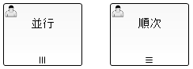
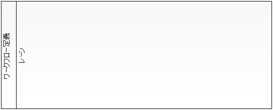

# ワークフロー定義

[ワークフローライブラリ](../../extension/workflow/workflow-workflow-doc-index.md) で使用するワークフロー定義について、定義に使用される要素の意味および定義内容について記載する。

> **Note:**
> [ワークフローライブラリ](../../extension/workflow/workflow-workflow-doc-index.md) では、基本的にはBPMNで定義されている用語を踏襲している。

> ただし、一部についてはNablarchの他の機能での用語との重複や紛らわしさを排除するために、独自の用語に置き換えている。
> そういった用語については、各要素の定義に対応するBPMNの用語を記載している。

[ワークフローライブラリ](../../extension/workflow/workflow-workflow-doc-index.md) でワークフロー定義に使用可能な要素は、BPMNの表記法で以下のように描かれる。

BPMNでは、他にも多くの要素が用意されているが、 [ワークフローライブラリ](../../extension/workflow/workflow-workflow-doc-index.md) で利用することができるのは、
以下に挙げる要素だけである。これら以外の要素は、サポートしていない。

* [シーケンスフロー](../../extension/workflow/workflow-WorkflowProcessElement.md#シーケンスフロー)
* [タスク](../../extension/workflow/workflow-WorkflowProcessElement.md#タスク) （ [マルチインスタンス・タスク](../../extension/workflow/workflow-WorkflowProcessElement.md#マルチインスタンスタスク) を含む）
* [XORゲートウェイ](../../extension/workflow/workflow-WorkflowProcessElement.md#xorゲートウェイ)
* [開始イベント](../../extension/workflow/workflow-WorkflowProcessElement.md#開始イベント)
* [停止イベント](../../extension/workflow/workflow-WorkflowProcessElement.md#停止イベント)
* [境界イベント](../../extension/workflow/workflow-WorkflowProcessElement.md#境界イベント)
* [レーン](../../extension/workflow/workflow-WorkflowProcessElement.md#レーン)

> **Note:**
> 上記以外の要素がワークフロー定義で使用されていた場合、ワークフロー定義データ作成ツールの実行時にエラーとなる。

ワークフロー定義は、上図のように、 [フローノード](../../extension/workflow/workflow-WorkflowProcessElement.md#フローノード) を [シーケンスフロー](../../extension/workflow/workflow-WorkflowProcessElement.md#シーケンスフロー) で
繋ぎ合わせていくことで作成する。

## フローノード

[タスク](../../extension/workflow/workflow-WorkflowProcessElement.md#タスク) 、 [XORゲートウェイ](../../extension/workflow/workflow-WorkflowProcessElement.md#xorゲートウェイ) 、 [開始イベント](../../extension/workflow/workflow-WorkflowProcessElement.md#開始イベント) 、
[停止イベント](../../extension/workflow/workflow-WorkflowProcessElement.md#停止イベント) 、 [境界イベント](../../extension/workflow/workflow-WorkflowProcessElement.md#境界イベント) の総称。

[シーケンスフロー](../../extension/workflow/workflow-WorkflowProcessElement.md#シーケンスフロー) の接続元フローノード、接続先フローノードに設定することができる要素をあらわす。

## シーケンスフロー

**記法**

フローノード間の進行方向と、そのフローに沿ってワークフローが進行するための条件（フロー進行条件）を定義する要素。

[ワークフローライブラリ](../../extension/workflow/workflow-workflow-doc-index.md) では並行処理となるようなワークフローの分岐・合流をサポートしないため、 [XORゲートウェイ](../../extension/workflow/workflow-WorkflowProcessElement.md#xorゲートウェイ) からは
複数のシーケンスフローが流出することができるが、それ以外の要素からは、複数のシーケンスフローが流出することはできない。

[XORゲートウェイ](../../extension/workflow/workflow-WorkflowProcessElement.md#xorゲートウェイ) 以外の要素からは複数のシーケンスフローが流出することはできないため、
それらの要素から流出するシーケンスフローについては、フロー進行条件を定義する必要はなく、また、定義しても
無視される。

[ワークフローライブラリ](../../extension/workflow/workflow-workflow-doc-index.md) であらかじめ提供しているフロー進行条件については、 [ゲートウェイの進行先ノードの判定制御](../../extension/workflow/workflow-WorkflowApplicationApi.md#ゲートウェイの進行先ノードの判定制御) を参照。

## タスク

**記法**

ワークフロープロセスで、ユーザが画面などから実行する処理や、バッチなどにより自動的に実行される処理などの
存在を定義するフローノード。

実際にタスクを行うユーザとして単一の [タスク担当ユーザ/タスク担当グループ](../../extension/workflow/workflow-WorkflowInstanceElement.md#タスク担当ユーザタスク担当グループ) をアサインすることができる。

> **Note:**
> BPMNでは、「ユーザタスク」と呼ばれている要素であるが、ユーザだけでなくグループとしても担当の割り当てができること、
> その他の種類のタスクをサポートしないことから、単に「タスク」としている。

### マルチインスタンス・タスク

**記法**

複数の [タスク担当ユーザ/タスク担当グループ](../../extension/workflow/workflow-WorkflowInstanceElement.md#タスク担当ユーザタスク担当グループ) を設定することのできるタスク。それらの実行ユーザが順番に処理するか、
並行して処理するかを指定することができる。

マルチインスタンス・タスクでは、そのタスクが実際に処理されるまでに、実行ユーザの数を動的に決定することができる。

マルチインスタンス・タスクには、タスクが完了して次のフローノードに進行する条件（完了条件）を定義する必要がある。
これは自由に定義することができ、「合議」や「AND承認」「OR承認」は、完了条件を適切に設定することで実現できる。

[ワークフローライブラリ](../../extension/workflow/workflow-workflow-doc-index.md) であらかじめ提供しているマルチインスタンス・タスクの完了条件については、 [マルチインスタンス・タスクの終了判定](../../extension/workflow/workflow-WorkflowApplicationApi.md#マルチインスタンスタスクの終了判定) を参照。

> **Note:**
> BPMNでは、「マルチインスタンスアクティビティ」と呼ばれている要素であるが、
> タスク以外のアクティビティをサポートしないことから、「マルチインスタンス・タスク」としている。

## XORゲートウェイ

**記法**

ワークフローでの条件分岐をあらわすフローノード。

この要素からワークフローが進行する場合、流出する各シーケンスフローのフロー進行条件が評価されて、
進行可能と判定されたシーケンスフローに従ってワークフローを進行させる。

条件に合致するシーケンスフローが複数存在した場合、いずれかのシーケンスフローに従ってワークフローが進行するが、
どのシーケンスフローに従うかは不定となる。XORゲートウェイから流出するシーケンスフローのフロー進行条件は、
必ず排他的になるように設定すること。

フロー進行条件についての詳細は、 [ゲートウェイの進行先ノードの判定制御](../../extension/workflow/workflow-WorkflowApplicationApi.md#ゲートウェイの進行先ノードの判定制御) を参照。

## 開始イベント

**記法**

ワークフローの開始を定義するフローノード。

ワークフロー定義には必ず一つの開始イベントが存在している必要がある。開始を定義するフローノードなので、
このフローノードにシーケンスフローが流入することはできない。

## 停止イベント

**記法**

ワークフローの完了を定義するフローノード。

ワークフローがこのフローノードに到達したとき、ワークフローは完了する。完了を定義するフローノードなので、
このフローノードからシーケンスフローが流出することはできない。

## 境界イベント

**記法**

タスクと関連付けて定義され、タスクを中断して別のフローノードに強制的に移動させるようなワークフローを定義するためのフローノード。

申請フローにおける、「 [申請者による引戻](../../extension/workflow/workflow-WorkflowProcessSample.md#引戻) 」などを実現するために利用することができる。

関連付けられたタスクが処理可能（ [アクティブフローノード](../../extension/workflow/workflow-WorkflowInstanceElement.md#アクティブフローノード) ）となっているときに境界イベントが発生すると、
そのタスクを中断し、境界イベントから流出するシーケンスフローに従ってワークフローが進行する。

各境界イベントには、そのイベントを発生させる「境界イベントトリガー」を定義しておき、
アプリケーションは境界イベントトリガーを使用して、各境界イベントを発生させる。

異なるタスクに対して、同じ境界イベントトリガーを持つ境界イベントを定義することもできる。

> **Note:**
> 「境界イベント」は、BPMNでは「中断メッセージ境界イベント」と呼ばれている要素であるが、
> 「メッセージ」という単語を含むと紛らわしくなることと、 [ワークフローライブラリ](../../extension/workflow/workflow-workflow-doc-index.md) では他の境界イベントをサポートしないことから、
> 単に「境界イベント」としている。

> また、上記で「境界イベントトリガー」と呼んでいるものは、BPMNでは「メッセージ」として定義されている。
> しかし、Nablarchでは既に「メッセージ」が複数の異なる意味で使用されているため、本機能では、
> 「メッセージ」という単語を使用せず、「境界イベントトリガー」としている。

## レーン

**記法**

ワークフロー上に担当ユーザとして現れるユーザの分類を表すために利用する。ワークフローの進行に利用されることはないが、
レーンに対して担当ユーザ/担当グループを割り当てることができる。
