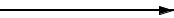

# ワークフロー定義

**公式ドキュメント**: [ワークフロー定義]()

## 

ワークフロー定義で使用可能なBPMN要素（これ以外の要素はサポートされない）:

- [workflow_element_sequence_flows](#s2)（シーケンスフロー）
- [workflow_element_task](#s4)（タスク）、[workflow_element_multi_instance_task](#s6)（マルチインスタンス・タスク）を含む
- [workflow_element_gateway_xor](#s6)（XORゲートウェイ）
- [workflow_element_event_start](#s8)（開始イベント）
- [workflow_element_event_terminate](#s10)（停止イベント）
- [workflow_element_boundary_event](#s12)（境界イベント）
- [workflow_element_lane](#s14)（レーン）

> **注意**: 上記以外の要素がワークフロー定義で使用された場合、ワークフロー定義データ作成ツールの実行時にエラーとなる。

ワークフロー定義は [workflow_flow_node](#) を [workflow_element_sequence_flows](#s2) で繋ぎ合わせて作成する。

keywords

ワークフロー定義, BPMNサポート要素, ワークフロー定義データ作成ツール, フローノード, シーケンスフロー

## フローノード

[workflow_element_task](#s4)、[workflow_element_gateway_xor](#s6)、[workflow_element_event_start](#s8)、[workflow_element_event_terminate](#s10)、[workflow_element_boundary_event](#s12) の総称。[workflow_element_sequence_flows](#s2) の接続元フローノード・接続先フローノードに設定できる要素を表す。

keywords

フローノード, workflow_flow_node, シーケンスフロー接続, タスク, XORゲートウェイ, 開始イベント, 停止イベント, 境界イベント

## 

`workflow_element_sequence_flows` — シーケンスフローセクションへの参照ラベル（[workflow_element_sequence_flows](#s2) で参照）

keywords

workflow_element_sequence_flows, シーケンスフロー, 参照ラベル

## シーケンスフロー

フローノード間の進行方向と、フロー進行条件（フローに沿って進行するための条件）を定義する要素。

制約:
- 並行処理の分岐・合流はサポートしない
- [workflow_element_gateway_xor](#s6) からのみ複数のシーケンスフローが流出可能。それ以外の要素からは複数流出不可
- [workflow_element_gateway_xor](#s6) 以外の要素から流出するシーケンスフローはフロー進行条件の定義不要（定義しても無視される）

提供済みフロー進行条件: :ref:`flowProceedCondition` 参照

keywords

シーケンスフロー, フロー進行条件, 並行処理非サポート, XORゲートウェイ, flowProceedCondition

## 

`workflow_element_task` — タスクセクションへの参照ラベル（[workflow_element_task](#s4) で参照）

keywords

workflow_element_task, タスク, 参照ラベル

## タスク

**タスク**

ワークフロープロセスで、ユーザが画面などから実行する処理やバッチなどにより自動的に実行される処理などの存在を定義するフローノード。単一の [workflow_task_assignee](workflow-WorkflowInstanceElement.md) をアサイン可能。

**マルチインスタンス・タスク**

複数の [workflow_task_assignee](workflow-WorkflowInstanceElement.md) を設定できるタスク。順番処理か並行処理かを指定可能。タスクが処理されるまでに実行ユーザ数を動的決定できる。

- 完了条件の定義が必須（次のフローノードへの進行条件）
- 「合議」「AND承認」「OR承認」は完了条件を適切に設定することで実現可能
- 提供済み完了条件: :ref:`completionCondition` 参照

keywords

タスク, マルチインスタンス・タスク, workflow_task_assignee, 完了条件, 合議, AND承認, OR承認, completionCondition

## 

`workflow_element_gateway_xor` — XORゲートウェイセクションへの参照ラベル（[workflow_element_gateway_xor](#s6) で参照）

keywords

workflow_element_gateway_xor, XORゲートウェイ, 参照ラベル

## XORゲートウェイ

条件分岐を表すフローノード。流出する各シーケンスフローのフロー進行条件を評価して、進行可能と判定されたフローに従ってワークフローを進行させる。

> **重要**: 複数の条件に合致するシーケンスフローが存在した場合、どのフローに従うかは不定となる。XORゲートウェイから流出するシーケンスフローのフロー進行条件は必ず排他的になるよう設定すること。

フロー進行条件詳細: :ref:`flowProceedCondition` 参照

keywords

XORゲートウェイ, 条件分岐, フロー進行条件, 排他条件, flowProceedCondition

## 

`workflow_element_event_start` — 開始イベントセクションへの参照ラベル（[workflow_element_event_start](#s8) で参照）

keywords

workflow_element_event_start, 開始イベント, 参照ラベル

## 開始イベント

ワークフローの開始を定義するフローノード。

- ワークフロー定義には必ず1つの開始イベントが存在する必要がある
- このフローノードにシーケンスフローが流入することはできない

keywords

開始イベント, ワークフロー開始, シーケンスフロー流入禁止

## 

`workflow_element_event_terminate` — 停止イベントセクションへの参照ラベル（[workflow_element_event_terminate](#s10) で参照）

keywords

workflow_element_event_terminate, 停止イベント, 参照ラベル

## 停止イベント

ワークフローの完了を定義するフローノード。

- ワークフローがこのフローノードに到達したとき、ワークフローは完了する
- このフローノードからシーケンスフローが流出することはできない

keywords

停止イベント, ワークフロー完了, シーケンスフロー流出禁止

## 

`workflow_element_boundary_event` — 境界イベントセクションへの参照ラベル（[workflow_element_boundary_event](#s12) で参照）

keywords

workflow_element_boundary_event, 境界イベント, 参照ラベル

## 境界イベント

タスクと関連付けて定義され、タスクを中断して別のフローノードに強制移動させるためのフローノード。[workflow_pullback](workflow-WorkflowProcessSample.md)（申請者による引戻し）などの実現に利用。

動作:
- 関連タスクが処理可能（[workflow_active_flow_node](workflow-WorkflowInstanceElement.md)）な状態で境界イベントが発生すると、タスクを中断し、境界イベントから流出するシーケンスフローに従ってワークフローが進行する
- 各境界イベントには「境界イベントトリガー」を定義しておき、アプリケーションがそのトリガーを使用して境界イベントを発生させる
- 異なるタスクに同じ境界イベントトリガーを持つ境界イベントを定義することも可能

keywords

境界イベント, 境界イベントトリガー, workflow_pullback, 引戻し, タスク中断, workflow_active_flow_node

## 

`workflow_element_lane` — レーンセクションへの参照ラベル（[workflow_element_lane](#s14) で参照）

keywords

workflow_element_lane, レーン, 参照ラベル

## レーン

ワークフロー上の担当ユーザの分類を表すために利用する要素。

- ワークフローの進行には利用されない（担当グループの可視化のみ）
- レーンに対して担当ユーザ/担当グループを割り当て可能

keywords

レーン, 担当ユーザ, 担当グループ, ワークフロー進行

