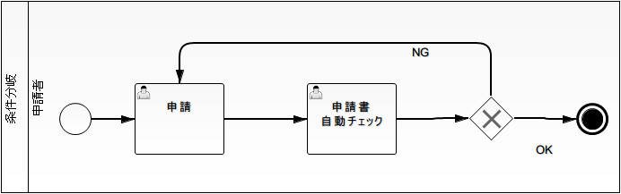
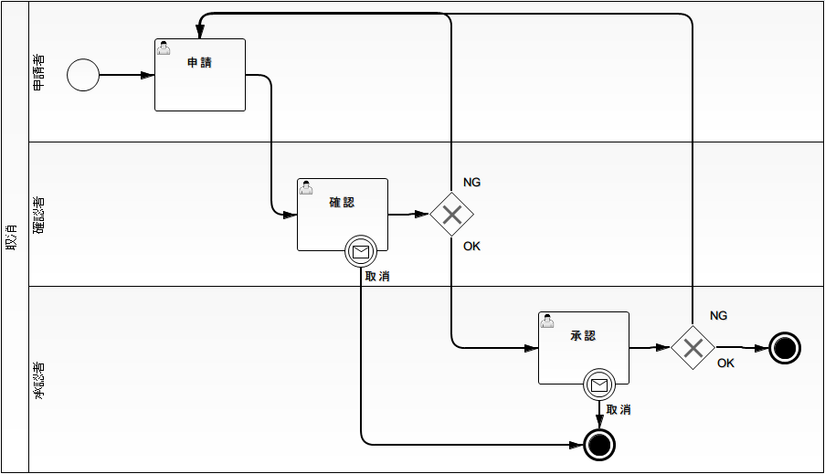
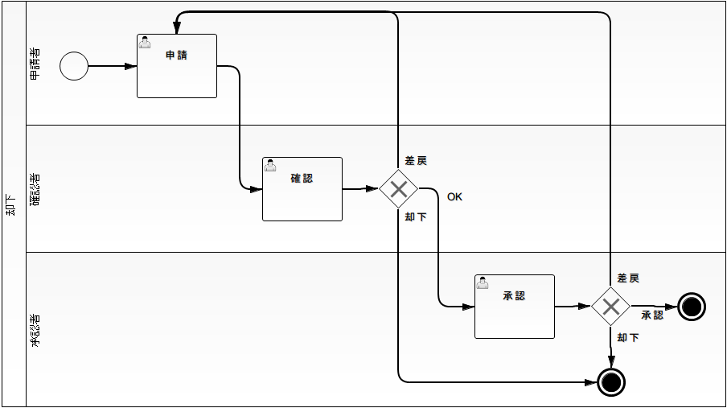
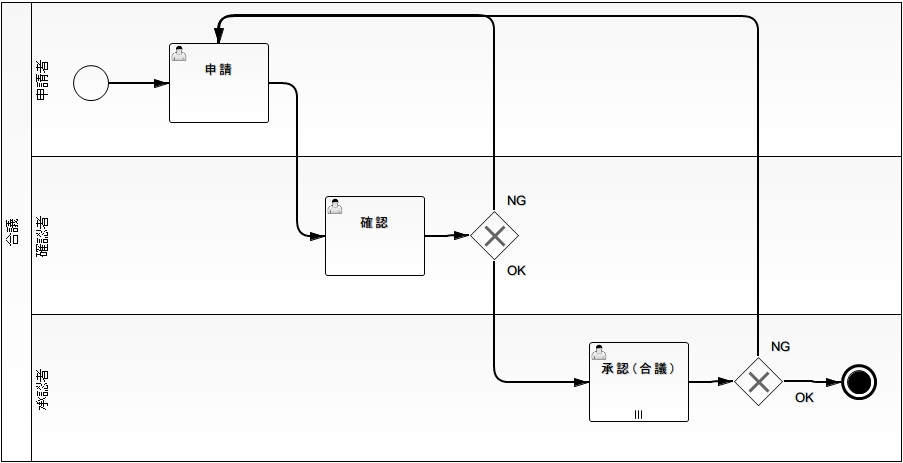
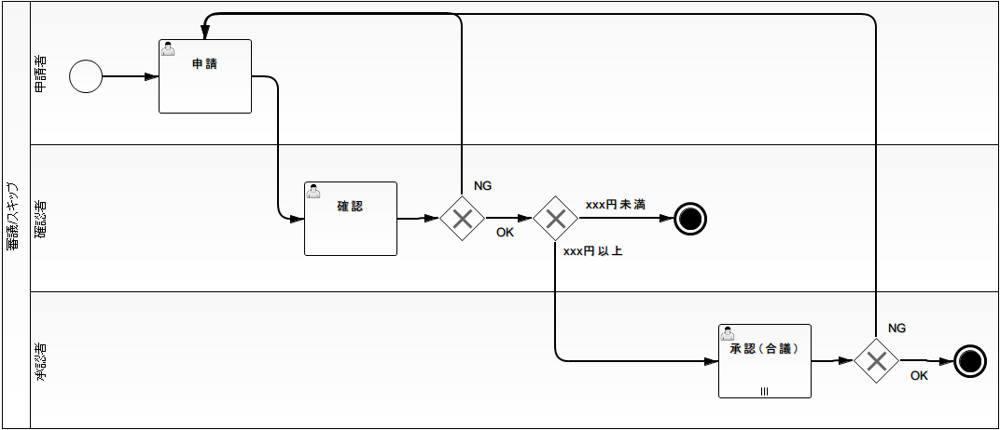

# ワークフロー定義例

## 通常経路（申請・確認・承認）

ワークフローインスタンスを生成し、ワークフローを開始・進行・終了させる。確認や承認の [workflow_element_task](workflow-WorkflowProcessElement.md) の [workflow_task_assignee](workflow-WorkflowInstanceElement.md) を指定してワークフローを進行させる。

**実現方法**: 各フローノードについて、それに続くフローノードを定義する。

keywords

ワークフロー開始, ワークフロー進行, ワークフロー終了, 申請・確認・承認フロー, タスク担当者指定, フローノード定義

## 条件分岐

ある [workflow_element_task](workflow-WorkflowProcessElement.md) での処理結果などに応じて、進行先の [workflow_element_task](workflow-WorkflowProcessElement.md) を変更する。

**実現方法**: [workflow_element_gateway_xor](workflow-WorkflowProcessElement.md) を利用し、進行先となる可能性のあるフローノードとそれらに進行する条件を定義する。3つ以上に条件分岐することも可能。

keywords

条件分岐, XORゲートウェイ, workflow_element_gateway_xor, 進行先切り替え, 3つ以上の分岐

## 差戻

確認などを行う [workflow_element_task](workflow-WorkflowProcessElement.md) で確認結果がNGだった場合に、申請者に差戻しを行う。差戻し後の [workflow_element_task](workflow-WorkflowProcessElement.md) の [workflow_task_assignee](workflow-WorkflowInstanceElement.md) は、そのタスクを直前に実行したユーザとなる。

**実現方法**: [workflow_element_gateway_xor](workflow-WorkflowProcessElement.md) を利用し、OKの場合は承認タスクへ、NGの場合は前の申請タスクにワークフローを進行させる。

既に一度実行されている [workflow_element_task](workflow-WorkflowProcessElement.md) へワークフローを進行させる場合は、[workflow_element_gateway_xor](workflow-WorkflowProcessElement.md) を利用する。その場合の [workflow_task_assignee](workflow-WorkflowInstanceElement.md) には、そのタスクに最後に割り当てられていたユーザが設定される。

keywords

差戻, XORゲートウェイ, workflow_element_gateway_xor, 差戻し担当者, 直前実行ユーザ, 既存タスクへの進行

## 再申請

差し戻された申請を修正し、再申請を行う。単純な差戻しフローとは異なり、初回の申請と再申請を明確に区別する。

**実現方法**: [workflow_element_gateway_xor](workflow-WorkflowProcessElement.md) を利用し、NGの場合には申請タスクではなく**再申請タスク**にワークフローを進行させる。

> **注意**: 申請者は申請タスクを実施後に必ずしも再申請を行うわけではないため、申請タスクと再申請タスクを結ぶシーケンスフローは作成しないこと。

keywords

再申請, 差戻し後の再申請, シーケンスフロー, 申請タスクと再申請タスクの区別, XORゲートウェイ

## 取消

申請者が申請の取り消しを行う。申請が取り消された場合にはワークフローを完了させる。

**実現方法**:
1. 申請の取り消しを行うことができる作業種別に対応する [workflow_element_task](workflow-WorkflowProcessElement.md) に [workflow_element_boundary_event](workflow-WorkflowProcessElement.md) を関連付ける。
2. それらの [workflow_element_boundary_event](workflow-WorkflowProcessElement.md) からは [workflow_element_event_terminate](workflow-WorkflowProcessElement.md) にワークフローを進行させる。
3. 申請の取り消しが行われた時に、上記の [workflow_element_boundary_event](workflow-WorkflowProcessElement.md) をトリガーしてワークフローを完了する。

keywords

取消, 境界イベント, workflow_element_boundary_event, 終了イベント, workflow_element_event_terminate, 申請取り消し

## 却下

確認者や承認者が申請を却下する。申請が却下された場合にはワークフローを完了させる。

**実現方法**: [workflow_remand](#s2) と同様に [workflow_element_gateway_xor](workflow-WorkflowProcessElement.md) を利用し、却下の場合には [workflow_element_event_terminate](workflow-WorkflowProcessElement.md) にワークフローを進行させる。

keywords

却下, XORゲートウェイ, workflow_element_gateway_xor, 終了イベント, workflow_element_event_terminate, 申請却下

## 引戻

確認依頼などが行われ、既に別実行ユーザの担当する [workflow_element_task](workflow-WorkflowProcessElement.md) にワークフローが進行している場合に、以前の実行ユーザが自分の担当する [workflow_element_task](workflow-WorkflowProcessElement.md) までワークフローを巻き戻す。

**実現方法**:
1. [workflow_cancel](#s4) と同様に、引戻しを行うことができる作業種別に対応する [workflow_element_task](workflow-WorkflowProcessElement.md) に [workflow_element_boundary_event](workflow-WorkflowProcessElement.md) を関連付ける。
2. それらの [workflow_element_boundary_event](workflow-WorkflowProcessElement.md) からは、引戻し後の [workflow_element_task](workflow-WorkflowProcessElement.md) にワークフローを進行させる。
3. 申請の引戻しが行われた時に、上記の [workflow_element_boundary_event](workflow-WorkflowProcessElement.md) を発生させ、ワークフローを引戻し後の [workflow_element_task](workflow-WorkflowProcessElement.md) に進行させる。

keywords

引戻, 境界イベント, workflow_element_boundary_event, ワークフロー巻き戻し, 申請引き戻し

## 後閲

[workflow_element_task](workflow-WorkflowProcessElement.md) が代理ユーザによって処理された場合に、代理元ユーザ本人が対象を確認してワークフローが完了する。

**実現方法**: 後閲の可能性があるフローに入る際には、必ずユーザを選択してからワークフローを進行させ、選択されたユーザが代理ユーザであるかどうかでワークフローを分岐する。

> **補足**: 確認後にユーザ選択を強制できない場合は、フロー進行条件をアプリケーションで実装し、直前の [workflow_element_task](workflow-WorkflowProcessElement.md) の実行ユーザが代理ユーザであったかどうかをゲートウェイで判定することで、確認後の「承認者選択タスク」が不要となり、確認後のユーザ選択を強制する必要はなくなる。

keywords

後閲, 代理ユーザ, フロー進行条件, 承認者選択タスク, 代理元ユーザ確認, ゲートウェイ判定

## 合議（回覧）

複数人で承認を行い、全員の承認が完了した時点でワークフローを進行させる。一人でも差戻しなどを行った場合には合議を中断して差戻し先にワークフローを進行させる。

**実現方法**: 合議に対応する [workflow_element_task](workflow-WorkflowProcessElement.md) には、担当ユーザを複数人割り当てることのできる [workflow_element_multi_instance_task](workflow-WorkflowProcessElement.md) を利用する。なお、合議に参加する人数は動的に決定できる。

keywords

合議, 回覧, マルチインスタンスタスク, workflow_element_multi_instance_task, 複数人承認, 動的人数決定

## 審議（エスカレーション）／スキップ

審議とスキップは同一のワークフロー定義で表される。

- **審議**: 確認や承認などを行った後、内容に応じて別の担当者による審査を実施する。
- **スキップ**: 確認や承認などを行った後、内容に応じて別の担当者による審査をスキップする。

**実現方法**: [workflow_conditional_branch](#s1) を利用して、内容に応じた分岐を行う。

keywords

審議, エスカレーション, スキップ, 条件分岐, workflow_conditional_branch, 担当者審査

