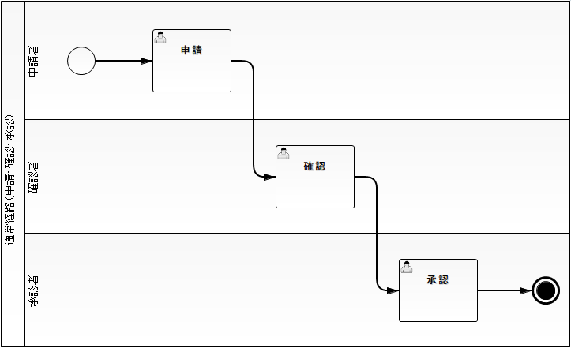
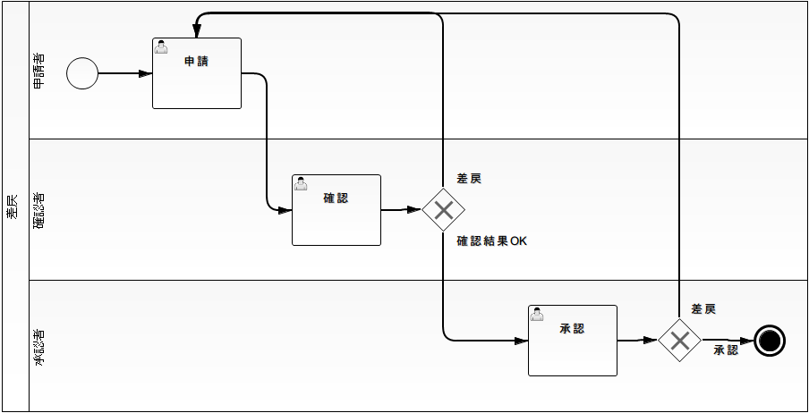
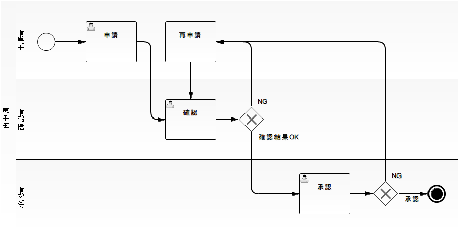
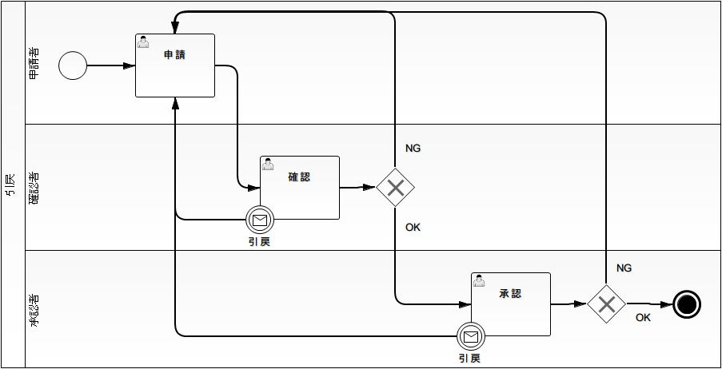
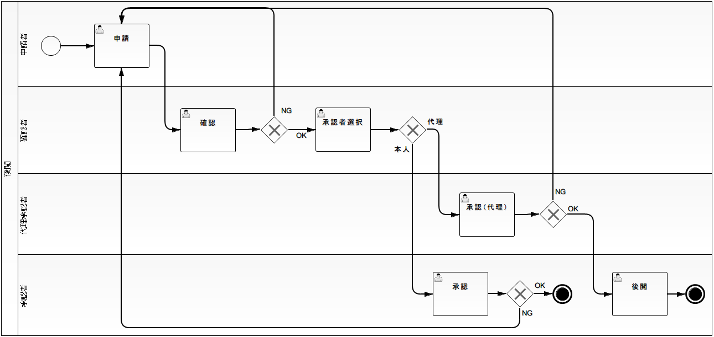

# ワークフロー定義例

一般的な「申請」「確認」「承認」のステップからなるワークフローを、 [ワークフローライブラリ](../../extension/workflow/workflow-workflow-doc-index.md) ではどのような
ワークフロー定義として実現するかの例を記載する。

## 通常経路（申請・確認・承認）

**ワークフロー概要**

ワークフローインスタンスを生成し、ワークフローを開始・進行・終了させる。

確認や承認の [タスク](../../extension/workflow/workflow-WorkflowProcessElement.md#タスク) の [タスク担当ユーザ/タスク担当グループ](../../extension/workflow/workflow-WorkflowInstanceElement.md#タスク担当ユーザタスク担当グループ) を指定してワークフローを進行させる。

**実現方法**

各フローノードについて、それに続くフローノードを定義する。

**ワークフロー定義の例**

## 条件分岐

**ワークフロー概要**

ある [タスク](../../extension/workflow/workflow-WorkflowProcessElement.md#タスク) での処理結果などに応じて進行先の [タスク](../../extension/workflow/workflow-WorkflowProcessElement.md#タスク) を変更する。

**実現方法**

[XORゲートウェイ](../../extension/workflow/workflow-WorkflowProcessElement.md#xorゲートウェイ) を利用し、進行先となる可能性のあるフローノードとそれらに進行する条件を定義する。
3つ以上に条件分岐することも可能。

**ワークフロー定義の例**

## 差戻

**ワークフロー概要**

確認などを行う [タスク](../../extension/workflow/workflow-WorkflowProcessElement.md#タスク) で、確認結果がNGだった場合に申請者に差戻しを行う。

このとき、差戻し後の [タスク](../../extension/workflow/workflow-WorkflowProcessElement.md#タスク) の [タスク担当ユーザ/タスク担当グループ](../../extension/workflow/workflow-WorkflowInstanceElement.md#タスク担当ユーザタスク担当グループ) は、
その [タスク](../../extension/workflow/workflow-WorkflowProcessElement.md#タスク) を直前に実行したユーザとなる。

**実現方法**

確認結果がOKかどうかで進行先となるフローノードを切り替える [XORゲートウェイ](../../extension/workflow/workflow-WorkflowProcessElement.md#xorゲートウェイ) を利用し、
OKの場合には承認タスクへ、NGの場合は前の申請タスクにワークフローを進行させる。

一般に、既に一度実行されている [タスク](../../extension/workflow/workflow-WorkflowProcessElement.md#タスク) へワークフローを進行させる必要がある場合には、
[XORゲートウェイ](../../extension/workflow/workflow-WorkflowProcessElement.md#xorゲートウェイ) を利用することで要件を実現できる。
その場合の [タスク担当ユーザ/タスク担当グループ](../../extension/workflow/workflow-WorkflowInstanceElement.md#タスク担当ユーザタスク担当グループ) には、その [タスク](../../extension/workflow/workflow-WorkflowProcessElement.md#タスク) に最後に割り当てられていたユーザが設定される。

**ワークフロー定義の例**

## 再申請

**ワークフロー概要**

差し戻された申請を修正し、再申請を行う。

上記の単純な差戻しフローとは異なり、初回の申請と再申請を明確に区別する。

**実現方法**

差戻しと同様に、確認結果がOKかどうかで進行先となるフローノードを切り替える [XORゲートウェイ](../../extension/workflow/workflow-WorkflowProcessElement.md#xorゲートウェイ) を利用する。
ただし、NGの場合には、申請タスクではなく、再申請タスクにワークフローを進行させる。

なお、申請者は申請タスクを実施後に必ずしも再申請を行うわけではないため、
申請タスクと再申請タスクを結ぶシーケンスフローは作成しないこと。

**ワークフロー定義の例**

## 取消

**ワークフロー概要**

申請者が、申請の取り消しを行う。

申請が取り消された場合には、ワークフローを完了させる。

**実現方法**

申請の取り消しを行うことができる作業種別に対応する [タスク](../../extension/workflow/workflow-WorkflowProcessElement.md#タスク) に、
[境界イベント](../../extension/workflow/workflow-WorkflowProcessElement.md#境界イベント) を関連付ける。

それらの [境界イベント](../../extension/workflow/workflow-WorkflowProcessElement.md#境界イベント) からは、 [停止イベント](../../extension/workflow/workflow-WorkflowProcessElement.md#停止イベント) に
ワークフローを進行させるようにしておく。

申請の取り消しが行われた時には、上記の [境界イベント](../../extension/workflow/workflow-WorkflowProcessElement.md#境界イベント) をトリガーし、ワークフローを完了する。

**ワークフロー定義の例**

## 却下

**ワークフロー概要**

確認者や承認者が、申請を却下する。

申請が却下された場合には、ワークフローを完了させる。

**実現方法**

[差戻](../../extension/workflow/workflow-WorkflowProcessSample.md#差戻) と同様に、確認結果がOKかどうかで進行先となるフローノードを切り替える
[XORゲートウェイ](../../extension/workflow/workflow-WorkflowProcessElement.md#xorゲートウェイ) を利用し、却下の場合には、 [停止イベント](../../extension/workflow/workflow-WorkflowProcessElement.md#停止イベント) にワークフローを進行させる。

**ワークフロー定義の例**

## 引戻

**ワークフロー概要**

確認依頼などが行われ、既に別実行ユーザの担当する [タスク](../../extension/workflow/workflow-WorkflowProcessElement.md#タスク) にワークフローが進行している場合に、
以前の実行ユーザが自分の担当する [タスク](../../extension/workflow/workflow-WorkflowProcessElement.md#タスク) までワークフローを巻き戻す。

**実現方法**

[取消](../../extension/workflow/workflow-WorkflowProcessSample.md#取消) と同様に、申請の引戻しを行うことができる作業種別に対応する [タスク](../../extension/workflow/workflow-WorkflowProcessElement.md#タスク) に、
[境界イベント](../../extension/workflow/workflow-WorkflowProcessElement.md#境界イベント) を関連付ける。

それらの [境界イベント](../../extension/workflow/workflow-WorkflowProcessElement.md#境界イベント) からは、引戻し後の [タスク](../../extension/workflow/workflow-WorkflowProcessElement.md#タスク) に
ワークフローを進行させるようにしておく。

申請の引戻しが行われた時には、上記の [境界イベント](../../extension/workflow/workflow-WorkflowProcessElement.md#境界イベント) を発生させし、
ワークフローを引戻し後の [タスク](../../extension/workflow/workflow-WorkflowProcessElement.md#タスク) に進行させる。

**ワークフロー定義の例**

## 後閲

**ワークフロー概要**

[タスク](../../extension/workflow/workflow-WorkflowProcessElement.md#タスク) が代理ユーザによって処理された場合には、代理元ユーザ本人が対象を確認して、ワークフローが完了する。

**実現方法**

後閲の可能性があるフローに入る際には、必ずユーザを選択してからワークフローを進行させるものとし、
選択されたユーザが代理ユーザであるかどうかで、ワークフローを分岐する。

なお、要件上、確認後にユーザ選択を強制することができない場合には、フロー進行条件をアプリケーションで実装し、
直前の [タスク](../../extension/workflow/workflow-WorkflowProcessElement.md#タスク) の実行ユーザが代理ユーザであったかどうかをゲートウェイで判定することで、
下記例の確認後の「承認者選択タスク」は不要となり、確認後にユーザ選択を強制する必要はなくなる。

**ワークフロー定義の例**

## 合議（回覧）

**ワークフロー概要**

複数人で承認を行い、全員の承認が完了した時点でワークフローを進行させる。

一人でも差戻しなどを行った場合には、合議を中断して差戻し先にワークフローを進行させる。

**実現方法**

合議に対応する [タスク](../../extension/workflow/workflow-WorkflowProcessElement.md#タスク) には、担当ユーザを複数人割り当てることのできる
[マルチインスタンス・タスク](../../extension/workflow/workflow-WorkflowProcessElement.md#マルチインスタンスタスク) を利用する。

なお、合議に参加する人数は動的に決定できる。

**ワークフロー定義の例**

## 審議（エスカレーション）／スキップ

**ワークフロー概要**

審議：確認や承認などを行った後、内容に応じて別の担当者による審査を実施する。

スキップ：確認や承認などを行った後、内容に応じて別の担当者による審査はスキップする。

**実現方法**

審議とスキップは、同一のワークフロー定義であらわされる。
[条件分岐](../../extension/workflow/workflow-WorkflowProcessSample.md#条件分岐) を利用して、内容に応じた分岐を行えばよい。

**ワークフロー定義の例**

