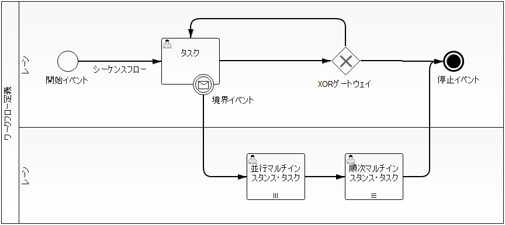

# ワークフローライブラリ

## 概要

申請フロー・承認フローの進行状況管理、各タスクへの担当ユーザ割り当て・割り当て状態管理の機能を提供する。

## ワークフロー定義

ワークフロー内で実行される処理の順序や分岐条件などを定義し、申請・案件ごとのワークフローのひな型となる。[BPMN (Business Process Model and Notation)](http://www.bpmn.org/) という表記法を利用して定義する。

## ワークフローインスタンス

ワークフローを利用する個々の案件や申請と紐付けて生成され、ワークフロー定義に存在するタスク・進行状態・担当ユーザを管理する。

- タスク終了時に [workflow_complete_task](workflow-WorkflowApplicationApi.md) などを呼び出すことで、[workflow_active_flow_node](workflow-WorkflowInstanceElement.md) が更新されワークフローが進行する。
- ワークフロー進行後は [workflow_definition](#s1) に従って進行先が判断され、次のタスク（または停止イベント）まで進行して再度待機する。

keywords

ワークフロー定義, ワークフローインスタンス, BPMN, workflow_complete_task, workflow_active_flow_node, 申請フロー, 承認フロー, タスク管理, WorkflowProcessElement, WorkflowInstanceElement

## 要求

## 実装済み

- ワークフロー定義として処理概念に相当するフローを定義し、進行状況を制御できる。
- タスクが現在処理可能かどうかに関わらず、担当ユーザを割り当てられる。
- 担当グループを設定できる（グループ内の任意のユーザが実行可能であることを表す）。
- すでに担当ユーザ/グループが割り当てられているタスクを、別の担当ユーザ/グループに再割り当てできる。
- 一つのタスクに複数の担当ユーザ/グループを割り当て、順番または並行して処理できる。
- 並行処理の場合、AND承認・OR承認を実現できる。

## 未検討

- 引上承認（確認者不在などの場合に、先のステップの承認者が承認を行う機能）は未検討。

keywords

AND承認, OR承認, 担当ユーザ割り当て, 担当グループ設定, 並行処理, 引上承認, WorkflowProcessSample, 複数担当ユーザ, 再割り当て

## 対象外としている機能

以下はワークフローライブラリでは提供しない。アプリケーションで実装が必要。

> **重要**: ワークフローインスタンス情報に関する排他制御は行われない。ワークフローに従って処理される業務データで排他制御を行うこと。

以下はアプリケーションに応じて要件が異なるため、ワークフローライブラリでは提供しない。アプリケーションで適切な設計・実装が必要。

- 処理履歴（承認履歴など）の取得
- ワークフローに付随する情報の保持（案件名、申請状況のステータス名など）
- 処理対象ワークフローなどの検索
- 担当ユーザと担当グループの関連など、ユーザや権限管理機能

keywords

排他制御, 処理履歴, 承認履歴, ユーザ権限管理, ワークフロー検索, 対象外機能, アプリケーション実装

## 制約事項

- タスクには担当ユーザと担当グループのいずれかしか割り当てられない。一つのタスクにユーザとグループの両方を同時に割り当てることはできない。ただし、担当ユーザが割り当てられているタスクをグループに再割り当て（またはその逆）は可能。
- 並行処理となるような分岐や合流を行うワークフローは定義できない。
- ワークフローの定義情報を動的に変更することはできない。事前に登録されているワークフロー定義データを利用する。

keywords

担当ユーザ, 担当グループ, 並行処理制約, ワークフロー定義変更不可, タスク割り当て制約, 分岐合流制約

## 全体構造

ワークフローライブラリの全体構造は [09/WorkflowArchitecture](workflow-WorkflowArchitecture.md) を参照。

テーブル定義に対応するObject Browser ERのEDMファイル: [workflow_model.edm](../../../knowledge/extension/workflow/assets/workflow-doc-workflow/workflow_model.edm)

keywords

WorkflowArchitecture, テーブル定義, workflow_model.edm, Object Browser ER, 全体構造

## 提供するAPI

ワークフローライブラリが提供するAPIおよびその実装例は [09/WorkflowApplicationApi](workflow-WorkflowApplicationApi.md) を参照。

keywords

WorkflowApplicationApi, API実装例, ワークフローAPI

