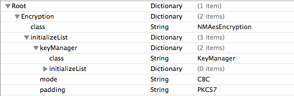

# iOS ライブラリについて

本章ではiOS ライブラリについて、各機能で共通のビルド設定、実装方針などについて記述する。

## ビルド設定

本ライブラリではiOSのリフレクションを利用しているため、コンパイルのリンカフラグに「-ObjC」を設定しなければ動作しない。
下記の通り、必ずOther Linker Flagsに「-ObjC」を追加すること。


## 実装方針

### iOSエラー処理実装方針

appleのプログラミング手法として、なんらかの異常が発生した場合例外を投げるのではなく、
エラーオブジェクトを生成して処理を終了するというルールがある。
iOS ライブラリではappleの推奨するこの手法に則って実装している。
またエラーハンドリングの手法として、戻り値の判定によるエラーハンドリングを想定して実装している。

ユーザがiOS ライブラリのある機能を使用する場合のエラーハンドリングの実装例を以下に示す。

```objective-c
NSError *error = nil;
NMMessage *response = [sender send:@"destination" sendMessage:sendMessage error:&error];

// error != nilという判定条件にしないこと
if (response == nil) {
    [self outputErrorInfo:error];
}
```

iOS ライブラリの一部の機能ではユーザーにプロトコルの実装を求めるものもある。
エラー情報を引数に持つ各メソッドでエラーが発生した場合、必ずエラー情報の設定を行い、
戻り値がNOまたはnilとなるように実装すること。
エラー情報には各プロジェクトの方針にあったドメイン、エラーコード、ユーザ情報を格納すればよい。

エラーを発生させるメソッドの実装例を以下に示す。

```objective-c
/**
 JSONによるNMMessageのエンコード
 正常に終了する場合はNSDataオブジェクトを、エラーが発生した場合はnilを戻り値とする。
 */
- (NSData *)convertSend:(NMMessage *)message error:(NSError *__autoreleasing *)error {

   NSDictionary *jsonMap = [message convertDictionary];
   if ([NSJSONSerialization isValidJSONObject:jsonMap]) {
       return [NSJSONSerialization dataWithJSONObject:jsonMap options:NSJSONWritingPrettyPrinted error:error];
   } else {
       // エラーオブジェクトの作成
       *error = [NSError errorWithDomain:@"NMJsonBodyConvertorException" code:0 userInfo:nil];
       // nilを返却
       return nil;
   }
}
```

### initWithDictionaryメソッド実装方法

iOS ライブラリで提供するプロトコルの中には指定イニシャライザであるinitWithDictionaryメソッドをもつものがある。
この、initWithDictionaryの引数であるNSDictionaryオブジェクトには該当する機能で作成するプロパティリスト
(通信基盤の [プロパティリストの作成](../../guide/biz-samples/biz-samples-01-ConnectionFramework.md#プロパティリストの作成) や 暗号化機能の [プロパティリストの作成](../../guide/biz-samples/biz-samples-01-Encryption.md#プロパティリストの作成) など)
のinitializeListに記入された値が格納されている。
設定書の値を取得することにより、初期化時にパラメータに任意の値を設定することが可能である。

実装例を下記に示す。

設定書



コード

```objective-c
@implementation NMAesEncryption

@synthesize keyManager;
@synthesize nmMode;
@synthesize nmPaddingType;

- (id)initWithDictionary:(NSDictionary *)dict {
    self = [super init];
    if (self != nil) {
        self.nmMode = dict[@"mode"];            // 設定書のmode欄に記入された値がdict[@"mode"]に格納されている
        self.nmPaddingType = dict[@"padding"];  // 設定書のpadding欄に記入された値がdict[@"padding"]に格納されている
    }
    return self;
}
```
