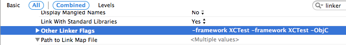

# iOS ライブラリについて

## ビルド設定

> **重要**: iOSのリフレクションを利用しているため、コンパイルのリンカフラグに「-ObjC」を設定しなければ動作しない。Other Linker Flagsに必ず「-ObjC」を追加すること。



<details>
<summary>keywords</summary>

-ObjC, Other Linker Flags, リンカフラグ, ビルド設定, iOSリフレクション

</details>

## iOSエラー処理実装方針

Appleの方針として、異常が発生した場合は例外を投げるのではなくエラーオブジェクトを生成して処理を終了する。iOS ライブラリもこの方針に従い、戻り値の判定によるエラーハンドリングを前提として実装している。

> **重要**: エラー判定は `response == nil` で行うこと。`error != nil` を判定条件にしないこと。

```objective-c
NSError *error = nil;
NMMessage *response = [sender send:@"destination" sendMessage:sendMessage error:&error];

// error != nilという判定条件にしないこと
if (response == nil) {
    [self outputErrorInfo:error];
}
```

プロトコルを実装する場合: エラー情報を引数に持つメソッドでエラーが発生した場合、必ずエラー情報を設定し、戻り値がNOまたはnilとなるように実装すること。エラー情報には各プロジェクトの方針に合ったドメイン、エラーコード、ユーザ情報を格納する。

```objective-c
- (NSData *)convertSend:(NMMessage *)message error:(NSError *__autoreleasing *)error {
    NSDictionary *jsonMap = [message convertDictionary];
    if ([NSJSONSerialization isValidJSONObject:jsonMap]) {
        return [NSJSONSerialization dataWithJSONObject:jsonMap options:NSJSONWritingPrettyPrinted error:error];
    } else {
        *error = [NSError errorWithDomain:@"NMJsonBodyConvertorException" code:0 userInfo:nil];
        return nil;
    }
}
```

<details>
<summary>keywords</summary>

NSError, NMMessage, NSJSONSerialization, エラーハンドリング, エラーオブジェクト, プロトコル実装, 戻り値判定, NMJsonBodyConvertorException

</details>

## initWithDictionaryメソッド実装方法

iOS ライブラリのプロトコルの中にはinitWithDictionaryメソッドを持つものがある。引数のNSDictionaryオブジェクトには、プロパティリスト（connectionFWpropertyList や encryptionPropertyList など）のinitializeListに記入された値が格納されている。これにより初期化時にパラメータに任意の値を設定できる。


```objective-c
@implementation NMAesEncryption

@synthesize keyManager;
@synthesize nmMode;
@synthesize nmPaddingType;

- (id)initWithDictionary:(NSDictionary *)dict {
    self = [super init];
    if (self != nil) {
        self.nmMode = dict[@"mode"];           // 設定書のmode欄の値
        self.nmPaddingType = dict[@"padding"]; // 設定書のpadding欄の値
    }
    return self;
}
```

<details>
<summary>keywords</summary>

initWithDictionary, NSDictionary, NMAesEncryption, keyManager, nmMode, nmPaddingType, synthesize, プロパティリスト, initializeList, connectionFWpropertyList, encryptionPropertyList

</details>
