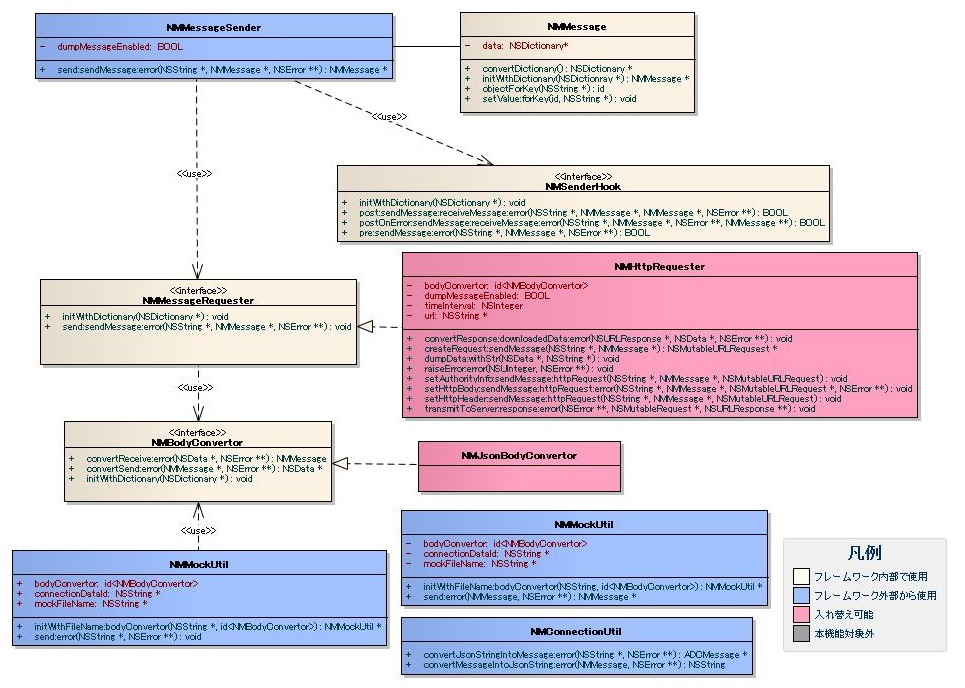
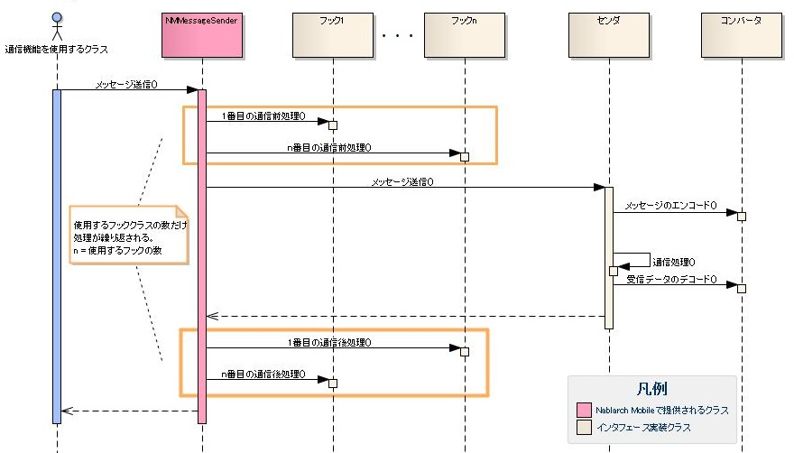
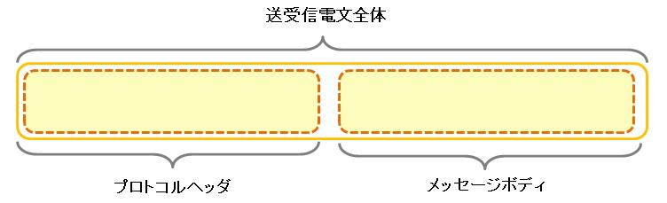
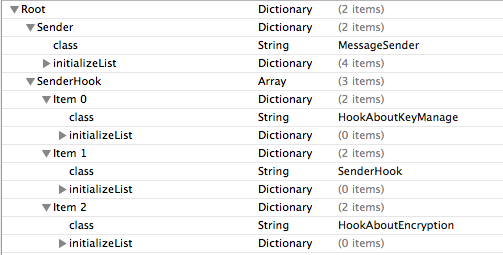
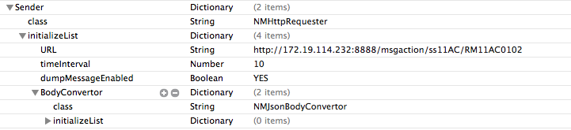

# モバイルアプリとNablarchサーバ間の通信

## 概要

モバイルアプリとサーバ間での通信機能を提供する。

## 特徴

* **通信機能の隠蔽**
  本機能を使用することで、利用者は通信方式を意識することなくサーバとの通信を行える。
* **基本的な通信機能の提供**
  [HTTP/HTTPS通信](../../guide/biz-samples/biz-samples-01-ConnectionFramework.md#httphttps通信) に記述されている通りの通信機能であれば、カスタマイズすることなく利用できる。
* **汎用的な電文の利用**
  送受信する電文形式を自由に変更できる。

## 要求

### 実装済み

* REST APIを提供するサーバと通信
* HTTP/HTTPS方式の通信
* JSON形式の電文の送受信

### 未実装

* XML形式の電文の送受信

### 未検討

* ベーシック認証
* ダイジェスト認証
* 証明書を用いた認証

## 構造

### クラス図



#### 各クラスの責務

##### インタフェース定義

| インタフェース名 | 概要 |
|---|---|
| NMMessageRequester | 通信を行うためのインタフェース。 通信方式ごとに本インタフェースの実装クラスを作成する。NMMessageRequesterを実装したクラス 及びインスタンスをセンダと呼ぶ。 |
| NMSenderHook | 通信前後の処理を行うインタフェース。 本インタフェースを実装することで、通信前後に処理を加えられる。 NMSenderHookを実装したクラスおよびインスタンスをフックと呼ぶ。 |
| NMBodyConvertor | NMMessageインスタンスをバイナリデータに変換するインタフェース。 変換形式ごとに本インタフェースの実装クラスを作成する。NMBodyConvertorを実装したクラス及び インスタンスをコンバータと呼ぶ。 |

##### クラス定義

a) 通信処理

| クラス名 | 概要 |
|---|---|
| NMMessageSender | 通信機能を提供するクラス。使用方法につていは [通信処理APIの呼び出し](../../guide/biz-samples/biz-samples-01-ConnectionFramework.md#通信処理apiの呼び出し) に記載する。 |
| NMHttpRequester | HTTP/HTTPS通信機能を実装したクラス。実装機能の詳細については [HTTP/HTTPS通信](../../guide/biz-samples/biz-samples-01-ConnectionFramework.md#httphttps通信) に、 本実装クラスの設定方法については [センダ](../../guide/biz-samples/biz-samples-01-ConnectionFramework.md#センダ) に記載する。 |

b) 通信データ

| クラス名 | 概要 |
|---|---|
| NMMessage | 通信のペイロード。本機能が想定するデータ形式のモデルは [データモデル](../../guide/biz-samples/biz-samples-01-ConnectionFramework.md#データモデル) に記載する。 |

c) データ変換

| クラス名 | 概要 |
|---|---|
| NMJsonBodyConvertor | JSON形式でNMMessageおよびNSData間の変換機能を提供するクラス。 実装機能の詳細については [JSONコンバータ](../../guide/biz-samples/biz-samples-01-ConnectionFramework.md#jsonコンバータ) に記載する。 |

d) その他

| クラス名 | 概要 |
|---|---|
| NMConnectionUtil | 通信機能に関するユーティリティをまとめたクラス。各ユーティリティの詳細については [NMConnectionUtil](../../guide/biz-samples/biz-samples-01-Utility.md#nmconnectionutil) に記載する。 |
| NMMockUtil | 通信モックに関するユーティリティをまとめたクラス。各ユーティリティの詳細については [NMMockUtil](../../guide/biz-samples/biz-samples-01-Utility.md#nmmockutil) に記載する。 |

### シーケンス図

通信時のシーケンスを以下に示す。



フックを複数使用する場合、送信前処理は設定した順番に、送信後処理は設定した順番とは逆に呼び出される
(フックの設定方法については [プロパティリストの作成](../../guide/biz-samples/biz-samples-01-ConnectionFramework.md#プロパティリストの作成) のb) SenderHookを参照)。
例えば、以下の処理を行うフックを順に設定した場合

1. 通信ヘッダの設定/取得
  (この通信ヘッダとは通信プロトコルヘッダとは別に、システムの通信インタフェースごとに決められたものを指す。)
2. 暗号化対象データ/復号データのフォーマット/パース
3. 通信データの一部暗号化/復号

この場合、送信前には1、2、3の順にフックの前処理が呼び出される。つまり、
ヘッダの設定、暗号化対象データのフォーマット、データの暗号化の順に処理が行われる。
一方、送信後には3、2、1の順にフックの後処理が呼び出される。つまり
データの復号、復号データのパース、ヘッダの取得の順に処理が行われる。
また、フックを複数使用できることにより、処理の追加および削除が容易である。
例えば、テスト実行時にはデータの暗号化は行いたくない、といった場合には3のフックだけを
取り外せばよい。

## データモデル

本機能では、送受信電文を以下のようなデータモデルで表現している。



* **プロトコルヘッダ**
  各通信プロトコル(HTTPなど)のヘッダ情報を格納する領域。本領域へのアクセスはセンダで行うことを推奨する。
* **メッセージボディ**
  プロトコルヘッダを除いた電文のデータ領域をメッセージボディと呼ぶ。メッセージボディの解析はコンバータによって行う。
  これによりメッセージボディをNMMessageオブジェクトとして扱える。NMMessageオブジェクトはNSDictionaryと同様にキーと値を格納するコレクションクラスである。

## 使用方法

本機能の使用方法について記載する。
ユーザはメッセージを送信するために、以下の3つのステップを実施する必要がある。

1. プロパティリストの作成
2. メッセージの作成
3. 通信処理APIの呼び出し

以下に各ステップの詳細を記載する。

### プロパティリストの作成

本機能を利用する際、通信機能に関する設定を記述したプロパティリストファイル(通信設定ファイル)を作成する必要がある。
通信設定ファイルでは以下の事柄について設定を行う。

* センダの指定(Sender.class)
* センダの初期値パラメータの指定(Sener.initializeLIst)
* 複数のフックの指定(SenderHook[].class)
* 各フックの初期値パラメータの指定(SenderHook[].initializeLIst)
* フックの呼び出し順の指定

設定例を以下に示す。



プロパティの説明を下記に示す。

| 項目名 | データ型 | 概要 |
|---|---|---|
| Sender | Dictionary | センダの設定。 |
| SenderHook | Array | 通信前後の処理を行う複数のフックの設定。 |

a) Sender

| 項目名 | データ型 | 概要 |
|---|---|---|
| class | String | 使用するセンダ名。 |
| initializeList | Dictionary | 使用するセンダの初期化時に使用するパラメータ。 詳細は使用するクラスの初期化パラメータを参照すること。 |

b) SenderHook

| 項目名 | データ型 | 概要 |
|---|---|---|
| SenderHook[] | Dictionary | 各フックの設定。 |
| SenderHook[].class | String | 使用するフック名。 |
| SenderHook[].initializeList | Dictionary | 使用するフックの初期化時に使用するパラメータ。 詳細は使用するクラスの初期化パラメータを参照すること。 |

フック処理は送信前処理であれば通信設定ファイルの配列順に、受信後処理であれば通信設定ファイルの配列逆順に実行される。
従って、上記の設定例では以下の順番で通信前処理が実行される。

1. HookAboutKeyManagerクラスで実装された送信前処理
2. SenderHookクラスで実装された送信前処理
3. HookAboutEncryptionクラスで実装された送信前処理

また、受信後処理は以下の順番で実行される。

1. HookAboutEncryptionクラスで実装された受信後処理
2. SenderHookクラスで実装された受信後処理
3. HookAboutKeyManagerクラスで実装された受信後処理

#### 初期値パラメータ

初期値パラメータはクラスによって異なる。それぞれのクラスの初期値パラメータについて記載する。

##### センダ

a) NMHttpRequester

初期値パラメータ一覧

| 項目名 | データ型 | 概要 |
|---|---|---|
| URL | String | 宛先URL |
| timeInterval | Number | 待機タイムアウト時間 |
| dumpMessageEnabled | Boolean | JSON形式でのメッセージダンプ要否 |
| bodyConvertor | Dictionary | コンバータの設定 |
| bodyConvertor.class | String | 使用するコンバータ名 |
| bodyConvertor.initializeList | Dictionary | 使用するコンバータの初期化パラメータ。 詳細は使用するクラスの初期化パラメータを参照すること。 |

設定例



##### フック

フレームワークで提供する実装クラスなし

##### コンバータ

a) NMJsonBodyConvertor

特に無し

### メッセージの作成

以下にメッセージを作成する実装例を示す。

```objective-c
NSDictionary *dict = @{
                       @"string" : @"dummyString",
                       @"number_integer" : @10,
                       @"number_double" : @1.0,
                       @"number_bool" : @YES,
                       @"array" : @[],
                       @"object" : @{},
                       @"null" : [NSNull null] };
NMMessage *sendMessage = [[NMMessage alloc] initWithDictionary:dict];

// NSDataは文字列にエンコードしてから格納する
NSString *str= [[NSString alloc] initWithData:data encoding:NSUTF8StringEncoding];
[sendMessage setValue:str forKey:@"data"];
```

### 通信処理APIの呼び出し

以下に通信処理APIを呼び出す実装例を示す。

```objective-c
/**
 * 通信機能使用サンプル
 */
- (NMMessage *)sample {
    NMMessage *sendMessage = [self createSendMessage];
    NMMessageSender *sender = [[NMMessageSender alloc] init];

    NSError *error = nil;
    // 第一引数に設定された物と同名の通信設定ファイルが読み込まれる
    // この例だとdestination.plistというプロパティリストが読み込まれる
    NMMessage *response = [sender send:@"destination" sendMessage:sendMessage error:&error];

    return response;
}
```

## 実装クラス

Nablarch Mobileで提供する、各インタフェースの実装クラスについて解説する。

### HTTP/HTTPS通信

NMHttpRequesterはHTTP/HTTPS通信を実装したセンダである。
実装したHTTP/HTTPS通信の仕様を以下に示す。

* **リクエストパス**
  URL：通信設定ファイルに設定された値に従う
  　　　　設定されたURLのプロトコルがhttpの場合はHTTP通信を、httpsの場合はHTTPS通信を行う
  メソッド：POST
* **ヘッダ**
  特に設定なし
* **ボディ**
  送信時：コンバータによりバイナリデータに変換したメッセージオブジェクト
  受信時：ダウンロードデータおよびHTTPステータス(ダウンロードデータがない場合はHTTPステータスだけを返す)
* **その他**
  キャッシュ：使用しない
  メッセージのダンプ：通信設定ファイルに設定された値によってはJSON形式のダンプを行う
  タイムアウト時間：通信設定ファイルに設定された値に従う

### JSONコンバータ

NMJsonConvertorはJSONによるNMMessageオブジェクトからのエンコードおよびNMMessageオブジェクトへのデコードを実装したコンバータである。

以下にJSONとObjective-Cのデータ型の変換仕様を示す。

| JSON | Objective-C |
|---|---|
| 数値 | NSNumber(数値、浮動小数点) |
| 文字列 | NSString |
| 真偽値 | NSNumber(真偽値) |
| 配列 | NSArray |
| オブジェクト | NSDictionary |
| null | NSNull |

NMMessageからバイナリデータに変換する際、上記以外のデータ型オブジェクトが格納されていると
変換できない。
例えばバイト配列をNMMessageに格納したい場合は、Base64でフォーマットして文字列へ変換してから
格納するなどして対応すること。
またNMMessageに使用できるキーの型もNSStringに限られる。

## ユーティリティ

[ユーティリティ](../../guide/biz-samples/biz-samples-01-Utility.md) 参照。
