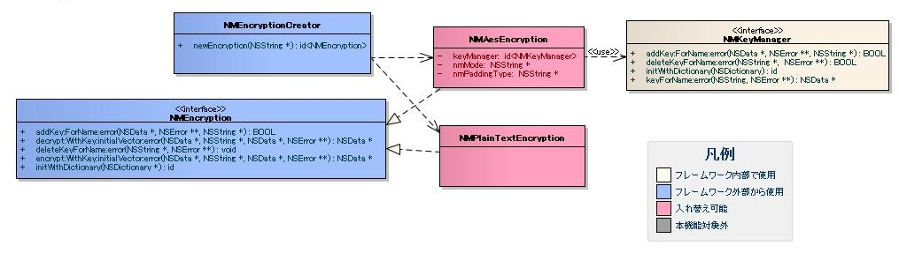
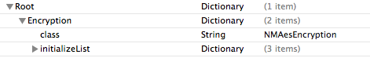

# データの暗号化

## 概要

データの暗号化／復号に必要な機能を提供する。

## 特徴

* **暗号機能の隠蔽**
  本機能を使用することで、利用者は暗号方式を意識することなくデータの暗号化/復号を行える。
* **暗号化機能の変更性の向上**
  本機能を使用することで、「テスト時に暗号化を行わず平文で出力する」といった変更を、呼び出し元を変更することなく実現できる。
* **基本的な暗号機能の提供**
  [実装済み](../../guide/biz-samples/biz-samples-01-Encryption.md#実装済み) に記述されている暗号方式であれば、カスタマイズすることなく利用できる。

## 要求

### 実装済み

* AES128ビット方式の暗号化/復号機能

### 未実装

* DES方式の暗号化/復号機能
* RSA方式の暗号化/復号機能
* DUKPT方式の暗号化/復号および鍵管理機能
* 基本的な鍵管理機能
* 暗号鍵、メタ情報管理機能

### 未検討

* iOS Keychainによる鍵管理機能

## 構造

### クラス図



#### 各クラスの責務

##### インタフェース定義

| インタフェース名 | 概要 |
|---|---|
| NMEncryption | 暗号化/復号を行うためのインタフェース。 暗号方式ごとに本インタフェースの実装クラスを作成する。本インタフェースを実装したクラス及 びインスタンスを暗号クラスと呼ぶ。 |
| NMKeyManager | 鍵管理を行うインタフェース。 鍵管理方式ごとに本インタフェースの実装クラスを作成する。本インタフェースを実装したクラス及 びインスタンスを鍵管理クラスと呼ぶ。 |

##### クラス定義

| クラス名 | 概要 |
|---|---|
| NMEncryptionCreator | 設定書ファイルを元に、暗号クラスのインスタンスを生成するクラス。設定書ファイルの記載方法 については [プロパティリストの作成](../../guide/biz-samples/biz-samples-01-Encryption.md#プロパティリストの作成) に、本クラスの使用方法については [API使用例](../../guide/biz-samples/biz-samples-01-Encryption.md#api使用例) に記載する。 |
| MNAesEncryption | AES128ビット暗号化/復号を実装したクラス。本実装クラスの設定方法については [暗号クラス](../../guide/biz-samples/biz-samples-01-Encryption.md#暗号クラス) に記載する。 |
| NMPlainTextEncryption | 暗号化を行わない、空実装クラス。 |

## 使用方法

本機能の使用方法について記載する。 ユーザは暗号化/復号を行うために、以下の2つのステップを実施する必要がある。

1. プロパティリストの作成
2. APIの呼び出し

以下に各ステップの詳細を記載する。

### プロパティリストの作成

本機能では暗号方式ごとにプロパティリスト形式で設定書(暗号化設定ファイル)を作成する必要がある。
設定書では以下の事柄についての設定を行う。

* 暗号クラスの指定(Encryption.class)
* 暗号クラスの初期値パラメータの指定(Encryption.initializeList)

設定例を以下に示す。



プロパティの説明を下記に示す。

| key | type | 説明 |
|---|---|---|
| Encryption | Dictionary | 暗号クラスの設定 |
| Encryption.class | String | 使用する暗号クラス名 |
| Encryption.initializeList | Dictionary | 使用する暗号クラスの初期値パラメータ群 |

#### 初期値パラメータ

初期値パラメータはクラスによって異なる。それぞれのクラスの初期値パラメータについて記載する。

##### 暗号クラス

a) NMAesEncryption

初期値パラメータ一覧

| key | type | 説明 |
|---|---|---|
| keyManager | Dictionary | 鍵管理クラスの設定 |
| keyManager.class | String | 使用する鍵管理クラス名 |
| keyManager.initializeList | Dictionary | 鍵管理クラスの初期値パラメータ。 詳細は使用する鍵管理クラスの初期値パラメータを参照すること。 |
| mode | String | 使用する動作モード。"CBC"または"ECB"のどちらかを指定可能。 |
| padding | String | 使用するパディング種類。"PKCS7"または"NOTHING"のどちらかを指定可能。 |

設定例


b) NMPlainTextEncryption

特に無し

##### 鍵管理クラス

フレームワークで提供する実装クラスなし

### API使用例

a) 暗号化実装例

```objective-c
NSData *plainData = [@"暗号化対象文字列" dataUsingEncoding:NSUTF8StringEncoding];

// 暗号化に使用する鍵の名称および、暗号化に使用する初期化ベクトルの取得処理は別途実装が必要である。
// 初期化ベクトルを使用しない暗号方式の場合はnilを指定できる。
NSData *initializeVector = [self initializeVector];
NSString *keyName = [self keyName];
NSError *error = nil;

id<NMEncryption> encryptor = [NMEncryptionCreator createEncryptionForName:@"設定書ファイル名"];
NSData *encryptData = [self.encryption encryptForKeyName:keyName
                                                    data:plainData
                                           initialVector:initializeVector
                                                   error:&error];
```

b) 復号実装例

```objective-c
NSData *encryptData = [@"gwycQJ0T0qTA\/W+cQBSrzNF6PxZ+vxFQIQBKAFQmzC2" dataUsingEncoding:NSUTF8StringEncoding];

// 復号に使用する鍵の名称および、復号に使用する初期化ベクトルの取得処理は別途実装が必要である。
// 初期化ベクトルを使用しない暗号方式の場合はnilを指定できる。
NSData *initializeVector = [self initializeVector];
NSString *keyName = [self keyName];
NSError *error = nil;

id<NMEncryption> encryptor = [NMEncryptionCreator createEncryptionForName:@"設定書ファイル名"];
NSData *decryptData = [self.encryption decryptForKeyName:keyName
                                                    data:encryptData
                                           initialVector:initializeVector
                                                   error:&error];
```
