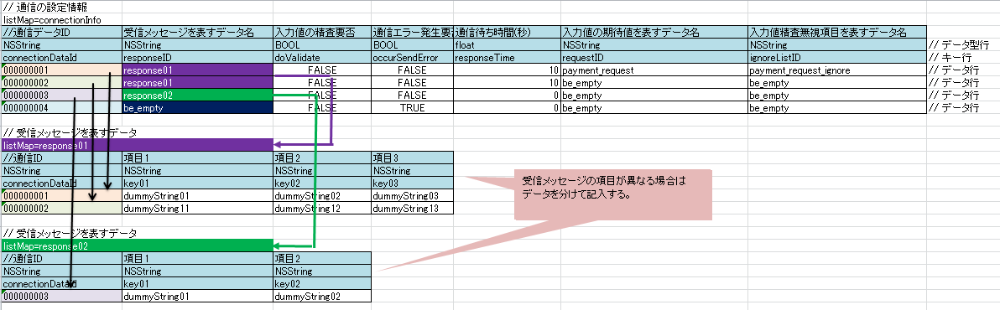
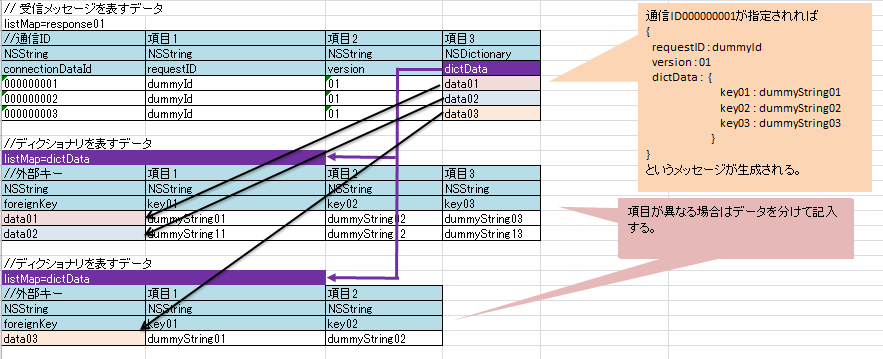

# ユーティリティ

Nablarch Mobileが提供するユーティリティの仕様を解説する。
以下に本章で解説するユーティリティクラスおよびその概要の一覧を記載する。

| クラス名 | 概要 |
|---|---|
| [NMCommonUtil](../../guide/biz-samples/biz-samples-01-Utility.md#nmcommonutil) | 一般ユーティリティの集合クラス |
| [NMConnectionUtil](../../guide/biz-samples/biz-samples-01-Utility.md#nmconnectionutil) | 通信ユーティリティの集合クラス |
| [NMMockUtil](../../guide/biz-samples/biz-samples-01-Utility.md#nmmockutil) | 通信モックユーティリティの集合クラス |

## NMCommonUtil

### 機能一覧

| 機能名 | 概要 |
|---|---|
| クラス生成 | フォーマット通り作成されたディクショナリで指定されたクラスを生成する。 詳細は [newClassFromPropertyList詳解](../../guide/biz-samples/biz-samples-01-Utility.md#newclassfrompropertylist) を参照すること。  propertyList:フォーマット通り作成されたディクショナリ  propertyListで指定されたクラス  例  ```objective-c NSDictionary *propertyList = @{@"class" : @"ClassName",                                @"initializeList" : @{@"proerty1" : @"value1"}}; ClassName *clazz = ((ClassName *)[NMCommonUtil newClassFromPropertyList:propertyList]); ``` |
| プロパティリストの取得 | 引数で指定されたファイル名のプロパティリストからNSDictionaryを生成する。 生成に使用するプロパティリストには NSBundle クラスの pathForResource:ofType: を使用してアクセスする。 このため、プロパティリストファイルは、 pathForResource:ofType: でアクセス可能な箇所に配置する 必要がある。  fileName:プロパティリストファイル名(拡張子を除く)  指定されたプロパティリストと同じ構造をもつNSDictionary  例  ```objective-c NSDictionary *propertyList = [NMCommonUtil getPropertyList:@"fileName"]; ``` |
| プロトコル実装確認 | 指定したクラスが指定したプロトコルを実装しているか確認する。プロトコルを実装していない場合は 例外を発生する。例外を発生させずに、単純にプロトコルが実装されているか調べたい場合は iOS APIで提供されるNSObjectクラスのconformsToProtocolメソッドを使用すること。  prtcl:プロトコル clazz:クラス  例  ```objective-c [NMCommonUtil protocol:@protocol(NMMessageRequester) isImplementedIn:sender]; ``` |

### newClassFromPropertyList詳解

propertyList:フォーマット通り作成されたディクショナリ

propertyListで指定されたクラス

本メソッドではフォーマット通り作成されたディクショナリで指定されたクラスを生成する。
ディクショナリのフォーマットは以下の通り。

| キー | 型 | 概要 |
|---|---|---|
| class | NSString | 生成したいクラス名 |
| initializeList | NSDictionary | 生成したいクラスの初期化時に使用するパラメータ郡 |

initializeListに設定したディクショナリは生成するクラスのinitWithDictionaryメソッドの引数として渡される。 

例

```objective-c
// メソッドの呼び出し側の実装
NSDictionary *propertyList = @{@"class" : @"NMAesEncryption",
                               @"initializeList" : @{@"mode" : @"CBC",
                                                     @"padding" : @"NOTHING"}};
NMAesEncryption *clazz = ((NMAesEncryption *)[NMCommonUtil newClassFromPropertyList:propertyList]);

// 生成したいクラス側の実装
@implementation NMAesEncryption

@synthesize nmMode;
@synthesize nmPaddingType;

- (id)initWithDictionary:(NSDictionary *)dict {
    self = [super init];
    if (self != nil) {
        self.nmMode = dict[@"mode"];
        self.nmPaddingType = dict[@"padding"];
    }
    return self;
}

@end
```

## NMConnectionUtil

### 機能一覧

| 機能名 | 概要 |
|---|---|
| JSONフォーマット | NMMessageオブジェクトをJSON形式の文字列にフォーマットする。  message:変換したいNMMessageオブジェクト error:エラー情報  フォーマットした文字列。エラーが発生した場合はnil。 |
| JSONパース | JSON形式の文字列をNMMessageオブジェクトにパースする。  str:変換したいJSON形式文字列 error:エラー情報  パースしたNMMessageオブジェクト。エラーが発生した場合はnil。 |

## NMMockUtil

本クラスは通信モッククラスで使用されることを前提としており、本クラスを使用するためには通信モック設定ファイルが必要である。

### 機能一覧

| 機能名 | 概要 |
|---|---|
| モック機能の実行 | 通信モックで使用する以下の機能を実行する。  * 入力値の検証(スキップ可能) * 通信フォーマット変換後の入力値のダンプ(スキップ可能) * 受信メッセージの作成 * 通信エラー情報の作成 * 通信待ち時間の発生  message:送信メッセージ error:エラー情報  プロパティconnectionDataIdに設定された値に対応する受信メッセージ。 エラーが発生した場合はnil。  利用例は <a href="../../../../../../app_dev_env/mobile/ios/sample/doc/01_iOS/01_ConnectionFramework/02_MockSample/03_howToImplementationOfMock.html">モックサンプル</a> を参照。 |

### 通信モック設定ファイル

通信モック設定ファイルは以下の設定を行うCSV形式(UTF-8)のファイルである。

* 入力値の検証要否
* 通信エラー発生要否
* 入力値の期待値
* 受信メッセージ
* エラー情報
* 通信待ち時間

#### ファイル内の構造

csvファイルの記述に関する規約について説明を行う。 以下にファイルの記述例を記載する。
※以下全ての例で、分かりやすいようにCSVデータではなくエクセルデータで記載する。


通信モック設定ファイルは複数のデータで構成される。
データには以下の種類がある。

* [通信の設定情報を表すデータ](../../guide/biz-samples/biz-samples-01-Utility.md#connectioninfo)
* [受信メッセージを表すデータ](../../guide/biz-samples/biz-samples-01-Utility.md#responsemessage)
* [入力値の期待値を表すデータ](../../guide/biz-samples/biz-samples-01-Utility.md#validationdata)
* [通信エラー情報を表すデータ](../../guide/biz-samples/biz-samples-01-Utility.md#errordata)
* [ディクショナリを表すデータ](../../guide/biz-samples/biz-samples-01-Utility.md#dictionarydata)
* [配列を表すデータ](../../guide/biz-samples/biz-samples-01-Utility.md#arraydata)

データの種類に依らない共通の書式は以下の通り。

* データ1行目は「listMap=<データ名>」の形式で、データ名を記載する
* データ名を記載した次以降の行にデータ型を記載する
* データ型を記載した次以降の行にKeyを記載する
* Keyを記載した次以降の行に値を記載する
* データ内に空行を含めない
* データとデータの間には1行以上の空行を挿入する
* データの値として「,（コンマ）」および「\r（改行コード）」は使用できない

**データ型**
データ型として指定できるのはNSString, int, float, BOOL, NSNull, NSArray, NSDictionaryのいずれか。
NSArrayまたはNSDictionaryがある場合はそれに対応するデータが必ず存在すること。

**Key**
全てアルファベットで記入すること。空白を含まないこと。

**値**
空文字を指定したい場合は「be_empty」とすること。また、データ型がNSNullの場合も値は「be_empty」とすること。

##### コメント

セル内に”//”から開始する文字列を記載した場合、そのセルから右のセルは全て読み込み対象外となる。
データ自体には含めたくないが、可読性を向上させるために付加情報を記載したい場合には、コメント機能が使用できる。

以下の例では、3行目で各項目の説明を、5行目末尾で各データ行の役割についてコメントしている。

listMap=PLAYER

| NSString | NSString | NSString | NSString |  |
|---|---|---|---|---|
| //番号 | 名 | 姓 | 住所 |  |
| 0001 | Andres | Segovia | Spain | // M01ABに紐づく |
| 0002 | Julian | Bream | England | // M01AAに紐づく |

##### 通信の設定情報を表すデータ

通信モック設定ファイルは必ず1つ以上の通信の設定情報を表すデータを持たなければならない。
通信の設定情報を表すデータの書式は以下の通り。

* データ名は「connectionInfo」固定
* 以下の値を用意する

  | key名 | データ型 | 概要 |
  |---|---|---|
  | connectionDataId | NSString | 通信データID |
  | responseID | NSString | 受信メッセージを表すデータ名   受信メッセージを生成しない場合は「be_empty」を記入 |
  | doValidate | BOOL | 入力値検証要否 |
  | occurSendError | BOOL | 通信エラー発生要否 |
  | responseTime | float | 通信待ち時間 |
  | requestID | NSString | 入力値の期待値を表すデータ名   doValidateの値がFALSEの場合は「be_empty」を記入 |
  | ignoreListID | NSString | 入力値検証無視項目を表すデータ名   occurSendErrorの値がFALSEの場合は「be_empty」を記入 |

本データの通信設定はsendメソッドが呼ばれるごとに読み込まれる。1つのファイルに複数の通信設定を記述可能だが、
sendメソッドで読み込まれる通信設定は1つである。sendメソッドが呼び出された時点で、connectonInfoIdというインスタンス変数
に保存されている値と同名の通信データIDの設定が読み込まれる。

記述例


##### 受信メッセージを表すデータ

受信メッセージを表すデータはNMMessageオブジェクトとしてsendメソッドの戻り値となる。
受信メッセージを表すデータの書式は以下の通り。

* データの1番目のkeyはconnectionDataIdであること

1つのファイルに複数の受信メッセージを記述可能だが、sendメソッドで戻り値となる受信メッセージは1つである。
[通信の設定情報を表すデータ](../../guide/biz-samples/biz-samples-01-Utility.md#connectioninfo) の項目responseIDに対応するデータ名を持ち、connectionDataIdが一致するものが戻り値となる。
ただし、通信エラーが発生する等の理由で戻り値が必要ない場合は本データを作成する必要はない。

記述例



プログラム例

```objective-c
NMMockUtil *mockUtil = [[NMMockUtil alloc] initWithFileName:@"fileName" bodyConvertor:nil];

// 000000002を通信データIDに設定した場合
// @"key01" : @"dummyString11", @"key02" : @"dummyString12", @"key03" : @"dummyString13"
// というデータを保持したメッセージが返される。
mockUtil.connectionDataId = @"000000002"; // 通信データIDの設定
NMMessage *responseMessage = [mockUtil send:message error:error];

// 000000004を通信データIDに設定した場合
// 通信エラーが発生するという設定になっているので、nilが戻り値となる。
mockUtil.connectionDataId = @"000000004"; // 通信データIDの設定
NMMessage *responseMessage = [mockUtil send:message error:error];
```

##### 入力値の期待値を表すデータ

入力値の期待値を表すデータはsendメソッドの引数として渡された送信メッセージの比較に使用される。
入力値の期待値を表すデータの書式は以下の通り。

* データの1番目のkeyはconnectionDataIdであること

[受信メッセージを表すデータ](../../guide/biz-samples/biz-samples-01-Utility.md#responsemessage) と同様に1つのファイルに複数の受信メッセージを記述可能だが、 
sendメソッドで期待値として扱われるデータは1つである。
[通信の設定情報を表すデータ](../../guide/biz-samples/biz-samples-01-Utility.md#connectioninfo) の項目requestIDに対応するデータ名を持ち、connectionDataIdが一致するものが期待値となる。
ただし、[通信の設定情報を表すデータ](../../guide/biz-samples/biz-samples-01-Utility.md#connectioninfo) の項目doValidateがFalseである場合は本データを作成する必要はない。

記述例


プログラム例

```objective-c
NMMockUtil *mockUtil = [[NMMockUtil alloc] initWithFileName:@"fileName" bodyConvertor:nil];

// 送信メッセージの作成
NSDictionary *dict1 = @{@"key01" : @"dummyStirng11", @"key02" : @"dummyString12", @"key03" : @"dummyString13"};
NMMessage *sendMessage = [[NMMessage alloc] initWithDictionary:dict];

// 000000002を通信データIDに設定した場合
// ファイルに記入した期待値とsendMessageが一致するので検証成功となる。
mockUtil.connectionDataId = @"000000002"; // 通信データIDの設定
NMMessage *responseMessage = [mockUtil send:sendMessage error:error];

// 000000001を通信データIDに設定した場合
// ファイルに記入した期待値とsendMessageが一致しないので、検証失敗となり例外が発生する。
mockUtil.connectionDataId = @"000000001"; // 通信データIDの設定
NMMessage *responseMessage = [mockUtil send:sendMessage error:error];
```

**検証無視項目の設定**

日時や登録者IDなど、実行するたびに入力値が変わってしまうような項目に対して、検証を行わないように設定できる。
入力検証無視リストの書式は以下の通り。

* データの1番目のkeyはforeignKeyであり、値は"const"であること。

入力検証無視リストは [通信の設定情報を表すデータ](../../guide/biz-samples/biz-samples-01-Utility.md#connectioninfo) の項目ignoreListIDに対応するデータ名を持つデータが読み込まれる。

記述例


上記の例の場合、送信メッセージのkey02およびkey03に期待値と異なる値が入っていたとしても、検証は失敗しない。

##### 通信エラー情報を表すデータ

通信エラー情報を表すデータはエラー情報としてsendメソッドのerror引数に設定される。
通信エラー情報を表すデータの書式は以下の通り。

* データ名は「error」固定
* 以下の値を用意する

| key | データ型 | 概要 |
|---|---|---|
| connectionDataId | NSString | 通信データID |
| code | int | エラーコード |
| domain | NSString | エラードメイン |
| NSLocalizedDescriptionKey | NSString | userInfoのキーNSLocalizedDescriptionKeyに設定する値 |
| NSFilePathErrorKey | NSString | userInfoのキーNSFilePathErrorKeyに設定する値 |
| NSStringEncodingErrorKey | NSString | userInfoのキーNSStringEncodingErrorKeyに設定する値 |
| NSUnderlyingErrorKey | NSString | userInfoのキーNSUnderlyingErrorKeyに設定する値 |
| NSURLErrorKey | NSString | userInfoのキーNSURLErrorKeyに設定する値 |
| NSLocalizedFailureReasonErrorKey | NSString | userInfoのキーNSLocalizedFailureReasonErrorKeyに設定する値 |
| NSLocalizedRecoverySuggestionErrorKey | NSString | userInfoのキーNSLocalizedRecoverySuggestionErrorKeyに設定する値 |
| NSLocalizedRecoveryOptionsErrorKey | NSString | userInfoのキーNSLocalizedRecoveryOptionsErrorKeyに設定する値 |
| NSRecoveryAttempterErrorKey | NSString | userInfoのキーNSRecoveryAttempterErrorKeyに設定する値 |
| NSHelpAnchorErrorKey | NSString | userInfoのキーNSHelpAnchorErrorKeyに設定する値 |
| NSURLErrorFailingURLErrorKey | NSString | userInfoのキーNSURLErrorFailingURLErrorKeyに設定する値 |
| NSURLErrorFailingURLStringErrorKey | NSString | userInfoのキーNSURLErrorFailingURLStringErrorKeyに設定する値 |
| NSURLErrorFailingURLPeerTrustErrorKey | NSString | userInfoのキーNSURLErrorFailingURLPeerTrustErrorKeyに設定する値 |

NSLocalizedDescriptionKey～NSURLErrorFailingURLPeerTrustErrorKeyが必要ない場合はデータ内に記述しなくてもよい。

1つのファイルに複数のエラー情報を記述可能だが、sendメソッドで使用されるエラー情報は1つである。
sendメソッドが呼び出された時点で、connectonInfoIdというインスタンス変数に保存されている値と同名の通信データIDのエラー情報が読み込まれる。
ただし、[通信の設定情報を表すデータ](../../guide/biz-samples/biz-samples-01-Utility.md#connectioninfo) の項目occurSendErrorがFalseである場合は本データを作成する必要はない。

##### ディクショナリを表すデータ

ディクショナリを表すデータはデータの型がNSDictionaryであるものの内容を表すデータである。
ディクショナリを表すデータの書式は以下の通り。

* データの1番目のkeyはforeignKeyであること

データ内にNSDictonary型の値がある場合、key名とデータ名が一致し、値とforeignKeyの値が一致する
ディクショナリを表すデータが読み込まれる。

記述例



##### 配列を表すデータ

配列を表すデータはデータの型がNSArrayであるものの内容を表すデータである。
配列を表すデータの書式は以下の通り。

* データの1番目のkeyはforeignKeyであること

データ内にNSArray型の値がある場合、key名とデータ名が一致し、値とforeignKeyの値が一致する
配列を表すデータが読み込まれる。

記述例


### 通信モッククラスに要求される処理

NMMockUtilを用いて通信モッククラスを作成する場合、通信モッククラスで行わなければならない処理は以下の通りである。

1. 使用するモックファイルの指定
2. 使用する通信データIDの指定
3. モックユーティリティのsendメソッドの呼び出し
