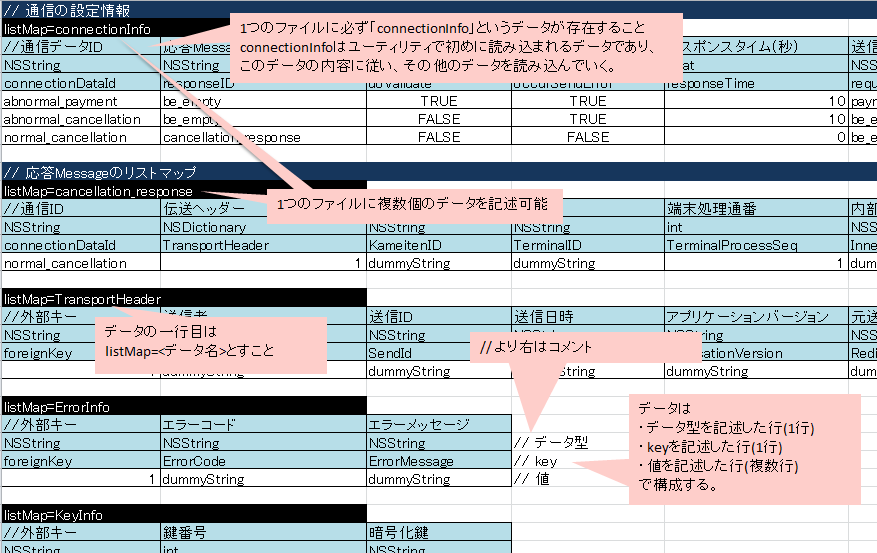
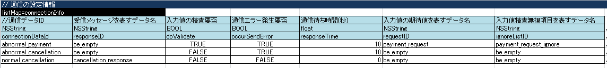
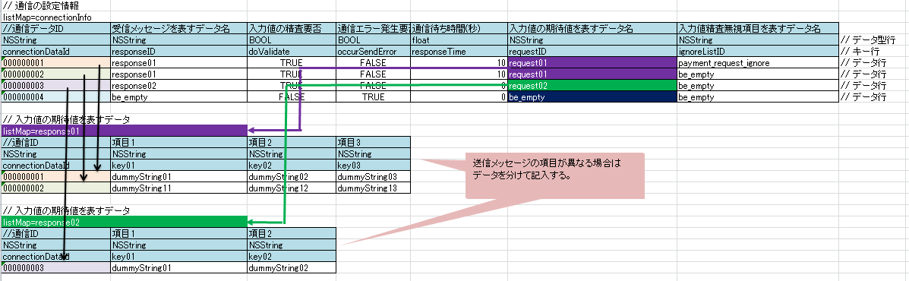
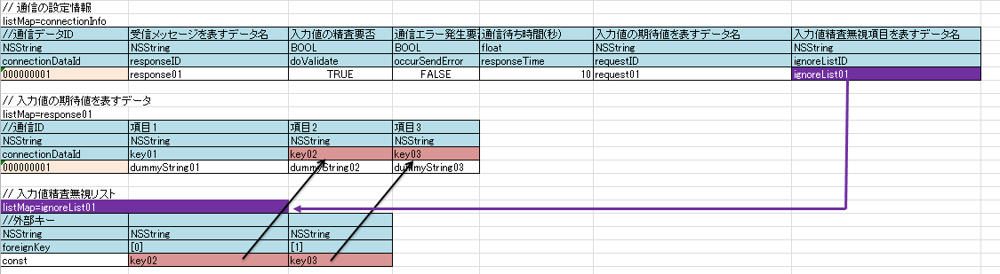
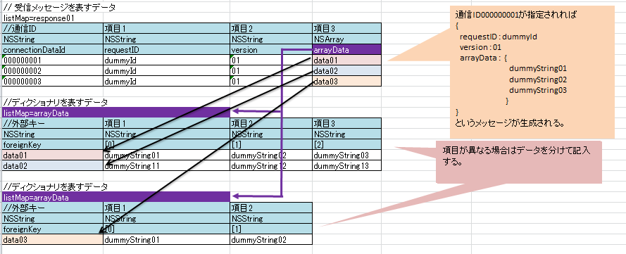

# ユーティリティ

## ユーティリティ概要

Nablarch Mobileが提供するユーティリティクラス。

| クラス名 | 概要 |
|---|---|
| `NMCommonUtil` | 一般ユーティリティの集合クラス |
| `NMConnectionUtil` | 通信ユーティリティの集合クラス |
| `NMMockUtil` | 通信モックユーティリティの集合クラス |

**クラス**: `NMMockUtil`

通信モック機能を実行するクラス。使用するには通信モック設定ファイル（CSV形式、UTF-8）が必要。

**sendメソッド**:
```
- (NMMessage *)send:(NMMessage *)message error:(NSError **)error
```
- 引数: message（送信メッセージ）、error（エラー情報）
- 戻り値: `connectionDataId`に対応する受信メッセージ。エラー発生時はnil

**sendメソッドが実行する機能**:
- 入力値の検証（スキップ可能）
- 通信フォーマット変換後の入力値のダンプ（スキップ可能）
- 受信メッセージの作成
- 通信エラー情報の作成
- 通信待ち時間の発生

**通信モッククラスの必須処理**:
1. 使用するモックファイルの指定
2. 使用する通信データIDの指定
3. `send`メソッドの呼び出し

<details>
<summary>keywords</summary>

NMCommonUtil, NMConnectionUtil, NMMockUtil, ユーティリティクラス一覧, Nablarch Mobile, NMMessage, 通信モック, sendメソッド, initWithFileName, connectionDataId, モックファイル

</details>

## NMCommonUtil

**クラス**: `NMCommonUtil`

### クラス生成

`+ (id)newClassFromProperty:(NSDictionary *)propertyList`

- param: propertyList — フォーマット通り作成されたディクショナリ
- return: propertyListで指定されたクラス

詳細はnewClassFromPropertyList詳解を参照すること。

```objective-c
NSDictionary *propertyList = @{@"class" : @"ClassName", 
                               @"initializeList" : @{@"proerty1" : @"value1"}};
ClassName *clazz = ((ClassName *)[NMCommonUtil newClassFromPropertyList:propertyList]);
```

### プロパティリストの取得

`+ (NSDictionary *)getPropertyList:(NSString *)fileName`

- param: fileName — プロパティリストファイル名(拡張子を除く)
- return: 指定されたプロパティリストと同じ構造をもつNSDictionary

> **注意**: プロパティリストファイルはNSBundleクラスの`pathForResource:ofType:`でアクセス可能な箇所に配置する必要がある。

```objective-c
NSDictionary *propertyList = [NMCommonUtil getPropertyList:@"fileName"];
```

### プロトコル実装確認

`+ (void)protocol:(Protocol *)prtcl isImplementedIn:(id)clazz`

- param: prtcl — プロトコル
- param: clazz — クラス

プロトコルを実装していない場合は例外を発生する。単純にプロトコル実装を確認したい場合はNSObjectクラスの`conformsToProtocol`メソッドを使用すること。

```objective-c
[NMCommonUtil protocol:@protocol(NMMessageRequester) isImplementedIn:sender];
```

通信モック設定ファイルはCSV形式（UTF-8）のファイル。設定項目: 入力値の検証要否、通信エラー発生要否、入力値の期待値、受信メッセージ、エラー情報、通信待ち時間。

## ファイル内の構造

通信モック設定ファイルは複数のデータで構成される。データの種類: connectionInfo、responseMessage、validationData、errorData、dictionaryData、arrayData。



**データの共通書式**:
- データ1行目: `listMap=<データ名>`形式でデータ名を記載
- データ名→データ型→Key→値の順で記載
- データ内に空行を含めない
- データ間には1行以上の空行を挿入
- 値として`,`（コンマ）および`\r`（改行コード）は使用不可
- データ型: `NSString`, `int`, `float`, `BOOL`, `NSNull`, `NSArray`, `NSDictionary` のいずれか
- `NSArray`または`NSDictionary`がある場合は対応するデータが必ず存在すること
- Keyは全てアルファベット、空白なし
- 空文字を指定する場合は「be_empty」と記入。`NSNull`型の値も「be_empty」

## コメント

セルに`//`から開始する文字列を記載すると、そのセルから右のセルは全て読み込み対象外になる。データ自体には含めたくないが可読性向上のために付加情報を記載したい場合に使用する。

<details>
<summary>keywords</summary>

NMCommonUtil, newClassFromProperty, getPropertyList, protocol:isImplementedIn:, クラス生成, プロパティリスト取得, プロトコル実装確認, NMMessageRequester, 通信モック設定ファイル, CSV, listMap, be_empty, NSString, NSNull, NSArray, NSDictionary, BOOL, int, float, コメント, モック設定ファイル

</details>

## newClassFromPropertyList詳解

`+ (id)newClassFromProperty:(NSDictionary *)propertyList`

ディクショナリのフォーマット:

| キー | 型 | 概要 |
|---|---|---|
| class | NSString | 生成したいクラス名 |
| initializeList | NSDictionary | 生成したいクラスの初期化時に使用するパラメータ群 |

`initializeList`に設定したディクショナリは、生成するクラスの`initWithDictionary:`メソッドの引数として渡される。

```objective-c
// 呼び出し側
NSDictionary *propertyList = @{@"class" : @"NMAesEncryption", 
                               @"initializeList" : @{@"mode" : @"CBC",
                                                     @"padding" : @"NOTHING"}};
NMAesEncryption *clazz = ((NMAesEncryption *)[NMCommonUtil newClassFromPropertyList:propertyList]);

// 生成するクラス側
@implementation NMAesEncryption

@synthesize nmMode;
@synthesize nmPaddingType;

- (id)initWithDictionary:(NSDictionary *)dict {
    self = [super init];
    if (self != nil) {
        self.nmMode = dict[@"mode"];
        self.nmPaddingType = dict[@"padding"];
    }
    return self;
}

@end
```

## connectionInfo（通信の設定情報）

- データ名は「connectionInfo」固定
- ファイルに必ず1つ以上存在すること
- `send`メソッドが呼ばれるごとに`connectonInfoId`というインスタンス変数に保存されている値と同名の通信データIDの設定が読み込まれる

| key名 | データ型 | 概要 |
|---|---|---|
| connectionDataId | NSString | 通信データID |
| responseID | NSString | 受信メッセージを表すデータ名。受信メッセージを生成しない場合は「be_empty」 |
| doValidate | BOOL | 入力値検証要否 |
| occurSendError | BOOL | 通信エラー発生要否 |
| responseTime | float | 通信待ち時間 |
| requestID | NSString | 入力値の期待値を表すデータ名。doValidateがFALSEの場合は「be_empty」 |
| ignoreListID | NSString | 入力値検証無視項目を表すデータ名。occurSendErrorがFALSEの場合は「be_empty」 |



<details>
<summary>keywords</summary>

newClassFromPropertyList, initWithDictionary, クラス動的生成, ディクショナリフォーマット, NMCommonUtil, NMAesEncryption, connectionInfo, connectionDataId, connectonInfoId, responseID, doValidate, occurSendError, responseTime, requestID, ignoreListID

</details>

## NMConnectionUtil

**クラス**: `NMConnectionUtil`

### JSONフォーマット

`- (NSString *)convertMessageIntoJsonString:(NMMessage *)message error:(NSError **)error`

- param: message — 変換したいNMMessageオブジェクト
- param: error — エラー情報
- return: フォーマットした文字列。エラーが発生した場合はnil。

### JSONパース

`- (NMMessage *)convertJsonStringIntoMessage:(NSString *)str error:(NSError **)error`

- param: str — 変換したいJSON形式文字列
- param: error — エラー情報
- return: パースしたNMMessageオブジェクト。エラーが発生した場合はnil。

## responseMessage（受信メッセージ）

- データの1番目のkeyは`connectionDataId`であること
- `send`メソッドの戻り値となる`NMMessage`オブジェクト
- `connectionInfo`の`responseID`と一致するデータ名かつ`connectionDataId`が一致するものが戻り値
- 通信エラー発生時など戻り値不要の場合は省略可


```objective-c
NMMockUtil *mockUtil = [[NMMockUtil alloc] initWithFileName:@"fileName" bodyConvertor:nil];
// 000000002を通信データIDに設定した場合
// @"key01":@"dummyString11", @"key02":@"dummyString12", @"key03":@"dummyString13" を保持したメッセージが返される
mockUtil.connectionDataId = @"000000002";
NMMessage *responseMessage = [mockUtil send:message error:error];
// 000000004を通信データIDに設定した場合: 通信エラー設定のためnilが返される
mockUtil.connectionDataId = @"000000004";
NMMessage *responseMessage = [mockUtil send:message error:error];
```

<details>
<summary>keywords</summary>

NMConnectionUtil, convertMessageIntoJsonString:error:, convertJsonStringIntoMessage:error:, JSONフォーマット, JSONパース, NMMessage, responseMessage, connectionDataId, responseID, initWithFileName

</details>

## NMMockUtil

**クラス**: `NMMockUtil`

通信モックユーティリティの集合クラス。

## validationData（入力値の期待値）

- データの1番目のkeyは`connectionDataId`であること
- `send`メソッドの引数（送信メッセージ）との比較に使用
- `connectionInfo`の`requestID`と一致するデータ名かつ`connectionDataId`が一致するものが期待値として使用される
- `connectionInfo`の`doValidate`がFALSEの場合は省略可
- 期待値と不一致の場合、例外が発生する



```objective-c
NMMockUtil *mockUtil = [[NMMockUtil alloc] initWithFileName:@"fileName" bodyConvertor:nil];

// 送信メッセージの作成
NSDictionary *dict1 = @{@"key01" : @"dummyStirng11", @"key02" : @"dummyString12", @"key03" : @"dummyString13"};
NMMessage *sendMessage = [[NMMessage alloc] initWithDictionary:dict];

// 000000002を通信データIDに設定した場合
// ファイルに記入した期待値とsendMessageが一致するので検証成功となる。
mockUtil.connectionDataId = @"000000002";
NMMessage *responseMessage = [mockUtil send:sendMessage error:error];

// 000000001を通信データIDに設定した場合
// ファイルに記入した期待値とsendMessageが一致しないので、検証失敗となり例外が発生する。
mockUtil.connectionDataId = @"000000001";
NMMessage *responseMessage = [mockUtil send:sendMessage error:error];
```

**検証無視項目の設定**:
- データの1番目のkeyは`foreignKey`で、値は「const」であること
- `connectionInfo`の`ignoreListID`に対応するデータが読み込まれる
- 指定したキーの入力値が期待値と異なっても検証失敗にならない
- 日時や登録者IDなど実行のたびに値が変わる項目に使用する



<details>
<summary>keywords</summary>

NMMockUtil, 通信モックユーティリティ, モック通信, validationData, 入力値検証, initWithDictionary, NMMessage, connectionDataId, foreignKey, ignoreList, 検証無視項目, requestID, doValidate

</details>

## errorData（通信エラー情報）

## errorData（通信エラー情報）

- データ名は「error」固定
- `send`メソッドのerror引数に設定される
- `send`メソッドが呼び出された時点で、`connectonInfoId`というインスタンス変数に保存されている値と同名の通信データIDのエラー情報が読み込まれる
- `connectionInfo`の`occurSendError`がFALSEの場合は省略可

| key | データ型 | 概要 |
|---|---|---|
| connectionDataId | NSString | 通信データID |
| code | int | エラーコード |
| domain | NSString | エラードメイン |
| NSLocalizedDescriptionKey | NSString | userInfoのNSLocalizedDescriptionKey値 |
| NSFilePathErrorKey | NSString | userInfoのNSFilePathErrorKey値 |
| NSStringEncodingErrorKey | NSString | userInfoのNSStringEncodingErrorKey値 |
| NSUnderlyingErrorKey | NSString | userInfoのNSUnderlyingErrorKey値 |
| NSURLErrorKey | NSString | userInfoのNSURLErrorKey値 |
| NSLocalizedFailureReasonErrorKey | NSString | userInfoのNSLocalizedFailureReasonErrorKey値 |
| NSLocalizedRecoverySuggestionErrorKey | NSString | userInfoのNSLocalizedRecoverySuggestionErrorKey値 |
| NSLocalizedRecoveryOptionsErrorKey | NSString | userInfoのNSLocalizedRecoveryOptionsErrorKey値 |
| NSRecoveryAttempterErrorKey | NSString | userInfoのNSRecoveryAttempterErrorKey値 |
| NSHelpAnchorErrorKey | NSString | userInfoのNSHelpAnchorErrorKey値 |
| NSURLErrorFailingURLErrorKey | NSString | userInfoのNSURLErrorFailingURLErrorKey値 |
| NSURLErrorFailingURLStringErrorKey | NSString | userInfoのNSURLErrorFailingURLStringErrorKey値 |
| NSURLErrorFailingURLPeerTrustErrorKey | NSString | userInfoのNSURLErrorFailingURLPeerTrustErrorKey値 |

NSLocalizedDescriptionKey〜NSURLErrorFailingURLPeerTrustErrorKeyは不要な場合は省略可。

<details>
<summary>keywords</summary>

errorData, 通信エラー情報, connectionDataId, connectonInfoId, NSLocalizedDescriptionKey, NSError, occurSendError, エラーコード, エラードメイン

</details>

## dictionaryData・arrayData

## dictionaryData（ディクショナリ）

- データの1番目のkeyは`foreignKey`であること
- `NSDictionary`型の値に対応するデータ
- key名とデータ名が一致し、値とforeignKeyの値が一致するデータが読み込まれる


## arrayData（配列）

- データの1番目のkeyは`foreignKey`であること
- `NSArray`型の値に対応するデータ
- key名とデータ名が一致し、値とforeignKeyの値が一致するデータが読み込まれる



<details>
<summary>keywords</summary>

dictionaryData, arrayData, NSDictionary, NSArray, foreignKey

</details>
