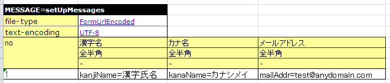

# データフォーマッタの拡張

## 

なし

<details>
<summary>keywords</summary>

データフォーマッタ, カスタムフォーマッタ, フォーマッタ拡張

</details>

## 概要

JSON形式・XML形式など、Nablarch標準以外のフォーマッタが必要な場合、データフォーマッタを追加することで対応できる。

<details>
<summary>keywords</summary>

データフォーマッタ追加, カスタムフォーマッタ, フォーマッタ拡張, application/x-www-form-urlencoded

</details>

## 提供パッケージ

本機能が提供されるパッケージ:
- `please.change.me.core.dataformat`
- `please.change.me.core.dataformat.convertor`
- `please.change.me.test.core.file`

<details>
<summary>keywords</summary>

提供パッケージ, please.change.me.core.dataformat, FormUrlEncoded, コアパッケージ

</details>

## FormUrlEncodedデータフォーマッタの構成

application/x-www-form-urlencodedデータ（`name1=value1&name2=value2`形式）を取り扱う。同一キーで複数値も扱える。

**制約**:
- 値はURLエンコードされる
- キーはURLエンコードされない。キー文字列に特殊文字は使用不可

**クラス一覧**:

| クラス名 | パッケージ | 概要 |
|---|---|---|
| `FormUrlEncodedDataFormatterFactory` | `please.change.me.core.dataformat` | フォーマッタファクトリクラス。`createFormatter(String fileType, String formatFilePath)`をオーバーライドし、`FormUrlEncodedDataRecordFormatter`のインスタンスを生成 |
| `FormUrlEncodedDataRecordFormatter` | `please.change.me.core.dataformat` | フォーマッタクラス。読み込み時はパラメータの出現順を意識しない。書き込み時はフォーマット定義順でパラメータを出力 |
| `FormUrlEncodedDataConvertorFactory` | `please.change.me.core.dataformat.convertor` | コンバータファクトリクラス。デフォルトのコンバータ名とコンバータ実装クラスの対応表を保持 |
| `FormUrlEncodedDataConvertorSetting` | `please.change.me.core.dataformat.convertor` | コンバータ設定クラス。コンバータ名と実装クラスの対応表をDIコンテナから設定 |
| `FormUrlEncodedTestDataConverter` | `please.change.me.test.core.file` | テストデータコンバータクラス。Key=Value形式のテストデータを解析し、Value部を動的にURLエンコード |

<details>
<summary>keywords</summary>

FormUrlEncodedDataFormatterFactory, FormUrlEncodedDataRecordFormatter, FormUrlEncodedDataConvertorFactory, FormUrlEncodedDataConvertorSetting, FormUrlEncodedTestDataConverter, application/x-www-form-urlencoded, URLエンコード, クラス構成

</details>

## 使用方法

なし

<details>
<summary>keywords</summary>

FormUrlEncoded, 使用方法, フォーマッタ設定

</details>

## FormUrlEncodedデータフォーマッタの使用方法

業務アプリケーションでFormUrlEncodedフォーマッタを使用する場合、コンポーネント設定ファイルに以下を追加する:

```xml
<component name="formatterFactory" class="please.change.me.core.dataformat.FormUrlEncodedDataFormatterFactory"/>
```

<details>
<summary>keywords</summary>

FormUrlEncodedDataFormatterFactory, formatterFactory, コンポーネント設定, フォーマッタファクトリ登録

</details>

## フォーマット定義ファイルの記述例

```
#
# ディレクティブ定義部
#
file-type:     "FormUrlEncoded"  # フォームURLエンコード形式ファイル
text-encoding: "UTF-8"  # 文字列型フィールドの文字エンコーディング

#
# データレコード定義部
#
[data]
1    key1   X      # 項目1
2    key2   X      # 項目2
```

<details>
<summary>keywords</summary>

フォーマット定義ファイル, file-type, FormUrlEncoded, text-encoding, データレコード定義

</details>

## フィールドタイプ・フィールドコンバータ定義一覧

**フィールドタイプ**:

| タイプ識別子 | Java型 | 内容 |
|---|---|---|
| X、N、XN、X9、SX9 | String | 全フィールドをStringとして読み書き。どのタイプ識別子を指定しても動作は変わらない。フィールド長の概念がないため引数不要 |

> **注意**: Number型（BigDecimalなど）を読み書きする場合はnumber/signed_numberコンバータを使用すること。

**フィールドコンバータ**:

| コンバータ名 | Java型（変換前後） | 内容 |
|---|---|---|
| リテラル値 | Object <-> Object | 入力時: なにもしない。出力時: 出力値が未設定の場合に指定リテラル値を出力。デフォルト実装: `nablarch.core.dataformat.convertor.value.DefaultValue`。引数: なし |
| number | String <-> BigDecimal | 入力時: 符号なし数値チェック後BigDecimalに変換。null/空文字の場合はnullを返却。出力時: 文字列変換後符号なし数値チェック。nullの場合は空文字を出力。デフォルト実装: `nablarch.core.dataformat.convertor.value.NumberString`。引数: なし |
| signed_number | String <-> BigDecimal | 符号が許可される点以外はnumberと同じ仕様。デフォルト実装: `nablarch.core.dataformat.convertor.value.SignedNumberString`。引数: なし |

<details>
<summary>keywords</summary>

フィールドタイプ, フィールドコンバータ, number, signed_number, nablarch.core.dataformat.convertor.value.NumberString, nablarch.core.dataformat.convertor.value.SignedNumberString, nablarch.core.dataformat.convertor.value.DefaultValue, BigDecimal変換

</details>

## 同一キーで複数の値を取り扱う場合

同一キーで複数の値を取り扱う場合:
- データはString配列形式で保持される
- フォーマット定義ファイルで多重度を設定する必要がある

<details>
<summary>keywords</summary>

同一キー複数値, String配列, 多重度, 複数値パラメータ

</details>

## テストデータの記述方法

URLエンコーディングされたデータをExcelファイルに直接記述することは可読性・保守性・作業効率の面で非現実的なため、テストデータコンバータを使用する。

**コンポーネント設定ファイルへの追加**:

```xml
<!-- テストデータコンバータ定義 -->
<component name="TestDataConverter_FormUrlEncoded"
           class="please.change.me.test.core.file.FormUrlEncodedTestDataConverter"/>
```

**Excelファイル**:

file-typeに`"FormUrlEncoded"`を指定し、テストデータとして項目ごとにKey=Value形式で記述する。



テストフレームワークにより`FormUrlEncodedTestDataConverter`が呼び出され、以下のようなデータに変換されてフォーマッタに入力される:

```
kanjiName=%E6%BC%A2%E5%AD%97%E6%B0%8F%E5%90%8D&kanaName=%E3%82%AB%E3%83%8A%E3%82%B7%E3%83%A1%E3%82%A4&mailAddr=test%40anydomain.com
```

<details>
<summary>keywords</summary>

テストデータ, URLエンコーディング, FormUrlEncodedTestDataConverter, テストデータコンバータ, TestDataConverter_FormUrlEncoded, Excelテストデータ

</details>
