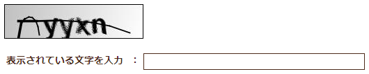
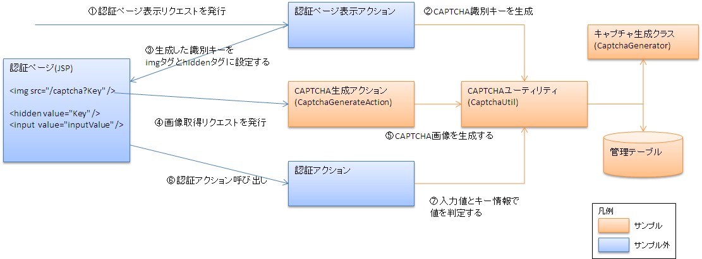
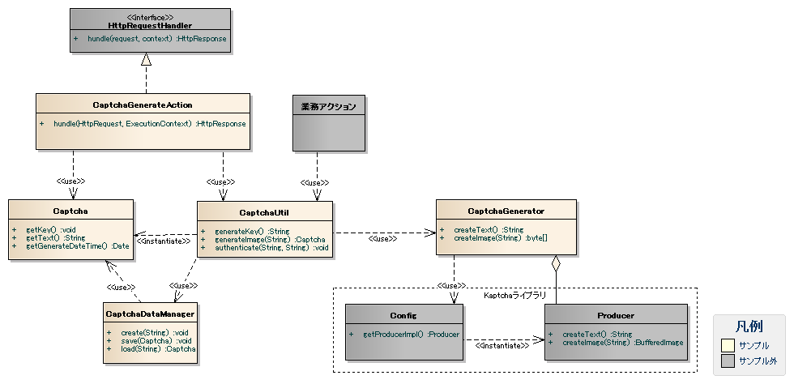

# CAPTCHA機能サンプル

本サンプルは、Webアプリケーションにおけるセキュリティ対策のひとつである、CAPTCHAによる認証機能の実装サンプルである。

## 提供パッケージ

本サンプルは、以下のパッケージで提供される。

*please.change.me.* **common.captcha**

## 概要

CAPTCHA認証とは、応答者がコンピュータでないことを確認するために使われる認証方式である。

本サンプルでは業務処理の中で認証用の画像を生成し、画像に描かれている文字列をユーザに入力させ、入力文字列と画像内の文字列を比較することで認証を行う。

一般的にCAPTCHA認証処理は、ログイン前に使用されることが多い。
かつ、CAPTCHA認証処理の実装ライブラリではセッション情報に生成文字列を保持し、入力文字列との比較を行うことが多い。
しかし、Nablarchではセッション情報は原則ログイン後に生成されるため、使用することが出来ない。
そのため、本サンプルでは入力文字列と生成文字列のひも付け方式としてデータベース上の管理テーブルを使用する。

管理テーブルにはCAPTCHA情報を生成するたびに生成した情報を蓄積していくため、肥大化する。
そのため、別途管理テーブルのメンテナンスを行うバッチの作成等を検討する必要がある。

本サンプルを使用し、出力されるCAPTCHA情報のサンプルを以下に示す。



なお、本サンプルではCAPTCHA画像の生成に、オープンソースライブラリの「kaptcha [1] 」を使用している。

kaptchaについての詳細は、kaptchaのサイト( [https://code.google.com/p/kaptcha/](https://code.google.com/p/kaptcha/) )を参照

## 構成

本サンプルの構成を示す。

CAPTCHA情報の取得および認証は以下の手順で行われる。



以下に業務画面側で行う処理(本サンプル外)および本サンプルが行う処理について解説する。

### 業務画面側で行う処理

CAPTCHA認証を行う際、業務画面側で必要な処理を下記に示す。

#### 認証ページ表示時

* 認証ページ表示アクション内で CaptchaUtil#generateKey を使用し、識別キーを取得する。

#### 認証画像取得時

* 認証ページ内で、CaptchaGenerateActionに対しHTTPリクエスト(GET)を発行し、認証用の画像取得する。

  この時、リクエストパラメータとして認証ページ表示時に取得した識別キーを指定する必要がある。
  リクエストパラメータ名は `captchaKey` で固定となっている。
  リクエストパラメータ名を変更する場合はソースコードを修正すること。

#### 認証アクション実行時

* 認証ページにて、入力文字列とともに表示時に取得した識別キーを送信(POST)する。
* 業務アクション内で CaptchaUtil#authenticate を使用し、認証を行う。

### 本サンプルが行う処理

CAPTCHA認証を行う際、本サンプルが行う処理を下記に示す。

#### 認証ページ表示時

* CAPTCHA情報のうち識別キーを生成し、データベースにレコードを作成する。

#### 認証画像取得時

* 識別キーからCAPTCHA情報（画像および画像に記載されている文字列）を生成し、データベース上のレコードを更新する。
* 生成したCAPTCHA情報のうち、認証用画像を呼び出し元に返却する。

  この時、リクエストパラメータとして認証ページ表示時に取得した識別キーが指定されている必要がある。
  リクエストパラメータ名は `captchaKey` で固定となっている。
  リクエストパラメータ名を変更する場合はソースコードを修正すること。

  また、指定した識別キーの不正により画像生成が失敗した場合には、
  HTTPステータス400および空のボディを持つレスポンスが返却される。

#### 認証アクション実行時

* 業務アクションより渡された識別キーを使用して、データベースからCAPTCHA情報を取得する。
* 取得した情報と入力された文字列を比較し、結果を呼び出し元に返却する。

### クラス図



#### 各クラスの責務

##### クラス定義

a) ユーティリティクラス

| クラス名 | 概要 |
|---|---|
| CaptchaGenerator | 「kaptcha [1] 」を使用してCAPTCHA情報の生成を行うクラス。 |
| CaptchaUtil | CaptchaGenerateActionから呼び出され、リポジトリから取得したCaptchaGeneratorを使用してCAPTCHA情報の生成を行う。  また、業務アクションから呼び出され、生成されたCAPTCHA情報と入力文字列との比較を行う。 |

b) アクションクラス

| クラス名 | 概要 |
|---|---|
| CaptchaGenerateAction | CAPTCHA情報を生成し、返却するアクションクラス。 生成されたCAPTCHA情報はリクエストパラメータで指定された識別キーでDBに保存される。 |

c) その他のクラス

| クラス名 | 概要 |
|---|---|
| Captcha | 生成したCAPTCHA情報を保持するクラス。 |
| CaptchaDataManager | 生成したCAPTCHA情報のデータベースへの保存および読み込みを行うクラス。 |

##### テーブル定義

本サンプルで使用しているCAPTCHA管理テーブルの定義を以下に示す。

**CAPTCHA管理(CAPTCHA_MANAGE)**

CAPTCHA管理テーブルには、生成したCAPTCHA情報のうち、キーおよび生成文字列を格納する。
画像情報は判定には使用しないため、格納しない。

| 論理名 | 物理名 | Javaの型 | 制約 |
|---|---|---|---|
| 識別キー | CAPTCHA_KEY | java.lang.String | 主キー |
| CAPTCHA文字列 | CAPTCHA_TEXT | java.lang.String |  |
| 生成日時 | GENERATE_DATE_TIME | java.sql.Timestamp |  |

> **Note:**
> 上記テーブル定義には、本サンプルで必要となる属性のみを列挙している。
> Nablarch導入プロジェクトでは、必要な管理情報を本テーブルに追加するなど、要件を満たすようテーブル設計を行うこと。

## 使用方法

CAPTCHA機能の使用方法について解説する。

### CaptchaUtilの使用方法

CaptchaUtilの使用方法について解説する。

CaptchaUtilでは、以下のユーティリティメソッドを実装している。なお、リポジトリからコンポーネントを取得する際の
コンポーネント名は、後述の [CaptchaGenerateActionの設定方法](../../guide/biz-samples/biz-samples-06-Captcha.md#captchagenerateactionの設定方法) で登録しているそれぞれのコンポーネント名と
あわせる必要があるため、上記の設定例と異なるコンポーネント名で登録している場合にはソースコードを修正すること。

| メソッド |  |
|---|---|
| generateKey | 識別キーを生成し、データベースに保存する。また、生成した識別キーを呼び出し元に返却する。 識別キーの生成には、 java.util.UUIDのrandomUUID を利用している。 重複する可能性は低く実用的に問題ないと考えているが、よりユニークなキーを利用したいなどで、 別の生成方法を利用する場合はソースコードを修正すること。 |
| generateImage | リポジトリから、 captchaGenerator というコンポーネント名で CaptchaGenerator を取得し、 CAPTCHA情報を生成し、データベースに保存する。  本メソッドはCaptchaGenerateActionで使用するため、業務アクションから使用されることはない。 |
| authenticate | 呼び出し元より渡された識別キーを使用して、データベースから先に生成されたCAPTCHA情報を取得する。 取得した情報と入力された文字列を比較し、結果を呼び出し元に返却する。 |

### CaptchaGenerateActionの設定方法

CaptchaGenerateActionの設定方法について解説する。

```xml
<!-- CaptchaGeneratorの設定 -->
<component name="captchaGenerator" class="please.change.me.common.captcha.CaptchaGenerator">
  <property name="imageType" value="jpg"/>
  <property name="configParameters">
    <map>
      <entry name="kaptcha.textproducer.char.string" value="abcdegfynmnpwx" />
      <entry name="kaptcha.textproducer.char.length" value="4" />
    </map>
  </property>
</component>

<!-- CaptchaGenerateActionの設定 -->
<component name="captchaGenerateAction" class="please.change.me.common.captcha.CaptchaGenerateAction"/>

<!-- ハンドラキュー構成 -->
<component name="webFrontController"
            class="nablarch.fw.web.servlet.WebFrontController">
  <property name="handlerQueue">
    <list>

      ～(途中省略)～

      <component class="nablarch.fw.RequestHandlerEntry">
        <property name="requestPattern" value="/action/common/captcha/CaptchaGenerateAction/RW11ZZ0101"/>
        <property name="handler" ref="captchaGenerateAction"/>
      </component>

      ～(途中省略)～

    </list>
  </property>
</component>
```

CaptchaGeneratorコンポーネントに対し、以下のプロパティ設定を行うことで、生成する文字列の内容や画像形式を制御することができる。

| property名 | 設定内容 |
|---|---|
| imageType | 生成する画像の形式を定義する。  指定可能な値は javax.imageio.ImageIO#getWriterFormatNames() で取得できる値である。 ただし、「wbmp」は使用できない。  省略した場合、「jpeg」となる。 |
| configParameters | kaptchaに対する設定値をMap形式で定義する。  具体的に設定可能な値はkaptchaのサイト( [https://code.google.com/p/kaptcha/wiki/ConfigParameters](https://code.google.com/p/kaptcha/wiki/ConfigParameters) )を参照。  省略した場合、全ての設定値がkaptcha内で定められたデフォルト値となる。 |

#### ハンドラの挿入位置や、他のハンドラに対する設定に関する注意事項

CaptchaGenerateActionハンドラはCAPTCHA情報を生成し、HTTPレスポンスを返却するため、後続のハンドラに処理を委譲しない。
上記例のようにRequestHandlerEntryを使用し、リクエストパターンを設定して使用することを想定している。

また、上記例のように/action配下にマッピングし、１つのアクションとして動作させる場合、他のハンドラに対し追加の設定を行ったり、
リクエストの内容を変化させる必要がある。

以下に画面オンライン実行制御基盤の標準ハンドラ構成に含まれる他のハンドラについて考慮すべき点を挙げる。

* データベース接続管理ハンドラおよびトランザクション制御ハンドラ

  CaptchaGenerateActionハンドラはデータベースに管理情報を保存するため、これらのハンドラより後に配置する必要がある。
* Nablarchカスタムタグ制御ハンドラ

  Nablarchカスタムタグ制御ハンドラのhidden暗号化機能により、hidden項目を含まないGETリクエストは改竄エラーと判定される。

  これはCustomTagConfigコンポーネントの、noHiddenEncryptionRequestIdsプロパティに本機能のリクエストIDを設定することで回避することができる。
* 開閉局制御ハンドラ

  アクションとして実装するため、リクエストテーブル上でリクエストIDとサービス稼動状態の設定を行う必要がある。
* 認可制御ハンドラ

  概要で述べたとおり、本機能はログイン前に使用されることが想定されるため、認可チェックハンドラのignoreRequestIdsプロパティに
  本機能のリクエストIDを設定する必要がある。

### CAPTCHA識別キー取得方法

CAPTCHA識別キーを取得するアクションの実装例を以下に示す。

```java
public HttpResponse doRW11ZZ0103(HttpRequest request, ExecutionContext context) {

    String key = CaptchaUtil.generateKey();
    context.setRequestScopedVar("captchaKey", key);

    return new HttpResponse("/ss11ZZ/W11ZZ0103.jsp");
}
```

### CAPTCHA画像の取得方法

CAPTCHA画像を取得するJSPの実装例を以下に示す。

```jsp
<n:form>
  <n:img src="/action/CaptchaImg?captchaKey=${captchaKey}" alt=""/>
  <n:hidden name="${captchaKey}"></n:hidden>
  <field:text title="表示されている文字を入力" name="captchaValue"></field:text>
</n:form>
```

### 入力文字列判定方法

入力文字列の判定はサーバサイドのアクションクラスまたはフォームクラスのバリデーション処理から呼び出すことを想定している。

フォームクラスのバリデーション処理として実装した場合の例を以下に示す。

```java
@ValidateFor("captcha")
public static void validateForCaptcha(ValidationContext<W11ZZ01Form> context) {
    // 単項目精査
    ValidationUtil.validate(context, new String[]{"captchaKey", "captchaValue"});
    if (!context.isValid()) {
        return;
    }

    // CAPTCHA文字列判定
    W11ZZ01Form form = context.createObject();
    if (!CaptchaUtil.authenticate(form.getCaptchaKey(), form.getCaptchaVal())) {
        context.addResultMessage("captchaValue", "MSG90001");
    }
}
```
