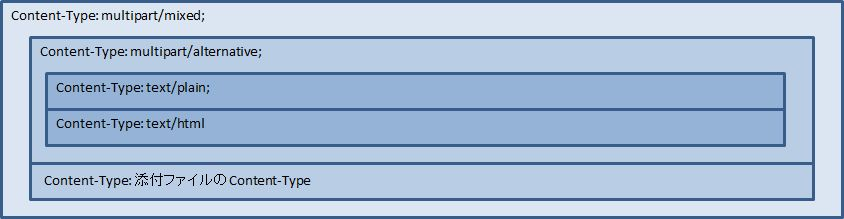
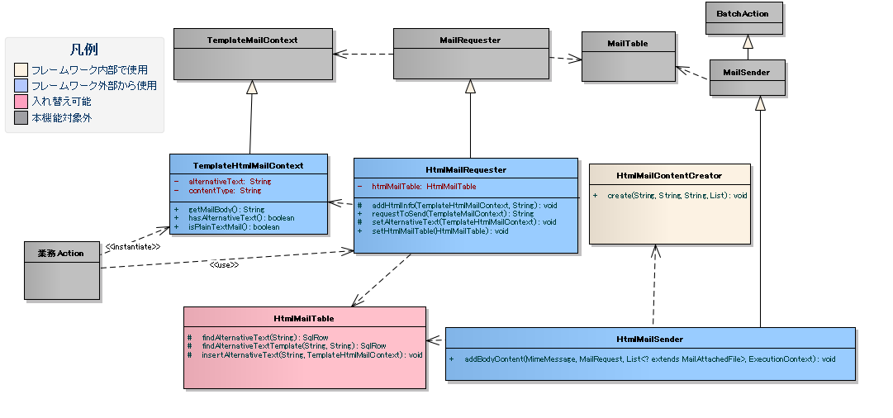

# HTMLメール送信機能サンプル

## 実装済み

> **重要**: 本機能はサンプル実装のため、導入プロジェクトで使用する際には、ソースコード（プロダクション・テストコード共に）をプロジェクトに取り込み、使用すること。

> **警告**: 本サンプルは以下のケースに対応していない。該当する場合はプロダクト利用を推奨する: (1) キャンペーン通知・メールマガジンなど大量メール一括送信、(2) 開封率・クリックカウントの効果測定、(3) クライアント判別（フィーチャーフォン等）による送信切替、(4) 絵文字・デコメール利用、(5) 顧客によるHTMLコンテンツ作成支援（本サンプルにドローツールやコンテンツ作成機能は存在しない）。

> **警告**: 一部クライアントでHTMLメールが期待通り表示されない可能性があるため、ユーザー通知が重要なメールにはHTMLメールを利用しないこと。

> **重要**: メールクライアントにより表示差異があるため、HTMLメール標準を策定し顧客と合意すること。検討点: テスト対象クライアント・デバイス・OS、HTMLタグ・スタイルの使用範囲、フォント・配色、コンテンツ横幅。コンテンツ作成留意点: (1) `<head>`タグを無視するクライアントがあるため、スタイルをCSSファイルや`<style>`タグに切り出すことは**推奨されていない**。(2) 極力シンプルなデザインにすること。(3) メディアクエリ非サポートのクライアントがあるため、レスポンシブデザインは極力採用しないこと。

実装済み要求:
- HTMLメール（代替テキストを含む）を送信できる
- 本文のプレースホルダーのHTMLエスケープを行う（通常のオンライン画面と同様のセキュリティ対策）

<details>
<summary>keywords</summary>

HTMLメール送信, 代替テキスト, HTMLエスケープ, セキュリティ対策, メールクライアント差異, HTMLメール標準, レスポンシブデザイン非推奨, headタグ, サンプル実装, ソースコード取り込み

</details>

## 取り下げ

取り下げとなった要求（本サンプルでは未提供）:

- **メールクライアント毎の差異吸収**: HTMLデザインおよびクライアント選定はPJにて対応するため、本サンプルでは提供しない。
- **HTMLメールへの画像埋め込み**: 画像埋め込みはメール容量増大・受信時間増加・メールサーバー負荷増大の問題があるため提供しない。コンシューマ向けWebサービスではURL形式の使用が多いため、本サンプルでは画像埋め込み機能を提供しない。

<details>
<summary>keywords</summary>

取り下げ要求, メールクライアント差異吸収, 画像埋め込み未提供, 未提供機能

</details>

## メールの形式

HTMLメールはRFC 2557に準拠したContent-Typeで送信する。

| メール形式 | 業務Actionが使用するコンテキストクラス | 添付ファイル | メール構造のパターン |
|---|---|---|---|
| TEXT | `TemplateMailContext` | 無し | 1 |
| TEXT | `TemplateMailContext` | 有り | 2 |
| HTML | `TemplateHtmlMailContext` | 無し | 3 |
| HTML | `TemplateHtmlMailContext` | 有り | 4 |




<details>
<summary>keywords</summary>

TemplateMailContext, TemplateHtmlMailContext, メール形式, TEXT, HTML, 添付ファイル, メール構造パターン, RFC 2557

</details>

## クラス図



各クラスの責務:

| クラス名 | 概要 |
|---|---|
| `please.change.me.common.mail.html.HtmlMailRequester` | `MailRequester`を拡張したHTMLメール送信要求を受け付けるクラス |
| `please.change.me.common.mail.html.TemplateHtmlMailContext` | `TemplateMailContext`を拡張し、HTMLメールに必要な情報を保持するクラス。代替テキストを本文に変換することでHTMLメール用テンプレートを利用したプレーンテキスト送信も実現 |
| `please.change.me.common.mail.html.HtmlMailTable` | HTMLメール用テーブルにアクセスするクラス |
| `please.change.me.common.mail.html.HtmlMailSender` | `MailSender`を拡張したHTMLメール送信サポートクラス。HTML用要求でない場合は親クラスに処理を委譲しプレーンテキスト形式で送信 |
| `please.change.me.common.mail.html.HtmlMailContentCreator` | HTMLメール用コンテンツを生成するクラス |

コンポーネント設定（`mailRequester`に`htmlMailTable`プロパティを追加）:

```xml
<component name="mailRequester" class="please.change.me.common.mail.html.HtmlMailRequester">
    <property name="mailRequestConfig" ref="mailRequestConfig" />
    <property name="mailRequestIdGenerator" ref="mailRequestIdGenerator" />
    <property name="mailRequestTable" ref="mailRequestTable" />
    <property name="mailRecipientTable" ref="mailRecipientTable" />
    <property name="mailAttachedFileTable" ref="mailAttachedFileTable" />
    <property name="mailTemplateTable" ref="mailTemplateTable" />
    <!-- 拡張したテーブルへのアクセス機能を設定する -->
    <property name="htmlMailTable" ref="htmlMailTable" />
</component>

<!--
Nablarchアプリケーションフレームワークのメール送信機能ではスキーマ定義を行うが、
本ライブラリではソースコードを直接修正すれば良いため、設定ファイルでの定義は行わない。
ただし、テーブルアクセスの機能はRequester,Senderで共通のため、コンポーネントの定義を行うこと。
-->
<component name="htmlMailTable" class="please.change.me.common.mail.html.HtmlMailTable" />
```

<details>
<summary>keywords</summary>

HtmlMailRequester, TemplateHtmlMailContext, HtmlMailTable, HtmlMailSender, HtmlMailContentCreator, MailRequester, MailSender, htmlMailTable, クラス構成, コンポーネント設定

</details>

## データモデル

メール機能からの拡張テーブル。HTML用拡張テーブルをメール関連テーブルに関連付けることでTEXT+HTMLメールとして動作する。

> **注意**: 下記データモデルのDDLはテスト資源に含まれている。

**HTMLメール用代替テキストテンプレートテーブル**（HTML用定型メールの代替テキストを管理するメールテンプレートの関連テーブル）:

| 定義 | Javaの型 | 備考 |
|---|---|---|
| メールテンプレートID | `java.lang.String` | PK |
| 言語 | `java.lang.String` | PK |
| 代替テキスト | `java.lang.String` | HTMLメールを表示できないメーラー向けテキスト |

**HTMLメール用代替テキストテーブル**（HTMLメール用の代替テキストを管理するメール送信要求の関連テーブル）:

| 定義 | Javaの型 | 備考 |
|---|---|---|
| メール送信要求ID | `java.lang.String` | PK |
| 代替テキスト | `java.lang.String` | HTMLメールを表示できないメーラー向けテキスト |

<details>
<summary>keywords</summary>

HTMLメール用代替テキストテンプレートテーブル, HTMLメール用代替テキストテーブル, メールテンプレートID, メール送信要求ID, 代替テキスト, 拡張テーブル

</details>

## HTMLメールの送信

本サンプルを利用した実装はNablarchのメール送信機能の定型メール送信と同様。業務アクションで使用するコンテキストクラスが`TemplateMailContext`の代わりに`TemplateHtmlMailContext`になるだけで、実装方法は同一。

<details>
<summary>keywords</summary>

HTMLメール送信実装, 定型メール, TemplateHtmlMailContext, MailRequester

</details>

## コンテンツの動的な切替

`TemplateHtmlMailContext`の`contentType`に`text/plain`を指定した場合、代替テキストを本文に差し替える。

| コンテキストクラス | 指定Type | 本文への移送元 | Content-Type |
|---|---|---|---|
| `TemplateMailContext` | — | メールテンプレート.本文 | `text/plain` |
| `TemplateHtmlMailContext` | `text/plain` | 代替テキストテンプレート.代替テキスト | `text/plain` |
| `TemplateHtmlMailContext` | `text/html` | メールテンプレート.本文 | `text/html` |

```java
public HttpResponse doSendMail(HttpRequest req, ExecutionContext ctx) {
    MailSampleForm form = MailSampleForm.validate(req, "mail");
    TemplateHtmlMailContext mail = new TemplateHtmlMailContext();
    // ユーザーがContentType.PLAINを選択していれば、代替テキストが本文に切り替わる。
    mail.setContentType(form.getType());
    // その他のプロパティを設定し、MailRequesterを呼び出す。
}
```

<details>
<summary>keywords</summary>

TemplateHtmlMailContext, contentType, text/plain, text/html, 動的切替, 代替テキスト切替, setContentType, ContentType.PLAIN

</details>

## 電子署名の併用

電子署名の拡張サンプル（`SMIMESignedMailSender`）とHTMLメールサンプルを併用する場合:
- メール送信要求の登録処理: 本サンプルを利用する
- メール送信バッチ: `HtmlMailContentCreator`を利用してHTMLメールコンテンツを作成できるよう`SMIMESignedMailSender`を拡張して利用する

```java
@Override
protected void addBodyContent(MimeMessage mimeMessage, MailRequestTable.MailRequest mailRequest,
        List<? extends MailAttachedFileTable.MailAttachedFile> attachedFiles, ExecutionContext context) throws MessagingException {

    String mailSendPatternId = context.getSessionScopedVar("mailSendPatternId");
    Map<String, CertificateWrapper> certificateChain = SystemRepository.get(CERTIFICATE_REPOSITORY_KEY);
    CertificateWrapper certificateWrapper = certificateChain.get(mailSendPatternId);

    try {
        SMIMESignedGenerator smimeSignedGenerator = new SMIMESignedGenerator();
        // ---中略---

        MimeBodyPart bodyPart;
        HtmlMailTable htmlTable = SystemRepository.get("htmlMailTable");
        SqlRow alternativeText = htmlTable.findAlternativeText(mailRequest.getMailRequestId());
        if (alternativeText != null) {
            bodyPart = new MimeBodyPart();
            bodyPart.setContent(HtmlMailContentCreator.create(mailRequest.getMailBody(), mailRequest.getCharset(),
                                                              alternativeText.getString("alternativeText"), attachedFiles));
            mimeMessage.setContent(smimeSignedGenerator.generate(bodyPart));
        } else {
            // SMIMESignedMailSenderの実装
            bodyPart = new MimeBodyPart();
            bodyPart.setText(mailRequest.getMailBody(), mailRequest.getCharset());
            // ---後略---
        } catch (Exception e) {
        MailConfig mailConfig = SystemRepository.get("mailConfig");
        String mailRequestId = mailRequest.getMailRequestId();
        throw new TransactionAbnormalEnd(
                mailConfig.getAbnormalEndExitCode(), e,
                mailConfig.getSendFailureCode(), mailRequestId);
    }
}
```

<details>
<summary>keywords</summary>

電子署名, SMIMESignedMailSender, HtmlMailContentCreator, HtmlMailTable, findAlternativeText, MimeBodyPart, SMIMESignedGenerator, TransactionAbnormalEnd, SqlRow, CertificateWrapper

</details>

## タグを埋めこむ

> **警告**: タグの埋め込みは以下の理由から提供時には実装しておらず、推奨もしていない: (1) HTMLメールのレイアウト確認が困難になる、(2) セキュリティ対策もPJにて実施する必要がある。安易に利用せず、テンプレートを複数用意することで対応できないか検討すること。

本サンプルではHTMLエスケープを強制するため、動的にHTMLタグをテンプレートに埋め込むことはできない。

動的に埋め込む必要がある場合は、PJにて`TemplateHtmlMailContext`を修正し、`TemplateMailContext#setReplaceKeyValue`を呼び出すAPIを追加すること:

```java
// HTMLエスケープをせずにタグを埋め込む。
public void setReplaceKeyRawValue(String key, String tag) {
    super.setReplaceKeyValue(key, tag);
}
```

> **注意**: HTMLメールのテストは通常のメールと同様に行う。HTMLテキストはメール送信要求のテーブルを検証する。実際のメールクライアントでのレイアウト確認は送信バッチを利用してメールを送信して確認する。

<details>
<summary>keywords</summary>

HTMLタグ埋め込み, HTMLエスケープ回避, TemplateHtmlMailContext, setReplaceKeyRawValue, setReplaceKeyValue, 動的HTMLタグ

</details>
