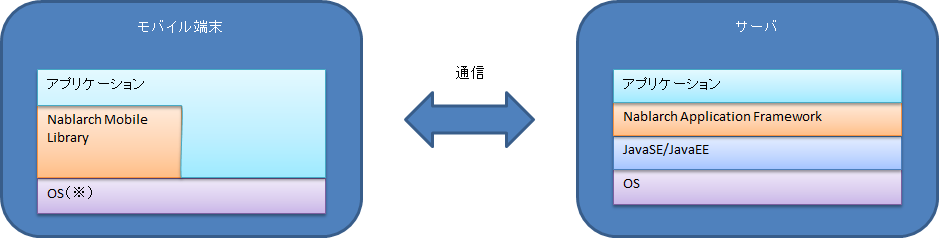

# Nablarch Mobile Library について

## Nablarch Mobile Library とは？

Nablarch Mobile Library (NML)は、モバイル端末で使用するネイティブアプリケーション開発に必要な機能を提供するライブラリ群である。
モバイル端末に提供するアプリケーションは、 モバイル端末内の Web ブラウザ上で動作するWebアプリケーションと、モバイル端末の1アプリケーションとして動作するネイティブアプリケーションに大別される。
NMLは、このうちネイティブアプリケーションの開発に使用するライブラリ群である。

以下に NML を使用したネイティブアプリケーションの構造の例を示す。

※現在 NML が対象としているOSは、下記のとおり。(今後 Android、最新のiOSに順次対応していく予定)

* iOS7

## NMLが想定する利用形態と提供する機能

NML は、OSの機能をそのまま使用するシンプルなネイティブアプリケーションだけでなく、 Phone Gap 、 Titanium といったアプリケーション開発基盤を使用した際にも使用できるよう考慮している。
このため、例えば画面機能のイベント処理といった、基盤を限定する機能は提供せず、開発効率化に寄与する汎用的な機能を提供する方針を採用している。
