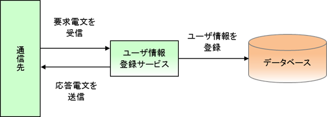

# ユーザ情報登録サービスの仕様

## 機能概要

外部システムからの送信電文を入力として、ユーザ情報テンポラリテーブルにレコードを登録する。



ユーザ情報テンポラリテーブルは、後続処理(常駐バッチ)によって一定時間間隔で監視され、
未処理のデータが存在する場合にユーザ情報を登録する。

常駐バッチの実装方法は、 [業務アプリケーションの実装方法 (バッチ処理編)](../../guide/nablarch-batch/nablarch-batch-04-Explanation-batch.md) を参照すること。

主な仕様は、以下の通り。

1. ユーザ情報登録処理

ユーザ情報登録電文を受信すると、データレコードの情報をユーザ情報テンポラリに登録し、処理結果を応答する。

【INPUTデータ】

* ユーザ情報登録電文

【OUTPUTデータ】

* ユーザ情報テンポラリ
* 応答電文

【精査仕様】

* 要求電文のレイアウトは、フレームワーク制御ヘッダ(以降ヘッダレコード)、データレコードが存在すること。
* ヘッダレコード、データレコードのレイアウト仕様については  要求電文仕様 を参照。
* データレコードの各項目に対するドメイン精査については 要求電文仕様 を参照。

## 要求電文仕様

【データレコード】

| 項目名 | データタイプ | 多重度 | 説明 |
|---|---|---|---|
| データ区分 | X | 1 | 半角:1桁 |
| ログインID | X | 1 | 半角:20桁以下:必須 |
| 漢字氏名 | XN | 1 | 全角:50桁以下:必須 |
| カナ氏名 | N | 1 | 全角カナ:50桁以下:必須 |
| メールアドレス | X | 1 | 半角:100桁以下:必須 |
| 内線番号(ビル番号) | X | 1 | 半角数字:2桁以下:必須 |
| 内線番号(個人番号) | X | 1 | 半角数字:4桁以下:必須 |
| 携帯電話番号(市外) | X | 0..1 | 半角数字:3桁以下 |
| 携帯電話番号(市内) | X | 0..1 | 半角数字:4桁以下 ※携帯電話番号(市外)が入力された場合は必須 携帯電話番号(市外)が未入力の場合は、未入力であること |
| 携帯電話番号(加入) | X | 0..1 | 半角数字:4桁以下:必須 ※携帯電話番号(市外)が入力された場合は必須 携帯電話番号(市外)が未入力の場合は、未入力であること |

XMLの場合の記述例を以下に示す。

```xml
<?xml version="1.0" encoding="UTF-8"?>
<request dataKbn="0">

  <loginId>nablarch</loginId>
  <kanjiName>名部　楽太郎</kanjiName>
  <kanaName>ナブ　ラクタロウ</kanaName>
  <mailAddress>nablarch@mail.co.jp</mailAddress>
  <extensionNumberBuilding>11</extensionNumberBuilding>
  <extensionNumberPersonal>1001</extensionNumberPersonal>
  <mobilePhoneNumberAreaCode>201</mobilePhoneNumberAreaCode>
  <mobilePhoneNumberCityCode>3001</mobilePhoneNumberCityCode>
  <mobilePhoneNumberSbscrCode>4001</mobilePhoneNumberSbscrCode>

  <_nbctlhdr>
    <userId>0000000101</userId>
    <resendFlag>0</resendFlag>
  </_nbctlhdr>

</request>
```

> **Note:**
> XML属性のサンプルを記載するため、データ区分を属性としている。

JSONの場合の記述例を以下に示す。

```bash
 {
      "dataKbn": "0"
    , "loginId": "nablarch"
    , "kanjiName": "名部　楽太郎"
    , "kanaName": "ナブ　ラクタロウ"
    , "mailAddress": "nablarch@mail.co.jp"
    , "extensionNumberBuilding": "11"
    , "extensionNumberPersonal": "1001"
    , "mobilePhoneNumberAreaCode": "201"
    , "mobilePhoneNumberCityCode": "3001"
    , "mobilePhoneNumberSbscrCode": "4001"
    , "_nbctlhdr": {
                        "userId": "user01"
                      , "resendFlag": "0"
                   }
}
```

## 応答電文仕様

【データレコード】

| 項目名 | データタイプ | 多重度 | 説明 |
|---|---|---|---|
| 障害事由コード | X | 0..1 | 障害事由を表すコード値 詳細は、 ステータスコード/障害コード/HTTPレスポンスコード仕様 を参照 |
| 問い合わせID | X | 0..1 | ユーザ情報テンポラリ.ユーザ情報IDに登録した値 |
| データ区分 | X | 1 | データ区分 |
| フレームワーク制御ヘッダ | X | 1 | フレームワーク制御項目(自動追加) |

【ヘッダレコード】

| 項目名 | データタイプ | 多重度 | 説明 |
|---|---|---|---|
| ステータスコード | X | 1 | 本サービス側の処理結果を表すコード 詳細は、 ステータスコード/障害コード/HTTPレスポンスコード仕様 を参照 |

## ステータスコード/障害コード/HTTPレスポンスコード仕様

| No | ステータスコード | 障害コード | HTTPレスポンスコード | 原因 | 備考 |
|---|---|---|---|---|---|
| 1 | 200 | (空白) | 200 | 正常終了 |  |
| 2 | 400 | NR11AC4001 | 400 | 要求電文データレコード部項目精査エラー |  |
| 3 | -- | -- | 400 | 要求電文のデータレコード部レイアウト不正 | FWでエラーが検出されエラー応答が返却される |
| 4 | 500 | NR11AC5000 | 500 | その他の意図しないエラーにより 業務処理が失敗した場合 |  |

## エンティティ情報

エンティティ論理名：ユーザ情報テンポラリ

| カラム論理名 | 入力データ |
|---|---|
| ユーザ情報ID | ユーザ情報IDで採番した値 |
| ログインID | 要求電文.データレコード.ログインID |
| 漢字氏名 | 要求電文.データレコード.漢字氏名 |
| カナ氏名 | 要求電文.データレコード.カナ氏名 |
| メールアドレス | 要求電文.データレコード.メールアドレス |
| 内線番号(ビル番号) | 要求電文.データレコード.内線番号(ビル番号) |
| 内線番号(個人番号) | 要求電文.データレコード.内線番号(個人番号) |
| 携帯電話番号(市外) | 要求電文.データレコード.携帯電話番号(市外) |
| 携帯電話番号(市内) | 要求電文.データレコード.携帯電話番号(市内) |
| 携帯電話番号(加入) | 要求電文.データレコード.携帯電話番号(加入) |
| ステータス | 未処理('0') |
