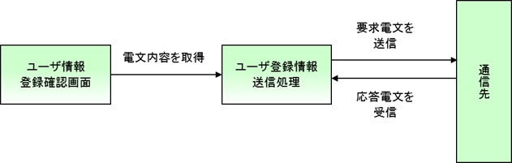

# ユーザ情報登録サービスの仕様

## 機能概要

ユーザ情報登録画面で入力されたユーザ情報からユーザ情報登録電文を作成し、
外部システムに電文を送信することでユーザ情報を登録する。
さらに、応答電文から採番されたユーザIDを取得し、完了画面に表示する。

本サンプルアプリケーションでは、ユーザ登録確認画面にHTTPメッセージ送信ボタンを設け、
HTTPメッセージ送信ボタンに対応する処理を行うアクションにユーザ情報登録電文の送信処理を実装する。

主な仕様は、以下の通り。

1.ユーザ登録情報送信処理

ユーザ情報登録画面で入力されたユーザ情報からユーザ情報登録電文を作成し、外部システムに送信する。

外部システムからの要求電文からユーザが登録される場合は、後続処理によって、
パスワードと権限情報にデフォルト値が設定されるため、画面で入力されたユーザ情報のうち、
パスワードと権限情報は使用しない。

【INPUTデータ】

* 画面で入力されたユーザ情報

【OUTPUTデータ】

* 要求電文

【概要】

* 要求電文、応答電文はデータレコードのみ必須。
* 要求電文のデータレコードのレイアウト仕様については [要求電文仕様](../../guide/http-messaging/http-messaging-01-userSendSyncMessageSpec.md#user-send-sync-request-format)を参照。
* 応答電文のデータレコードのレイアウト仕様については [応答電文仕様](../../guide/http-messaging/http-messaging-01-userSendSyncMessageSpec.md#user-send-sync-response-format)を参照。
* 応答電文のHTTPレスポンスコードが200の場合は、完了画面を表示する。
* 応答電文のHTTPレスポンスコードが200以外の場合は、業務エラーを送出し、登録画面にエラーメッセージを表示する。
* 通信先でエラーが発生した場合（接続エラー等）はシステムエラーを送出し、エラー画面に遷移する。(この処理はアーキテクトにより提供されるため、業務Actionは意識しなくてよい)

## 要求電文仕様

【データレコード】

| 項目名 | データタイプ | 多重度 | 説明 |
|---|---|---|---|
| データ区分 | X | 1 | 半角:1桁 |
| ログインID | X | 1 | 半角:20桁以下:必須 |
| 漢字氏名 | XN | 1 | 全角:50桁以下:必須 |
| カナ氏名 | N | 1 | 全角カナ:50桁以下:必須 |
| メールアドレス | X | 1 | 半角:100桁以下:必須 |
| 内線番号(ビル番号) | X | 1 | 半角数字:2桁以下:必須 |
| 内線番号(個人番号) | X | 1 | 半角数字:4桁以下:必須 |
| 携帯電話番号 | OB | 0..3 | 携帯電話番号 |
| フレームワーク制御ヘッダ | OB | 0..1 | フレームワーク制御項目 |

【携帯電話番号レコード】

| 項目名 | データタイプ | 多重度 | 説明 |
|---|---|---|---|
| 携帯電話番号(市外) | X | 0..1 | 半角数字:3桁以下 |
| 携帯電話番号(市内) | X | 0..1 | 半角数字:4桁以下 ※携帯電話番号(市外)が入力された場合は必須 携帯電話番号(市外)が未入力の場合は、未入力であること |
| 携帯電話番号(加入) | X | 0..1 | 半角数字:4桁以下:必須 ※携帯電話番号(市外)が入力された場合は必須 携帯電話番号(市外)が未入力の場合は、未入力であること |

【ヘッダレコード】

| 項目名 | データタイプ | 多重度 | 説明 |
|---|---|---|---|
| ユーザID | X | 0..1 | ユーザID |
| 再送要求フラグ | X9 | 0..1 | ‘0’: 初回送信 / ‘1’: 再送要求 / 空白: 再送不要 デフォルト値'0'を設定 |

## 応答電文仕様

【データレコード】

| 項目名 | データタイプ | 多重度 | 説明 |
|---|---|---|---|
| 障害事由コード | X | 0..1 | 障害事由コード |
| 問い合わせID | X | 0..1 | ユーザ情報テンポラリ.ユーザ情報IDに登録した値 |
| データ区分 | X | 1 | データ区分 |
| オプション項目 | OB | 1..5 | オプション項目 |
| フレームワーク制御ヘッダ | OB | 1 | フレームワーク制御項目(自動追加) |

【オプション項目レコード】

| 項目名 | データタイプ | 多重度 | 説明 |
|---|---|---|---|
| 連絡先アドレス | X | 0..1 | 連絡先アドレス |

【ヘッダレコード】

| 項目名 | データタイプ | 多重度 | 説明 |
|---|---|---|---|
| ステータスコード | X | 1 | HTTPレスポンスコード |

【HTTPレスポンスコード仕様】

| No | HTTPレスポンスコード | 原因 | 備考 |
|---|---|---|---|
| 1 | 200 | 正常終了 |  |
| 2 | 200以外 | ステータスコード不正 | 業務アプリケーションで判定し、業務エラーとする |
| 3 | -- | 要求電文データレコード部レイアウト不正 | 送信前にエラーとなるため、HTTPレスポンスは返却されない。 |
| 4 | -- | 応答電文のデータレコード部レイアウト不正 | 通信先のエラーとなるため、返却値は不明。 |
| 5 | -- | 接続タイムアウトが発生した場合。 | 送信前にエラーとなるため、HTTPレスポンスは返却されない。 |
| 6 | -- | その他の意図しないエラーにより業務処理が失敗した場合。 |  |
