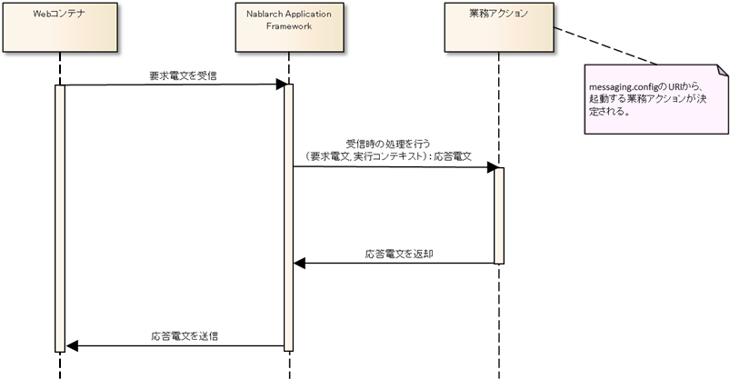

# HTTP同期応答型メッセージ受信処理のアプリケーション構造

HTTP同期応答型メッセージ受信処理で共通の基本的なクラス構造については、
 [同期応答型メッセージ受信処理のアプリケーション構造](../../guide/mom-messaging/mom-messaging-04-explanation-real-02-basic.md) を参照すること。

本項では、 [同期応答型メッセージ受信処理のアプリケーション構造](../../guide/mom-messaging/mom-messaging-04-explanation-real-02-basic.md) と異なる箇所の解説を行う。

## 概要

Nablarch Application Frameworkでは、複雑になりがちなメッセージング処理を簡潔かつ堅牢に作成できるように以下のような機能を備えている。

* Nablarch共通の実装方法

業務Actionの実装内容は、MOMによるメッセージング処理と同様の実装にて、HTTPメッセージングを実現できる。

* データ形式

HTTP同期応答型メッセージングのデータ形式として一般的に用いるJSON/XML形式についても、
汎用データフォーマッターでサポートしており、従来の固定長ファイルやCSV/TSVと同様に扱うことができる。

## 処理の流れ

WebコンテナからNablarch Application Frameworkへ要求電文が到達する毎に、以下の処理が実行される。

1. Nablarch Application Frameworkはmessaging.configのURIをもとに、業務アクションクラスを起動する。
2. 業務アクションは、要求電文を受け取り業務処理を実行し、応答電文を戻り値として返却する。
3. Nablarch Application Frameworkは、返却された応答電文をWebコンテナへ返却する。

