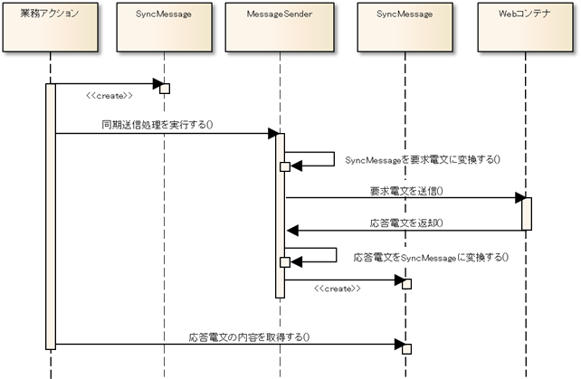

# HTTP同期応答メッセージ送信処理のアプリケーション構造

HTTP同期応答型メッセージ送信処理で共通の基本的なクラス構造については、
 [同期応答メッセージ送信処理のアプリケーション構造](../../guide/mom-messaging/mom-messaging-04-explanation-send-sync-02-basic.md) を参照すること。

本項では、 [同期応答メッセージ送信処理のアプリケーション構造](../../guide/mom-messaging/mom-messaging-04-explanation-send-sync-02-basic.md) と異なる箇所の解説を行う。

## 概要

Nablarch Application Frameworkでは、複雑になりがちなメッセージング処理を簡潔かつ堅牢に作成できるように以下のような機能を備えている。

* Nablarch共通の実装方法

業務Actionの実装内容は、MOMによるメッセージング処理と同様の実装にて、HTTPメッセージングを実現できる。

* データ形式

HTTP同期応答型メッセージングのデータ形式として一般的に用いるJSON/XML形式についても、
汎用データフォーマッターでサポートしており、従来の固定長ファイルやCSV/TSVと同様に扱うことができる。

## クラス構造

[同期応答メッセージ送信処理のアプリケーション構造](../../guide/mom-messaging/mom-messaging-04-explanation-send-sync-02-basic.md) と同様。

ただし、タイムアウトが発生し、正常終了しなかった場合は、HttpMessagingTimeoutExceptionがスローされる。

## 処理の流れ

業務ActionはMessageSenderを実行し、HTTP同期応答メッセージの送信を行う。
具体的には以下の流れで処理が行われる。

1. 業務Actionは、SyncMessageクラスにリクエストID [1] と要求電文に格納するパラメータを設定し、それを引数にMessageSenderのsendSyncメソッドを実行する。
2. MessageSenderは、引数のSyncMessageから要求電文を生成し、Webコンテナに送信する。
3. Webコンテナから応答電文が返却される。
4. MessageSenderは、応答電文の解析結果をSyncMessageに格納し、呼び出し元（業務Action）に返却する。

ここで扱うリクエストIDとは、メッセージを送信する相手先システムの機能を一意に識別するために定義するIDのことを指すものであり、画面オンライン処理やバッチ処理で使用するリクエストIDとは意味が異なる点に注意すること。
このリクエストIDにもとづき、以下が決定する。

* 要求電文および応答電文のフォーマット
* メッセージングの基盤（MOM/HTTP）
