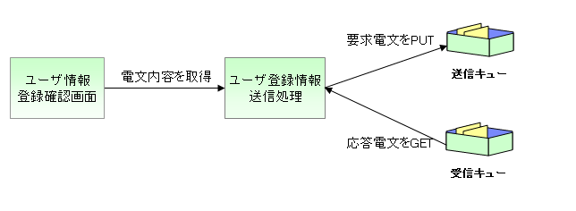

# 同期応答メッセージ送信処理

## 概要



[ユーザ情報登録サービス](mom-messaging-01_userSendSyncMessageSpec.md)\を例に、同期応答メッセージ送信処理の実装方法を説明する。

<details>
<summary>keywords</summary>

同期応答メッセージ送信処理, MOMメッセージング, ユーザ情報登録サービス

</details>

## アプリケーションプログラマが実装する成果物

作成する成果物:
- 要求電文および応答電文のフォーマット定義ファイル
- 同期応答メッセージ送信処理を行うActionクラス

<details>
<summary>keywords</summary>

フォーマット定義ファイル, Actionクラス, 同期応答メッセージ送信実装成果物

</details>

## フォーマット定義ファイルの設定と命名規約

フォーマット定義ファイルの配置場所と拡張子は`FilePathSetting`クラスのコンポーネント定義で設定する（通常アーキテクトが設定）。

```xml
<component name="filePathSetting" class="nablarch.core.util.FilePathSetting" autowireType="None">
  <property name="basePathSettings">
    <map>
      <entry key="format" value="classpath:web/format" />
    </map>
  </property>
  <property name="fileExtensions">
    <map>
      <entry key="format" value="fmt" />
    </map>
  </property>
</property>
```

命名規約:
- 要求電文: リクエストID + `_SEND`
- 応答電文: リクエストID + `_RECEIVE`

<details>
<summary>keywords</summary>

FilePathSetting, nablarch.core.util.FilePathSetting, フォーマット定義ファイル命名規約, _SEND, _RECEIVE, filePathSetting, basePathSettings, fileExtensions

</details>

## フォーマット定義ファイル（要求電文）

ファイルパス: `web/format/RM11AC0201_SEND.fmt`

```
file-type:        "Fixed" # 固定長
text-encoding:    "MS932" # 文字列型フィールドの文字エンコーディング
record-length:    420     # 各レコードの長さ
record-separator: "\r\n"  # 改行コード

[data]
1   dataKbn                     X(1)  "2"   # レコード区分(固定)
2   loginId                     X(20)       # ログインID
22  kanjiName                   N(100)      # 漢字氏名
122 kanaName                    N(100)      # カナ氏名
222 ?filler1                    X(50)       # 空白領域
272 mailAddress                 X(100)      # メールアドレス
372 extensionNumberBuilding     X(2)        # 内線番号（ビル番号）
374 extensionNumberPersonal     X(4)        # 内線番号（個人番号）
378 mobilePhoneNumberAreaCode   X(3)        # 携帯番号（市外）
381 mobilePhoneNumberCityCode   X(4)        # 携帯電話番号(市内)
385 mobilePhoneNumberSbscrCode  X(4)        # 携帯電話番号(加入)
389 ?filler2                    X(32)       # 空白領域
```

> **警告**: 同期応答送信処理に使用するフォーマット定義ファイル（〜_SEND.fmt）のレコードタイプ名は`data`固定である。

<details>
<summary>keywords</summary>

要求電文フォーマット定義, RM11AC0201_SEND.fmt, 固定長フォーマット, dataレコードタイプ

</details>

## フォーマット定義ファイル（応答電文）

ファイルパス: `web/format/RM11AC0201_RECEIVE.fmt`

```
file-type:        "Fixed" # 固定長
text-encoding:    "MS932" # 文字列型フィールドの文字エンコーディング
record-length:    420     # 各レコードの長さ
record-separator: "\r\n"  # 改行コード

[data]
1   dataKbn                     X(1)  "0"   # データ区分(固定)
2   userId                      X(10)       # 採番したユーザID
12  failureCode                 X(20)       # 障害事由コード
32  userInfoId                  X(20)       # 問い合わせID
52  ?filler                     X(369)      # 空白領域
```

<details>
<summary>keywords</summary>

応答電文フォーマット定義, RM11AC0201_RECEIVE.fmt, 固定長フォーマット

</details>

## 同期応答メッセージ送信処理を行うActionクラス

実装フロー:
1. リクエストを精査しEntityへ変換
2. EntityからSyncMessageオブジェクトを生成
3. `MessageSender`でメッセージを送信
4. 応答電文の`SyncMessage`オブジェクトからデータを取得

```java
@OnError(type = ApplicationException.class, path = "forward://RW11AC0201")
@OnDoubleSubmission(path = "forward://RW11AC0201")
public HttpResponse doRW11AC0205(HttpRequest req, ExecutionContext ctx) {
    W11AC02Form form = validateForSendUser(req);
    SystemAccountEntity systemAccount = form.getSystemAccount();
    UsersEntity users = form.getUsers();

    Map<String, Object> dataRecord = new HashMap<String, Object>();
    dataRecord.put("dataKbn", REQUEST_MESSAGE_DATA_KBN);
    dataRecord.put("loginId", systemAccount.getLoginId());
    dataRecord.put("kanjiName", users.getKanjiName());
    dataRecord.put("kanaName", users.getKanaName());
    dataRecord.put("mailAddress", users.getMailAddress());
    dataRecord.put("extensionNumberBuilding", users.getExtensionNumberBuilding());
    dataRecord.put("extensionNumberPersonal", users.getExtensionNumberPersonal());
    dataRecord.put("mobilePhoneNumberAreaCode", users.getMobilePhoneNumberAreaCode());
    dataRecord.put("mobilePhoneNumberCityCode", users.getMobilePhoneNumberCityCode());
    dataRecord.put("mobilePhoneNumberSbscrCode", users.getMobilePhoneNumberSbscrCode());

    SyncMessage responseMessage
        = MessageSender.sendSync(new SyncMessage("RM11AC0201").addDataRecord(dataRecord));

    String userId = (String) responseMessage.getDataRecord().get("userId");
    systemAccount.setUserId(userId);

    // 引き継ぎ項目を格納
    W11AC01SearchForm successionForm = new W11AC01SearchForm();
    successionForm.setSystemAccount(systemAccount);
    ctx.setRequestScopedVar("11AC_W11AC01", successionForm);

    return new HttpResponse("/ss11AC/W11AC0203.jsp");
}
```

> **警告**: タイムアウト時は`MessageSendSyncTimeoutException`がスローされる。必要に応じてキャッチし、エラー画面へ遷移すること。

<details>
<summary>keywords</summary>

MessageSender, SyncMessage, MessageSendSyncTimeoutException, @OnError, @OnDoubleSubmission, 同期応答メッセージ送信, sendSync, HttpResponse, ExecutionContext, HttpRequest

</details>
