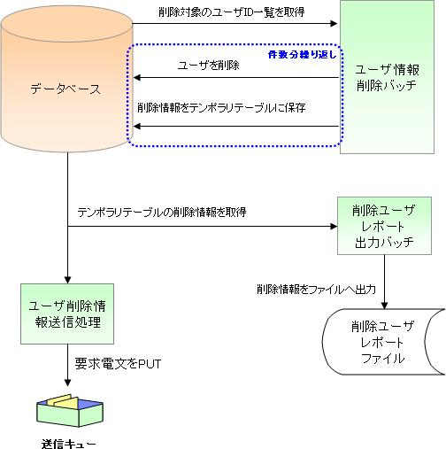

# ユーザ情報削除バッチの仕様

## 機能概要

ユーザ有効期限を過ぎて２年を経過したユーザ情報を削除し、削除したユーザ情報をファイルに出力する。

> **注意**: CSVファイルと固定長ファイルの２種類のファイル出力バッチを提供する。

> **注意**: ユーザ削除情報送信処理はメッセージング実行制御基盤を使用して実現する。

**1. ユーザ削除処理**

削除対象（ユーザの有効期限を過ぎて２年を経過した場合）のユーザ情報を削除し、削除ユーザレポートテンポラリとユーザ削除情報メッセージ送信テーブルに保存する。

INPUTデータ:
- システムアカウント: 削除対象ユーザIDを取得（有効期限を過ぎて２年を経過した条件）
- ユーザ情報: 削除ユーザレポートテンポラリ出力用の属性情報

削除対象テーブル:
- ユーザ情報
- システムアカウント
- システムアカウント権限
- グループシステムアカウント

OUTPUTデータ:
- 削除ユーザレポートテンポラリ
- ユーザ削除情報メッセージ送信

**2. ファイル出力処理**

ユーザ削除処理で作成されたテンポラリテーブルから全レコードを取得し、CSV・固定長ファイル出力を行う。

keywords

ユーザ情報削除バッチ, バッチ削除処理, ファイル出力, CSVファイル出力, 固定長ファイル出力, メッセージング実行制御, テンポラリテーブル

## エンティティ情報

**エンティティ論理名：削除ユーザレポートテンポラリ**

| カラム論理名 | 入力データ |
|---|---|
| ユーザID | システムアカウントテーブル.ユーザID |
| ログインID | システムアカウントテーブル.ログインID |
| 漢字氏名 | ユーザ情報.漢字氏名 |
| カナ氏名 | ユーザ情報.カナ氏名 |
| メールアドレス | ユーザ情報.メールアドレス |
| 内線番号(ビル番号) | ユーザ情報.内線番号(ビル番号) |
| 内線番号(個人番号) | ユーザ情報.内線番号(個人番号) |
| 携帯電話番号(市外) | ユーザ情報.携帯電話番号(市外) |
| 携帯電話番号(市内) | ユーザ情報.携帯電話番号(市内) |
| 携帯電話番号(加入) | ユーザ情報.携帯電話番号(加入) |

**エンティティ論理名：ユーザ削除情報メッセージ送信**

| カラム論理名 | 備考 |
|---|---|
| 送信電文連番 | ユーザ登録情報送信登録時に採番した一意の連番 |
| ユーザID | ユーザ情報.ユーザID |
| 漢字名称 | ユーザ情報.漢字名称 |
| カナ名称 | ユーザ情報.カナ名称 |
| ステータス | '0'(未処理) |

keywords

削除ユーザレポートテンポラリ, ユーザ削除情報メッセージ送信, エンティティ定義, テーブル定義, カラム定義

## ファイル情報

**ヘッダレコード**

| 項目名 | データタイプ | 開始位置 | バイト数 | 説明 |
|---|---|---|---|---|
| レコード区分 | X | 1 | 1 | ヘッダレコード区分値。'1'固定 |
| 日付 | X | 2 | 8 | ファイル出力時点のシステム日付 |
| FILLER | X | 9 | 411 | 空白（半角スペース） |

**データレコード**

| 項目名 | データタイプ | 開始位置 | バイト数 | 説明 |
|---|---|---|---|---|
| レコード区分 | X | 1 | 1 | データレコード区分値。'2'固定 |
| ユーザID | X | 2 | 10 | 削除ユーザレポートテンポラリのユーザID |
| ログインID | X | 12 | 20 | 削除ユーザレポートテンポラリのログインID |
| 漢字氏名 | N | 32 | 100 | 削除ユーザレポートテンポラリの漢字氏名 |
| カナ氏名 | N | 132 | 100 | 削除ユーザレポートテンポラリのカナ氏名 |
| FILLER1 | X | 232 | 50 | 空白（半角スペース） |
| メールアドレス | X | 282 | 100 | 削除ユーザレポートテンポラリのメールアドレス |
| 内線番号(ビル番号) | 9 | 382 | 2 | 削除ユーザレポートテンポラリの内線番号(ビル番号) |
| 内線番号(個人番号) | 9 | 384 | 4 | 削除ユーザレポートテンポラリの内線番号(個人番号) |
| 携帯電話番号(市外) | 9 | 386 | 3 | 削除ユーザレポートテンポラリの携帯電話番号(市外) |
| 携帯電話番号(市内) | 9 | 389 | 4 | 削除ユーザレポートテンポラリの携帯電話番号(市内) |
| 携帯電話番号(加入) | 9 | 394 | 4 | 削除ユーザレポートテンポラリの携帯電話番号(加入) |
| FILLER2 | X | 399 | 22 | 空白（半角スペース） |

**トレーラレコード**

| 項目名 | データタイプ | 開始位置 | バイト数 | 説明 |
|---|---|---|---|---|
| レコード区分 | X | 1 | 1 | トレーラレコード区分値。'8'固定 |
| 総件数 | 9 | 2 | 19 | データレコードの総件数 |
| FILLER | X | 21 | 400 | 空白（半角スペース） |

**エンドレコード**

| 項目名 | データタイプ | 開始位置 | バイト数 | 説明 |
|---|---|---|---|---|
| レコード区分 | X | 1 | 1 | エンドレコード区分値。'9'固定 |
| FILLER | X | 2 | 419 | 空白（半角スペース） |

**障害通知仕様**

| No | 終了コード | 障害コード | 原因 |
|---|---|---|---|
| 1 | 100 | NB11AA0101 | システムアカウントに紐付くユーザ情報が存在しない場合 |

keywords

ファイルレイアウト, ヘッダレコード, データレコード, トレーラレコード, エンドレコード, 障害通知仕様, NB11AA0101, 固定長ファイルレイアウト

