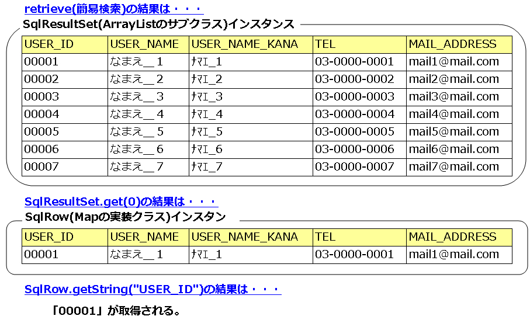

# データベースアクセス実装例集

## 本ページの構成

本ページで説明する実装例の一覧:

- [basic_implementation](#s1)
- [simple_search](#s2)
  - [retrieve-variable-label](#s3)
  - [range_search](#s3)
  - [how_to_use_sql_result_set](#s3)
- :ref:`executeQuery-label`
- [insert_update_delete](#)
  - [update_single_data](#)
  - :ref:`executeBatch-label`
- [access_to_binary_data](#)
  - [searching_binary_data](#)
  - [insert_binary_data](#)
  - [insert_file_data_as_binary_data](#)
  - [generate_binary_file](#)
- [db-object-save-samole](#)
  - [update_single_data_by_object](#)
  - [update_multiple_data_by_object](#)
- [map-save-label](#)
  - [update_single_data_by_map](#)
  - [update_multiple_data_by_map](#)
- [object-select-label](#)
  - [using_simple_search](#)
  - [using_simple_search_having_like_conditions](#)
  - [variable-condition-sql-label](#)
  - [changing_dynamically_in](#)
  - [changing_dynamically_order_by](#)
  - [serching_for_mass_data](#)
- [map-search-label](#)

大量データ取得には簡易検索ではなく`executeQuery`を使用する。

> **補足**: 大量データとはSELECT文で取得されるデータ件数が多いことをさす。`statement.retrieve(1, 10000000)`は最大1千万件取得のため大量データ。`statement.retrieve(10000000, 20)`は取得最大件数が20件のため大量データではない。

**クラス**: `ResultSetIterator`, `SqlPStatement`, `SqlRow`, `DbAccessSupport`

`executeQuery()`は`ResultSetIterator`を返す。`ResultSetIterator`は`Iterable`を実装しており、for-each文で使用可能。

```sql
GET_ALL_USER =
SELECT USER_ID, USER_NAME, USER_NAME_KANA, TEL, MAIL_ADDRESS
FROM USER_MST ORDER BY USER_ID
```

```java
public class CM311AC1Component extends DbAccessSupport {
    public ResultSetIterator getAllUser() {
        SqlPStatement statement = getSqlPStatement("GET_ALL_USER");
        statement.setString(1, "00001");
        return statement.executeQuery();
    }
}

// ResultSetIteratorの使用例
for (SqlRow row : rs) {
    String userId = row.getString("USER_ID");
    String userName = row.getString("USER_NAME");
}
```

> **警告**: `ResultSetIterator#iterator`の呼び出しは複数回不可。for-each文を2回使用すると2回目の`iterator`呼び出しになるためNG。
>
> ```java
> // NG: iteratorを2回呼び出し
> rs.iterator();
> rs.iterator();
>
> // NG: 2回目のfor-each文でiterator2回目呼び出し
> for (SqlRow row : rs) { /* 処理 */ }
> for (SqlRow row : rs) { /* 処理 */ } // ← NG
> ```

データベースのバイナリ型(BLOBやbyte)データの参照・更新で使用するSQLファイル。

**SQLファイル**: `nablarch/sample/ss11AC/CM311AC1Component.sql`

```sql
-- SQL_ID:GET_PASSWORD (パスワード取得)
GET_PASSWORD =
SELECT PWD FROM USER_MST WHERE USER_ID = ?

-- SQL_ID:UPDATE_PASSWORD (パスワード更新)
UPDATE_PASSWORD =
UPDATE USER_MST SET PWD = ? WHERE USER_ID = ?

-- SQL_ID:UPDATE_PDF (PDF更新)
UPDATE_PDF =
UPDATE PDF_LIST SET PDF_DATA = ? WHERE USER_ID = ?

-- SQL_ID:GET_PDF (PDF取得)
GET_PDF =
SELECT PDF_DATA FROM PDF_LIST WHERE USER_ID = ?
```

## 1件のデータを更新する場合

`ParameterizedSqlPStatement.executeUpdateByMap(Map)` でMapのデータを1件更新する。

```java
Map<String, Object> sales = new HashMap<String, Object>();
sales.put("CST_ID", "00001");
sales.put("KINGAKU", "200");

ParameterizedSqlPStatement statement = getParameterizedSqlStatement("UPDATE_SALES");
int updCnt = statement.executeUpdateByMap(sales);
```

## SQLファイルの記述ルール（バインド変数・LIKE条件記法）

オブジェクトのフィールドの値を使用してデータを検索する際に使用するSQLファイルの記述ルール。

バインド変数部分には `?` を設定するのではなく、`:`＋`オブジェクトのフィールド名` とすること。

**LIKE条件のバインド変数記法**:
- 前方一致: バインド変数名の末尾に `%` を付加する（例: `:userName%`）
- 後方一致: バインド変数名の先頭に `%` を付加する（例: `:%userName`）
- 部分一致: バインド変数名の前後に `%` を付加する（例: `:%userName%`）
- SQLにescape句の記述は不要（フレームワークが自動付加）

**SQLファイル例（抜粋）**:

```sql
-- 単純検索（GET）
GET =
SELECT USER_ID, USER_NAME
FROM USER_MTR
WHERE USER_NAME = :userName
ORDER BY USER_ID

-- LIKE検索（GET_LIST1）: 前方一致
GET_LIST1 =
SELECT USER_ID, USER_NAME
FROM USER_MTR
WHERE USER_NAME LIKE :userName%
ORDER BY USER_ID

-- 可変条件（GET_LIST2）: $if
GET_LIST2 =
SELECT ...
FROM USER_MTR, USER_GROUP
WHERE
    $if (loginId)           {USER_MTR.LOGIN_ID        =    :loginId}
    AND $if (userKanjiName) {USER_MTR.USER_KANJI_NAME LIKE :userKanjiName%}
    AND $if (userKanaName)  {USER_MTR.USER_KANA_NAME  LIKE :userKanaName%}
    AND $if (groupId)       {USER_MTR.GROUP_ID        =    :groupId}
    AND USER_GROUP.GROUP_ID = USER_MTR.GROUP_ID

-- IN句動的生成（GET_LIST3）: バインド変数名末尾に[]
GET_LIST3 =
SELECT ...
FROM USER_MTR, USER_GROUP
WHERE
    $if (loginId)       {USER_MTR.LOGIN_ID   = :loginId}
    AND $if (kengenKbn) {USER_MTR.KENGEN_KBN IN (:kengenKbn[])}
    AND USER_GROUP.GROUP_ID = USER_MTR.GROUP_ID

-- ORDER BY動的変更（GET_LIST4）: $sort
GET_LIST4 =
SELECT USER_ID, USER_NAME
FROM USER_MTR
WHERE USER_NAME = :userName
$sort(sortId) {
    (1 USER_ID)
    (2 USER_ID DESC)
    (3 USER_NAME)
    (4 USER_NAME DESC)
}

-- 大量データ取得（GET_ALL）
GET_ALL =
SELECT USER_ID, USER_NAME, USER_NAME_KANA, TEL, MAIL_ADDRESS
FROM USER_MST
WHERE USER_ID = :userId
ORDER BY USER_ID
```

SQLファイルの記述ルールやSQL_IDの指定方法の詳細は `[retrieve-variable-label](#s3)` を参照すること。

<details>
<summary>keywords</summary>

データベースアクセス実装例, 簡易検索, バイナリデータアクセス, オブジェクト保存, マップ検索, DbAccessSupport, SqlResultSet, executeQuery, ResultSetIterator, SqlPStatement, SqlRow, 大量データ検索, for-eachループ, iterator複数回呼び出し禁止, バイナリデータ, BLOB, byte型, SQLファイル定義, GET_PASSWORD, UPDATE_PASSWORD, GET_PDF, UPDATE_PDF, ParameterizedSqlPStatement, executeUpdateByMap, Map更新, 1件更新, バインド変数, フィールド名, LIKE条件, 前方一致, 後方一致, 部分一致, escape句, SQL_ID

</details>

## 基本的な実装

**クラス**: `nablarch.core.db.support.DbAccessSupport`

データベースアクセスクラスは `DbAccessSupport` を継承して作成する。

```java
package nablarch.sample.ss11AC;
import nablarch.core.db.support.DbAccessSupport;

public class CM311AC1Component extends DbAccessSupport {
}
```

> **注意**: 継承モデルを使用しない場合（別スーパークラスを継承しているためDbAccessSupportを継承できない場合）は、DbAccessSupportをインスタンス化して使用する。コンストラクタに自身のクラスオブジェクト（`getClass()`）を指定する。

```java
DbAccessSupport support = new DbAccessSupport(getClass());
```

> **警告**: 継承モデルを使用しない場合にデフォルトコンストラクタ（引数なし）を使用すると、SQLファイルを特定できず実行時エラーになる。

`SqlPStatement.executeUpdate()`でINSERT/UPDATE/DELETE実行。UPDATE時は戻り値（更新件数）を確認し、1件でない場合（`updCnt != 1`）は対象なしエラーを表示すること。

```sql
REGISTER_USER =
INSERT INTO USER_MST (USER_ID, USER_NAME, USER_NAME_KANA, TEL, MAIL_ADDRESS)
VALUES (?, ?, ?, ?, ?)

UPDATE_USER_NAME =
UPDATE USER_MST SET USER_NAME = ? WHERE USER_ID = ?
```

```java
public class CM311AC1Component extends DbAccessSupport {

    // 登録処理の例
    public void registerUser(String userId, String userName, String userNameKana,
            String tel, String mailAddress) {
        SqlPStatement statement = getSqlPStatement("REGISTER_USER");
        statement.setString(1, userId);
        statement.setString(2, userName);
        statement.setString(3, userNameKana);
        statement.setString(4, tel);
        statement.setString(5, mailAddress);
        statement.executeUpdate();
    }

    // 更新処理の例（件数確認必須）
    public void updateUserName(String userId, String userName) {
        SqlPStatement updateStatement = getSqlPStatement("UPDATE_USER_NAME");
        updateStatement.setString(1, userName);
        updateStatement.setString(2, userId);
        int updCnt = updateStatement.executeUpdate();
        if (updCnt != 1) {
            // 更新対象が存在しない場合は、対象なしエラーを表示する
        }
    }
}
```

## バイナリデータの検索方法

`SqlRow#getBytes` でバイナリデータを取得する。

```java
public class CM311AC1Component extends DbAccessSupport {
    public byte[] getPassword(String userId) {
        SqlPStatement select = getSqlPStatement("GET_PASSWORD");
        select.setString(1, userId);
        SqlResultSet rs = select.retrieve();
        SqlRow row = rs.get(0);
        return row.getBytes("pwd");  // バイナリデータはgetBytesで取得
    }
}
```

> **警告**: データ量が大きい場合（ファイルデータ等）は `getBytes` で一括取得せず、[generate_binary_file](#) の実装例に従うこと。

## バイナリデータの登録方法

`SqlPStatement#setBytes` でバイナリデータを設定する。

```java
SqlPStatement statement = getSqlPStatement("UPDATE_PASSWORD");
statement.setBytes(1, pwd);
statement.setString(2, "00001");
int updNo = statement.executeUpdate();
```

> **警告**: `setBytes` はデータベースベンダーによってはサポートされない場合がある。使用するsetメソッドはDBベンダーのJDBCマニュアルを確認すること。

## ファイルの内容をバイナリデータとして登録する方法

`setBinaryStream(int, InputStream, int)` でファイルのストリームをバインド変数に設定する。

```java
SqlPStatement statement = getSqlPStatement("UPDATE_PDF");
File file = new File("hoge.pdf");
FileInputStream fis = new FileInputStream(file);
try {
    statement.setBinaryStream(1, fis, (int) file.length());
    statement.setString(2, "00001");
    statement.executeUpdate();
} finally {
    fis.close();
}
```

> **警告**: `java.io` パッケージを直接使用する実装はリソース開放漏れが発生する可能性があり、アプリケーションプログラマが実装することは推奨しない。必要な場合はアーキテクトがコンポーネントを作成すること。

## バイナリデータをファイルとして出力する方法

データベースからBlobとして取得し、ストリームを使ってファイル出力する。

```java
SqlPStatement select = getSqlPStatement("GET_PDF");
select.setString(1, "00001");
SqlResultSet rs = select.retrieve();

Blob fileData = (Blob) rs.get(0).get("PDF_DATA");  // BlobとしてDBから取得
InputStream pdfData = null;
FileOutputStream output = null;
try {
    pdfData = fileData.getBinaryStream();  // Blobからストリームを取得
    output = new FileOutputStream("hoge.pdf");
    byte[] b = new byte[1024];
    int size = 0;
    while ((size = pdfData.read(b)) != -1) {
        output.write(b, 0, size);
        output.flush();
    }
} finally {
    try { if (pdfData != null) pdfData.close(); }
    finally { if (output != null) output.close(); }
}
```

> **警告**: `java.io` パッケージを直接使用する実装はリソース開放漏れが発生する可能性があり、アプリケーションプログラマが実装することは推奨しない。必要な場合はアーキテクトがコンポーネントを作成すること。

## 複数件を更新する場合

複数件を一括で更新する場合の注意点は、JDBC標準機能と同じである。

```java
// 1回のexecuteBatchで更新する最大の件数
private static final int BATCH_EXECUTE_MAX_CNT = 1000;

// 【説明】本実装例では、更新対象のデータを作成する処理は省略している

ParameterizedSqlPStatement statement = getParameterizedSqlStatement("UPDATE_SALES");

for (Map<String, ?> sales : salesList) {
    statement.addBatchMap(sales);
    if (statement.getBatchSize() == BATCH_EXECUTE_MAX_CNT) {
        statement.executeBatch();
    }
}
if (statement.getBatchSize() != 0) {
    statement.executeBatch();
}
```

## 簡易検索機能を使用する場合

オブジェクトのフィールドの値を条件として、簡易検索機能（`[simple_search](#s2)`）を使用する際の実装例。

SQL_IDを指定して `ParameterizedSqlPStatement` を取得し、Formオブジェクトを渡して `retrieve` を呼び出す。

```java
// オブジェクトの実装
public class W11BB01Form {
    private String userId;
    private String userName;
    // 各フィールドのアクセスメソッドを定義
}

public void doRW11BB0101() {
    W11BB01Form form = new W11BB01Form();
    form.setUserName("ユーザ");

    CM211BB1Component component = new CM211BB1Component();
    component.get(form);
}

public class CM211BB1Component {
    public SqlResultSet get(W11BB01Form form) {
        // SQL_IDを指定してStatementオブジェクトを取得する
        ParameterizedSqlPStatement select = getParameterizedSqlStatement("GET");
        return select.retrieve(form);
    }
}
```

SQLファイルの記述ルールやSQL_IDの指定方法の詳細は `[retrieve-variable-label](#s3)` を参照すること。

<details>
<summary>keywords</summary>

DbAccessSupport, データベースアクセスクラス継承, 継承モデル, DbAccessSupportインスタンス化, CM311AC1Component, executeUpdate, SqlPStatement, INSERT, UPDATE, DELETE, 更新件数確認, SqlRow, getBytes, setBytes, setBinaryStream, Blob, getBinaryStream, バイナリデータ検索, バイナリデータ登録, ファイル登録, ファイル出力, SqlResultSet, FileInputStream, FileOutputStream, ParameterizedSqlPStatement, addBatchMap, executeBatch, getBatchSize, バッチ更新, 一括更新, BATCH_EXECUTE_MAX_CNT, retrieve, getParameterizedSqlStatement, 簡易検索, simple_search

</details>

## 簡易検索機能

検索処理では基本的に簡易検索機能を使用する。検索結果は `SqlResultSet` オブジェクトに格納されて返却される。

**SqlResultSetとは**

`SqlResultSet` は `java.sql.ResultSet` と比較して簡易的に扱えるオブジェクト。主に以下の利点がある:

- **リソース解放(close処理)を実装する必要がない** — 標準JDBCの `ResultSet` と異なり、close処理が不要
- **取得レコード数がわかる** — 検索結果の件数を取得できる



> **警告**: 大量データを簡易検索機能で取得するとOutOfMemoryErrorが発生する可能性がある。大量データの取得には :ref:`executeQuery-label` を使用すること。

大量データとはSELECT文の結果として取得されるデータ件数（SqlResultSetのサイズ）が大量なことをさす（取得開始位置でなく取得件数が基準）。

```java
// 大量データの取得に該当する例
statement.retrieve();                // この結果返却されるSqlResultSetのサイズが多い場合は、大量データとなる。
statement.retrieve(1, 10000000);     // 取得件数に1千万件を指定しているため、SqlResultSetのサイズが最大で1千万件となるため、大量データとなる。

// 大量データに該当しない例
statement.retrieve(10000000, 20);    // 取得開始位置は1千万であるが、取得最大件数に20件を指定しているため(SqlResultSetのサイズは最大で20件のため)、大量データの取得とはならない。
```

同一テーブルへの繰り返し更新（INSERT/UPDATE/DELETE）はバッチ更新機能（`executeBatch`）を使用すること。DBサーバとのラウンドトリップ回数を削減でき、性能改善が期待できる。

> **警告**: 大量データを一括更新する場合、適宜`executeBatch`を呼び出すこと。未実施の場合、OutOfMemoryErrorが発生したり、GCが頻発して性能劣化の原因となる。

```sql
REGSITER_ALL_USER =
INSERT INTO USER (ID, NAME) VALUES (?, ?)
```

```java
public class CM311AC1Component extends DbAccessSupport {

    private static final int BATCH_EXECUTE_MAX_CNT = 1000;

    public void registerAllUser(List<Map<String, ?>> users) {
        SqlPStatement batch = getSqlPStatement("REGSITER_ALL_USER");
        for (Map<String, ?> user : users) {
            batch.setObject(1, user.get("ID"));
            batch.setObject(2, user.get("NAME"));
            batch.addBatch();
            // 1000件単位で実行
            if (batch.getBatchSize() == BATCH_EXECUTE_MAX_CNT) {
                batch.executeBatch();
            }
        }
        // 残りのデータがある場合には実行
        if (batch.getBatchSize() != 0) {
            batch.executeBatch();
        }
    }
}
```

JavaBeansのフィールド値をSQLのバインド変数に直接設定して登録できる機能。画面処理で精査済みリクエストパラメータをJavaBeansで保持している場合に実装ステップ数を軽減できる。

**SQLファイル**: `nablarch/sample/ss11AE/CM211AE1Component.sql`

バインド変数には `?` の代わりに `:`+フィールド名（またはMapのキー名）を使用する。

```sql
-- SQL_ID:REGISTER_SALES
-- バインド変数は「:フィールド名」形式
REGISTER_SALES =
INSERT INTO SALES (CST_ID, KINGAKU, INS_DATE_TIME, INS_USER_ID, UPD_DATE_TIME, UPD_USER_ID, EXECUTION_ID, REQUEST_ID)
VALUES (:cstId, :kingaku, :insDateTime, :insUserId, :updDateTime, :updUserId, :executionId, :requestId)

-- SQL_ID:UPDATE_SALES
-- バインド変数は「:Mapのキー名」形式
UPDATE_SALES =
UPDATE SALES SET KINGAKU = :KINGAKU WHERE CST_ID = :CST_ID
```

## like条件をもつ簡易検索の場合

検索条件にLIKE条件（部分一致検索）をもつSQL文の実装例。

like条件の項目であっても、アプリケーション側でescape処理を行う必要はない（フレームワークが自動付加）。

```java
W11BB01Form form = new W11BB01Form();
form.setUserName("ユーザ");  // like条件でもescape処理は不要

ParameterizedSqlPStatement select = getParameterizedSqlStatement("GET_LIST1");
SqlResultSet rs = select.retrieve(form);
```

**実際に実行されるSQL（前方一致 `:userName%` を指定した場合）**:
- アプリで定義: `WHERE USER_NAME LIKE :userName%`
- DBに対して実行（バインド変数名が置き換えられ、escape句が自動で付加される）: `WHERE USER_NAME LIKE ? ESCAPE '\\'`
- バインド変数にセットされる値: `1(:userName) = [ユーザ%]`

> **警告**: 後方・部分一致検索はインデックスが使用されずテーブルフルスキャンとなるため、極端な性能劣化が発生する。顧客要件で回避不可能な場合のみ、顧客と合意した上で使用すること。

<details>
<summary>keywords</summary>

SqlResultSet, 簡易検索, リソース解放, close処理不要, 取得レコード数, 大量データ, OutOfMemoryError, executeBatch, addBatch, getBatchSize, SqlPStatement, DbAccessSupport, バッチ更新, 一括更新, INSERT, UPDATE, DELETE, ParameterizedSqlPStatement, バインド変数, オブジェクト登録, Form, REGISTER_SALES, executeUpdateByObject, LIKE検索, escape自動付加, 前方一致, 後方一致, 部分一致, テーブルフルスキャン, 性能劣化, retrieve

</details>

## 条件に紐付くデータの全件検索処理

`SqlPStatement#retrieve()` で条件に紐付くデータを全件取得する。

SQLファイルの記述ルール（ファイル名例: `nablarch/sample/ss11AC/CM311AC1Component.sql`）:
- SQL_IDとSQL文の1グループは空行で区切る（1つのSQL文の中に空行を入れてはならない、異なるSQL文の間には必ず空行を入れる）
- SQL文の最初の `=` までがSQL_ID
- コメントは `--` で開始（`--` 以降はコメントとして読み込まない）
- SQL文の途中での改行・スペース・tabによる桁揃えは可

```sql
GET_USER_INFO =
SELECT
    USER_ID,
    USER_NAME,
    USER_NAME_KANA,
    TEL,
    MAIL_ADDRESS
FROM
    USER_MST
WHERE
    USER_ID = ?
ORDER BY
    USER_ID
```

```java
SqlPStatement statement = getSqlPStatement("GET_USER_INFO");
statement.setString(1, "00001");  // インデックスは1から開始（java.sql.PreparedStatementと同様）
SqlResultSet resultSet = statement.retrieve();
```

## 1件のデータを更新する場合

`ParameterizedSqlPStatement#executeUpdateByObject` でオブジェクトのフィールド値を登録する（INSERT/UPDATE/DELETE 共通）。

```java
// Formオブジェクト定義
public class W11AE01Form {
    private String cstId;
    private long kingaku;
    @CurrentDateTime(format="yyyyMMddHHmmss") private String insDateTime;
    @UserId private String insUserId;
    @CurrentDateTime(format="yyyyMMddHHmmss") private String updDateTime;
    @UserId private String updUserId;
    @RequestId private String requestId;
    // 各フィールドのアクセスメソッドを定義すること
}

// 登録処理
W11AE01Form form = new W11AE01Form();
form.setCstId("0001");
form.setKingaku(100);

ParameterizedSqlPStatement insert = getParameterizedSqlStatement("REGISTER_SALES");
insert.executeUpdateByObject(form);
```

## 複数件を更新する場合

`addBatchObject(form)` でオブジェクトをバッチに追加し、`executeBatch()` で一括更新する。注意点は :ref:`JDBC標準機能 <executeBatch-label>` と同じ。

```java
private static final int BATCH_EXECUTE_MAX_CNT = 1000;

ParameterizedSqlPStatement insert = getParameterizedSqlStatement("REGISTER_SALES");
for (W11AE02Form form : forms) {
    statement.addBatchObject(form);
    if (insert.getBatchSize() == BATCH_EXECUTE_MAX_CNT) {
        insert.executeBatch();
    }
}
if (insert.getBatchSize() != 0) {
    insert.executeBatch();
}
```

## 可変条件のSQLの場合

全ての条件が任意項目の検索画面のように、条件が動的に変わる場合の実装例（前提: どれか1つは入力されていないとSQL文は実行されない）。

`$if(フィールド名) {条件式}` で動的WHERE句を生成する。フィールドがnull（未入力）の場合、条件が `(0 = 0 OR 条件式)` となり評価されない。

```java
// オブジェクトの実装
public class W11BB02Form {
    private String loginId;
    private String userKanjiName;
    private String userKanaName;
    private String groupId;
}

// SQL文と条件が設定されたオブジェクトを指定してParameterizedSqlPStatementを生成する
ParameterizedSqlPStatement select = getParameterizedSqlStatement("GET_LIST2", user);

// 条件が設定されたオブジェクトを引数にSQL文を実行する
SqlResultSet rs = select.retrieve(user);
```

**実行されるSQL例（カナ氏名のみ入力時）**:

```sql
WHERE (0 = 0 OR (USER_MTR.LOGIN_ID        =    ?))             -- ログインID未入力: (0=0)が評価され条件除外
  AND (0 = 0 OR (USER_MTR.USER_KANJI_NAME LIKE ? ESCAPE '\\')) -- 漢字氏名未入力: (0=0)が評価され条件除外
  AND (0 = 1 OR (USER_MTR.USER_KANA_NAME  LIKE ? ESCAPE '\\')) -- カナ氏名入力あり: (0=1)は評価されず条件に含まれる
  AND (0 = 0 OR (USER_MTR.GROUP_ID        =    ?))             -- グループID未入力: (0=0)が評価され条件除外
  AND USER_GROUP.GROUP_ID = USER_MTR.GROUP_ID
```

> **警告**: 可変条件SQLはWebアプリケーションでのみ使用すること。バッチ処理ではインデックスが最適に使用されず性能劣化の原因となるため、固定条件SQLを使用すること。

> **警告**: `$if` の制限事項:
> - `$if` をネストすることはできない（例: `$if(userName) {USER_NAME = :userName $if(UserId) {USER_ID = :userId}}` は不可）。
> - OR条件と `$if` を組み合わせると、未入力フィールドの `(0 = 0 or ...)` が true となり全レコードが条件一致となる。OR条件を使う場合は通常のSQL文を使用すること。
>
> OR条件を使う場合の正しい実装例（通常のSQL文）:
>
> ```sql
> WHERE
>     (USER_MTR.LOGIN_ID        =    :loginId
>     OR USER_MTR.USER_KANJI_NAME LIKE :userKanjiName%
>     OR USER_MTR.USER_KANA_NAME  LIKE :userKanaName%
>     OR USER_MTR.GROUP_ID        =    :groupId)
>     AND USER_GROUP.GROUP_ID = USER_MTR.GROUP_ID
> ORDER BY LOGIN_ID
> ```
>
> これにより、未入力の場合は `カラム名 = null` となり評価されないため、入力された項目のみを評価できる。

<details>
<summary>keywords</summary>

SqlPStatement, retrieve, 全件検索, SQL_ID, getSqlPStatement, SqlResultSet, executeUpdateByObject, addBatchObject, executeBatch, ParameterizedSqlPStatement, バッチ更新, 一括登録, CurrentDateTime, UserId, RequestId, W11AE01Form, W11AE02Form, $if, 可変条件SQL, 動的WHERE句, OR条件制限, ネスト不可

</details>

## 範囲指定での検索処理

`SqlPStatement#retrieve(int, int)` で対象範囲のデータを取得する。

```sql
GET_USER_LIST =
SELECT
    USER_ID,
    USER_NAME,
    USER_NAME_KANA,
    TEL,
    MAIL_ADDRESS
FROM
    USER_MST
ORDER BY
    USER_ID
```

```java
SqlPStatement statement = getSqlPStatement("GET_USER_LIST");
return statement.retrieve(startPos, 20);
```

> SQLファイルの記述ルールやSQL_IDの指定方法の詳細は [retrieve-variable-label](#s3) を参照すること。

## IN句の条件が動的に変わる場合

検索画面で区分値などユーザが選択した区分のみを条件に含める場合、IN句の条件を動的に生成する必要がある。

バインド変数名末尾に `[]` を付加する: `:fieldName[]`

Formのフィールドは配列または `java.util.Collection` にすること。

```java
public class W11BB03SearchForm {
    private String loginId;
    // IN句に対応するフィールドのデータ型は配列またはjava.util.Collection
    private List kengenKbn;
}

// SQL文と条件が設定されたオブジェクトを指定してParameterizedSqlPStatementを生成する
ParameterizedSqlPStatement select = getParameterizedSqlStatement("GET_LIST3", user);

// 条件が設定されたオブジェクトを引数にSQL文を実行する
SqlResultSet rs = select.retrieve(user);
```

**kengenKbnの値が `["01", "02"]` の場合の実行SQL**:

```sql
-- kengenKbnの要素数が2のためIN句の項目数が2としてSQL文が構築される
WHERE (0 = 0 OR (USER_MTR.LOGIN_ID = ?))
  AND (0 = 1 OR (USER_MTR.KENGEN_KBN IN (?, ?)))
  AND USER_GROUP.GROUP_ID = USER_MTR.GROUP_ID
```

**可変条件（`$if`）と組み合わせた場合**:

```java
// サイズ0またはnullの配列(Collection)を設定した場合: 「WHERE (0 = 0 OR (KENGEN_KBN IN (?)))」となり条件除外
// サイズが1以上の配列(Collection)を設定した場合: 「WHERE (0 = 1 OR (KENGEN_KBN IN (?)))」となり条件に含まれる
"WHERE $if(kengenKbn) {KENGEN_KBN IN (:kengenKbn[])}"
```

配列(Collection)の各要素を `$if` の組み立て条件には使用不可（`$if(kengenKbn[0])` のような記述は定義できない）。

> **注意**: IN句の要素数はDBベンダーごとに上限あり（Oracleは1000）。各アプリケーションでこの上限を超えないよう精査すること。

> **警告**: IN句動的生成はWebアプリケーションでのみ使用すること。バッチ処理ではSQL構築コストにより性能劣化の原因となる。

> **警告**: IN句動的生成では条件オブジェクトにMapインタフェース実装クラスは指定不可。Mapのvalue値は静的型情報を持たないため、配列(Collection)が格納されていることが保証できず予期せぬ不具合の原因となる。

<details>
<summary>keywords</summary>

SqlPStatement, retrieve, 範囲指定検索, startPos, 取得件数, ページング, IN句動的生成, 配列, Collection, kengenKbn, バインド変数[], ParameterizedSqlPStatement, $if

</details>

## 取得したSqlResultSetの使用方法

`SqlResultSet` は `SqlRow` クラスの集合。`SqlRow` からカラム値を取得する際、カラム名（例: `USER_ID`）またはJavaBeansプロパティ命名規約に準じた名称（例: `userId`）のどちらでも指定可能。

```java
SqlResultSet resultSet = statement.retrieve();
for (SqlRow row : resultSet) {
    String userId = row.getString("USER_ID");
    String userName = row.getString("USER_NAME");
    String userNameKana = row.getString("USER_NAME_KANA");
}
```

JSPでDB検索結果行（`SqlRow`）とJavaオブジェクトを透過的に扱える。変数 `searchResult` の中身が `SqlResultSet` でもJavaオブジェクトのリストでも同じように動作する。

```jsp
<c:forEach var="row" items="${searchResult}">
    <td><n:write name="row.userId" /></td>
    <td><n:write name="row.userName" /></td>
    <td><n:write name="row.kanaName" /></td>
</c:forEach>
```

## ORDER BY句を動的に変更する場合

検索結果リストの列見出しによる並び替えを行う場合など、ORDER BY句を動的に変更する際の実装例。

`$sort(フィールド名) {(ケース番号 カラム名) ...}` で動的ORDER BY句を生成する。`$sort` で指定したフィールド名と同名のプロパティをFormに定義し、値に応じてORDER BY句が切り替わる。

```java
public class W11BB03SearchForm {
    private String userName;
    // SQL文の$sort(フィールド名)で指定したフィールド名に合わせてプロパティを用意する
    // このプロパティの値により、SQL文で指定したORDER BY句を動的に変更する
    private String sortId;
}

// SQL文と条件が設定されたオブジェクトを指定してParameterizedSqlPStatementを生成する
ParameterizedSqlPStatement select = getParameterizedSqlStatement("GET_LIST4", user);

// 条件が設定されたオブジェクトを引数にSQL文を実行する
SqlResultSet rs = select.retrieve(user);
```

**SQL定義例**:

```sql
$sort(sortId) {
    (1 USER_ID)
    (2 USER_ID DESC)
    (3 USER_NAME)
    (4 USER_NAME DESC)
}
```

`sortId` の値が `"3"` の場合、`ORDER BY USER_NAME` が構築される:

```sql
SELECT USER_ID, USER_NAME
FROM USER_MTR
WHERE USER_NAME = ?
ORDER BY USER_NAME
```

> **警告**: ORDER BY句の動的変更はWebアプリケーションでのみ使用すること。バッチ処理では不要な並び替えを行わず、必要最小限の固定ORDER BY句のみ使用すること（SQL構築コストによる性能劣化の原因）。

<details>
<summary>keywords</summary>

SqlResultSet, SqlRow, getString, カラム名, JavaBeansプロパティ, JSP, n:write, $sort, ORDER BY動的変更, sortId, ParameterizedSqlPStatement, retrieve

</details>

## 大量データを検索する場合

## 大量データを検索する場合

簡易検索（`retrieve`）ではなく大量データ検索機能（`executeQueryByObject`）を使用する必要性については `:ref:`executeQuery-label`` を参照すること。

```java
// オブジェクトの宣言、生成については省略

ParameterizedSqlPStatement statement = getParameterizedSqlStatement("GET_ALL");

// executeQueryByObjectを呼び出すと、ResultSetIteratorが返却される
ResultSetIterator rs = statement.executeQueryByObject(user);

for (SqlRow row : rs) {
    String userId = row.getString("USER_ID");
    String userName = row.getString("USER_NAME");
    // 業務処理の実装(呼び出し)
}
```

SQLファイルの記述ルールやSQL_IDの指定方法の詳細は `[retrieve-variable-label](#s3)` を参照すること。

<details>
<summary>keywords</summary>

executeQueryByObject, ResultSetIterator, SqlRow, 大量データ検索, ParameterizedSqlPStatement, getString

</details>
