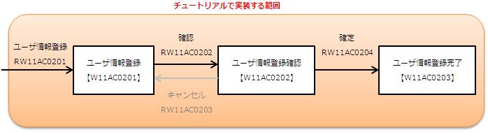

# 説明に使用する機能について

## 

なし

keywords

ユーザ情報登録機能, チュートリアル概要, Nablarchウェブアプリケーション

## ユーザ情報登録機能の概要

登録するユーザ情報:

| 項目名 | 意味 |
|---|---|
| ユーザID | 各ユーザ毎に自動採番されるシステムで一意の値 |
| 漢字氏名 | ユーザ氏名（全角文字） |
| カナ氏名 | ユーザ氏名の読み（全角カタカナ） |

画面遷移: 登録画面 → 登録確認画面 → 登録完了画面。登録確認画面からのキャンセル遷移は実装しない。

keywords

ユーザ情報登録, ユーザID, 漢字氏名, カナ氏名, 画面遷移, USERSテーブル, 自動採番

## ユーザ情報登録機能の仕様

## 画面仕様

**ユーザ情報登録画面 (W11AC0201.jsp)**
「確認」ボタン押下時に入力精査。精査OK→登録確認画面に入力内容表示、精査NG→登録画面に戻りエラーメッセージ表示。

**ユーザ情報登録確認画面 (W11AC0202.jsp)**
「確定」ボタン押下時に入力精査。精査OK→DBに登録、精査NG→登録画面に戻りエラーメッセージ表示。

**ユーザ情報登録完了画面 (W11AC0203.jsp)**
登録完了画面を表示。

## 画面情報

| 画面ID | 画面名称 | リクエストID | リクエスト名称 |
|---|---|---|---|
| W11AC0201 | ユーザ情報登録画面 | RW11AC0201 | 登録画面初期表示処理 |
| W11AC0202 | ユーザ情報登録確認画面 | RW11AC0202 | 登録入力確認処理 |
| W11AC0203 | ユーザ情報登録完了画面 | RW11AC0204 | 登録処理 |

## テーブル仕様

**テーブル**: USERS（ユーザ）

| カラム論理名 | カラム物理名 |
|---|---|
| ユーザID | USER_ID |
| 漢字氏名 | KANJI_NAME |
| カナ氏名 | KANA_NAME |

## 精査仕様（単項目）

| 論理名 | 精査内容 | メッセージID |
|---|---|---|
| 漢字氏名 | 必須 | デフォルト |
| 漢字氏名 | 文字種（全角） | デフォルト |
| 漢字氏名 | 文字列長（50桁以下） | デフォルト |
| カナ氏名 | 必須 | デフォルト |
| カナ氏名 | 文字種（全角カタカナ） | デフォルト |
| カナ氏名 | 文字列長（50桁以下） | デフォルト |

> **注意**: メッセージIDはアプリケーション中でユーザへの通知メッセージを一意に特定するもの。全バリデーションがデフォルトのメッセージIDを使用するため、カスタムメッセージIDの設定は不要。

## 登録処理仕様

| カラム論理名 | カラム物理名 | 登録する値 |
|---|---|---|
| 漢字氏名 | KANJI_NAME | 入力項目.漢字氏名 |
| カナ氏名 | KANA_NAME | 入力項目.カナ氏名 |
| 作成者ID | INSERT_USER_ID | 実行ユーザ（NAFにより自動設定） |
| 作成日時 | INSERT_DATE | システム日時（NAFにより自動設定） |
| 更新者ID | UPDATED_USER_ID | 実行ユーザ（NAFにより自動設定） |
| 更新日時 | UPDATED_DATE | システム日時（NAFにより自動設定） |

keywords

ユーザ情報登録仕様, 機能仕様, バリデーション, 精査仕様, W11AC0201, W11AC0202, W11AC0203, RW11AC0201, RW11AC0202, RW11AC0204, USERS, USER_ID, KANJI_NAME, KANA_NAME, 登録処理仕様, 全角, 全角カタカナ, 必須, 文字列長, INSERT_USER_ID, INSERT_DATE, UPDATED_USER_ID, UPDATED_DATE, NAF自動設定

