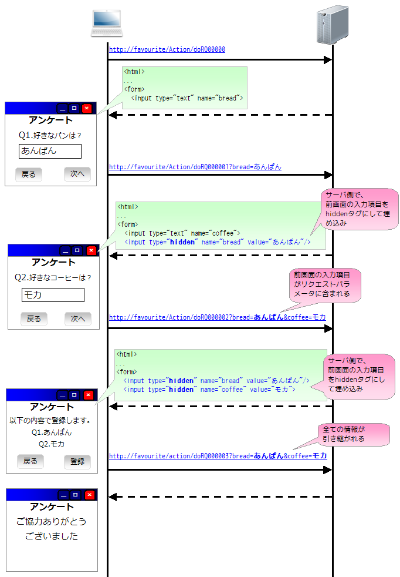

# Appendix A: ウィンドウスコープ概要

## 動作イメージ

ウィンドウスコープはリクエストを跨るデータを格納する領域。セッションスコープ（アプリサーバ上のデータ格納）と異なり、hiddenタグで複数画面間を持ちまわることで実現される。複数ウィンドウの並列動作が可能で、ブラウザのヒストリバックによる遷移もできる。

hiddenで引き継がれる情報は特定のウィンドウ内のHTMLに記載されており、他のウィンドウやタブに影響を与えずに複数のリクエストをまたがったデータ共有を実現している。

> **注意**: ウィンドウスコープに格納された変数はカスタムタグにより自動的にhiddenタグに変換される。アプリケーションプログラマがJSPにhiddenタグを書く必要はない。（実装方法は :ref:`window_scope_guide_links` 参照）

keywords

ウィンドウスコープ, hiddenタグ, 複数ウィンドウ並列動作, ヒストリバック, カスタムタグ自動変換, ウィンドウ内HTML, クロスリクエストデータ共有

## セッションスコープとの使い分け

基本的にセッションスコープではなく**ウィンドウスコープを使用**する。

| ケース | 使用するスコープ |
|---|---|
| ウィンドウ間でデータを共有しない（ほとんどの場合） | ウィンドウスコープ |
| ウィンドウ間でデータを共有する必要がある場合 | セッションスコープ |

ウィンドウ間でデータを共有する用途の例: ショッピングサイトのショッピングカート内の商品情報は、ユーザが複数のウィンドウを使用していても、ユーザに対して１つにしなければならない。このような用途にはセッションスコープを使用する。

keywords

ウィンドウスコープ, セッションスコープ, スコープ使い分け, ウィンドウ間データ共有, ショッピングカート

## 詳細情報

- 変数スコープ（ウィンドウスコープ・セッションスコープ等）の利用方法: [変数スコープの利用](../../../fw/reference/handler/HttpMethodBinding.html#web-scope)
- カスタムタグを使用したウィンドウスコープの使用方法: :ref:`howto_window_scope`

keywords

ウィンドウスコープ実装, 変数スコープ, howto_window_scope, カスタムタグ実装

