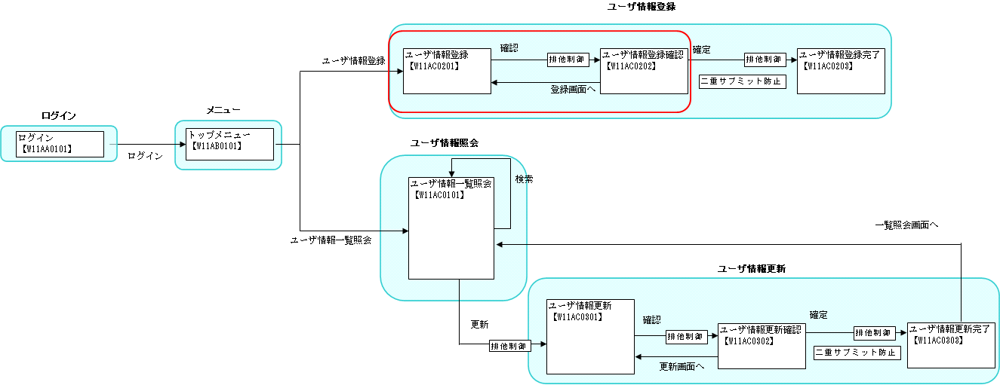

# 入力内容の精査

## 本項で説明する内容

### 説明内容

本項では、以下の内容を説明する。

* データベースアクセスを伴わない単項目精査や項目間精査
* 画面より入力された情報を持ったオブジェクトの取得
* エラー(例外)発生時の処理

### 作成内容

本項で作成するのは、下記画面遷移図の赤丸の部分である。ただし"戻る"遷移は対象外(戻る遷移については [画面遷移処理](../../guide/web-application/web-application-05-screenTransition.md#screentransition) 参照のこと)。



編集するソースコードは以下のとおり。

| 名称 | ステレオタイプ | 処理内容 |
|---|---|---|
| W11AC02FormBase.java | Form | 画面/取引に対応したクラス。取引において画面で入力されたデータを保持する。 |
| W11AC02Form.java | Form | FormBaseクラスを継承し、画面/取引に対応したクラス。取引においてアプリケーションで使用するデータ（画面で入力された項目以外）を保持する。 また、外部入力値の精査を実行するクラス。 |
| W11AC02Action.java | Action | 画面入力値が設定されたオブジェクトの取得、例外処理を行う。 上記ビジネスロジックを実行し、結果をリクエストスコープに格納、JSPに遷移させる。 |
| W11AC0201.jsp | View | ユーザ情報登録画面の入力に誤りがあった場合、エラーメッセージを表示する。 |

ステレオタイプについては [業務コンポーネントの責務配置](../../about/about-nablarch/about-nablarch-01-NablarchOutline.md#stereotype) を参照。

## 作成手順

### Formの生成

画面/取引に対応したFormクラスを新規に作成する。
Formクラスには、画面から入力する値や取引で必要となる精査処理（単項目精査や項目間精査）を実装する。

#### プロパティの追加

Formクラスには、画面からの入力値や取引で必要な値に対応するプロパティが必要である。
これらの値に対応するプロパティは、以下の指針に従ってFormクラスに追加されている。

* プロパティが取引内の画面からの入力値に対応する場合には、そのプロパティをFormBaseクラスに追加する。
* プロパティが上記に該当しない場合には、そのプロパティをFormクラスに追加する。

> **Note:**
> テーブルと1対1に対応付けられたFormをEntityと呼ぶ。

プロパティを追加する手順は以下のようになる。

Form（およびFormBase）にプロパティ(メンバ変数、setter、getter)を追加する。

FormのMapを引数にとるコンストラクタに、追加したプロパティの値を設定する処理を追加する。

W11AC02FormBaseにプロパティを追加した例を以下に示す。

なお、本項の説明に使用している取引では、画面からの入力値以外に取引内で必要とする値は存在しないため、
W11AC02Formにはプロパティを追加していない。
このような場合の実装例としては、W11AC03Formなどを参照すること。

```java
/**
 * ユーザ情報登録フォーム。
 *
 * @author Nablarch Taro
 * @since 1.0
 */
public abstract class W11AC02FormBase {

    //---- プロパティ ----//
    // 【説明】画面からの入力項目に対応したプロパティを定義する。

    /** ログインID */
    private String loginId;

    // ～中略～

    //---- コンストラクタ ----//

    /** デフォルトコンストラクタ。 */
    public W11AC02FormBase() {
    }

    /**
     * Mapを引数にとるコンストラクタ。
     *
     * @param params 項目名をキーとし、項目値を値とするMap
     */
    public W11AC02FormBase(Map<String, Object> params) {

        loginId = (String) params.get("loginId");
        newPassword = (String) params.get("newPassword");
        confirmPassword = (String) params.get("confirmPassword");
        kanjiName = (String) params.get("kanjiName");
        kanaName = (String) params.get("kanaName");
        mailAddress = (String) params.get("mailAddress");
        extensionNumberBuilding = (String) params.get("extensionNumberBuilding");
        extensionNumberPersonal = (String) params.get("extensionNumberPersonal");
        mobilePhoneNumberAreaCode = (String) params.get("mobilePhoneNumberAreaCode");
        mobilePhoneNumberCityCode = (String) params.get("mobilePhoneNumberCityCode");
        mobilePhoneNumberSbscrCode = (String) params.get("mobilePhoneNumberSbscrCode");
        ugroupId = (String) params.get("ugroupId");
        permissionUnit = (String[]) params.get("permissionUnit");
    }

    /**
     * プロパティの情報をMapに変換する。
     *
     * @return 変換後のMap
     */
    protected Map<String, Object> toMap() {
        Map<String, Object> result = new HashMap<String, Object>();

        result.put("loginId", loginId);
        result.put("newPassword", newPassword);
        result.put("confirmPassword", confirmPassword);
        result.put("kanjiName", kanjiName);
        result.put("kanaName", kanaName);
        result.put("mailAddress", mailAddress);
        result.put("extensionNumberBuilding", extensionNumberBuilding);
        result.put("extensionNumberPersonal", extensionNumberPersonal);
        result.put("mobilePhoneNumberAreaCode", mobilePhoneNumberAreaCode);
        result.put("mobilePhoneNumberCityCode", mobilePhoneNumberCityCode);
        result.put("mobilePhoneNumberSbscrCode", mobilePhoneNumberSbscrCode);
        result.put("ugroupId", ugroupId);
        result.put("permissionUnit", permissionUnit);

        return result;
    }

    //------ プロパティアクセッサ -----//
    // 【説明】 プロパティに対するアクセスメソッド
    //  setterには、精査用のアノテーションを付加する。

    /**
     * ログインIDを取得する。
     *
     * @return ログインID。
     */
    public String getLoginId() {
        return this.loginId;
    }

    /**
     * ログインIDを設定する。
     *
     * @param loginId 設定するログインID。
     *
     */
    @PropertyName("ログインID")
    @Required
    @Length(max = 20)
    @SystemChar(charsetDef = "asciiCharset", allowLineSeparator = false)
    public void setLoginId(String loginId) {
        this.loginId = loginId;
    }

    // ～後略～
}
```

( [記載しているサンプルプログラムソースコードの注意事項](../../about/about-nablarch/about-nablarch-aboutThis.md#sourcecode) 参照)

#### バリデーションの実装

各プロパティに対するバリデーションを行う場合、下記の実装が必要となる。

* FormBaseおよびFormに定義したsetterにアノテーションを付与する。
* Formにバリデーションメソッドを実装する。

##### アノテーションの付与

W11AC02Formの確認用パスワードのsetterに対してアノテーションを付与する場合の実装例を以下に示す。

```java
/**
 * 確認用パスワードを設定する。
 *
 * @param confirmPassword 設定する確認用パスワード
 */
@PropertyName("パスワード（確認用）")                        // 【説明】プロパティ名称の指定(エラー発生時に表示される項目名に使われる)
@Required                                                    // 【説明】必須入力チェック
@Length(max = 20)                                            // 【説明】文字列長チェック(最大20文字)
@SystemChar(charsetDef="asciiCharset")                       // 【説明】ASCII文字のみからなる文字列であるかをチェック
public void setConfirmPassword(String confirmPassword) {
    this.confirmPassword = confirmPassword;
}
```

( [記載しているサンプルプログラムソースコードの注意事項](../../about/about-nablarch/about-nablarch-aboutThis.md#sourcecode) 参照)

アプリケーションフレームワークが提供しているバリデータについては、 [基本バリデータ・コンバータ](../../../fw/reference/core_library/validation_basic_validators.html) および [拡張バリデータ](../../../fw/reference/core_library/validation_advanced_validators.html) を参照。

> **Note:**
> Integer、Long、BigDecimal といった数値型のプロパティには、@Digits アノテーションを設定する。

> Webアプリケーションでは、システム外部からの入力は基本的に文字列のみからなるため、数値型のプロパティに値を設定するためにはデータ型を変換する必要がある。
> 数値型のプロパティに @Digits アノテーションを設定することで、数値精査とデータ型の変換が実行される。

> 数値型のプロパティに対するバリデーションの設定例を以下に示す。

> ```java
> /**
>  * 認証失敗回数を設定する。
>  *
>  * @param failedCount 設定する認証失敗回数。
>  */
> @PropertyName("認証失敗回数")
> @Required
> @Digits(integer = 1, fraction = 0)  // 【説明】数値フォーマット指定を表す。integerには整数部桁数、fractionには小数部桁数を設定する。
> @NumberRange(min = 0, max = 9)      // 【説明】数値範囲チェック。桁数以外に最大値や最小値を指定したい場合に使用する。
> public void setFailedCount(Integer failedCount) {
>     this.failedCount = failedCount;
> }
> ```

##### バリデーションメソッドの実装

Formにバリデーションメソッドを追加し、 `@ValidateFor` アノテーションを付与する。このアノテーションの値はバリデーションを実施する際に使用する( [Actionの作成](../../guide/web-application/web-application-04-validation.md#04-action) 参照)。

処理に応じて精査対象のプロパティを切り替えたい場合は、処理ごとにバリデーションメソッドを用意すること。
例えばパスワードは、登録時は自動で値を設定するため精査は不要だが、パスワード更新機能では画面から入力するため精査が必要なので、
登録処理用のバリデーションメソッドと、更新処理用のバリデーションメソッドを実装する必要がある。
詳細は  [バリデーションメソッドを複数作成したい場合](../../guide/web-application/web-application-04-validation.md#multiple-validation-method) を参照すること。

具体的な実装としては、バリデーション対象としたいプロパティ名の配列、もしくは、バリデーション対象 **外** としたいプロパティ名の配列を用意し、
追加したバリデーションメソッド内でValidationUtilクラスのメソッドを呼び出す。

どちらの場合にどのメソッドを呼び出すかは以下のとおり。

| 用意する配列 | 呼び出すメソッド |
|---|---|
| バリデーション対象としたいプロパティ名の配列を用意した場合 | ValidationUtil#validate |
| バリデーション対象外としたいプロパティ名の配列を用意した場合 | ValidationUtil#validateWithout |

呼び出し後、ValidationContext#isValidメソッド(エラーなしの場合true)を使用してバリデーションの結果を確認し、エラー有無に応じた処理を行う。

バリデーション対象としたいプロパティ名の配列を用意した場合の例(W11AC03Form)を以下に示す。

```java
/**
 * ユーザ選択時のパラメータを精査する。
 *
 * @param context バリデーションの実行に必要なコンテキスト
 */
@ValidateFor("find")
public static void validateForSelectUser(ValidationContext<W11AC03Form> context) {
    // 【説明】バリデーション対象としたいプロパティ名の配列を指定して、
    // ValidationUtil#validateを呼び出し
    ValidationUtil.validate(context, new String[] {"userId"});
}
```

( [記載しているサンプルプログラムソースコードの注意事項](../../about/about-nablarch/about-nablarch-aboutThis.md#sourcecode) 参照)

バリデーション対象外としたいプロパティ名の配列を用意した場合の例(W11AC02Form)を以下に示す。

```java
/**
 * ユーザ登録時に実施するバリデーション
 *
 * @param context バリデーションの実行に必要なコンテキスト
 */
@ValidateFor("insert")
public static void validate(ValidationContext<W11AC02Form> context) {
    // 【説明】バリデーション対象外としたいプロパティ名の配列を指定して、
    // ValidationUtil#validateWithoutを呼び出し
    // この例ではすべてのプロパティをバリデーションするため、空のString配列を指定している
    ValidationUtil.validateWithout(context, new String[0]);

    // ～後略～
}
```

( [記載しているサンプルプログラムソースコードの注意事項](../../about/about-nablarch/about-nablarch-aboutThis.md#sourcecode) 参照)

#### 独自の精査処理(項目間精査)を行いたい場合

独自の精査処理(項目間精査)を行いたい場合も、バリデーションメソッド内で実装を行う。

精査エラーの場合、ValidationContextにエラーメッセージを格納し処理を終了する。使用するメソッドは下表を参照。エラーがなかった場合は特に何もしない。

| メソッド | 用途 | 例 |
|---|---|---|
| addResultMessage(String propertyName, String messageId, Object... params) | 特定の項目に対する 精査エラー | 新パスワードと確認用パスワードが 異なる場合 |
| addMessage(String messageId, Object... params) [1] | 全体に跨るエラー | 検索条件が１つ以上必要な場合に、 １つも条件指定がされなかった場合 |

脚注

具体的な使用例については、 W11AC01Form#validateForSearch(ValidationContext) を参照

W11AC02Formの例を以下に示す(後半部分が項目間精査処理)。ここでは、入力した新パスワードと、確認のために入力した確認用パスワードが
一致するかどうか(一致しなければエラー)と、携帯電話番号がすべて入力されているかもしくはひとつも入力されていないかを精査している。

```java
/**
 * ユーザ登録時に実施するバリデーション
 *
 * @param context バリデーションの実行に必要なコンテキスト
 */
@ValidateFor("insert")
public static void validate(ValidationContext<W11AC02Form> context) {
    ValidationUtil.validateWithout(context, new String[0]);

    if (!context.isValid()) {
        return;
    }

    W11AC02Form form = context.createObject();
    // 新パスワードと確認用パスワードのチェック
    if (!form.matchConfirmPassword()) {
       // 【説明】精査エラーが発生した場合は、エラーメッセージを設定して処理を終わる
        context.addResultMessage("newPassword", "MSG00003");
    }
    // 携帯電話番号が全項目入力されているがひとつも入力されていないことのチェック
    if (!form.isValidateMobilePhoneNumbers()) {
        context.addResultMessage("mobilePhoneNumber", "MSG00004");
    }
}
```

( [記載しているサンプルプログラムソースコードの注意事項](../../about/about-nablarch/about-nablarch-aboutThis.md#sourcecode) 参照)

> **Warning:**
> 独自の精査処理を実装し使用する場合、その処理内でValidationUtil#validateや
> ValidationUtil#validateWithoutを呼び出さないと、アプリケーションフレームワークが提供するバリデータによる
> 精査は行われないので、注意すること。

#### バリデーションメソッドを複数作成したい場合

登録処理時と更新処理時で精査内容が異なる場合など、独自の精査処理が複数必要になる場合がある。
この場合、それぞれ処理に応じた精査メソッドを追加する。
各メソッドに付与する `@ValidateFor` アノテーションの値は異なるものにしておき、
バリデーションを実施する際( [Actionの作成](../../guide/web-application/web-application-04-validation.md#04-action) 参照)に呼び分ける。

例えば、更新用に精査メソッドを追加する場合は以下のようになる。

```java
// 【説明】アノテーションの値を他の精査メソッドと別のものにしておく
@ValidateFor("updateUser")
public static void validateForUpdate(ValidationContext<SearchCondition> context) {
   // 中略
}
```

#### プロパティの表示名をカスタマイズしたい場合

例えば、"ユーザ名"(バリデーションエラー時などで画面に出力される表示名も"ユーザ名")というプロパティの表示名を"氏名"としたい場合は、Formの対応するプロパティのsetterをオーバーライドし、
@PropertyNameアノテーションを付与すればよい。このとき、バリデーションは元の指定(△△△.javaで指定されているもの)が、そのまま継承される。

下記の例では、kanjiNameプロパティの表示名(元は(W11AC02FormBaseの@PropertyNameアノテーションの値)は"漢字氏名")を"氏名"に変更している。

```java
public class W11AC02FormSample extends W11AC02FormBase {
    @PropertyName("氏名")  /* 【説明】
                               setterをオーバーライドし、@PropertyNameアノテーションで変更したい表示名を指定する。
                               バリデーションは元のものがそのまま継承される */
    public void setKanjiName(String kanjiName) {
        super.setKanjiName(kanjiName);
    }
}
```

( [記載しているサンプルプログラムソースコードの注意事項](../../about/about-nablarch/about-nablarch-aboutThis.md#sourcecode) 参照)

> **Note:**
> サンプルアプリケーションでは本機能は用いていない。このため、記載したコード例はサンプルアプリケーションには含まれない。

### Actionの作成

#### バリデーションの実行と画面入力値が設定されたオブジェクトの取得

バリデーションの実行と、画面入力値が設定されたオブジェクトを生成するためのメソッドを、Formクラスにstaticメソッドとして実装する。

ValidationUtil#validateAndConvertRequestを使用してバリデーションを実行する。独自に実装したバリデーション用のメソッドを実行するには、引数に「バリデーション対象メソッド」を用意したvalidateAndConvertRequestメソッドを使用する [2] 。この引数の値に `@ValidateFor` アノテーションを付与する際に設定した値とすることで、独自に実装したバリデーション用のメソッドが実行される。

ValidationContext#abortIfInvalidメソッドを使用して、バリデーションエラーが存在していた場合はApplicationExceptionをthrowする。

ValidationContext#createObjectメソッドを使用して、画面入力値が設定されたオブジェクトを取得する。このとき取得できるクラスはValidationUtil#validateAndConvertRequestの第2引数に設定したクラスとなる。

W11AC02Formの例を以下に示す。

```java
/**
 * バリデーションを実施する。
 *
 * @param req 入力パラメータ情報
 * @param validationName 使用するバリデーションの名前
 * @return 入力パラメータを精査後に生成した本フォーム
 */
public static W11AC02Form validate(HttpRequest req, String validationName) {
    // 【説明】 バリデーションを実行する。
    ValidationContext<W11AC02Form> context = ValidationUtil.validateAndConvertRequest(
            "W11AC02", W11AC02Form.class, req, validationName);

    // 【説明】バリデーション結果を確認し、バリデーションエラーが存在した場合にはApplicationExceptionをthrowする。
    context.abortIfInvalid();

    // 【説明】画面入力値が設定されたオブジェクトを取得する。
    return context.createObject();
}
```

ここでは以下のシグネチャのメソッドを使用している。
`validateAndConvertRequest(String prefix, Class<T> targetClass, Validatable<?> request, String validateFor)`

#### 例外発生時の処理

ComponentやActionで例外が発生した場合、デフォルトではHTTPステータス500のレスポンスがブラウザに返される。この応答を変更したい場合は、例外処理が必要なメソッドに、
@OnErrorアノテーションを付与し、例外発生時の処理(例外発生時の遷移先の指定)を行う。

具体例は [メソッドの実装](../../guide/web-application/web-application-04-validation.md#04-actionclasscreate) を参照。

#### メソッドの実装

[バリデーションの実行と画面入力値が設定されたオブジェクトの取得](../../guide/web-application/web-application-04-validation.md#04-validation) と [例外発生時の処理](../../guide/web-application/web-application-04-validation.md#04-errhandling) に従い *W11AC02Actionクラス* を作成し以下のメソッドを追加する。このメソッドでは、次の処理を行っている。

@OnErrorアノテーションを使用して、ApplicationException例外発生時の処理を記述。

画面入力値が設定されているオブジェクトの取得。

データベースアクセスを伴う精査

ビジネスロジックの実行

```java
/**
 * ユーザ情報登録画面の「確認」イベントの処理を行う。
 *
 * @param req リクエストコンテキスト
 * @param ctx HTTPリクエストの処理に関連するサーバ側の情報
 * @return HTTPレスポンス
 */
@OnError(                              // 【説明】例外処理用アノテーション
    type = ApplicationException.class, // 【説明】例外処理の対象とする例外クラス

    /* 【説明】
        例外発生時の処理。ここではリクエストID"RW11AC0201"の処理を行うよう(doRW11AC0201メソッドを実行するよう)
        指定している。 */
    path = "forward://RW11AC0201"
)
public HttpResponse doRW11AC0202(HttpRequest req, ExecutionContext ctx) {

    // 精査
    validate(req);

    // ～中略～

}

/**
 * 入力データの精査と生成を行う。<br>
 * <br>
 * 精査エラーの場合はApplicationExceptionを送出する。
 *
 * @param req リクエスト
 * @return 精査済みの入力データから生成したエンティティ
 */
private W11AC02Form validate(HttpRequest req) {

    // 生成
    // 【説明】画面入力値が設定されたオブジェクトを生成する。
    W11AC02Form form = W11AC02Form.validate(req, "insert");
    SystemAccountEntity systemAccount = form.getSystemAccount();
    CM311AC1Component component = new CM311AC1Component();

    // 【説明】データベースアクセスを伴う精査を実施する。
    // ログインIDのチェック
    checkLoginId(systemAccount.getLoginId());

    // グループIDのチェック
    if (!function.existGroupId(form.getUgroupSystemAccount())) {
        throw new ApplicationException(MessageUtil.createMessage(MessageLevel.ERROR,
                "MSG00002", MessageUtil.getStringResource("S0020001")));
    }

    // 認可単位IDのチェック
    if (systemAccount.getPermissionUnit() != null
            && !function.existPermissionUnitId(systemAccount)) {
        throw new ApplicationException(MessageUtil.createMessage(MessageLevel.ERROR,
                "MSG00002", MessageUtil.getStringResource("S0030001")));
    }

    return form;
}
```

( [記載しているサンプルプログラムソースコードの注意事項](../../about/about-nablarch/about-nablarch-aboutThis.md#sourcecode) 参照)

サンプルアプリケーションでは、バリデーションの処理をプライベートメソッドに切り出しているが、必ずプライベートメソッドに切り出す必要は **ない** 。

> **Note:**
> doRW11AC0201メソッドは、ユーザ情報登録画面を初期表示する処理。

> **Note:**
> @OnErrorのpathの記述方法はHttpResponseの引数と同じである。詳細は [画面初期表示のActionの作成](../../guide/web-application/web-application-02-basic.md#makeactionclass) 参照。

### View(JSP)の作成

以下の内容で *W11AC0201.jsp* を作成する。

エラーメッセージを表示する場所に、アプリケーションフレームワーク提供のn:errorsタグとn:errorタグを記述する。
n:errorsタグは複数のエラーメッセージの一覧表示、n:errorタグは各入力項目のエラーメッセージ表示に使用する。
サンプルでは、各入力項目以外のエラーメッセージを画面上部に一覧表示するためにn:errorsタグを使用し、
各入力項目に関するエラーメッセージを入力項目の下に表示するためにn:errorタグを使用する。

* app_error.jsp

```./_source/04/app_error.jsp

```

( [記載しているサンプルプログラムソースコードの注意事項](../../about/about-nablarch/about-nablarch-aboutThis.md#sourcecode) 参照)

* W11AC0201.jsp(一覧表示)

```./_source/04/W11AC0201_errors.jsp

```

( [記載しているサンプルプログラムソースコードの注意事項](../../about/about-nablarch/about-nablarch-aboutThis.md#sourcecode) 参照)

* W11AC0201.jsp(ログインIDの入力項目を抜粋)

```./_source/04/W11AC0201_error.jsp

```

( [記載しているサンプルプログラムソースコードの注意事項](../../about/about-nablarch/about-nablarch-aboutThis.md#sourcecode) 参照)

画面の入力項目には、フレームワーク提供のカスタムタグ及びサンプル提供のカスタムタグファイルを使用する。
入力項目のカスタムタグは、リクエストパラメータの名前となるname属性を、以下の形式で指定する。

Formに追加したEntityのプロパティを指定する場合:

```
<バリデーションで指定するプレフィックス名>.<FormでのEntityのプロパティ名>.<Entityでのプロパティ名>
```

Formに直接追加したプロパティを指定する場合:

```
<バリデーションで指定するプレフィックス名>.<プロパティ名>

ユーザ情報登録では、Formに対してW11AC02というプレフィックスを使用している。
```

* W11AC0201.jsp(入力フォーム)

```./_source/04/W11AC0201_form.jsp

```

( [記載しているサンプルプログラムソースコードの注意事項](../../about/about-nablarch/about-nablarch-aboutThis.md#sourcecode) 参照)

## 次に読むもの

* [バリデーションとEntityの生成を詳しく知りたい時](../../../fw/reference/02_FunctionDemandSpecifications/01_Core/08_Validation.html)
* [例外処理を詳しく知りたい時](../../../fw/reference/handler/HttpMethodBinding.html)
* [カスタムタグの使用方法を詳しく知りたい時](../../../fw/reference/02_FunctionDemandSpecifications/03_Common/07_WebView.html)
