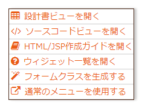

# FormBaseクラスの自動生成

## 業務画面JSPの修正

## 業務画面JSPの修正

FormBaseクラスは、Nablarch UI開発基盤のフォーム自動生成機能を使用して、業務画面JSPから自動生成する。このクラスは、画面入力項目に対応したプロパティを持ち、それらの入力項目に対する精査を行う。

外部設計で作成されたJSPファイルを `main/web/ss11AC` ディレクトリに移動する:
- `main/web/W11AC0201.jsp`
- `main/web/W11AC0202.jsp`
- `main/web/W11AC0203.jsp`

修正対象は `W11AC0201.jsp` のみ。以下の2点を修正する。

**1. n:formタグの追加**

業務領域（`<jsp:attribute name="contentHtml">` の内側全体）を `n:form` で囲み、`windowScopePrefixes` に値を設定する。登録取引を行う取引IDから `W11AC02` というプレフィックスを使用する。

```jsp
<n:form windowScopePrefixes="W11AC02">
```

> **注意**: すでに `n:form` で囲まれている場合は、`windowScopePrefixes` の設定のみ行う。

**2. name属性の指定**

`name` 属性の形式:
```
"ウィンドウスコーププレフィックス"."フォーム内のプロパティ名"
```

フォーム内のプロパティ名はDBカラム名をキャメルケース変換した文字列に統一する（DB登録処理の実装が容易になるため）。

修正例（漢字氏名）:

修正前:
```jsp
<field:text title="漢字氏名"
            domain="KANJI_NAME"
            required="true"
            maxlength="50"
            hint="全角50文字以内"
            dataFrom="USERS.KANJI_NAME"
            name=""
            sample="名部　楽太郎">
</field:text>
```

修正後:
```jsp
<field:text title="漢字氏名"
            domain="KANJI_NAME"
            required="true"
            maxlength="50"
            hint="全角50文字以内"
            dataFrom="USERS.KANJI_NAME"
            name="W11AC02.kanjiName"
            sample="名部　楽太郎">
</field:text>
```

<details>
<summary>keywords</summary>

業務画面JSP修正, n:formタグ, windowScopePrefixes, ウィンドウスコープ, name属性設定, field:text, FormBaseクラス, 画面入力項目, 精査

</details>

## 業務画面JSPからFormBaseクラスを自動生成

## 業務画面JSPからFormBaseクラスを自動生成

1. `main/web/tools/ローカル画面確認.bat` を起動する
2. ブラウザで `ss11AC/W11AC0201.jsp` を選択してユーザ情報登録画面を表示する
3. 表示された画面を右クリックし、「フォームクラスを生成する」を選択する



4. `W11AC02FormBase.java` が生成・ダウンロードされるので、`main/java/nablarch/sample/ss11AC` にコピーする

<details>
<summary>keywords</summary>

FormBaseクラス自動生成, W11AC02FormBase, ローカル画面確認, フォームクラス生成, Nablarch UI開発基盤

</details>
