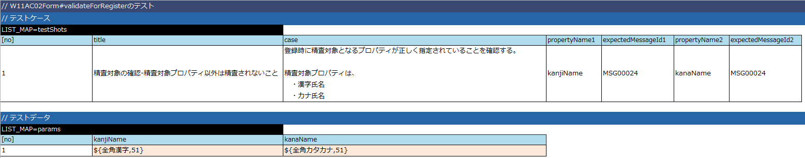

# Formクラスの実装

ユーザ登録画面に対応するFormクラスを以下のステップで実装する。

Formクラスは、業務画面JSPから自動生成したFormBaseクラスを継承し、
前画面や別取引からの引継ぎ項目など、画面入力項目に対応しないプロパティを保持する。

また、精査用メソッドとリクエストからフォームを生成するためのメソッドも実装する。

* Formクラスの作成
* Formクラスの精査処理実装

  * Formクラスに実装する精査処理の単体テストを作成
  * Formクラスの単体テストを実行
  * Formクラスに精査処理を実装
  * Formクラスの単体テストを実行
* 精査処理とFormの生成を行うメソッドの実装

## Formクラスの作成

本機能で使用するFormクラスを作成する。

本機能では、前画面や別取引からの引継ぎ項目が存在しないため、精査用メソッドと
フォーム生成用メソッドのみ実装する。

ここでは、クラスを作成し、デフォルトコンストラクタと、Mapを引数に取るコンストラクタを作成しておく。

| ソース格納フォルダ | クラス名 |
|---|---|
| main/java/nablarch/sample/ss11AC | W11AC02Form |

```java
/**
 * ユーザ情報登録で使用するユーザ情報を保持するフォーム。
 *
 * @author Nablarch Taro
 * @since 1.0
 */
public class W11AC02Form extends W11AC02FormBase {

    /** コンストラクタ。 */
    public W11AC02Form() {
    }

    /**
     * Mapを引数に取るコンストラクタ。
     *
     * @param data 各プロパティのデータを保持したMap
     */
    public W11AC02Form(Map<String, Object> data) {
        super(data);
    }
}
```

## Formクラスの精査処理実装

### Formクラスに実装する精査処理の単体テストを作成

1. Form単体テストデータの作成

  Formクラスに実装する精査処理の単体テストでは、以下を検証する。 [1]

  * 精査対象となっているプロパティに対して、精査が行われていること。
  * 精査対象となっていないプロパティに対して、精査が行われていないこと。

  | データシート格納フォルダ | データシートファイル名 | シート名 |
  |---|---|---|
  | test/java/nablarch/sample/ss11AC | W11AC02FormTest.xlsx | testValidateForRegister |

  以下に、テストデータの例を示しておく。（詳細は、 [Form/Entityのクラス単体テスト](../../development-tools/testing-framework/testing-framework-01-entityUnitTest.md#formentityのクラス単体テスト) 参照）

  

  前画面や別取引からの引継ぎ項目が存在し、Formクラスにプロパティを実装する場合には、
  それらのプロパティに対して単項目精査が正しく実装されていることをテストする必要がある。

  そのような場合の実装方法については [入力内容の精査](../../guide/web-application/web-application-04-validation.md#入力内容の精査) や [精査処理の実装例集](../../guide/web-application/web-application-Validation.md#精査処理の実装例集) を、
  テスト方法については [Form/Entityのクラス単体テスト](../../development-tools/testing-framework/testing-framework-01-entityUnitTest.md#formentityのクラス単体テスト) を参照すること。
2. Form単体テストコードの作成

  実装するFormクラスの単体テストコードとして登録機能用のテストメソッド(`testValidateForRegister`)を追加する。

  | テストクラス格納フォルダ | テストクラス名 | テストメソッド名 |
  |---|---|---|
  | test/java/nablarch/sample/ss11AC | W11AC02FormTest | testValidateForRegister |

  ```java
  /**
   * {@link W11AC02Form}のテスト。
   *
   * @author Nablarch Taro
   * @since 1.0
   */
  public class W11AC02FormTest extends SampleEntityTestSupport {
  
      /**
       * {@link W11AC02Form#validateForRegister(nablarch.core.validation.ValidationContext)} のテスト。
       */
      @Test
      public void testValidateForRegister() {
          testValidateAndConvert(W11AC02Form.class, "testValidateForRegister", "register");
      }
  }
  ```

### Formクラスの単体テストを実行

単体テストを実行し、テストが失敗することを確認する。（精査メソッドを実装していない為）

> **Note:**
> クラス単体テストは、テスト対象のクラス(～Test.java)を右クリックし、[実行]→[Junitテスト]を選択して実行する。
> テスト失敗時には下記のように JUnit ビューにエラーが表示される。

> 

### Formクラスに精査処理を実装

| ソース格納フォルダ | クラス名 | メソッド名 |
|---|---|---|
| main/java/nablarch/sample/ss11AC | W11AC02Form | validateForRegister |

単項目精査の対象とするプロパティ名の配列を引数として、
単項目精査を実行するメソッド(`ValidationUtil#validate(ValidationContext, String[])`)を呼び出す。

```java
/**
 * ユーザ情報登録時に実施するバリデーション
 *
 * @param context バリデーションの実行に必要なコンテキスト
 */
@ValidateFor("register")
public static void validateForRegister(ValidationContext<W11AC02Form> context) {

    // 【説明】単項目精査対象項目変数のセット
    // FormBaseクラスに定義されている、画面入力項目に対応したプロパティを設定しておく。
    ValidationUtil.validate(context, new String[] {"kanjiName", "kanaName"});
}
```

なお、Nablarchでは単項目精査の **対象外** とするプロパティ名を渡すメソッドも準備されており、
今回の場合は、そちらを利用しても良い。

```java
// 【説明】単項目精査対象外項目変数のセット
// すべてのプロパティを単項目精査の対象とするので、空の配列を渡す。
ValidationUtil.validateWithout(context, new String[0]);
```

### Formクラスの単体テストを実行

Form単体テストを実行し、精査対象とするプロパティの精査が行われていることを確認する。

## 精査処理とFormの生成を行うメソッドの実装

Formクラスに、精査処理とForm生成を行うstaticメソッドを実装しておくことでActionの実装が容易になる。

`W11AC02Form` に、精査処理とForm生成を行うstaticメソッドを実装しておく。

```java
/**
 * 【説明】
 * 入力パラメータの精査処理と、Formの生成を行うメソッド。
 *
 * @param req 入力パラメータ情報
 * @param validationName 使用するバリデーションの名前
 * @return 入力パラメータを精査後に生成した本フォーム
 */
public static W11AC02Form validate(HttpRequest req, String validationName) {
    // 【説明】
    //  入力パラメータの精査処理を実行する。
    ValidationContext<W11AC02Form> context = ValidationUtil.validateAndConvertRequest(
            "W11AC02", W11AC02Form.class, req, validationName);

    // 【説明】
    //  精査エラーが発生した場合には、ApplicationExceptionを発生させる。
    context.abortIfInvalid();

    // 【説明】
    //  精査エラーが発生しなかった場合には、入力パラメータからフォームオブジェクトを生成する。
    return context.createObject();
}
```
