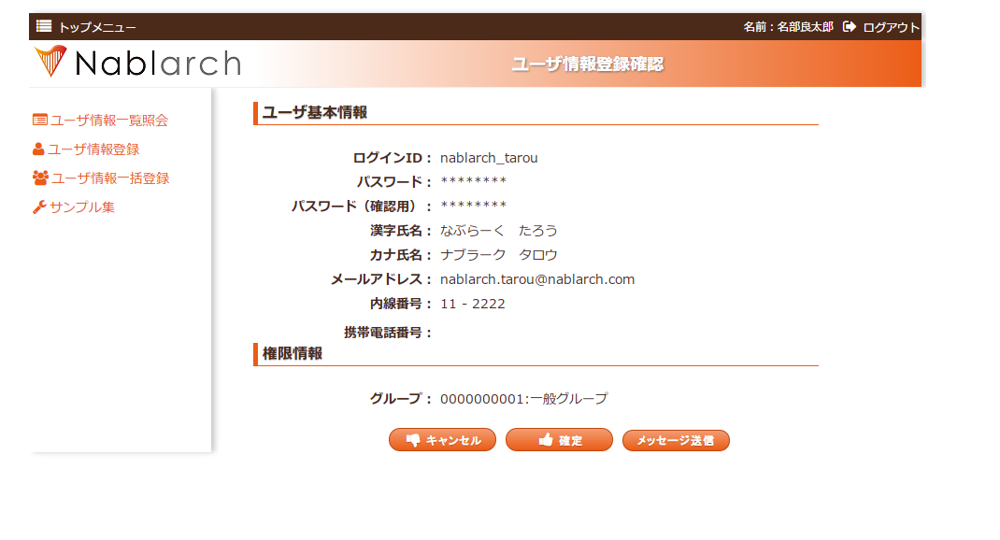

# 画面遷移処理

## 本項で説明する内容

| ファイル名 | ステレオタイプ | 処理内容 |
|---|---|---|
| [W11AC0201.jsp](../../../knowledge/guide/web-application/assets/web-application-05_screenTransition/W11AC0201.jsp), [W11AC0202.jsp](../../../knowledge/guide/web-application/assets/web-application-05_screenTransition/W11AC0202.jsp) | View | ユーザ情報登録画面の入力内容、登録画面に戻るボタン、登録処理ボタンを表示する。W11AC0202.jsp内でW11AC0201.jspを取り込む。|

ステレオタイプについては :ref:`stereoType` を参照。

<details>
<summary>keywords</summary>

画面遷移処理, View, W11AC0201.jsp, W11AC0202.jsp, JSP作成

</details>

## 作成手順

View（JSP）を作成する。対象ファイル: W11AC0201.jsp（W11AC0202.jsp内でW11AC0201.jspを取り込む構成）。

<details>
<summary>keywords</summary>

View作成手順, JSP, W11AC0201.jsp, W11AC0202.jsp, カスタムタグ

</details>

## 画面イメージ

作成するJSPの画面イメージを以下に示す。画面下の「キャンセル」ボタンと画面下の「確定」ボタンを押下したときの画面遷移処理の書き方を説明する。



<details>
<summary>keywords</summary>

画面イメージ, キャンセルボタン, 確定ボタン, 画面遷移

</details>

## ソースコード(実装方法)

画面遷移処理の実装にはアプリケーションフレームワーク提供のカスタムタグを使用する。

- `n:form` タグでHTMLフォームを作成する
- `button:cancel`（キャンセルボタン）タグ、`button:confirm`（確定ボタン）タグでボタンを出力する
- `uri` 属性にはサブミットするパスを指定する（`button` タグはサンプル提供のタグファイル）

* W11AC0201.jsp

```jsp
<!DOCTYPE HTML PUBLIC "-//W3C//DTD HTML 4.01 Transitional//EN" "http://www.w3.org/TR/html4/loose.dtd">
<!-- <%/* --> <script src="js/devtool.js"></script><meta charset="utf-8"><body> <!-- */%> -->
<%@ taglib prefix="c" uri="http://java.sun.com/jsp/jstl/core" %>
<%@ taglib prefix="n" uri="http://tis.co.jp/nablarch" %>
<%@ taglib prefix="field" tagdir="/WEB-INF/tags/widget/field" %>
<%@ taglib prefix="button" tagdir="/WEB-INF/tags/widget/button" %>
<%@ taglib prefix="t" tagdir="/WEB-INF/tags/template" %>
<%@ page language="java" contentType="text/html; charset=UTF-8" pageEncoding="UTF-8" %>

～中略～

<%-- 【説明】アプリケーションフレームワーク提供の n:form タグ。action属性は指定しない。 --%>
<n:form windowScopePrefixes="W11AC02,11AC_W11AC01">

<%-- 【説明】
  ボタンのuri属性にサブミットするパスを記述する。
  下記の場合、「キャンセル」ボタンは"/action/ss11AC/W11AC02Action/RW11AC0203"、
  「確定」ボタンは"/action/ss11AC/W11AC02Action/RW11AC0204"となる。 --%>
  <button:cancel
      uri="/action/ss11AC/W11AC02Action/RW11AC0203">
  </button:cancel>
  <button:confirm
      uri="/action/ss11AC/W11AC02Action/RW11AC0204"
      allowDoubleSubmission="false">
  </button:confirm>

～中略～

</n:form>

～後略～
```

> **注意**: `button:cancel` のデフォルトラベルは「キャンセル」、`button:confirm` は「確定」。一部画面でラベルを変えたい場合は `label` 属性に表示文言を指定する。

<details>
<summary>keywords</summary>

n:form, button:cancel, button:confirm, uri属性, カスタムタグ, ボタン出力, label属性

</details>

## 登録画面へ戻る(キャンセルボタン押下)場合の入力値の復元

キャンセルボタン押下で前画面に戻った場合に入力内容を復元するには、以下の2点を実装時に守ること。これにより単純に戻り先へ遷移させるだけで入力内容が復元される。

1. 入力項目（テキストエリア、ラジオボタンなど）はアプリケーションフレームワーク提供のカスタムタグで作成する
2. `n:form` タグの `windowScopePrefixes` 属性に、入力項目のカスタムタグの `name` 属性に指定したプレフィックス :ref:`(参照)<04_JSPNameAttribute>` を指定する

<details>
<summary>keywords</summary>

windowScopePrefixes, 入力値復元, キャンセルボタン, n:form, 画面遷移

</details>

## 次に読むもの

- [カスタムタグの使用方法を詳しく知りたい時](../../../fw/reference/02_FunctionDemandSpecifications/03_Common/07_WebView.html)

<details>
<summary>keywords</summary>

カスタムタグ, WebView, 参考資料

</details>
