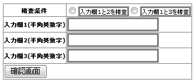

# 精査処理の実装例集

## 本ページの構成

本ページでは以下の実装例を説明する。

* [データベースアクセスを伴う精査を行う方法](../../guide/web-application/web-application-Validation.md#validation-database-access-error)
* [コード値の精査を行う方法](../../guide/web-application/web-application-Validation.md#validation-example-code-validate)
* [入力値に連動して、動的に単項目精査対象を変化させる方法(プロパティの存在有無による切り替え)](../../guide/web-application/web-application-Validation.md#validation-example-contains-key)
* [入力値に連動して、動的に単項目精査対象を変化させる方法(プロパティの値による切り替え)](../../guide/web-application/web-application-Validation.md#validation-example-contains-key-param)

## データベースアクセスを伴う精査を行う方法

アプリケーションにおいて、データベースアクセスを伴う精査は
単体項目、複合項目を問わず Entity ではなく Action に実装する。

精査エラーは、 [エラーメッセージの通知方法](../../guide/web-application/web-application-Other.md#other-example-message-notify) に示した ApplicationException
クラスを使用する方法で使用者にメッセージを通知する。

以下にユーザ登録時に行うログインIDの重複チェックを行う実装例を示す。

* 実装例

  ```java
  /* 【説明】
      データベースアクセスを伴う精査の実装例。
      Entityではなく Action (業務共通コンポーネントを含む) に精査の実装を行う。 */
  // form 生成
  W11AC02Form form = context.createObject();
  
  // form から entity 取得
  SystemAccountEntity systemAccount = form.getSystemAccount();
  
  // entityからログインIDの取得
  String loginId = systemAccount.getLoginId();
  
  // ログインIDが登録済みか、DBを検索する
  SqlPStatement statement = getSqlPStatement("SELECT_SYSTEM_ACCOUNT");
  statement.setString(1, loginId);
  if (!statement.retrieve().isEmpty()) {
      // ログインIDが登録済みの場合、 ApplicationException を送出
      throw new ApplicationException(MessageUtil.createMessage(MessageLevel.ERROR, "MSG00001"));
  }
  ```

( [記載しているサンプルプログラムソースコードの注意事項](../../about/about-nablarch/about-nablarch-aboutThis.md#sourcecode) 参照)

## コード値の精査を行う方法

コード値の精査を行う方法を示す。
ここでは、 [コード名称と値の取得方法](../../guide/web-application/web-application-Other.md#other-example-code-get) に示したコード管理用のデータがデータベースに設定されているものとする。

* 実装例

  ```java
  /* 【説明】BaseCustomerEntityクラスのJavaDocは省略。 */
  public class BaseCustomerEntity {
  
      /* 【説明】その他のプロパティおよびメソッドは省略。 */
  
      /** 性別 */
      private String gender;
  
      /* 【説明】
          コード値のバリデーションはCodeValueバリデータを使用する。
          genderプロパティに対する値が"1"、"2"、"9"以外の場合は、バリデーション結果がエラーとなる。
          BaseEntityでは、pattern属性を指定せずに精査を行う。
      */
      @PropertyName("性別")
      @CodeValue(codeId="0001")
      public String setGender(String gender) {
          this.gender = gender;
      }
  }
  
  /* 【説明】BaseEntityを継承したEntity */
  
  /* 【説明】
      業務共通機能サンプルで提供されるCodeValidationUtilをインポートする。
  
      CodeValidationUtilはサンプル実装として提供されます。
      Nablarch導入プロジェクトでは、アーキテクトがCodeValidationUtilのサンプル実装をプロジェクト内に取り込む必要があります
  */
  import please.change.me.core.validation.validator.CodeValidationUtil;
  
  public class CustomerEntity extends BaseCustomerEntity {
  
      @ValidateFor("validate")
      public static void validate(ValidationContext<CustomerEntity context) throws Exception {
          ValidationUtil.validate(context, new String[] {"gender"});
  
          // 【説明】CodeValidationUtil#validateメソッドを使用してコード値精査を行う。
          CodeValidationUtil.validate(context, "0001", "PATTERN1", "gender");
  
          // 【説明】メッセージIDを上書きする場合には、第5引数にメッセージIDを指定する。
          CodeValidationUtil.validate(context, "0001", "PATTERN1", "gender", "message_id");
      }}
  ```

( [記載しているサンプルプログラムソースコードの注意事項](../../about/about-nablarch/about-nablarch-aboutThis.md#sourcecode) 参照)

## 入力値に連動して、動的に単項目精査対象を変化させる方法(プロパティの存在有無による切り替え)

例えば、ラジオボタンを選択したか否かに応じて、単項目精査対象を変更したい場合は、FormクラスのValidateForアノテーションを
付与したメソッドでWebUtil#containsPropertyKeyを使用する。

以下に実装例を示す。

* 入力画面イメージ

  
* JSP

  ```jsp
  <%--
   【説明】
   入力イメージ対応部分のみ抜粋
  --%>
  
  <n:form windowScopePrefixes="form">
  <table>
      <tr>
          <th>
              精査条件
          </th>
          <td>
              <n:radioButton name="form.validationPtn"  value="ptn1" label="入力欄1のみ精査"/>
              <n:error name="form.validationPtn" />
          </td>
      </tr>
      <tr>
          <th>入力欄1(半角英数字)</th>
          <td>
              <n:error name="form.value1" />
              <n:text name="form.value1" cssClass="input" />
          </td>
      </tr>
      <tr>
          <th>入力欄2(半角英数字)</th>
          <td>
              <n:error name="form.value2" />
              <n:text name="form.value2" cssClass="input" />
          </td>
      </tr>
      <tr>
          <td colspan="2">
              <n:submit type="button"
               uri="/action/validation/ValidationDemoAction/VALID003002"
               name="VALID003002_submit" value="確認画面"/>
          </td>
      </tr>
  </table>
  </n:form>
  ```
* formクラス

  ```java
  // 【説明】JavaDocは省略。
  /* 【説明】
      この実装例では、単項目精査内容を指定するパラメータ(入力画面イメージのラジオボタンの選択内容)には、
      WebUtil#containsPropertyKeyでアクセスするのみの想定なので、対応するプロパティは用意していない。
      単項目精査内容を指定するパラメータ(入力画面イメージのラジオボタンの選択内容)をActionクラス等で使用
      する場合は、通常のプロパティと同様、対応するプロパティを用意し、キーが存在する場合の精査対象に
      含めればよい。
  */
  public class Example4Form {
  
      private String value1;
      private String value2;
  
      public Example4Form() {
  
      }
  
      public Example4Form(Map<String, Object> params) {
          value1 = (String) params.get("value1");
          value2 = (String) params.get("value2");
      }
  
      public String getValue1() {
          return value1;
      }
  
      @PropertyName("入力欄1")
      @Required
      @SystemChar(charsetDef = "AlnumChar")
      public void setValue1(String value1) {
          this.value1 = value1;
      }
  
      public String getValue2() {
          return value2;
      }
  
      @PropertyName("入力欄2")
      @Required
      @SystemChar(charsetDef = "AlnumChar")
          public void setValue2(String value2) {
          this.value2 = value2;
      }
  
      public static Example4Form validate(HttpRequest req, String validationName) {
          ValidationContext<Example4Form> context
            = ValidationUtil.validateAndConvertRequest("form", Example4Form.class, req, validationName);
          context.abortIfInvalid();
          return context.createObject();
      }
  
      @ValidateFor("validateKey")
      public static void validateForKey(ValidationContext<Example4Form> context) {
          String paramKey = "form.validationPtn";
  
          if (WebUtil.containsPropertyKey(context, paramKey)) {
              ValidationUtil.validate( context, new String[] { "value1" });
          } else {
              ValidationUtil.validate(context, new String[] { "value1", "value2" });
          }
      }
  }
  ```

( [記載しているサンプルプログラムソースコードの注意事項](../../about/about-nablarch/about-nablarch-aboutThis.md#sourcecode) 参照)

## 入力値に連動して、動的に単項目精査対象を変化させる方法(プロパティの値による切り替え)

ラジオボタンやセレクトボックスの選択内容に応じて、単項目精査対象を変更したい場合は、
FormクラスのValidateForアノテーションを付与したメソッドでWebUtil#containsPropertyKeyValueを使用する。

以下にラジオボタンで単項目精査対象を指定する場合の実装例を示す。セレクト
ボックスの場合でも、基本的にJSPの内容が変わるだけである。

* 入力画面イメージ

  
* JSP

  ```jsp
  <%--
   【説明】
   入力イメージ対応部分のみ抜粋
  --%>
  <n:form windowScopePrefixes="form">
      <table>
          <tr>
              <th>精査条件</th>
              <td>
                  <n:radioButton name="form.validationPtn"  value="ptn1" label="入力欄1と2を精査"/>
                  <n:radioButton name="form.validationPtn"  value="ptn2" label="入力欄1と3を精査" />
                  <n:error name="form.validationPtn" />
              </td>
          </tr>
          <tr>
              <th>入力欄1(半角英数字)</th>
              <td>
                  <n:error name="form.value1" />
                  <n:text name="form.value1" cssClass="input" />
              </td>
          </tr>
          <tr>
              <th>入力欄2(半角英数字)</th>
              <td>
                  <n:error name="form.value2" />
                  <n:text name="form.value2" cssClass="input" />
              </td>
          </tr>
          <tr>
              <th>入力欄3(半角英数字)</th>
              <td>
                  <n:error name="form.value3" />
                  <n:text name="form.value3" cssClass="input" />
              </td>
          </tr>
          <tr>
              <td colspan="2">
                  <n:submit type="button" uri="/action/validation/ValidationDemoAction/VALID002002"
                          name="VALID002002_submit" value="確認画面"/>
              </td>
          </tr>
      </table>
  </n:form>
  ```
* formクラス

  ```java
  // 【説明】JavaDocは省略。
  /* 【説明】
      この実装例では、単項目精査内容を指定するパラメータ(入力画面イメージのラジオボタンの選択内容)には、
      WebUtil#containsPropertyKeyValueでアクセスするのみの想定なので、対応するプロパティは用意していない。
      単項目精査内容を指定するパラメータ(入力画面イメージのラジオボタンの選択内容)をActionクラス等で使用
      する場合は、通常のプロパティと同様、対応するプロパティを用意し、精査対象に含めればよい。
  */
  public class Example3Form {
  
      private String value1;
      private String value2;
      private String value3;
  
      public Example3Form() {
  
      }
  
      public Example3Form(Map<String, Object> params) {
          value1 = (String) params.get("value1");
          value2 = (String) params.get("value2");
          value3 = (String) params.get("value3");
      }
  
      public String getValue1() {
          return value1;
      }
  
      @PropertyName("入力欄1")
      @Required
      @SystemChar(charsetDef = "AlnumChar")
      public void setValue1(String value1) {
          this.value1 = value1;
      }
  
      public String getValue2() {
          return value2;
      }
  
      @PropertyName("入力欄2")
      @Required
      @SystemChar(charsetDef = "AlnumChar")
          public void setValue2(String value2) {
          this.value2 = value2;
      }
  
      public String getValue3() {
          return value3;
      }
  
      @PropertyName("入力欄3")
      @Required
      @SystemChar(charsetDef = "AlnumChar")
      public void setValue3(String value3) {
          this.value3 = value3;
      }
  
      public static Example3Form validate(HttpRequest req, String validationName) {
          ValidationContext<Example3Form> context
           = ValidationUtil.validateAndConvertRequest("form", Example3Form.class, req, validationName);
          context.abortIfInvalid();
          return context.createObject();
      }
  
      @ValidateFor("validateKeyValue")
      public static void validateForKeyValue(ValidationContext<Example3Form> context) {
          // 【説明】paramKeyは、単項目精査内容を指定する入力項目のname属性。
          String paramKey = "form.validationPtn";
  
          /* 【説明】
              送信された値により、精査処理を切り替える。
          */
          if (WebUtil.containsPropertyKeyValue(context, paramKey, "ptn1")) {
              ValidationUtil.validate( context, new String[] { "value1", "value2" });
          } else if (WebUtil.containsPropertyKeyValue(context, paramKey, "ptn2")) {
              ValidationUtil.validate(context, new String[] { "value1", "value3" });
          } else {
              /* 【説明】
                  送信されていなかった(ラジオボタンを選択せずに、確認ボタンを押下した場合など)は、
                  精査エラーとする。
                  MSG00010は、"{0}を入力してください。"というエラーメッセージ、
                  V0020001は、"精査条件"という語。
              */
              context.addResultMessage("validationPtn",
                                       "MSG00010",
                                       MessageUtil.getStringResource("V0020001"));
          }
      }
  }
  ```

( [記載しているサンプルプログラムソースコードの注意事項](../../about/about-nablarch/about-nablarch-aboutThis.md#sourcecode) 参照)
