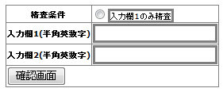

# 精査処理の実装例集

## 本ページの構成

* :ref:`validation_database_access_error`
* :ref:`validation_example_code_validate`
* :ref:`validation_example_contains_key`
* :ref:`validation_example_contains_key_param`

ラジオボタンやセレクトボックスの選択内容に応じて単項目精査対象を変更する場合は、FormクラスのValidateForアノテーションを付与したメソッドで`WebUtil#containsPropertyKeyValue`を使用する。セレクトボックスの場合もJSPの内容が変わるだけで実装は同様。

**JSP実装例**（ラジオボタンで精査条件を指定）:
```jsp
<n:form windowScopePrefixes="form">
    <n:radioButton name="form.validationPtn" value="ptn1" label="入力欄1と2を精査"/>
    <n:radioButton name="form.validationPtn" value="ptn2" label="入力欄1と3を精査" />
    <n:error name="form.validationPtn" />
    <n:text name="form.value1" cssClass="input" />
    <n:text name="form.value2" cssClass="input" />
    <n:text name="form.value3" cssClass="input" />
</n:form>
```

**Formクラスの設計上の注意点**:

精査内容を指定するパラメータ（ここでは`form.validationPtn`）は、`WebUtil#containsPropertyKeyValue`でアクセスするのみを想定している場合、対応するプロパティ（フィールド・getter/setter）を用意しなくてよい。`Example3Form`に`validationPtn`のプロパティが存在しないのはこの設計による。一方、Actionクラス等でそのパラメータの値を直接使用する必要がある場合は、通常のプロパティと同様に対応するプロパティを用意し、精査対象に含める。

**Formクラス実装例**（setterメソッドへのアノテーション付与）:
```java
@PropertyName("入力欄1")
@Required
@SystemChar(charsetDef = "AlnumChar")
public void setValue1(String value1) {
    this.value1 = value1;
}

@PropertyName("入力欄2")
@Required
@SystemChar(charsetDef = "AlnumChar")
public void setValue2(String value2) {
    this.value2 = value2;
}

@PropertyName("入力欄3")
@Required
@SystemChar(charsetDef = "AlnumChar")
public void setValue3(String value3) {
    this.value3 = value3;
}
```

**Formクラス実装例**（`validate`静的メソッド）:

`validationName`パラメータで呼び出す`@ValidateFor`メソッドを動的に切り替えるために、`validate`静的メソッドを用意する:
```java
public static Example3Form validate(HttpRequest req, String validationName) {
    ValidationContext<Example3Form> context
        = ValidationUtil.validateAndConvertRequest("form", Example3Form.class, req, validationName);
    context.abortIfInvalid();
    return context.createObject();
}
```

**Formクラス実装例**（`@ValidateFor`メソッド）:
```java
@ValidateFor("validateKeyValue")
public static void validateForKeyValue(ValidationContext<Example3Form> context) {
    String paramKey = "form.validationPtn";
    if (WebUtil.containsPropertyKeyValue(context, paramKey, "ptn1")) {
        ValidationUtil.validate(context, new String[] { "value1", "value2" });
    } else if (WebUtil.containsPropertyKeyValue(context, paramKey, "ptn2")) {
        ValidationUtil.validate(context, new String[] { "value1", "value3" });
    } else {
        // ラジオボタン未選択時はエラーメッセージを追加
        context.addResultMessage("validationPtn", "MSG00010", MessageUtil.getStringResource("V0020001"));
    }
}
```

<details>
<summary>keywords</summary>

精査処理の実装例, バリデーション実装例一覧, データベースアクセス精査, コード値精査, 動的精査切り替え, WebUtil, WebUtil#containsPropertyKeyValue, ValidationUtil, ValidationContext, Example3Form, @ValidateFor, @PropertyName, @Required, @SystemChar, MessageUtil, 単項目精査の動的切り替え, ラジオボタン選択による精査条件変更, プロパティの値による切り替え, validationPtn, validateAndConvertRequest, abortIfInvalid

</details>

## データベースアクセスを伴う精査を行う方法

データベースアクセスを伴う精査（ログインID重複チェック等）は、単体項目・複合項目を問わず Entity ではなく Action（業務共通コンポーネントを含む）に実装する。

精査エラーは :ref:`other_example_message_notify` に示した `ApplicationException` クラスを使用してメッセージ通知する。

```java
// form 生成
W11AC02Form form = context.createObject();

// form から entity 取得
SystemAccountEntity systemAccount = form.getSystemAccount();

// entityからログインIDの取得
String loginId = systemAccount.getLoginId();

// ログインIDが登録済みか、DBを検索する
SqlPStatement statement = getSqlPStatement("SELECT_SYSTEM_ACCOUNT");
statement.setString(1, loginId);
if (!statement.retrieve().isEmpty()) {
    // ログインIDが登録済みの場合、 ApplicationException を送出
    throw new ApplicationException(MessageUtil.createMessage(MessageLevel.ERROR, "MSG00001"));
}
```

<details>
<summary>keywords</summary>

ApplicationException, SqlPStatement, MessageUtil, データベースアクセス精査, ログインID重複チェック, Action精査実装, Entity精査禁止, W11AC02Form, SystemAccountEntity, MessageLevel

</details>

## コード値の精査を行う方法

コード値のバリデーションは `@CodeValue` バリデータを使用する。コード値の精査には :ref:`other_example_code_get` に示したコード管理用データがDBに設定されているものとする。

> **注意**: `CodeValidationUtil` はサンプル実装として提供される。Nablarch導入プロジェクトでは、アーキテクトが `CodeValidationUtil` のサンプル実装をプロジェクト内に取り込む必要がある。

**アノテーション**: `@CodeValue`, `@PropertyName`

```java
/* 【説明】BaseCustomerEntityクラスのJavaDocは省略。 */
public class BaseCustomerEntity {

    /** 性別 */
    private String gender;

    @PropertyName("性別")
    @CodeValue(codeId="0001")
    public String setGender(String gender) {
        this.gender = gender;
    }
}
```

`CustomerEntity.validate()` では `ValidationUtil.validate()` で標準プロパティ精査を行い、`CodeValidationUtil.validate()` でコード値精査を行う:

```java
public class CustomerEntity extends BaseCustomerEntity {

    @ValidateFor("validate")
    public static void validate(ValidationContext<CustomerEntity> context) throws Exception {
        ValidationUtil.validate(context, new String[] {"gender"});

        // 【説明】CodeValidationUtil#validateメソッドを使用してコード値精査を行う
        CodeValidationUtil.validate(context, "0001", "PATTERN1", "gender");

        // メッセージIDを上書きする場合は第5引数にメッセージIDを指定する
        CodeValidationUtil.validate(context, "0001", "PATTERN1", "gender", "message_id");
    }
}
```

`BaseCustomerEntity` では `@CodeValue` の `pattern` 属性を指定せずに精査を行い、サブクラスの `CustomerEntity` で `CodeValidationUtil.validate()` を呼び出してパターンを指定する。

<details>
<summary>keywords</summary>

@CodeValue, CodeValidationUtil, @PropertyName, コード値精査, codeId, ValidationUtil, BaseCustomerEntity, CustomerEntity

</details>

## 入力値に連動して、動的に単項目精査対象を変化させる方法(プロパティの存在有無による切り替え)

ラジオボタン選択など、入力値に応じて動的に単項目精査対象を変化させるには、Form クラスの `@ValidateFor` アノテーションを付与したメソッドで `WebUtil#containsPropertyKey` を使用する。

パラメータキーが存在する場合と存在しない場合で精査対象プロパティを切り替える。

**JSP 例**:

```jsp
<n:form windowScopePrefixes="form">
<table>
    <tr>
        <th>精査条件</th>
        <td>
            <n:radioButton name="form.validationPtn" value="ptn1" label="入力欄1のみ精査"/>
            <n:error name="form.validationPtn" />
        </td>
    </tr>
    <tr>
        <th>入力欄1(半角英数字)</th>
        <td>
            <n:error name="form.value1" />
            <n:text name="form.value1" cssClass="input" />
        </td>
    </tr>
    <tr>
        <th>入力欄2(半角英数字)</th>
        <td>
            <n:error name="form.value2" />
            <n:text name="form.value2" cssClass="input" />
        </td>
    </tr>
</table>
</n:form>
```

**Form クラス** (`Example4Form`):

プロパティには `@PropertyName`, `@Required`, `@SystemChar` アノテーションを付与する:

```java
public class Example4Form {

    private String value1;
    private String value2;

    @PropertyName("入力欄1")
    @Required
    @SystemChar(charsetDef = "AlnumChar")
    public void setValue1(String value1) {
        this.value1 = value1;
    }

    @PropertyName("入力欄2")
    @Required
    @SystemChar(charsetDef = "AlnumChar")
    public void setValue2(String value2) {
        this.value2 = value2;
    }

    // リクエストをバリデーション・変換して Form オブジェクトを返す静的メソッド
    public static Example4Form validate(HttpRequest req, String validationName) {
        ValidationContext<Example4Form> context
            = ValidationUtil.validateAndConvertRequest("form", Example4Form.class, req, validationName);
        context.abortIfInvalid();
        return context.createObject();
    }

    @ValidateFor("validateKey")
    public static void validateForKey(ValidationContext<Example4Form> context) {
        String paramKey = "form.validationPtn";

        if (WebUtil.containsPropertyKey(context, paramKey)) {
            ValidationUtil.validate(context, new String[] { "value1" });
        } else {
            ValidationUtil.validate(context, new String[] { "value1", "value2" });
        }
    }
}
```

> **補足**: `form.validationPtn` パラメータを Action クラス等で使用する場合は、通常のプロパティと同様に対応するプロパティを用意し、キーが存在する場合の精査対象に含める。

入力画面イメージ:


<details>
<summary>keywords</summary>

WebUtil, containsPropertyKey, ValidationContext, @ValidateFor, ValidationUtil, 動的精査切り替え, プロパティ存在確認, Example4Form, validateAndConvertRequest, abortIfInvalid, n:radioButton, @Required, @SystemChar, HttpRequest

</details>

## 入力値に連動して、動的に単項目精査対象を変化させる方法（パラメータによる切り替え）

入力値に連動して動的に単項目精査対象を変化させる方法のうち、パラメータの値による切り替えを使用する方法。プロパティの存在有無による切り替え（ :ref:`validation_example_contains_key` 参照）とは異なり、パラメータの値に応じて精査対象を変化させる。

<details>
<summary>keywords</summary>

動的精査切り替え, パラメータによる切り替え, ValidationUtil, @ValidateFor

</details>
