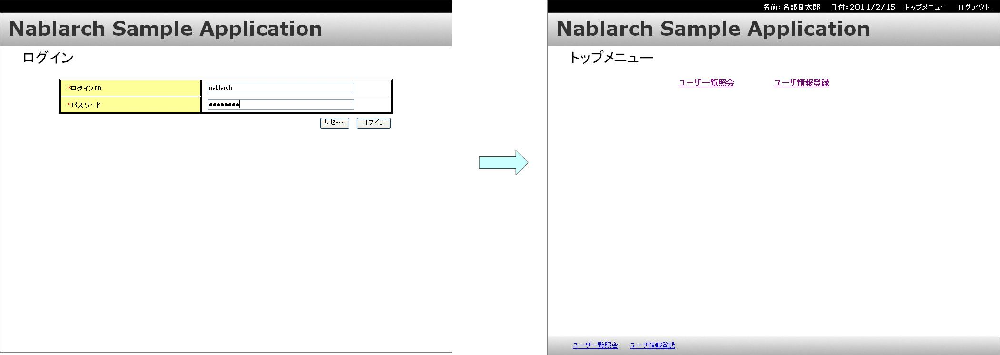
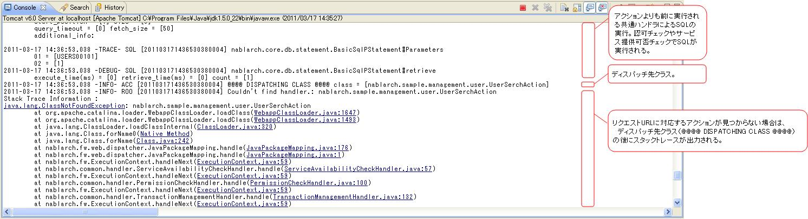
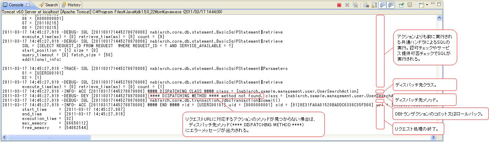

# ログ出力の設定方法とログの見方(画面オンライン処理編)

## 

画面オンライン処理の開発時は、以下の3種類のログを出力する。開発ログとは、アプリケーションプログラマが開発時に必要な情報をDEBUGレベルでログ出力したものを指す。

| ログの種類 | 説明 |
|---|---|
| HTTPアクセスログ | アプリケーション実行状況の把握。性能・負荷測定情報の出力も含む。全リクエスト/レスポンス情報を出力する証跡ログとしても使用する。 |
| SQLログ | SQL文の実行時間とSQL文を出力（パフォーマンスチューニング用）。 |
| 開発ログ | アプリケーションプログラマが開発時に必要な情報（DEBUGレベル）を出力。 |

HTTPアクセスログとSQLログの出力内容: :ref:`HttpAccessLog`、:ref:`SqlLog` 参照。

<details>
<summary>keywords</summary>

HTTPアクセスログ, SQLログ, 開発ログ, ログの種類, 証跡ログ, パフォーマンスチューニング, DEBUGレベル

</details>

## 開発時のログ出力の設定方法

開発時のログ出力設定では、標準出力（EclipseのConsoleビュー）へのログ出力のために以下を設定する。

1. 出力先として標準出力を追加
2. デバッグ用ログを標準出力に出力
3. HTTPアクセスログを標準出力に出力
4. SQLログを標準出力に出力
5. 開発ログを標準出力に出力


<details>
<summary>keywords</summary>

標準出力設定, ログ出力設定, Eclipse Console, HTTPアクセスログ設定, SQLログ設定, 開発ログ設定

</details>

## 開発時のログの見方

開発時のログ確認対象ケース:

- リクエスト処理を正常に完了した場合
- JSPで例外が発生した場合
- リクエストURLに対応するアクションが見つからない場合
- リクエストURLに対応するアクションのメソッドが見つからない場合

> **注意**: 上記ケースでエラーが発生するものはあくまで一例であり、全てのケースを網羅していない。実際の開発時は「リクエスト処理を正常に完了した場合」を参考に、デバッグ作業に必要な情報を収集する。

<details>
<summary>keywords</summary>

ログの見方, デバッグケース, ログ確認方法, 開発ログ読み方

</details>

## 各ケースのログ出力例

## リクエスト処理を正常に完了した場合

ログイン処理を例に、1回のリクエスト処理で出力されるログの順番と出力内容を説明する。

画面遷移:


アクション実行前のログ:


アクション実行中のログ:


アクション実行後のログ:


> **注意**: HTTPアクセスログとSQLログのフォーマットはデフォルトフォーマットを使用した場合の出力例。

## JSPで例外が発生した場合

「リクエスト処理の終了（END）」の後にスタックトレースが出力される。


## リクエストURLに対応するアクションが見つからない場合

「ディスパッチ先クラス（DISPATCHING CLASS）」の後にスタックトレースが出力される。



## リクエストURLに対応するアクションのメソッドが見つからない場合

「ディスパッチ先メソッド（DISPATCHING METHOD）」にエラーメッセージが出力される。



エラーメッセージ例:
```bash
method not found. class = [nablarch.sample.management.user.UserSearchAction], method signature = [HttpResponse dousers00101(HttpRequest, ExecutionContext)]
```

<details>
<summary>keywords</summary>

リクエスト処理, JSP例外, アクション未発見, ディスパッチ, スタックトレース, method not found, DISPATCHING CLASS, DISPATCHING METHOD, HttpRequest, ExecutionContext, HttpResponse, UserSearchAction

</details>
