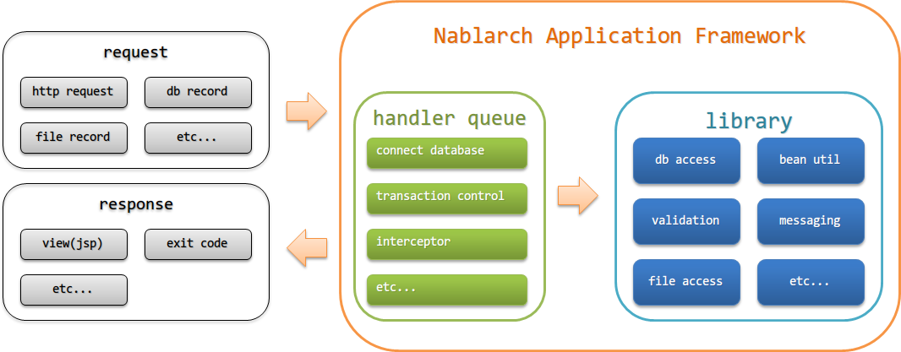
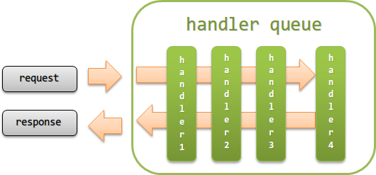

# アーキテクチャ

**公式ドキュメント**: [1](https://nablarch.github.io/docs/LATEST/doc/application_framework/application_framework/nablarch/architecture.html) [2](https://nablarch.github.io/docs/LATEST/javadoc/nablarch/common/web/token/OnDoubleSubmission.html) [3](https://nablarch.github.io/docs/LATEST/javadoc/nablarch/common/web/token/UseToken.html) [4](https://nablarch.github.io/docs/LATEST/javadoc/nablarch/fw/web/interceptor/OnErrors.html) [5](https://nablarch.github.io/docs/LATEST/javadoc/nablarch/fw/web/interceptor/OnError.html) [6](https://nablarch.github.io/docs/LATEST/javadoc/nablarch/common/web/interceptor/InjectForm.html) [7](https://nablarch.github.io/docs/LATEST/javadoc/nablarch/fw/Interceptor.Factory.html)

## Nablarchアプリケーションフレームワークの主な構成要素

> **警告**: 本項で解説するアーキテクチャは、JSR352バッチ（jsr352_batch）には該当しない。JSR352バッチのアーキテクチャについては、jsr352_batchのjsr352_architectureを参照。

keywords

Nablarchアプリケーションフレームワーク, アーキテクチャ, 構成要素, フレームワーク概要, jsr352_batch, JSR352, 適用範囲, スコープ

## ハンドラキュー(handler queue)

ハンドラキューとは、リクエスト/レスポンスへの横断的処理を行うハンドラ群を定められた順序で定義したキュー。サーブレットフィルタのチェーン実行と同様に処理を実行する。

ハンドラでの主な処理:
- リクエストのフィルタリング（アクセス権限のあるリクエストのみ受け付けるなど）
- リクエスト/レスポンスの変換
- リソースの取得・解放（DB接続の取得・解放など）

処理フロー:
1. ハンドラキュー上のハンドラを先頭から順に実行
2. レスポンス返却時は、これまでに実行されたハンドラを逆順に実行

ハンドラは前後関係を意識してハンドラキューに設定しないと正常に動作しないものがある。各ハンドラのドキュメントを参照してハンドラキューを構築すること。

> **補足**: リクエスト/レスポンス処理や共通処理は、親クラスではなく個別ハンドラとして実装することを推奨。個別のハンドラの前後に処理を追加したい場合にはインターセプタを使用することを推奨する。
> - **個別ハンドラ実装**: 各ハンドラの責務が明確でテスト容易・保守性高。共通処理の抜き差しも容易。
> - **親クラスへの共通処理実装**: 処理増加で親クラスが肥大化し複数責務を持つことになる。メンテコスト増大・テスト複雑化・不具合検知困難の問題がある。本来継承すべきクラスを継承しなかった場合でも、共通処理の内容によっては異常終了とならずに処理が実行されるため不具合を検知しづらい。

## インターセプタ(interceptor)

インターセプタとは、実行時に動的にハンドラキューに追加されるハンドラ。特定リクエストのみ処理（ハンドラ）を追加する場合や、リクエストごとに設定値を切り替えて処理を実行したい場合は、ハンドラよりインターセプタが適している。

> **補足**: インターセプタは、Java EEのCDI（JSR-346）で定義されているインターセプタと同じように処理を実行する。

> **重要**: インターセプタの実行順序は設定ファイルへの設定が必要。設定がない場合、実行順はJVM依存となる。Nablarchがデフォルトで提供するインターセプタの実行順は以下の順序で設定する必要がある:
> 1. `OnDoubleSubmission`
> 2. `UseToken`
> 3. `OnErrors`
> 4. `OnError`
> 5. `InjectForm`
>
> 実行順設定の詳細は `Factory` を参照。

keywords

ハンドラキュー, handler queue, ハンドラ, インターセプタ, interceptor, CDI, JSR-346, OnDoubleSubmission, UseToken, OnErrors, OnError, InjectForm, Interceptor.Factory, 横断的処理, リクエスト処理, レスポンス処理, ハンドラ実行順序

## ライブラリ(library)

ライブラリとは、データベースアクセス、ファイルアクセス、ログ出力などのようにハンドラから呼び出されるコンポーネント群。

Nablarchアプリケーションフレームワークが提供するライブラリは [library](../../component/libraries/libraries-libraries.md) を参照。

keywords

ライブラリ, library, データベースアクセス, ファイルアクセス, ログ出力, コンポーネント

