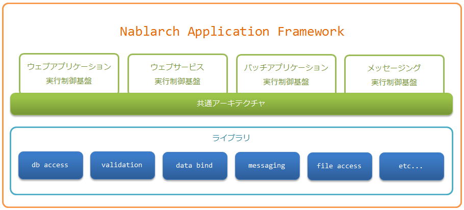

# 全体像

**公式ドキュメント**: [全体像](https://nablarch.github.io/docs/LATEST/doc/application_framework/application_framework/nablarch/big_picture.html)

## 全体像

Nablarchアプリケーションフレームワークは、実行制御基盤と [library](../../component/libraries/libraries-libraries.md) から構成される。

**実行制御基盤** (:ref:`runtime_platform`):
- [web_application](../../processing-pattern/web-application/web-application-web.md)
- :ref:`web_service`
- [batch_application](../../processing-pattern/nablarch-batch/nablarch-batch-batch.md)
- [messaging](../../processing-pattern/db-messaging/db-messaging-messaging.md)

**共通アーキテクチャ** ([nablarch_architecture](about-nablarch-architecture.md)): すべての実行制御基盤でパイプライン型の処理モデルを採用。

パイプライン型処理モデルの特長:
- **柔軟な機能追加・変更**: ハンドラの差し替えにより機能追加・変更が容易。ハンドラは処理方式間で共有可能なため、処理方式ごとに同じ機能を重複して作成する必要がない。
- **開発方法の共通化**: 各実行制御基盤上のアプリケーションはほぼ同様の方法で作成・テスト可能。ある処理方式で習得したスキルを最小限の学習で他の処理方式にも適用できる。

keywords

Nablarchフレームワーク全体像, 実行制御基盤, パイプライン型処理モデル, ハンドラ, 処理方式, ライブラリ

