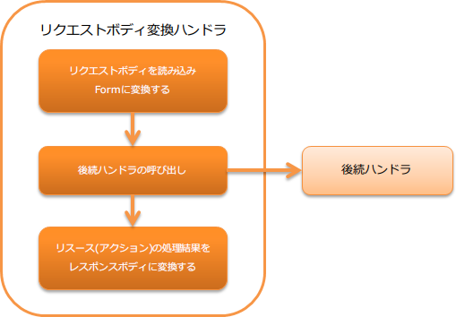

# リクエストボディ変換ハンドラ

**目次**

* ハンドラクラス名
* モジュール一覧
* 制約
* 変換処理を行うコンバータを設定する
* リクエストボディをFormに変換する
* リソース(アクション)の処理結果をレスポンスボディに変換する

本ハンドラでは、リクエストボディとレスポンスボディの変換処理を行う。

変換時に使用するフォーマットは、リクエストを処理するリソース(アクション)クラスのメソッドに設定された
Consumes 及び Produces アノテーションで指定する。

本ハンドラでは、以下の処理を行う。

* リクエストボディをリソース(アクション)クラスで受け付けるFormに変換する。
  詳細は、[リクエストボディをFormに変換する](../../component/handlers/handlers-body-convert-handler.md#body-convert-handler-convert-request) を参照。
* リソース(アクション)クラスの処理結果をレスポンスボディに変換する。
  詳細は、[リソース(アクション)の処理結果をレスポンスボディに変換する](../../component/handlers/handlers-body-convert-handler.md#body-convert-handler-convert-response) を参照。

処理の流れは以下のとおり。



## ハンドラクラス名

* nablarch.fw.jaxrs.BodyConvertHandler

## モジュール一覧

```xml
<dependency>
  <groupId>com.nablarch.framework</groupId>
  <artifactId>nablarch-fw-jaxrs</artifactId>
</dependency>
```

## 制約

本ハンドラは [ルーティングアダプタ](../../component/adapters/adapters-router-adaptor.md#router-adaptor) よりも後ろに設定すること
このハンドラは、リソース(アクション)クラスのメソッドに設定された、アノテーションの情報を元に
リクエスト及びレスポンスの変換処理を行う。
このため、ディスパッチ先を特定する [ルーティングアダプタ](../../component/adapters/adapters-router-adaptor.md#router-adaptor) よりも後ろに設定する必要がある。

## 変換処理を行うコンバータを設定する

このハンドラでは、 bodyConverters プロパティに設定された、
BodyConverter の実装クラスを使用してリクエスト及びレスポンスの変換処理を行う。
bodyConverters プロパティには、
プロジェクトで使用するMIMEに対応した、 BodyConverter を設定すること。

以下に例を示す。

```xml
<component class="nablarch.fw.jaxrs.BodyConvertHandler">
  <property name="bodyConverters">
    <list>
      <!-- application/xmlに対応したリクエスト・レスポンスのコンバータ -->
      <component class="nablarch.fw.jaxrs.JaxbBodyConverter" />
      <!-- application/x-www-form-urlencodedに対応したリクエスト・レスポンスのコンバータ -->
      <component class="nablarch.fw.jaxrs.FormUrlEncodedConverter" />
    </list>
  </property>
</component>
```

> **Tip:**
> bodyConverters プロパティに設定されたコンバータで、
> 変換出来ないMIMEが使用された場合、サポートしていないメディアタイプであることを示すステータスコード(`415`)を返却する。

## リクエストボディをFormに変換する

リクエストボディの変換処理で使用するフォーマットは、リクエストを処理するメソッドに設定された Consumes により決まる。
もし、 Consumes に設定されたMIMEと異なるMIMEがリクエストヘッダのContent-Typeに設定されていた場合は、
サポートしていないメディアタイプであることを示すステータスコード(`415`)を返却する。

リソース(アクション)のメソッドの実装例を以下に示す。

この例では、 `MediaType.APPLICATION_JSON` が示す `application/json` に対応した
BodyConverter でリクエストボディが `Person` に変換される。

```java
@Consumes(MediaType.APPLICATION_JSON)
@Valid
public HttpResponse saveJson(Person person) {
    UniversalDao.insert(person);
    return new HttpResponse();
}
```

## リソース(アクション)の処理結果をレスポンスボディに変換する

レスポンスボディへの変換処理で使用するフォーマットは、リクエストを処理したメソッドに設定された Produces により決まる。

リソース(アクション)のメソッドの実装例を以下に示す。

この例では、 `MediaType.APPLICATION_JSON` が示す `application/json` に対応した
BodyConverter でリクエストボディが `Person` に変換される。

```java
GET
@Produces(MediaType.APPLICATION_JSON)
public List<Person> findJson() {
    return UniversalDao.findAll(Person.class);
}
```
