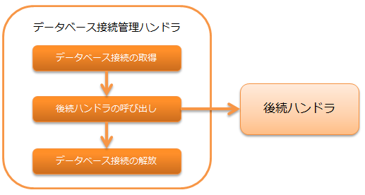

# データベース接続管理ハンドラ

**目次**

* ハンドラクラス名
* モジュール一覧
* 制約
* データベースの接続先を設定する
* アプリケーションで複数のデータベース接続（トランザクション）を使用する

後続のハンドラ及びライブラリで使用するためのデータベース接続を、スレッド上で管理するハンドラ。

データベースアクセスの詳細は、 [データベースアクセス(JDBCラッパー)](../../component/libraries/libraries-database.md#database) を参照。

> **Important:**
> このハンドラを使用する場合は、 [トランザクション制御ハンドラ](../../component/handlers/handlers-transaction-management-handler.md#transaction-management-handler) をセットで設定すること。
> トランザクション制御ハンドラが設定されていない場合、トランザクション制御が実施されないため後続で行ったデータベースへの変更は全て破棄される。

本ハンドラでは、以下の処理を行う。

* データベース接続の取得
* データベース接続の解放

処理の流れは以下のとおり。



## ハンドラクラス名

* nablarch.common.handler.DbConnectionManagementHandler

## モジュール一覧

```xml
<dependency>
  <groupId>com.nablarch.framework</groupId>
  <artifactId>nablarch-core-jdbc</artifactId>
</dependency>
<dependency>
  <groupId>com.nablarch.framework</groupId>
  <artifactId>nablarch-common-jdbc</artifactId>
</dependency>
```

## 制約

なし。

## データベースの接続先を設定する

このハンドラは、 connectionFactory
プロパティに設定されたファクトリクラス( ConnectionFactory 実装クラス )を使用してデータベース接続を取得する。

以下の設定ファイル例を参考にし、  connectionFactory
プロパティにファクトリクラスを設定すること。

```xml
<!-- データベース接続管理ハンドラ -->
<component class="nablarch.common.handler.DbConnectionManagementHandler">
  <property name="connectionFactory" ref="connectionFactory" />
</component>

<!-- データベース接続オブジェクトを取得するファクトリクラスの設定 -->
<component name="connectionFactory"
    class="nablarch.core.db.connection.BasicDbConnectionFactoryForDataSource">
  <!-- プロパティの設定は省略 -->
</component>
```

> **Important:**
> データベース接続オブジェクトを取得するためのファクトリクラスの詳細は、 [データベースに対する接続設定](../../component/libraries/libraries-database.md#database-connect) を参照。

## アプリケーションで複数のデータベース接続（トランザクション）を使用する

1つのアプリケーションで複数のデータベース接続が必要となるケースが考えられる。
この場合は、このハンドラをハンドラキュー上に複数設定することで対応する。

このハンドラは、データベース接続オブジェクトをスレッド上で管理する際に、データベース接続名をつけて管理している。
データベース接続名は、スレッド内で一意とする必要がある。

データベース接続名は、このハンドラの connectionName プロパティに設定する。
connectionName への設定を省略した場合、その接続はデフォルトのデータベース接続となり簡易的に使用できる。
このため、最もよく使うデータベース接続をデフォルトとし、それ以外のデータベース接続に対して任意の名前をつけると良い。

以下にデータベース接続名の設定例を示す。

```xml
<!-- データベース接続を取得するファクトリの設定は省略 -->

<!-- デフォルトのデータベース接続を設定 -->
<component class="nablarch.common.handler.DbConnectionManagementHandler">
  <property name="connectionFactory" ref="connectionFactory" />
</component>

<!-- userAccessLogという名前でデータベース接続を登録 -->
<component class="nablarch.common.handler.DbConnectionManagementHandler">
  <property name="connectionFactory" ref="userAccessLogConnectionFactory" />
  <property name="connectionName" value="userAccessLog" />
</component>
```

上記のハンドラ設定の場合の、アプリケーションからのデータベースアクセス例を以下に示す。
なお、データベースアクセス部品の詳細な使用方法は、 [データベースアクセス(JDBCラッパー)](../../component/libraries/libraries-database.md#database) を参照。

デフォルトのデータベース接続を使用する
DbConnection#getConnection 呼び出し時に引数を指定する必要が無い。
引数を指定しないと、自動的にデフォルトのデータベース接続が戻される。

```java
AppDbConnection connection = DbConnectionContext.getConnection();
```
userAccessLogデータベース接続を使用する
DbConnection#getConnection(String) を使用し、引数にデータベース接続名を指定する。
データベース接続名は connectionName プロパティに設定した値と一致させる必要がある。

```java
AppDbConnection connection = DbConnectionContext.getConnection("userAccessLog");
```
