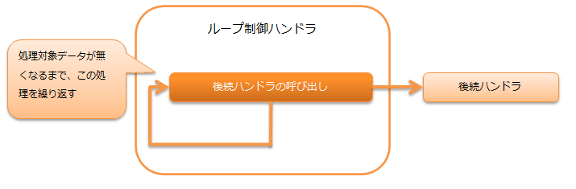

# ループ制御ハンドラ

**目次**

* ハンドラクラス名
* モジュール一覧
* 制約

本ハンドラは、データリーダ上に処理対象のデータが存在する間、後続ハンドラの処理を繰り返し実行する。

> **Important:**
> DBに接続するバッチアプリケーションではトランザクション管理が必要になるため、本ハンドラではなく [トランザクションループ制御ハンドラ](../../component/handlers/handlers-loop-handler.md#loop-handler) を使用すること。

処理の流れは以下のとおり。



## ハンドラクラス名

* nablarch.fw.handler.DbLessLoopHandler

## モジュール一覧

```xml
<dependency>
  <groupId>com.nablarch.framework</groupId>
  <artifactId>nablarch-fw-standalone</artifactId>
</dependency>
```

## 制約

なし。
