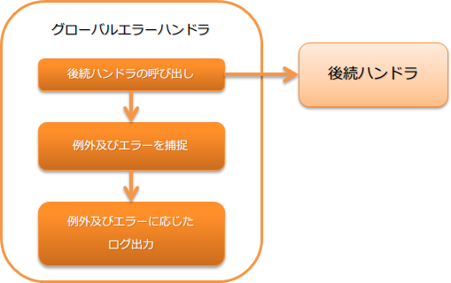

# グローバルエラーハンドラ

**目次**

* ハンドラクラス名
* モジュール一覧
* 制約
* 例外及びエラーに応じた処理内容
* グローバルエラーハンドラでは要件を満たせない場合

後続ハンドラで発生した未捕捉の例外及びエラーを捕捉し、ログ出力及び結果を返すハンドラ。

処理の流れは以下のとおり。



## ハンドラクラス名

* nablarch.fw.handler.GlobalErrorHandler

## モジュール一覧

```xml
<dependency>
  <groupId>com.nablarch.framework</groupId>
  <artifactId>nablarch-fw</artifactId>
</dependency>
```

## 制約

できるだけハンドラキューの先頭に配置すること
このハンドラは未捕捉例外を処理するため、特に理由がない限り、できるだけハンドラキューの先頭に配置すること。

もし、このハンドラより手前のハンドラで例外が発生した場合は、ウェブアプリケーションサーバやJVMにより例外処理が行われる。

例外を捕捉した際にスレッドコンテキストの情報をログに出力したい場合は、 [スレッドコンテキスト変数削除ハンドラ](../../component/handlers/handlers-thread-context-clear-handler.md#thread-context-clear-handler) より後に配置すること。

## 例外及びエラーに応じた処理内容

このハンドラでは捕捉した例外及びエラーの内容に応じて、以下の処理を行い結果を生成する。

例外に応じた処理内容
| 例外クラス | 処理内容 |
|---|---|
| ServiceError  (サブクラス含む) | ServiceError#writeLog を呼び出し、ログを出力する。  ログレベルは、 ServiceError の実装クラスにより異なる。  ログ出力後、ハンドラの処理結果として、 ServiceError を返却する。 |
| Result.Error  (サブクラス含む) | FATALレベルのログを出力する。  ログ出力後、ハンドラの処理結果として、 Result.Error を返却する。 |
| 上記以外の例外クラス | FATALレベルのログを出力する。  ログ出力後、捕捉した例外を原因に持つ InternalError を生成し、ハンドラの処理結果として返却する。 |
エラーに応じた処理内容
| エラークラス | 処理内容 |
|---|---|
| ThreadDeath  (サブクラス含む) | INFOレベルのログ出力を行う。  ログ出力後、捕捉したエラーをリスローする。 |
| StackOverflowError  (サブクラス含む) | FATALレベルのログ出力を行う。  ログ出力後、捕捉したエラーを原因に持つ InternalError を生成し、ハンドラの処理結果として返却する。 |
| OutOfMemoryError  (サブクラス含む) | FATALレベルのログ出力を行う。  なお、FATALレベルのログ出力に失敗する可能性(再度 OutOfMemoryError が発生する可能性)があるため、 ログ出力前に標準エラー出力に OutOfMemoryError が発生したことを出力する。  ログ出力後、捕捉したエラーを原因に持つ InternalError を生成し、ハンドラの処理結果として返却する。 |
| VirtualMachineError  (サブクラス含む) | FATALレベルのログ出力を行う。  ログ出力後、捕捉したエラーをリスローする。  > **Tip:** > StackOverflowError 及び OutOfMemoryError 以外が対象となる。 |
| 上記以外のエラークラス | FATALレベルのログ出力を行う。  ログ出力後、捕捉したエラーを原因に持つ InternalError を生成し、ハンドラの処理結果として返却する。 |

## グローバルエラーハンドラでは要件を満たせない場合

このハンドラは、設定などで実装を切り替えることはできない。
このため、この実装で要件を満たすことができない場合は、
プロジェクト固有のエラー処理用ハンドラを作成し対応すること。

例えば、ログレベルを細かく切り替えたい場合などは、このハンドラを使用するのではなく、ハンドラを新たに作成すると良い。
